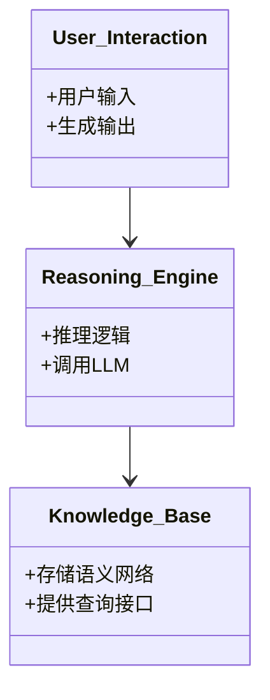
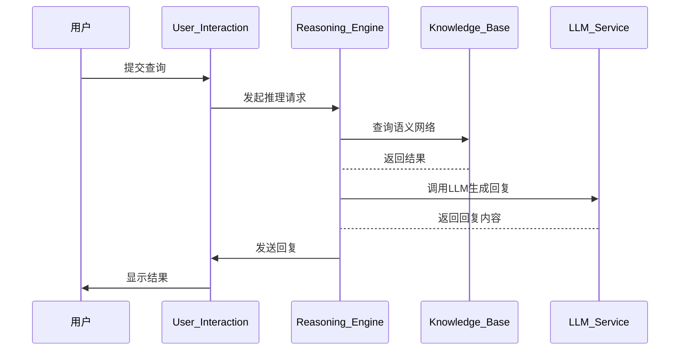

                 


# LLM在AI Agent语义网络构建中的应用

> 关键词：LLM, AI Agent, 语义网络, 自然语言处理, 深度学习, 知识图谱

> 摘要：本文探讨了大语言模型（LLM）在AI Agent语义网络构建中的应用，详细分析了LLM与语义网络的关系，结合实际案例，介绍了构建方法、算法原理和系统架构，提供了项目实战和最佳实践的建议。

---

# 第1章: LLM与AI Agent概述

## 1.1 LLM的基本概念

### 1.1.1 大语言模型的定义
大语言模型（Large Language Model, LLM）是指基于深度学习训练的大型神经网络模型，能够理解和生成人类语言。这些模型通常使用大量的训练数据，经过多次迭代优化，具备强大的自然语言处理能力。

### 1.1.2 LLM的核心特点
- **大规模训练数据**：LLM通常使用数十亿级别的数据进行训练，使其能够理解多种语言和上下文。
- **深度学习架构**：采用Transformer架构，支持自我注意机制，能够捕捉长距离依赖关系。
- **多任务能力**：LLM可以执行多种NLP任务，如文本生成、翻译、问答等。

### 1.1.3 LLM与传统NLP模型的区别
- **模型规模**：LLM通常参数量更大，计算能力更强。
- **任务通用性**：能够处理多种任务，而传统模型通常针对特定任务优化。
- **自我学习能力**：通过大量数据自动学习语言规律，减少对人工特征工程的依赖。

## 1.2 AI Agent的基本概念

### 1.2.1 AI Agent的定义
AI Agent（人工智能代理）是指能够感知环境并采取行动以实现目标的智能实体。它可以是一个软件程序，也可以是物理设备，通过与环境交互来完成任务。

### 1.2.2 AI Agent的核心功能
- **感知环境**：通过传感器或其他数据源获取信息。
- **决策制定**：基于获取的信息做出决策。
- **执行行动**：根据决策执行物理或数字操作。

### 1.2.3 AI Agent的应用场景
- **智能助手**：如Siri、Alexa等，帮助用户完成日常任务。
- **推荐系统**：根据用户行为推荐相关内容。
- **自动驾驶**：通过感知环境做出驾驶决策。

## 1.3 LLM在AI Agent中的作用

### 1.3.1 LLM作为知识库的使用
LLM可以作为AI Agent的知识库，存储和处理大量信息，帮助AI Agent理解上下文并做出决策。

### 1.3.2 LLM在自然语言处理中的应用
LLM能够理解用户输入的自然语言，并生成自然的回应，提升AI Agent的交互能力。

### 1.3.3 LLM在决策支持中的作用
通过分析大量数据，LLM可以为AI Agent提供决策支持，优化其行动策略。

## 1.4 本章小结
本章介绍了LLM和AI Agent的基本概念，分析了LLM在AI Agent中的作用，为后续章节奠定了基础。

---

# 第2章: 语义网络的基本概念

## 2.1 语义网络的定义

### 2.1.1 语义网络的定义
语义网络是一种知识表示方法，通过节点和边表示概念及其关系，能够有效地组织和表达知识。

### 2.1.2 语义网络的结构
语义网络通常由节点（概念）和边（关系）组成，节点代表实体或概念，边表示它们之间的关系。

### 2.1.3 语义网络的特点
- **可扩展性**：能够方便地添加新的概念和关系。
- **语义丰富性**：能够表达复杂的语义关系。
- **动态性**：可以根据新的信息动态更新。

## 2.2 语义网络的构建方法

### 2.2.1 基于知识图谱的构建方法
知识图谱是一种结构化的语义网络，通过实体和关系构建知识网络。

### 2.2.2 基于深度学习的构建方法
利用深度学习模型从文本中提取实体和关系，构建语义网络。

### 2.2.3 基于规则的构建方法
通过预定义的规则和模式，手动或半自动构建语义网络。

## 2.3 语义网络的应用场景

### 2.3.1 在自然语言处理中的应用
语义网络用于理解文本语义，提升NLP任务的准确性。

### 2.3.2 在知识检索中的应用
通过语义网络快速检索相关知识，提高信息检索效率。

### 2.3.3 在智能对话中的应用
语义网络帮助AI Agent理解用户意图，生成更准确的回应。

## 2.4 本章小结
本章详细介绍了语义网络的基本概念、构建方法和应用场景，为后续章节奠定了基础。

---

# 第3章: LLM与语义网络的结合

## 3.1 LLM在语义网络中的角色

### 3.1.1 LLM作为语义网络的知识来源
LLM可以作为语义网络的知识库，提供丰富的语义信息。

### 3.1.2 LLM作为语义网络的推理引擎
通过LLM的推理能力，语义网络可以进行复杂的语义分析和推理。

### 3.1.3 LLM作为语义网络的优化工具
LLM可以帮助优化语义网络的结构和内容，提高其效率和准确性。

## 3.2 LLM在语义网络构建中的优势

### 3.2.1 高效性
LLM能够快速处理大量数据，提高语义网络的构建效率。

### 3.2.2 自适应性
LLM可以根据新的数据动态调整语义网络，适应变化的环境。

### 3.2.3 可扩展性
LLM支持大规模数据的处理，使语义网络具备良好的扩展性。

## 3.3 LLM在语义网络中的挑战

### 3.3.1 计算资源需求
构建和使用LLM需要大量的计算资源，可能带来成本和性能上的挑战。

### 3.3.2 数据隐私问题
处理大量数据时，隐私和数据安全问题需要重点关注。

### 3.3.3 模型可解释性
复杂的模型可能导致语义网络的决策过程缺乏可解释性，影响信任和使用。

## 3.4 本章小结
本章分析了LLM在语义网络中的角色及其优势和挑战，为后续章节提供了理论支持。

---

# 第4章: LLM在AI Agent语义网络中的具体应用

## 4.1 智能对话中的语义网络构建

### 4.1.1 对话历史的语义分析
通过分析对话历史，构建对话的语义网络，帮助AI Agent理解上下文。

### 4.1.2 基于LLM的对话生成
利用LLM生成符合语义网络的对话回应，提升对话的自然性和准确性。

### 4.1.3 对话中的语义纠错
通过语义网络检测和纠正对话中的语义错误，提高对话质量。

## 4.2 知识检索中的语义网络应用

### 4.2.1 基于LLM的知识图谱构建
利用LLM构建知识图谱，作为语义网络的基础。

### 4.2.2 基于语义网络的知识检索
通过语义网络进行高效的语义检索，提高信息检索的准确性。

### 4.2.3 知识检索的优化
通过语义网络优化知识检索的过程，提升检索效率和结果的相关性。

## 4.3 智能推荐中的语义网络应用

### 4.3.1 基于语义网络的推荐算法
通过语义网络分析用户的兴趣和行为，进行个性化推荐。

### 4.3.2 基于LLM的推荐优化
利用LLM优化推荐算法，提高推荐的准确性和多样性。

### 4.3.3 推荐系统的可解释性
通过语义网络提升推荐系统的可解释性，增强用户体验。

## 4.4 本章小结
本章通过具体案例展示了LLM在AI Agent语义网络中的应用，包括智能对话、知识检索和智能推荐等方面。

---

# 第5章: LLM驱动的语义网络构建算法

## 5.1 基于LLM的语义网络构建流程

### 5.1.1 数据预处理
对原始数据进行清洗、标注和转换，为模型训练做好准备。

### 5.1.2 模型训练
使用预处理后的数据训练LLM模型，优化模型参数。

### 5.1.3 网络构建与优化
基于训练好的模型构建语义网络，并通过反馈机制优化网络结构。

## 5.2 基于深度学习的语义网络构建算法

### 5.2.1 Transformer模型在语义网络中的应用
通过Transformer模型捕捉语义网络中的长距离依赖关系。

### 5.2.2 图神经网络在语义网络中的应用
利用图神经网络处理语义网络中的图结构数据，提升网络的表达能力。

### 5.2.3 基于注意力机制的语义网络构建
通过注意力机制动态调整语义网络中各节点的重要性，提高网络的准确性。

## 5.3 基于LLM的语义网络优化算法

### 5.3.1 基于反馈的网络优化
通过用户反馈不断优化语义网络的结构和参数。

### 5.3.2 基于强化学习的网络优化
利用强化学习算法优化语义网络的决策过程，提升网络性能。

### 5.3.3 基于迁移学习的网络优化
通过迁移学习技术，将已有的知识迁移到新的语义网络构建任务中，提高效率。

## 5.4 本章小结
本章详细介绍了基于LLM的语义网络构建算法，包括数据预处理、模型训练和网络优化等步骤。

---

# 第6章: 系统分析与架构设计方案

## 6.1 问题场景介绍
构建一个基于LLM的AI Agent语义网络系统，需要考虑系统的功能需求、性能需求和安全性需求。

## 6.2 项目介绍
本项目旨在开发一个支持智能对话、知识检索和推荐的AI Agent系统，利用LLM构建语义网络，提升系统的智能化水平。

## 6.3 系统功能设计

### 6.3.1 领域模型设计
使用Mermaid类图展示系统的功能模块，包括用户交互模块、知识库模块、推理引擎模块等。



### 6.3.2 系统架构设计
使用Mermaid架构图展示系统的整体架构，包括前端、后端和数据库等部分。

```mermaid
archiitecture
    Frontend --> Backend
    Backend --> Database
    Database --> Knowledge_Base
    Backend --> LLM_Service
```

### 6.3.3 系统接口设计
定义系统的接口，包括用户交互接口、知识库接口和推理引擎接口，确保系统的模块化和可扩展性。

### 6.3.4 系统交互设计
使用Mermaid序列图展示系统的交互过程，包括用户输入、系统处理和结果输出等步骤。



## 6.4 本章小结
本章通过系统分析和架构设计，展示了如何构建一个基于LLM的AI Agent语义网络系统。

---

# 第7章: 项目实战

## 7.1 环境安装

### 7.1.1 安装Python
安装Python 3.8及以上版本，确保系统运行环境正常。

### 7.1.2 安装必要的库
安装`transformers`、`numpy`、`pytorch`等库，为模型训练和推理提供支持。

### 7.1.3 安装Mermaid工具
安装Mermaid CLI或使用在线工具生成图表。

## 7.2 系统核心实现源代码

### 7.2.1 数据预处理代码
```python
import numpy as np
import torch
from transformers import AutoTokenizer, AutoModelForMaskedLM

tokenizer = AutoTokenizer.from_pretrained('bert-base-uncased')
model = AutoModelForMaskedLM.from_pretrained('bert-base-uncased')

def preprocess_data(text):
    inputs = tokenizer(text, return_tensors='np')
    return inputs
```

### 7.2.2 模型训练代码
```python
def train_model(model, inputs, labels):
    optimizer = torch.optim.Adam(model.parameters(), lr=1e-5)
    loss_fn = torch.nn.CrossEntropyLoss()
    
    outputs = model(**inputs)
    loss = loss_fn(outputs.logits, labels)
    loss.backward()
    optimizer.step()
    return loss.item()
```

### 7.2.3 语义网络构建代码
```python
from networkx import DiGraph

def build_semantic_network():
    graph = DiGraph()
    graph.add_edge('user', 'intent')
    graph.add_edge('intent', 'action')
    return graph
```

## 7.3 代码应用解读与分析
解释上述代码的功能，展示如何使用这些代码构建语义网络和训练模型。

## 7.4 实际案例分析和详细讲解
通过具体案例，展示如何利用上述代码构建语义网络，训练模型，并实现AI Agent的功能。

## 7.5 本章小结
本章通过实际项目，展示了如何在具体场景中应用LLM构建语义网络，提供了环境安装和代码实现的详细指导。

---

# 第8章: 最佳实践、小结与注意事项

## 8.1 最佳实践

### 8.1.1 数据质量的重要性
确保训练数据的质量和多样性，避免模型偏见。

### 8.1.2 模型调优技巧
通过超参数调优和模型剪枝等技术优化模型性能。

### 8.1.3 系统安全性建议
采取数据加密、访问控制等措施，保护系统的安全性和用户隐私。

## 8.2 项目小结
总结项目的主要成果和经验，分析项目的优缺点，提出改进建议。

## 8.3 注意事项

### 8.3.1 计算资源管理
合理分配计算资源，避免资源浪费。

### 8.3.2 数据隐私保护
严格遵守数据隐私法规，保护用户数据安全。

### 8.3.3 模型可解释性
确保模型的决策过程可解释，增强用户信任。

## 8.4 拓展阅读
推荐相关的技术文献和资源，供读者深入学习和研究。

---

# 作者

作者：AI天才研究院/AI Genius Institute & 禅与计算机程序设计艺术 /Zen And The Art of Computer Programming

---

# 结语

本文详细探讨了LLM在AI Agent语义网络构建中的应用，从理论到实践，为读者提供了全面的指导。通过本文的学习，读者可以深入了解如何利用LLM构建高效的语义网络，提升AI Agent的智能化水平。希望本文能够为相关领域的研究和实践提供有价值的参考。

