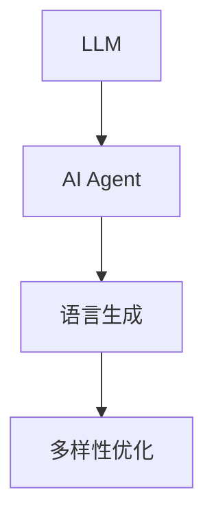
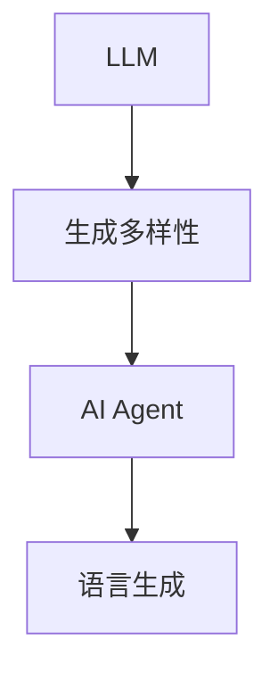
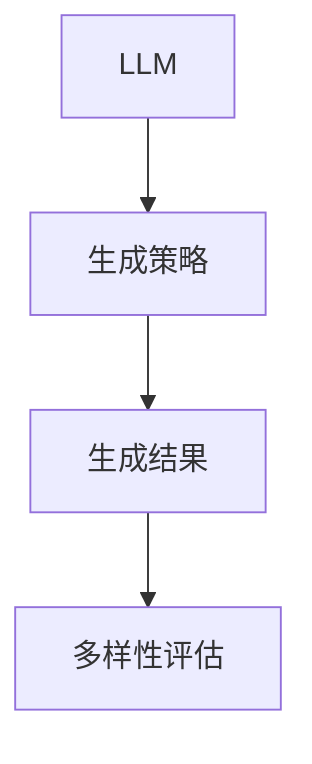
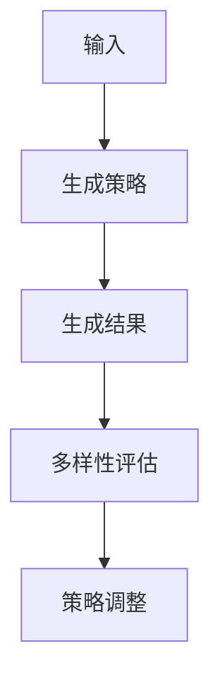
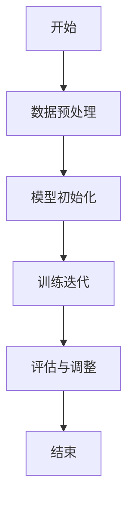
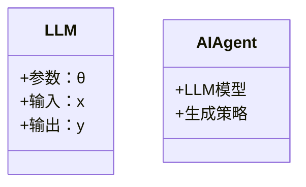
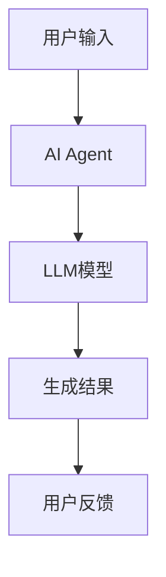
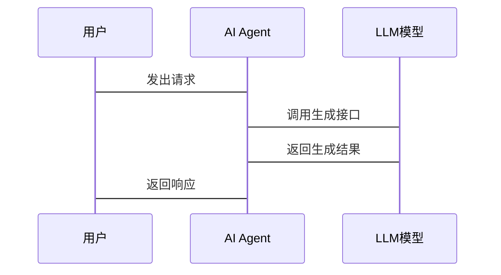

                 


# LLM在AI Agent语言生成多样性上的优化

> 关键词：LLM, AI Agent, 语言生成多样性, 大语言模型, 强化学习, 生成策略

> 摘要：本文探讨了如何利用大语言模型（LLM）提升AI代理的语言生成多样性。通过分析生成多样性的核心要素，对比LLM与其他NLP模型的差异，结合算法原理和数学模型，提出了优化策略，并通过系统设计和项目实战展示了实现方法。本文旨在为AI Agent的开发者提供理论支持和实践指导，帮助他们在实际应用中实现更丰富、多样的语言生成能力。

---

## 第一部分: LLM在AI Agent语言生成多样性上的优化背景介绍

### 1.1 问题背景与问题描述

#### 1.1.1 当前AI Agent语言生成面临的挑战
AI Agent（智能代理）在语言生成方面面临的主要挑战包括：
- **生成多样性不足**：传统的NLP模型往往过于受限，生成的文本缺乏多样性。
- **上下文理解不足**：AI Agent需要理解复杂的上下文关系，以生成符合情境的多样文本。
- **动态适应性差**：在动态变化的环境中，生成策略难以快速调整。

#### 1.1.2 语言生成多样性的重要性
语言生成的多样性直接关系到AI Agent的智能水平和用户体验：
- **提升用户体验**：多样化的生成结果使用户感受到更智能的交互。
- **增强适应性**：多样性生成使AI Agent能够在不同场景下灵活应对。
- **避免单一性问题**：多样生成可以减少因单一生成策略导致的错误或不适应情况。

#### 1.1.3 当前技术的局限性与改进方向
当前技术在语言生成多样性上的主要局限性包括：
- **模型限制**：传统生成模型（如简单的RNN或LSTM）在生成多样性方面的能力有限。
- **训练数据不足**：高质量的多样生成需要大量多样化数据，而这些数据往往难以获取。
- **计算资源消耗**：生成多样性优化通常需要更复杂的计算和训练过程。

改进方向：
- 引入更先进的模型架构（如Transformer）。
- 利用外部知识库增强生成多样性。
- 通过强化学习等方法优化生成策略。

### 1.2 问题解决思路

#### 1.2.1 LLM在AI Agent中的作用
LLM（Large Language Model）通过其强大的上下文理解和生成能力，为AI Agent提供了以下优势：
- **强大的上下文理解**：LLM能够捕捉到文本中的深层语义信息。
- **丰富的知识储备**：LLM基于海量数据训练，能够生成多样化的内容。
- **动态适应能力**：LLM可以通过微调等方式快速适应新的任务或场景。

#### 1.2.2 提升语言生成多样性的关键点
要提升AI Agent的语言生成多样性，需要重点关注以下几点：
- **模型的可定制化**：允许根据具体需求调整生成策略。
- **生成策略的多样性控制**：通过参数调整或引入多样性损失函数来控制生成结果的多样性。
- **动态反馈机制**：根据用户反馈实时调整生成策略。

#### 1.2.3 边界与外延
- **边界**：本文主要关注基于LLM的生成多样性优化，不涉及其他类型模型。
- **外延**：生成多样性优化不仅仅适用于语言生成，还可以应用于其他生成任务（如图像生成、音乐生成等）。

### 1.3 概念结构与核心要素

#### 1.3.1 LLM与AI Agent的关系
通过Mermaid图展示LLM与AI Agent的关系：


#### 1.3.2 语言生成多样性优化的核心要素
核心要素包括：
1. **模型架构**：模型的结构决定了生成能力。
2. **训练数据**：数据的多样性直接影响生成结果。
3. **生成策略**：生成过程中的策略选择。
4. **评估指标**：用于衡量生成结果的多样性。

#### 1.3.3 概念结构图
通过Mermaid图展示概念结构：


---

## 第二部分: 核心概念与联系

### 2.1 核心概念原理

#### 2.1.1 LLM的基本原理
LLM基于Transformer架构，通过自注意力机制捕捉文本的长距离依赖关系，从而实现强大的生成能力。

#### 2.1.2 AI Agent的定义与功能
AI Agent是一个智能实体，能够感知环境、执行任务并进行交互。

#### 2.1.3 语言生成多样性的数学模型
生成多样性可以通过以下公式衡量：
$$ D = \sum_{i=1}^{n} \log p(y_i) $$

### 2.2 核心概念对比分析

#### 2.2.1 LLM与传统NLP模型的对比
通过对比表格展示LLM与传统模型的差异：

| 特性                | LLM                     | 传统NLP模型         |
|---------------------|-------------------------|---------------------|
| 模型架构            | Transformer              | RNN/LSTM            |
| 上下文理解能力      | 强大                   | 较弱               |
| 训练数据量          | 巨大                   | 较小               |
| 生成能力            | 高                    | 一般               |

#### 2.2.2 生成多样性与生成质量的权衡
生成多样性与生成质量之间存在权衡，可以通过以下公式表示：
$$ \text{多样性} + \text{质量} \leq C $$
其中，$C$是常数。

#### 2.2.3 模型属性特征对比表格
| 特性                | LLM                     | 传统模型            |
|---------------------|-------------------------|---------------------|
| 参数量              | 数十亿级别             | 数百万级别         |
| 训练数据量          | 巨大                   | 较小               |
| 生成速度            | 较慢                   | 较快               |

### 2.3 ER实体关系图

通过Mermaid图展示实体关系：


---

## 第三部分: 算法原理讲解

### 3.1 算法原理概述

#### 3.1.1 LLM的训练过程
LLM的训练过程包括以下步骤：
1. **数据预处理**：清洗和格式化数据。
2. **模型初始化**：定义模型架构并初始化参数。
3. **训练迭代**：通过反向传播优化模型参数。
4. **评估与调整**：根据评估结果调整训练策略。

#### 3.1.2 基于强化学习的生成策略
通过强化学习优化生成策略，具体步骤如下：
1. **定义奖励函数**：衡量生成结果的多样性。
2. **策略调整**：根据奖励函数调整生成策略。
3. **训练迭代**：反复优化生成策略。

#### 3.1.3 多样性优化的算法框架
算法框架如下：


### 3.2 算法流程图

通过Mermaid图展示算法流程：


### 3.3 Python实现示例

#### 3.3.1 基于Hugging Face的LLM实现
```python
from transformers import AutoModelForCausalLM, AutoTokenizer

model_name = "gpt2"
tokenizer = AutoTokenizer.from_pretrained(model_name)
model = AutoModelForCausalLM.from_pretrained(model_name)
```

#### 3.3.2 多样性优化的代码示例
```python
def generate_diverse_responses(model, tokenizer, prompt, num_samples=5):
    input_ids = tokenizer.encode(prompt, return_tensors="pt")
    input_ids = input_ids.to(model.device)
    outputs = model.generate(
        input_ids=input_ids,
        max_length=50,
        num_beams=5,
        temperature=1.2,
        top_p=0.7
    )
    return tokenizer.decode(outputs[0], skip_special_tokens=True)
```

#### 3.3.3 算法实现的详细解读
- **数据预处理**：包括文本清洗、分词等步骤。
- **模型初始化**：定义模型架构并加载预训练权重。
- **训练迭代**：通过反向传播优化模型参数。
- **评估与调整**：根据生成结果的多样性调整模型参数。

---

## 第四部分: 数学模型与公式

### 4.1 数学模型概述

#### 4.1.1 生成概率的数学公式
生成概率公式为：
$$ p(y|x) = \frac{1}{N} \sum_{i=1}^{N} p_i(y|x) $$

#### 4.1.2 多样性评估的数学模型
多样性评估公式为：
$$ D = \sum_{i=1}^{n} \log p(y_i) $$

#### 4.1.3 优化目标的数学表达
优化目标为：
$$ \min_{\theta} \left( L(\theta) - \lambda D \right) $$

### 4.2 公式推导

#### 4.2.1 生成概率公式的推导
通过链式法则推导生成概率：
$$ p(y|x) = \prod_{i=1}^{n} p(y_i|x_{<i}) $$

#### 4.2.2 多样性评估公式的推导
通过信息论中的熵公式推导：
$$ H(y|x) = -\sum p(y|x) \log p(y|x) $$

#### 4.2.3 优化目标的数学证明
通过拉格朗日乘数法证明：
$$ L(\theta) = \mathcal{L}(\theta) + \lambda D $$

### 4.3 举例说明

#### 4.3.1 生成多样性优化的实例
通过调整温度参数（temperature）和概率截断（top_p）来控制生成多样性。

#### 4.3.2 数学公式的实际应用
在实际应用中，通过公式计算生成结果的多样性，并根据计算结果调整生成策略。

#### 4.3.3 优化策略的详细分析
分析不同参数设置对生成多样性的影响，并找到最优配置。

---

## 第五部分: 系统分析与架构设计方案

### 5.1 问题场景介绍

#### 5.1.1 问题场景描述
AI Agent需要在多种场景下生成多样化语言，如客服对话、内容创作等。

#### 5.1.2 项目介绍
本项目旨在优化AI Agent的语言生成多样性，提升用户体验。

### 5.2 系统功能设计

#### 5.2.1 领域模型
通过Mermaid类图展示领域模型：


#### 5.2.2 系统架构设计
通过Mermaid架构图展示系统架构：


#### 5.2.3 系统接口设计
系统接口包括：
- **输入接口**：接收用户输入。
- **输出接口**：返回生成结果。
- **反馈接口**：接收用户反馈并调整生成策略。

#### 5.2.4 系统交互流程图
通过Mermaid序列图展示交互流程：


---

## 第六部分: 项目实战

### 6.1 环境安装

#### 6.1.1 安装Python环境
使用Anaconda或虚拟环境管理Python版本。

#### 6.1.2 安装Hugging Face库
```bash
pip install transformers
```

### 6.2 系统核心实现

#### 6.2.1 核心代码实现
```python
from transformers import AutoModelForCausalLM, AutoTokenizer

def main():
    model_name = "gpt2"
    tokenizer = AutoTokenizer.from_pretrained(model_name)
    model = AutoModelForCausalLM.from_pretrained(model_name)
    
    while True:
        prompt = input("输入你的提示：")
        input_ids = tokenizer.encode(prompt, return_tensors="pt")
        input_ids = input_ids.to(model.device)
        outputs = model.generate(
            input_ids=input_ids,
            max_length=50,
            num_beams=5,
            temperature=1.2,
            top_p=0.7
        )
        response = tokenizer.decode(outputs[0], skip_special_tokens=True)
        print("生成结果：", response)

if __name__ == "__main__":
    main()
```

#### 6.2.2 代码解读与分析
- **数据预处理**：用户输入经过分词处理。
- **模型调用**：使用Hugging Face库中的模型进行生成。
- **生成结果**：根据参数设置生成多样化的内容。

### 6.3 案例分析与详细讲解

#### 6.3.1 案例分析
通过实际案例展示生成多样性优化的效果。

#### 6.3.2 详细讲解
分析生成过程中的关键参数及其对生成多样性的影响。

### 6.4 项目小结

#### 6.4.1 项目总结
总结项目的实现过程和取得的成果。

#### 6.4.2 经验与教训
分享在项目实施过程中积累的经验和遇到的问题。

---

## 第七部分: 最佳实践与总结

### 7.1 最佳实践 tips
- **参数调整**：根据具体需求调整生成参数（如温度、top_p）。
- **数据优化**：使用高质量、多样的训练数据。
- **反馈机制**：引入用户反馈实时优化生成策略。

### 7.2 小结
本文详细探讨了LLM在AI Agent语言生成多样性优化中的应用，从理论到实践，为读者提供了全面的指导。

### 7.3 注意事项
- **参数选择**：避免过度调整参数导致生成质量下降。
- **计算资源**：优化生成过程中的计算效率。

### 7.4 拓展阅读
建议进一步阅读相关文献，深入理解LLM和AI Agent的结合应用。

---

## 作者

作者：AI天才研究院/AI Genius Institute & 禅与计算机程序设计艺术 /Zen And The Art of Computer Programming

---

通过以上步骤，我们可以全面而系统地优化LLM在AI Agent中的语言生成多样性，为实际应用提供有力支持。

