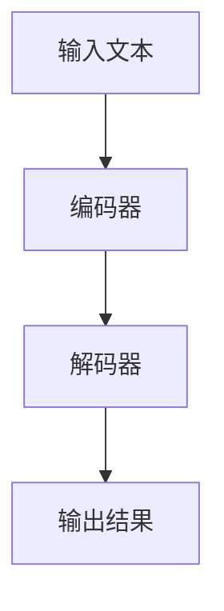
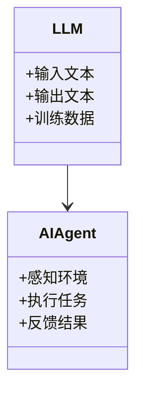
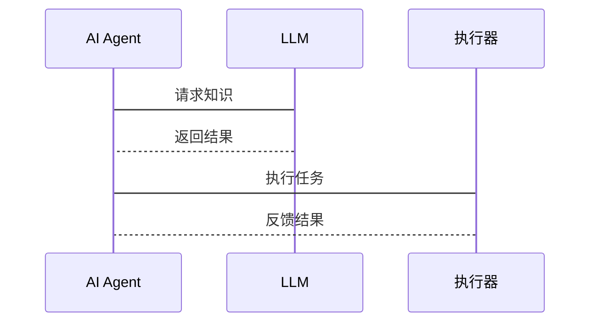

                 


# LLM在AI Agent跨领域知识整合中的应用

**关键词：** 大语言模型（LLM）、人工智能代理（AI Agent）、跨领域知识整合、知识图谱、语义理解、协同工作

**摘要：** 大语言模型（LLM）在人工智能代理（AI Agent）中的跨领域知识整合应用，是当前人工智能领域的重要研究方向。本文从LLM的基本原理出发，分析其在AI Agent中的角色与功能，探讨LLM与AI Agent的协同工作模式，并通过实际案例展示跨领域知识整合的应用场景。文章结构清晰，内容详实，涵盖从理论到实践的各个方面，为读者提供全面的技术解读。

---

## 第1章 LLM与AI Agent的基本概念

### 1.1 问题背景与问题描述

#### 1.1.1 传统AI系统的局限性
传统AI系统通常依赖于规则引擎或基于单一领域的知识库，难以处理跨领域的问题。例如，医疗领域的AI系统可能无法直接理解法律领域的术语，导致知识整合困难。

#### 1.1.2 知识整合的需求
随着人工智能技术的广泛应用，AI系统需要处理越来越多跨领域的问题。例如，一个智能助手可能需要理解医疗、法律、金融等多个领域的知识，以提供更全面的服务。

#### 1.1.3 LLM的出现与AI Agent的结合
大语言模型（LLM）的出现为跨领域知识整合提供了新的可能性。LLM能够处理大量的文本数据，理解上下文关系，并通过AI Agent进行实际操作，从而实现跨领域的知识整合。

### 1.2 问题解决与边界

#### 1.2.1 LLM在知识整合中的优势
LLM具有强大的语义理解能力，能够处理多种语言和复杂的问题。此外，LLM可以通过持续学习不断更新知识库，适应新的领域需求。

#### 1.2.2 AI Agent的跨领域知识整合边界
AI Agent的跨领域知识整合需要考虑数据隐私、计算资源和知识覆盖范围等问题。同时，AI Agent需要与不同领域的知识库进行交互，确保信息的准确性和一致性。

#### 1.2.3 LLM与AI Agent的结合方式
LLM可以作为AI Agent的知识库，AI Agent则作为LLM的执行者，两者协同工作，实现跨领域知识的整合与应用。

### 1.3 核心概念与结构

#### 1.3.1 LLM的定义与核心要素
- **定义：** 大语言模型（LLM）是一种基于深度学习的自然语言处理模型，能够理解和生成人类语言。
- **核心要素：** 包括大规模的训练数据、复杂的模型结构、高效的训练算法等。

#### 1.3.2 AI Agent的定义与核心要素
- **定义：** AI Agent是一种智能体，能够感知环境并执行任务。
- **核心要素：** 包括感知能力、决策能力、执行能力等。

#### 1.3.3 两者的结合与整合机制
- **结合方式：** LLM作为知识库，AI Agent作为执行者。
- **整合机制：** AI Agent通过LLM获取知识，LLM通过AI Agent实现实际应用。

### 1.4 本章小结
本章介绍了LLM和AI Agent的基本概念，分析了跨领域知识整合的需求和挑战，并探讨了两者结合的可能性和整合机制。

---

## 第2章 LLM的核心原理

### 2.1 LLM的基本原理

#### 2.1.1 大语言模型的训练过程
- **预训练：** 使用大规模文本数据进行无监督学习。
- **微调：** 根据具体任务调整模型参数。

#### 2.1.2 模型的注意力机制
- **自注意力机制：** 模型能够关注输入中的重要部分，提升语义理解能力。

#### 2.1.3 模型的解码过程
- **解码器：** 根据上下文生成输出文本。

### 2.2 LLM的数学模型与公式

#### 2.2.1 概率分布与损失函数
$$ \text{损失函数} = -\sum_{i=1}^{n} \log p(x_i) $$

#### 2.2.2 优化算法与更新公式
$$ \theta = \theta - \eta \frac{\partial L}{\partial \theta} $$

### 2.3 LLM与AI Agent的关系

#### 2.3.1 LLM作为知识库的载体
- **知识存储：** LLM能够存储和理解大量跨领域的知识。
- **动态更新：** LLM可以实时更新知识库，适应新的信息。

#### 2.3.2 AI Agent作为LLM的执行者
- **任务执行：** AI Agent根据LLM的指令执行具体任务。
- **反馈机制：** AI Agent将执行结果反馈给LLM，形成闭环。

#### 2.3.3 两者的结合与协同工作
- **协同模式：** LLM负责知识处理，AI Agent负责任务执行。
- **交互流程：** AI Agent向LLM提出问题，LLM提供答案或建议，AI Agent执行任务并反馈结果。

### 2.4 本章小结
本章详细讲解了LLM的核心原理，分析了其与AI Agent的关系，并探讨了两者协同工作的模式。

---

## 第3章 LLM的算法实现

### 3.1 算法原理

#### 3.1.1 基于Transformer的模型结构
- **编码器：** 将输入文本转换为向量表示。
- **解码器：** 根据向量生成输出文本。

#### 3.1.2 编码器与解码器的交互过程
- **自注意力机制：** 解码器中的每个位置都关注前面的词。

#### 3.1.3 模型的训练与推理流程
- **训练：** 使用大规模数据训练模型参数。
- **推理：** 根据输入生成输出。

### 3.2 算法流程图



### 3.3 算法实现代码

```python
def model_forward(x, y):
    # 编码器
    enc_output = encoder(x)
    # 解码器
    dec_output = decoder(y, enc_output)
    # 输出
    output = head(dec_output)
    return output
```

### 3.4 本章小结
本章通过流程图和代码详细讲解了LLM的算法实现过程，展示了模型的训练和推理流程。

---

## 第4章 系统分析与架构设计

### 4.1 问题场景介绍

#### 4.1.1 跨领域知识整合的场景
- **医疗领域：** 整合医疗知识与法律条款。
- **金融领域：** 整合金融数据与市场动态。

### 4.2 系统功能设计

#### 4.2.1 领域模型设计


### 4.3 系统架构设计

#### 4.3.1 系统架构图
```mermaid
graph TD
    LLM[大语言模型] --> A[知识库]
    A --> AI Agent
    AI Agent --> B[执行器]
```

#### 4.3.2 系统交互流程


### 4.4 本章小结
本章通过系统架构图和交互流程图，展示了LLM与AI Agent协同工作的整体架构和交互过程。

---

## 第5章 项目实战

### 5.1 环境安装

#### 5.1.1 安装Python环境
- 使用Anaconda安装Python 3.8以上版本。

#### 5.1.2 安装LLM框架
- 使用Hugging Face库安装大语言模型：`pip install transformers`

### 5.2 核心代码实现

#### 5.2.1 LLM模型加载
```python
from transformers import AutoTokenizer, AutoModelForCausalLM
model_name = "gpt2"
tokenizer = AutoTokenizer.from_pretrained(model_name)
model = AutoModelForCausalLM.from_pretrained(model_name)
```

#### 5.2.2 AI Agent实现
```python
class AI_Agent:
    def __init__(self, model, tokenizer):
        self.model = model
        self.tokenizer = tokenizer
    def generate_response(self, input_text):
        inputs = self.tokenizer(input_text, return_tensors="np")
        outputs = self.model.generate(inputs.input_ids, max_length=50)
        response = self.tokenizer.decode(outputs[0])
        return response
```

### 5.3 代码应用解读

#### 5.3.1 LLM模型加载
- 使用Hugging Face库加载预训练的LLM模型和分词器。
- 模型加载后，可以生成符合要求的文本。

#### 5.3.2 AI Agent实现
- AI Agent通过调用LLM模型生成响应。
- 响应生成后，AI Agent可以根据需要执行具体任务。

### 5.4 实际案例分析

#### 5.4.1 医疗领域案例
- **输入文本：** "患者有高血压和糖尿病，建议用药方案。"
- **LLM输出：** "建议使用ACE抑制剂和胰岛素治疗。"
- **AI Agent执行：** 调用医疗知识库确认用药方案，并反馈结果。

#### 5.4.2 金融领域案例
- **输入文本：** "当前股市波动较大，建议投资策略。"
- **LLM输出：** "建议分散投资，关注蓝筹股。"
- **AI Agent执行：** 调用金融数据进行分析，并反馈结果。

### 5.5 本章小结
本章通过实际案例展示了LLM与AI Agent的协同工作过程，详细讲解了代码实现和应用流程。

---

## 第6章 最佳实践与小结

### 6.1 最佳实践

#### 6.1.1 知识库管理
- 定期更新知识库，确保信息的准确性和时效性。
- 使用多语言模型，支持多种语言的跨领域知识整合。

#### 6.1.2 模型优化
- 根据具体任务调整模型参数，优化性能。
- 使用分布式训练，提升模型的并行计算能力。

#### 6.1.3 安全与隐私
- 确保数据隐私，遵守相关法律法规。
- 使用加密技术，保护敏感信息。

### 6.2 小结与展望
本文详细讲解了LLM在AI Agent跨领域知识整合中的应用，从理论到实践，为读者提供了全面的技术解读。未来，随着AI技术的不断发展，LLM与AI Agent的结合将更加紧密，应用场景也将更加广泛。

---

## 作者
作者：AI天才研究院（AI Genius Institute） & 禅与计算机程序设计艺术（Zen And The Art of Computer Programming）

---

通过以上内容，读者可以全面了解LLM在AI Agent跨领域知识整合中的应用，从基础理论到实际案例，逐步深入，掌握相关技术的核心要点。

