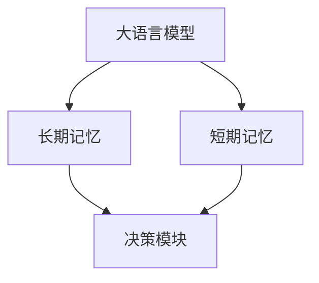
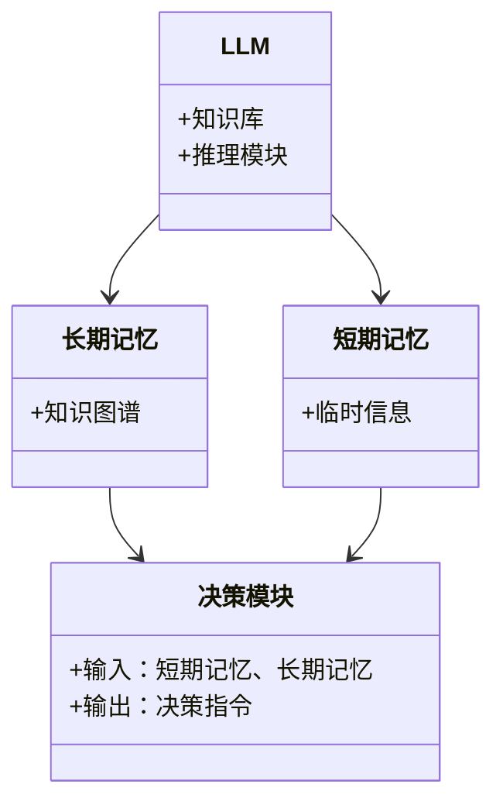
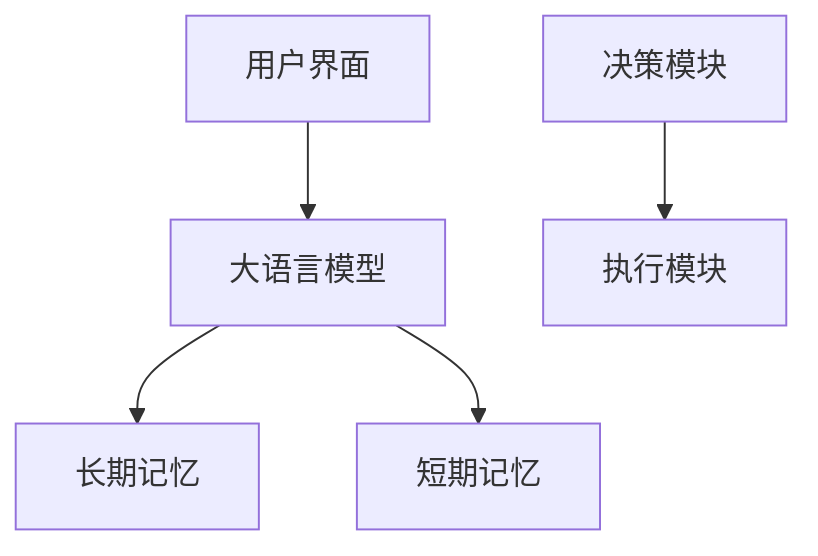
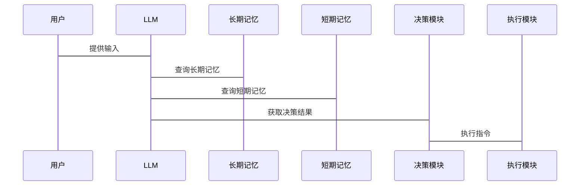

                 


# LLM在AI Agent长短期记忆融合中的应用

## 关键词：
- 大语言模型（LLM）
- AI Agent
- 长短期记忆
- 记忆融合
- 知识图谱
- 实体关系
- 序列图

## 摘要：
本文探讨了大语言模型（LLM）在AI代理（AI Agent）长短期记忆融合中的应用。通过分析记忆机制、算法原理和系统架构，结合实际案例，展示了如何利用LLM提升AI Agent的智能性和实用性。

---

# 第1章: LLM与AI Agent长短期记忆融合的背景与概念

## 1.1 问题背景
### 1.1.1 AI Agent的基本概念与特点
AI Agent是一种具备自主决策能力的智能体，能够根据环境信息做出决策和行动。

### 1.1.2 LLM在AI Agent中的作用
大语言模型（LLM）通过强大的语言处理能力，帮助AI Agent理解和生成自然语言，提升其交互能力。

### 1.1.3 长短期记忆融合的必要性
AI Agent需要结合历史信息（长期记忆）和当前情境（短期记忆）来做出更智能的决策。

## 1.2 问题描述
### 1.2.1 AI Agent记忆系统的挑战
传统记忆机制难以处理复杂场景下的信息关联和更新。

### 1.2.2 LLM在记忆处理中的优势
LLM能够处理非结构化数据，具备强大的语义理解能力。

### 1.2.3 长短期记忆融合的目标与意义
通过融合长短期记忆，提升AI Agent的决策能力和知识保持能力。

## 1.3 问题解决
### 1.3.1 LLM在长短期记忆融合中的解决方案
利用LLM的语义理解和知识存储能力，构建动态更新的长短期记忆系统。

### 1.3.2 解决方案的可行性分析
LLM的可扩展性和灵活性使其适合应用于记忆融合。

## 1.4 概念结构与核心要素
### 1.4.1 概念结构图
使用Mermaid图展示LLM与长短期记忆的关系。



### 1.4.2 核心要素组成
- LLM：负责语义理解和知识生成
- 长期记忆：存储重要信息和知识图谱
- 短期记忆：处理当前情境和临时信息

### 1.4.3 核心要素的相互关系
通过LLM的桥梁作用，长期记忆和短期记忆相互补充，共同支持决策模块。

---

# 第2章: LLM与长短期记忆的核心原理

## 2.1 LLM的基本原理
### 2.1.1 大语言模型的定义与特点
LLM通过深度学习训练，具备强大的语言理解和生成能力。

### 2.1.2 LLM的核心算法与训练机制
基于Transformer架构，采用自监督学习进行预训练。

### 2.1.3 LLM的记忆能力与局限性
LLM无法直接存储信息，需要依赖外部存储系统。

## 2.2 长短期记忆机制
### 2.2.1 长期记忆的定义与特点
长期记忆用于存储重要且持久的信息，如知识图谱。

### 2.2.2 短期记忆的定义与特点
短期记忆处理当前情境下的临时信息。

### 2.2.3 长短期记忆的相互关系
通过LLM的语义理解，长期记忆和短期记忆实现信息的动态关联。

## 2.3 LLM与长短期记忆的融合原理
### 2.3.1 LLM如何增强长期记忆
通过LLM的语义分析，长期记忆中的信息得到优化和关联。

### 2.3.2 短期记忆如何影响LLM的决策
短期记忆提供当前情境信息，影响LLM的输出和决策。

---

# 第3章: LLM在长短期记忆融合中的算法原理

## 3.1 算法概述
### 3.1.1 记忆存储与检索机制
使用知识图谱和向量数据库进行高效存储和检索。

## 3.2 算法步骤
### 3.2.1 信息输入与解析
通过LLM解析输入信息，提取关键特征。

### 3.2.2 长期记忆更新
根据新信息更新知识图谱，保持长期记忆的准确性。

### 3.2.3 短期记忆维护
动态更新短期记忆，清除过时信息。

## 3.3 算法实现
### 3.3.1 记忆存储的数学模型
使用图论表示知识图谱，构建实体关系网络。

### 3.3.2 短期记忆的检索算法
基于关键词匹配和向量相似度进行检索。

---

# 第4章: 系统分析与架构设计方案

## 4.1 问题场景介绍
### 4.1.1 项目背景
设计一个具备长短期记忆的AI代理系统。

## 4.2 系统功能设计
### 4.2.1 领域模型
使用Mermaid类图展示系统模块。



## 4.3 系统架构设计
### 4.3.1 系统架构图
展示系统的分层架构。



## 4.4 系统接口设计
### 4.4.1 输入接口
接收用户输入和环境数据。

### 4.4.2 输出接口
输出决策指令和反馈信息。

## 4.5 系统交互流程
### 4.5.1 交互流程图
展示系统从输入到输出的交互过程。



---

# 第5章: 项目实战

## 5.1 环境安装
### 5.1.1 安装Python
```bash
python --version
```

### 5.1.2 安装依赖
```bash
pip install transformers
pip install networkx
pip install numpy
```

## 5.2 核心代码实现
### 5.2.1 LLM接口实现
```python
from transformers import AutoTokenizer, AutoModelForCausalLM

class LLMInterface:
    def __init__(self):
        self.tokenizer = AutoTokenizer.from_pretrained("gpt2")
        self.model = AutoModelForCausalLM.from_pretrained("gpt2")
```

### 5.2.2 知识图谱构建
```python
import networkx as nx

class KnowledgeGraph:
    def __init__(self):
        self.graph = nx.Graph()
```

### 5.2.3 决策模块实现
```python
class DecisionModule:
    def make_decision(self, short_term_memory, long_term_memory):
        # 实现决策逻辑
        pass
```

## 5.3 代码应用解读与分析
### 5.3.1 LLM接口的使用场景
通过LLM接口生成自然语言响应。

### 5.3.2 知识图谱的构建与更新
动态更新知识图谱，保持长期记忆的准确性。

## 5.4 实际案例分析
### 5.4.1 案例背景
设计一个客服AI代理，具备对话历史记忆和客户信息长期记忆。

### 5.4.2 案例实现
展示如何利用LLM和记忆融合技术提升客服服务质量。

## 5.5 项目小结
总结项目实现的关键点和经验教训。

---

# 第6章: 最佳实践、小结与注意事项

## 6.1 最佳实践
### 6.1.1 知识图谱的构建与维护
定期更新知识图谱，保持信息准确性。

### 6.1.2 决策模块的优化
引入多模态数据，提升决策的准确性。

## 6.2 小结
总结全书内容，强调LLM在长短期记忆融合中的重要性。

## 6.3 注意事项
### 6.3.1 数据隐私问题
确保用户数据的安全和隐私。

### 6.3.2 系统性能优化
优化算法和架构，提升系统的响应速度。

## 6.4 拓展阅读
推荐相关领域的书籍和论文，供读者进一步学习。

---

# 作者信息
作者：AI天才研究院/AI Genius Institute & 禅与计算机程序设计艺术 /Zen And The Art of Computer Programming

---

通过以上目录大纲，我们可以清晰地看到，文章将系统地介绍LLM在AI Agent长短期记忆融合中的应用，从理论到实践，逐步展开，确保读者能够全面理解和掌握相关知识。

