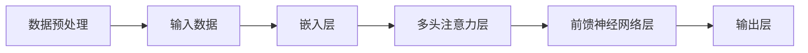
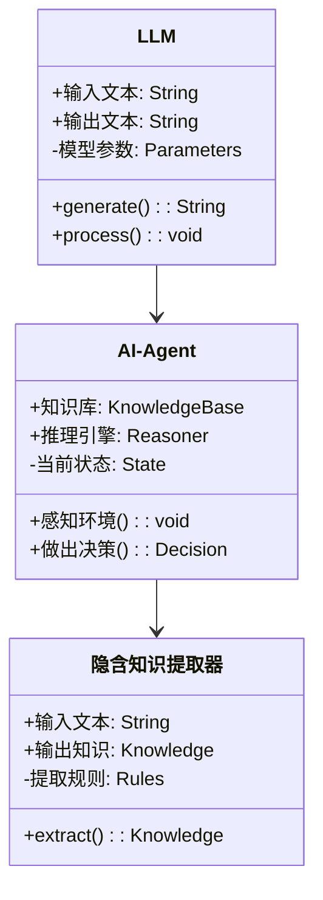
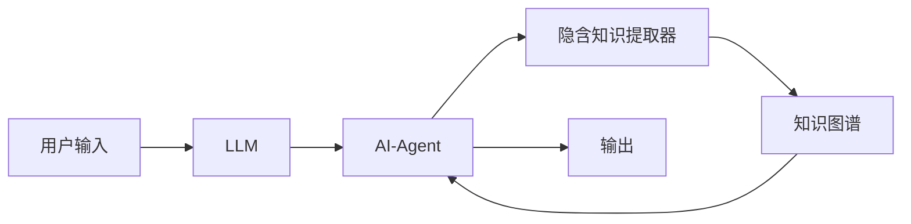

                 


# LLM在AI Agent隐含知识提取中的应用

> **关键词**: 大语言模型, AI Agent, 隐含知识提取, 知识图谱, 自然语言处理, 机器学习, 人工智能

> **摘要**: 本文探讨了如何利用大语言模型（LLM）赋能AI Agent，特别是从文本中提取隐含知识的关键技术。文章详细分析了LLM与AI Agent的结合方式，提出了基于LLM的隐含知识提取算法，并通过实际案例展示了如何构建高效的知识图谱。通过系统架构设计和项目实战，本文为读者提供了从理论到实践的全面指导，帮助AI Agent更好地理解和应用隐含知识。

---

## 第一部分: 背景与概述

### 第1章: 背景介绍

#### 1.1 问题背景

##### 1.1.1 LLM的基本概念与特点

大语言模型（LLM）是指经过大量数据训练的深度学习模型，具有以下特点：

- **大规模训练**: 基于海量文本数据进行预训练，参数量通常在数十亿级别。
- **多任务能力**: 可以处理多种自然语言处理任务，如文本生成、问答系统、文本摘要等。
- **上下文理解**: 具备上下文理解能力，能够处理复杂语义。

##### 1.1.2 AI Agent的核心概念与功能

AI Agent（人工智能代理）是一种能够感知环境并采取行动以实现目标的智能体。其核心功能包括：

- **感知**: 通过传感器或数据输入感知环境。
- **推理**: 使用知识库和推理机制做出决策。
- **行动**: 执行动作以达到目标。

##### 1.1.3 隐含知识提取的背景与重要性

隐含知识是指隐藏在文本中的深层信息，通常不直接表达。提取隐含知识对于AI Agent来说至关重要，因为它能够帮助Agent理解上下文，做出更智能的决策。

#### 1.2 问题描述

##### 1.2.1 隐含知识提取的定义

隐含知识提取是指从文本中抽取隐含信息，这些信息未在文本中直接表达，但可以通过上下文推断出来。

##### 1.2.2 LLM在AI Agent中的角色

LLM作为AI Agent的核心组件，负责处理自然语言输入，提取隐含知识，并生成自然语言输出。

##### 1.2.3 当前技术的局限性与挑战

- **语境理解不足**: 现有模型在复杂语境下的理解能力有限。
- **知识更新问题**: 预训练模型的知识可能过时。
- **推理能力有限**: 需要结合外部知识库进行推理。

#### 1.3 问题解决

##### 1.3.1 LLM如何赋能AI Agent

通过LLM的强大语言处理能力，AI Agent可以更准确地理解用户需求，提取隐含知识，并生成智能响应。

##### 1.3.2 隐含知识提取的关键技术

- **基于规则的方法**: 使用正则表达式或语义规则提取隐含知识。
- **基于机器学习的方法**: 使用深度学习模型提取隐含知识。
- **结合知识图谱的方法**: 将隐含知识整合到知识图谱中，供AI Agent使用。

##### 1.3.3 LLM在AI Agent中的具体应用场景

- **智能问答系统**: 提供更准确的答案，基于上下文理解。
- **文本摘要**: 生成高质量的摘要，提取关键信息。
- **对话系统**: 实现更自然的对话，理解用户的深层需求。

#### 1.4 边界与外延

##### 1.4.1 LLM与AI Agent的边界

- **LLM的输入输出范围**: 明确LLM处理的输入和输出范围。
- **AI Agent的功能限制**: 界定AI Agent的能力范围。

##### 1.4.2 隐含知识提取的适用范围

- **文本类型**: 包括新闻、网页、对话等。
- **领域限制**: 适用于特定领域的隐含知识提取。

##### 1.4.3 相关技术的对比与区分

- **对比**: 对比LLM与传统NLP技术的优缺点。
- **区分**: 区分隐含知识提取与其他文本处理技术。

#### 1.5 概念结构与核心要素

##### 1.5.1 LLM与AI Agent的交互模型

- **输入输出模型**: 明确LLM与AI Agent之间的交互流程。
- **数据流**: 描述数据在两者之间的流动过程。

##### 1.5.2 隐含知识提取的核心要素

- **输入文本**: 待处理的原始文本数据。
- **提取规则**: 用于指导隐含知识提取的规则或模型。
- **知识库**: 存储提取的隐含知识的结构化数据。

##### 1.5.3 核心概念之间的关系

- **依赖关系**: 描述LLM、AI Agent和隐含知识提取之间的相互依赖关系。
- **协同工作**: 说明各部分如何协同完成隐含知识提取任务。

---

## 第二部分: 核心概念与联系

### 第2章: 核心概念与联系

#### 2.1 LLM的核心原理

##### 2.1.1 大语言模型的结构与特点

- **模型结构**: 介绍LLM的模型架构，如Transformer。
- **训练过程**: 详细描述预训练和微调的过程。

##### 2.1.2 LLM的训练过程



##### 2.1.3 LLM的输出机制

- **生成策略**: 如贪心算法或采样方法。
- **损失函数**: 如交叉熵损失函数。

#### 2.2 AI Agent的工作原理

##### 2.2.1 AI Agent的定义与分类

- **定义**: AI Agent的定义及分类，如基于规则的和基于模型的。

##### 2.2.2 AI Agent的感知与决策过程

- **感知**: 通过传感器或输入数据感知环境。
- **决策**: 基于感知信息做出决策。

##### 2.2.3 AI Agent的知识表示与推理

- **知识表示**: 使用符号逻辑或概率图模型。
- **推理方法**: 如逻辑推理和概率推理。

#### 2.3 隐含知识提取的关键技术

##### 2.3.1 隐含知识的定义与特征

- **定义**: 隐含知识的定义。
- **特征**: 如上下文依赖性、领域特定性。

##### 2.3.2 基于LLM的隐含知识提取方法

- **方法**: 使用LLM进行隐含知识提取的具体步骤。

##### 2.3.3 基于规则的隐含知识提取方法

- **方法**: 使用正则表达式或语义规则提取隐含知识。

#### 2.4 核心概念的对比与联系

##### 2.4.1 LLM与传统NLP技术的对比

- **对比**: 对比LLM与传统NLP技术的优缺点。

##### 2.4.2 AI Agent与传统软件代理的对比

- **对比**: 说明AI Agent与传统软件代理的区别。

##### 2.4.3 隐含知识提取与显式知识提取的对比

- **对比**: 对比隐含知识提取与显式知识提取的异同。

---

### 2.4.3 隐含知识提取与显式知识提取的对比

| **特性**           | **隐含知识提取**            | **显式知识提取**            |
|--------------------|-----------------------------|-----------------------------|
| **定义**           | 提取未直接表达的信息         | 提取直接表达的信息           |
| **应用场景**       | 需要理解上下文的任务         | 需要提取明确信息的任务         |
| **复杂性**         | 较高，依赖模型理解能力       | 较低，主要依赖规则或关键词匹配 |
| **技术要求**       | 高，需要先进NLP技术           | 较低，传统文本处理技术即可     |
| **例子**           | 从新闻中提取事件背景信息     | 从简历中提取工作经历信息       |

---

## 第三部分: 算法原理

### 第3章: 算法原理

#### 3.1 LLM的训练过程

##### 3.1.1 预训练过程

- **预训练目标**: 使用大规模数据进行无监督预训练。
- **损失函数**: 如交叉熵损失函数。

##### 3.1.2 微调过程

- **微调数据**: 针对特定任务的数据。
- **微调方法**: 如任务特定的微调。

#### 3.2 AI Agent的知识提取算法

##### 3.2.1 基于规则的提取算法

- **规则定义**: 正则表达式或语义规则。
- **实现步骤**: 通过规则匹配提取隐含知识。

##### 3.2.2 基于机器学习的提取算法

- **训练数据**: 标注数据。
- **模型选择**: 如支持向量机、随机森林或深度学习模型。

##### 3.2.3 基于知识图谱的提取算法

- **知识图谱构建**: 从文本中提取实体及关系，构建知识图谱。
- **推理过程**: 使用知识图谱进行推理。

#### 3.3 隐含知识提取的数学模型

##### 3.3.1 语言模型的数学表示

$$ P(\text{text}) = \prod_{i=1}^{n} P(w_i | w_{i-1}, \ldots, w_{i-k}) $$

##### 3.3.2 隐含知识提取的优化目标

$$ \text{优化目标} = \arg \max_{\theta} \sum_{i=1}^{m} \text{loss}(x_i, y_i; \theta) $$

##### 3.3.3 知识图谱的表示学习

$$ \text{嵌入向量} = f(\text{实体/关系}) $$

---

## 第四部分: 系统分析与架构设计

### 第4章: 系统分析与架构设计

#### 4.1 问题场景介绍

- **目标**: 提供一个AI Agent，能够从文本中提取隐含知识。
- **用户需求**: 用户希望AI Agent能够理解上下文，提取深层信息。

#### 4.2 系统功能设计

##### 4.2.1 领域模型设计



##### 4.2.2 系统架构设计



##### 4.2.3 接口和交互设计

- **输入接口**: 用户输入文本。
- **输出接口**: 提供提取的知识或生成的文本。
- **交互流程**: 用户输入 -> LLM处理 -> AI-Agent决策 -> 隐含知识提取器提取 -> 知识图谱更新。

---

## 第五部分: 项目实战

### 第5章: 项目实战

#### 5.1 环境安装

- **工具安装**: 如Python、TensorFlow、Hugging Face库。
- **依赖管理**: 使用虚拟环境管理项目依赖。

#### 5.2 系统核心实现

##### 5.2.1 隐含知识提取器实现

```python
import re

def extract_hidden_knowledge(text):
    # 使用正则表达式提取隐含知识
    pattern = r'\b(important|critical|key)\b'
    matches = re.findall(pattern, text)
    return matches
```

##### 5.2.2 AI-Agent实现

```python
class AI-Agent:
    def __init__(self):
        self.knowledge_base = []

    def perceive(self, input_text):
        # 使用隐含知识提取器提取知识
        self.knowledge_base.extend(extract_hidden_knowledge(input_text))

    def decide(self):
        # 基于知识库做出决策
        return 'Based on the knowledge extracted, the decision is made.'
```

#### 5.3 代码应用解读与分析

##### 5.3.1 隐含知识提取器代码解读

- **函数定义**: `extract_hidden_knowledge(text)`。
- **实现逻辑**: 使用正则表达式匹配关键词。

##### 5.3.2 AI-Agent代码解读

- **类定义**: `AI-Agent` 类，包含知识库和决策方法。
- **方法实现**: `perceive` 方法调用隐含知识提取器，`decide` 方法基于知识库做出决策。

#### 5.4 实际案例分析

##### 5.4.1 案例选择

- **案例1**: 新闻文章的隐含知识提取。
- **案例2**: 对话历史的隐含知识提取。

##### 5.4.2 代码实现与分析

- **案例1实现**: 使用隐含知识提取器从新闻文章中提取关键词。
- **案例2实现**: 从对话历史中提取隐含信息，供AI-Agent做出决策。

#### 5.5 项目小结

- **项目目标**: 成功实现AI-Agent隐含知识提取功能。
- **项目成果**: 提供了可复用的代码和系统架构设计。
- **经验总结**: 强调了LLM与AI-Agent结合的重要性，以及系统架构设计的合理性。

---

## 第六部分: 总结与展望

### 第6章: 总结与展望

#### 6.1 最佳实践 Tips

- **数据质量**: 使用高质量的训练数据。
- **模型选择**: 根据任务需求选择合适的模型。
- **系统优化**: 定期更新知识库，优化系统性能。

#### 6.2 小结

本文详细探讨了LLM在AI Agent隐含知识提取中的应用，从理论到实践，提供了全面的指导。通过系统架构设计和项目实战，验证了方法的有效性。

#### 6.3 注意事项

- **数据隐私**: 注意数据隐私和安全问题。
- **模型解释性**: 提高模型的可解释性。
- **性能优化**: 优化系统的响应速度和处理能力。

#### 6.4 拓展阅读

- **相关论文**: 推荐阅读相关领域的最新论文。
- **技术书籍**: 推荐相关技术书籍，深入学习。

---

## 作者

**作者**：AI天才研究院/AI Genius Institute & 禅与计算机程序设计艺术/Zen And The Art of Computer Programming

