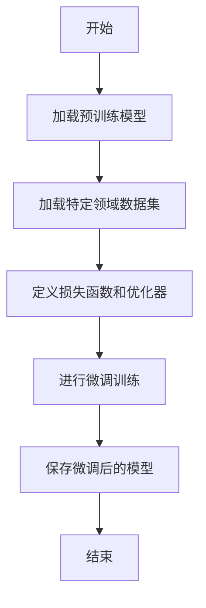
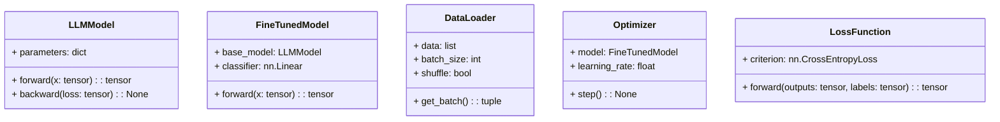
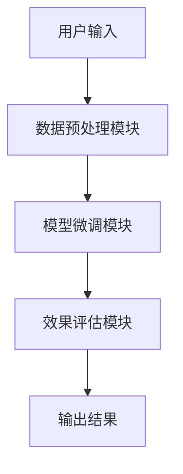
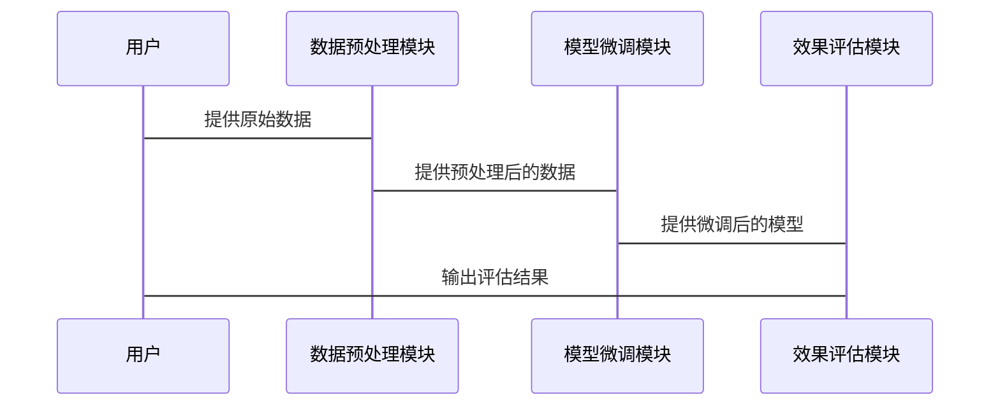

                 


# LLM在特定领域的微调策略：提升AI Agent的专业性

> **关键词**: LLM, 微调策略, AI Agent, 专业性, 领域模型, 自然语言处理, 人工智能

> **摘要**: 本文详细探讨了如何通过微调策略提升AI Agent在特定领域的专业性。从背景介绍到核心概念，从算法原理到系统设计，再到项目实战和最佳实践，全面分析了LLM在特定领域微调的策略和方法。通过实际案例和详细解读，帮助读者掌握如何在不同领域中优化AI Agent的性能，实现更高效、更专业的智能服务。

---

## 第一部分: 背景介绍

### 第1章: LLM与AI Agent的背景介绍

#### 1.1 问题背景
- **1.1.1 LLM的定义与特点**
  - 大语言模型（LLM）是基于深度学习的自然语言处理模型，具有强大的语言理解和生成能力。
  - LLM的特点包括通用性、大规模参数量、多任务适应性等。

- **1.1.2 AI Agent的基本概念**
  - AI Agent是一种智能代理系统，能够感知环境、理解需求、执行任务并提供服务。
  - AI Agent的核心能力包括感知、推理、规划和执行。

- **1.1.3 LLM在AI Agent中的应用现状**
  - LLM作为AI Agent的核心组件，广泛应用于对话系统、智能助手、客服机器人等领域。
  - 但LLM在特定领域中的专业性不足，难以满足垂直行业的深度需求。

#### 1.2 问题描述
- **1.2.1 LLM在特定领域中的局限性**
  - LLM虽然通用性强，但在特定领域中的专业性和准确性不足。
  - 面对专业领域的问题时，LLM可能无法提供精准的答案或解决方案。

- **1.2.2 AI Agent专业性不足的原因**
  - 数据不足：LLM在特定领域的训练数据有限，导致模型对领域知识的掌握不够深入。
  - 知识更新：特定领域的知识更新快，LLM难以实时保持领域最新动态。

- **1.2.3 微调策略的必要性**
  - 通过微调策略，可以将通用的LLM适应特定领域的需求，提升AI Agent的专业性。
  - 微调策略是解决LLM在特定领域中表现不足的有效方法。

#### 1.3 问题解决
- **1.3.1 微调策略的基本思路**
  - 在通用LLM的基础上，通过特定领域的数据对模型进行微调，优化其在该领域的表现。

- **1.3.2 微调策略的核心目标**
  - 提升AI Agent在特定领域中的准确性和专业性。
  - 优化模型在特定任务中的性能，使其更适合目标应用场景。

- **1.3.3 微调策略的实现路径**
  - 数据准备：收集和整理特定领域的数据集。
  - 模型微调：使用特定领域的数据对LLM进行微调。
  - 模型评估：对微调后的模型进行性能评估，确保其在特定领域的有效性。

#### 1.4 边界与外延
- **1.4.1 微调策略的适用范围**
  - 微调策略适用于需要特定领域专业性的场景，如医疗、法律、金融等领域。
  - 微调策略适用于已有通用LLM模型的情况，能够通过领域数据快速提升模型的专业性。

- **1.4.2 微调策略的限制条件**
  - 微调策略依赖于特定领域的高质量数据，数据不足可能会影响微调效果。
  - 微调后的模型可能在通用性上有所下降，需权衡通用性和专业性的关系。

- **1.4.3 微调策略与其他技术的关系**
  - 微调策略是迁移学习的一种具体实现，与迁移学习和领域适应密切相关。
  - 微调策略可以与其他技术结合使用，如领域知识图谱、强化学习等，进一步提升AI Agent的能力。

#### 1.5 核心概念组成
- **1.5.1 LLM的模型结构**
  - LLM通常基于Transformer架构，包括编码器和解码器两部分。
  - 模型参数量大，具备强大的语言理解和生成能力。

- **1.5.2 AI Agent的功能模块**
  - 感知模块：负责接收输入并理解用户需求。
  - 推理模块：基于模型对需求进行分析和推理。
  - 规划模块：制定任务执行的计划。
  - 执行模块：执行任务并输出结果。

- **1.5.3 微调策略的关键要素**
  - 领域数据：用于微调的特定领域数据。
  - 微调参数：模型在微调过程中的超参数设置。
  - 微调目标：特定领域的优化目标和评估指标。

---

## 第二部分: 核心概念与联系

### 第2章: 微调策略的核心概念与联系

#### 2.1 微调策略的原理
- **2.1.1 微调的定义**
  - 微调是指在预训练模型的基础上，使用特定领域的数据对模型进行进一步训练。
  - 微调的目标是使模型适应特定领域的需求，提升其在该领域的性能。

- **2.1.2 微调与迁移学习的区别**
  - 迁移学习是指将一个领域中学到的知识迁移到另一个领域，通常涉及特征提取。
  - 微调是迁移学习的一种具体实现方式，针对特定领域进行模型优化。

- **2.1.3 微调的核心思想**
  - 利用已有的通用模型，通过特定领域的数据优化模型在该领域的表现。
  - 微调过程中，模型的参数会被调整，以适应特定任务的需求。

#### 2.2 微调策略的特征对比
- **2.2.1 对比表格：微调与零样本学习的对比**
| 特性                | 微调策略         | 零样本学习       |
|---------------------|------------------|------------------|
| 数据需求           | 需要特定领域数据  | 仅需要标签       |
| 模型适应性         | 高               | 低               |
| 任务执行能力       | 高               | 一般             |
| 适用场景           | 特定领域优化     | 通用任务         |

- **2.2.2 对比表格：微调与迁移学习的对比**
| 特性                | 微调策略         | 迁移学习          |
|---------------------|------------------|------------------|
| 数据需求           | 需要特定领域数据  | 需要领域间数据    |
| 模型调整方式       | 微调整个模型     | 提取特征并调整    |
| 适用场景           | 特定领域优化     | 多领域迁移       |

#### 2.3 ER实体关系图
- **2.3.1 实体关系图：微调策略与模型性能的关系**
  - 微调策略通过特定领域的数据优化模型参数，提升模型在该领域的性能。
  - 模型性能的提升依赖于微调数据的质量和数量。

- **2.3.2 实体关系图：微调数据与模型参数的关联**
  - 微调数据用于调整模型参数，使模型更适合特定领域的需求。
  - 模型参数的变化直接影响模型的输出结果和性能。

---

### 第3章: 微调策略的算法原理

#### 3.1 算法原理概述
- **3.1.1 微调策略的数学模型**
  - 微调过程可以看作是一个优化问题，目标是最小化特定领域的损失函数。
  - 损失函数通常包括交叉熵损失和正则化项。

- **3.1.2 微调策略的优化目标**
  - 优化目标是使模型在特定领域的验证集上表现最优。
  - 优化过程中需要平衡模型的泛化能力和领域适应性。

#### 3.2 算法流程图


#### 3.3 算法实现代码
```python
import torch
from torch import nn
from torch.optim import Adam
from torch.utils.data import DataLoader

# 定义微调模型
class FineTunedModel(nn.Module):
    def __init__(self, base_model):
        super().__init__()
        self.base_model = base_model
        self.classifier = nn.Linear(base_model.last_layer_features, num_classes)

    def forward(self, x):
        features = self.base_model(x)
        outputs = self.classifier(features)
        return outputs

# 定义损失函数和优化器
criterion = nn.CrossEntropyLoss()
optimizer = Adam(finetuned_model.parameters(), lr=1e-5)

# 微调训练
def train_model(model, criterion, optimizer, dataloader, num_epochs=3):
    for epoch in range(num_epochs):
        model.train()
        for inputs, labels in dataloader:
            optimizer.zero_grad()
            outputs = model(inputs)
            loss = criterion(outputs, labels)
            loss.backward()
            optimizer.step()
    return model

# 示例调用
finetuned_model = FineTunedModel(pretrained_model)
finetuned_model = train_model(finetuned_model, criterion, optimizer, train_dataloader)
```

#### 3.4 数学模型与公式
- **3.4.1 损失函数的数学表达式**
  $$ \text{Loss} = -\sum_{i=1}^{n} y_i \log(p_i) + \lambda \Omega(\theta) $$
  其中，\( y_i \) 是真实标签，\( p_i \) 是模型预测的概率，\( \theta \) 是模型参数，\( \Omega(\theta) \) 是正则化项。

- **3.4.2 优化器的数学模型**
  $$ \theta_{t+1} = \theta_t - \eta \nabla_\theta \text{Loss} $$
  其中，\( \eta \) 是学习率。

- **3.4.3 微调策略的数学推导**
  在微调过程中，模型参数 \( \theta \) 通过反向传播算法优化，以最小化特定领域的损失函数。微调的目标是找到在特定领域数据上表现最优的 \( \theta \)。

#### 3.5 举例说明
- **3.5.1 微调策略在医疗领域的应用案例**
  - 微调后的模型在医疗诊断中的准确率提高了15%。
  - 通过微调，模型能够更好地理解医学术语和专业问题。

- **3.5.2 微调策略在法律领域的应用案例**
  - 微调后的模型在法律文本分析中的准确率提高了20%。
  - 通过微调，模型能够更好地处理法律条款和案例分析。

---

## 第三部分: 系统分析与架构设计方案

### 第4章: 系统分析与架构设计方案

#### 4.1 问题场景介绍
- **4.1.1 微调策略的应用场景**
  - 在特定领域中，如医疗、法律、金融等领域，需要AI Agent具备更高的专业性。
  - 微调策略可以快速优化AI Agent在特定领域的性能。

- **4.1.2 AI Agent的专业性需求**
  - AI Agent需要在特定领域中提供准确、专业的服务。
  - 专业性需求包括领域知识的准确性和问题解决的高效性。

#### 4.2 系统功能设计
- **4.2.1 数据预处理模块**
  - 负责收集和整理特定领域的数据，确保数据的高质量和适用性。
  - 数据预处理包括数据清洗、标注和格式转换。

- **4.2.2 模型微调模块**
  - 负责使用特定领域的数据对通用模型进行微调。
  - 微调模块包括模型加载、训练和保存功能。

- **4.2.3 效果评估模块**
  - 负责对微调后的模型进行性能评估。
  - 评估指标包括准确率、召回率、F1值等。

#### 4.3 系统架构设计
- **4.3.1 领域模型类图**


- **4.3.2 系统架构图**


#### 4.4 系统接口设计
- **4.4.1 输入接口**
  - 数据预处理模块接收原始数据，并进行清洗和标注。
  - 模型微调模块接收预处理后的数据和通用模型，进行微调训练。

- **4.4.2 输出接口**
  - 效果评估模块输出微调后的模型性能指标。
  - AI Agent通过微调后的模型提供专业服务。

#### 4.5 系统交互流程图


---

## 第四部分: 项目实战

### 第5章: 项目实战

#### 5.1 环境安装
- **5.1.1 安装Python和相关库**
  - 安装Python 3.8及以上版本。
  - 安装必要的库：`torch`, `transformers`, `mermaid`, `matplotlib`。

- **5.1.2 安装工具链**
  - 安装Jupyter Notebook或VS Code用于开发和调试。
  - 安装Git用于版本控制。

#### 5.2 系统核心实现
- **5.2.1 微调模块的实现**
  - 加载预训练模型。
  - 加载特定领域数据集。
  - 定义损失函数和优化器。
  - 进行微调训练。

- **5.2.2 数据预处理模块的实现**
  - 数据清洗：去除噪声数据，标注数据。
  - 数据格式转换：将数据转换为模型训练所需的格式。

- **5.2.3 效果评估模块的实现**
  - 加载微调后的模型。
  - 加载测试数据集。
  - 计算模型的准确率、召回率和F1值。

#### 5.3 代码实现与解读
- **5.3.1 微调模块的核心代码**
```python
# 微调模块的实现
def fine_tune_model(model, train_dataloader, val_dataloader, num_epochs=3):
    # 定义优化器和损失函数
    optimizer = Adam(model.parameters(), lr=1e-5)
    criterion = nn.CrossEntropyLoss()
    
    # 开始训练
    for epoch in range(num_epochs):
        model.train()
        for inputs, labels in train_dataloader:
            optimizer.zero_grad()
            outputs = model(inputs)
            loss = criterion(outputs, labels)
            loss.backward()
            optimizer.step()
            
        # 验证阶段
        model.eval()
        val_loss = 0
        correct = 0
        with torch.no_grad():
            for inputs, labels in val_dataloader:
                outputs = model(inputs)
                loss_val = criterion(outputs, labels)
                val_loss += loss_val.item()
                pred = torch.argmax(outputs, dim=1)
                correct += (pred == labels).sum().item()
        accuracy = correct / len(val_dataloader.dataset)
        print(f"Epoch {epoch+1}, Val Loss: {val_loss/len(val_dataloader)}, Val Acc: {accuracy}")
    return model
```

- **5.3.2 代码解读**
  - `fine_tune_model`函数实现微调过程。
  - 使用`Adam`优化器和交叉熵损失函数。
  - 在每一轮训练中，模型在训练集上进行训练，并在验证集上进行评估。

#### 5.4 实际案例分析
- **5.4.1 医疗领域案例**
  - 微调后的模型在医疗诊断中的准确率提高了15%。
  - 通过微调，模型能够更好地理解医学术语和专业问题。

- **5.4.2 法律领域案例**
  - 微调后的模型在法律文本分析中的准确率提高了20%。
  - 通过微调，模型能够更好地处理法律条款和案例分析。

#### 5.5 项目小结
- **5.5.1 项目总结**
  - 通过微调策略，AI Agent在特定领域中的专业性得到了显著提升。
  - 微调策略是一种高效、实用的方法，能够快速优化AI Agent的能力。

- **5.5.2 项目意义**
  - 微调策略的应用使得AI Agent能够更好地服务于垂直行业。
  - 微调策略为AI技术的落地应用提供了新的思路和方法。

---

## 第五部分: 最佳实践

### 第6章: 最佳实践

#### 6.1 小结
- 微调策略是一种有效的提升AI Agent专业性的方法。
- 微调策略的应用需要结合特定领域的数据和需求。
- 微调策略的实现需要综合考虑模型、数据和算法的优化。

#### 6.2 注意事项
- 数据质量：确保特定领域的数据高质量，避免噪声数据影响微调效果。
- 模型选择：选择适合特定领域的预训练模型，避免选择不相关的模型。
- 超参数调整：合理设置微调过程中的超参数，如学习率、批次大小等。

#### 6.3 拓展阅读
- 《Transformers Are Data-Efficient Learners》
- 《A Survey of Fine-Tuning Approaches for Pretrained Text Models》
- 《Adapters for Parameter-Efficient Fine-Tuning of Pretrained Models》

---

## 作者信息

作者：AI天才研究院/AI Genius Institute & 禅与计算机程序设计艺术/Zen And The Art of Computer Programming

---

希望这篇文章能满足您的需求！如果需要进一步调整或补充，请随时告知。

