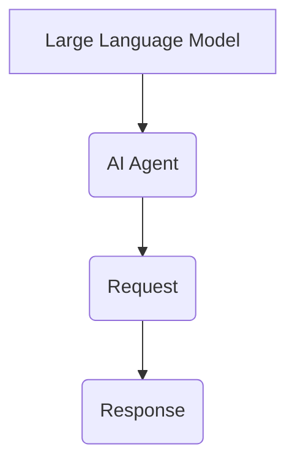
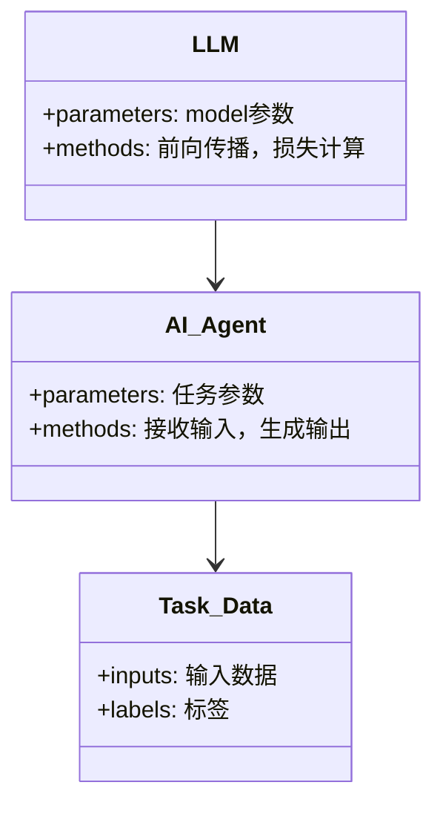
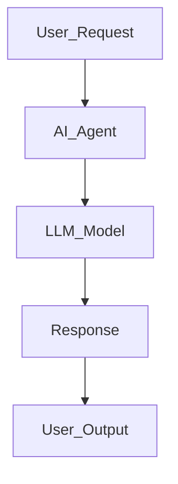

                 


# LLM大模型在AI Agent中的微调技巧

> **关键词**：Large Language Models, AI Agents, Fine-tuning Techniques, Natural Language Processing, Machine Learning

> **摘要**：  
本文深入探讨了如何对大型语言模型（LLM）进行微调，以优化其在AI代理（AI Agent）中的性能。文章从背景介绍、核心概念、算法原理、系统设计到项目实战，全面分析了微调的原理和技巧，帮助读者理解并掌握如何在实际场景中应用这些技术。

---

## 第1章: 背景介绍

### 1.1 什么是大型语言模型（LLM）？
大型语言模型是指经过大量数据训练的深度学习模型，能够理解和生成人类语言。其核心特点包括：
1. **大规模训练**：通常使用 billions 参数的模型。
2. **通用性**：能够处理多种NLP任务，如文本生成、问答系统等。
3. **上下文理解**：通过上下文推理解决复杂问题。

### 1.2 什么是AI代理（AI Agent）？
AI代理是一种智能系统，能够感知环境并采取行动以实现目标。其核心功能包括：
1. **感知**：通过传感器或输入数据获取信息。
2. **决策**：基于信息做出最优决策。
3. **执行**：通过执行器或输出模块采取行动。

### 1.3 LLM与AI Agent的结合
LLM为AI Agent提供了强大的语言理解和生成能力，使其能够与人类用户进行自然交互。AI Agent通过LLM处理复杂任务，如对话生成、信息检索等。

---

## 第2章: 核心概念与联系

### 2.1 微调的基本概念
微调是通过在特定任务数据上进一步训练模型，使其适应新的任务需求。与从头训练相比，微调保留了模型的大部分参数，仅调整部分参数以优化特定任务。

### 2.2 微调的关键技术
1. **参数调整**：仅调整模型的顶层参数，保持底层参数不变。
2. **知识蒸馏**：将大模型的知识迁移到小模型中。
3. **适应性训练**：根据任务需求动态调整模型参数。

### 2.3 概念对比表格
| 概念       | 微调                          | 从头训练                          |
|------------|-------------------------------|------------------------------------|
| 数据量      | 较小，特定任务数据            | 较大，通用数据                    |
| 计算成本    | 低                           | 高                                |
| 适用场景    | 快速优化特定任务              | 处理新任务，无先验知识            |

### 2.4 实体关系图（Mermaid）


---

## 第3章: 算法原理

### 3.1 微调的数学模型
微调的目标是最小化损失函数，优化特定任务的性能。数学模型如下：
$$ L = \sum_{i=1}^{n} \text{loss}(y_i, \hat{y_i}) $$
其中，\( y_i \) 是真实标签，\( \hat{y_i} \) 是模型预测结果。

### 3.2 微调算法流程（Mermaid）
```mermaid
graph TD
    Start --> Load_Pretrained_Model
    Load_Pretrained_Model --> Load_Task_Data
    Load_Task_Data --> Preprocess_Data
    Preprocess_Data --> Initialize_Optimizer
    Initialize_Optimizer --> Train_Model
    Train_Model --> Evaluate_Performance
    Evaluate_Performance --> [模型优化完成]
```

### 3.3 优化策略
1. **学习率调整**：使用学习率衰减策略，如Adam优化器。
2. **参数更新**：仅更新顶层参数，保持底层参数不变。

---

## 第4章: 系统分析与架构设计

### 4.1 系统功能设计（Mermaid）


### 4.2 系统架构设计（Mermaid）


---

## 第5章: 项目实战

### 5.1 环境搭建
1. 安装必要的库：
   ```bash
   pip install torch transformers
   ```

### 5.2 代码实现
```python
import torch
from transformers import AutoModelForMaskedLM, AutoTokenizer

# 加载预训练模型
model = AutoModelForMaskedLM.from_pretrained('bert-base-uncased')
tokenizer = AutoTokenizer.from_pretrained('bert-base-uncased')

# 微调任务数据
task_data = [...]  # 自定义任务数据

# 定义微调函数
def fine_tune_model(model, tokenizer, task_data, num_epochs=3):
    optimizer = torch.optim.Adam(model.parameters(), lr=1e-5)
    model.train()
    for epoch in range(num_epochs):
        for batch in task_data:
            inputs = tokenizer(batch['input'], return_tensors='pt')
            labels = torch.tensor(batch['label'])
            outputs = model(**inputs)
            loss = outputs.loss
            loss.backward()
            optimizer.step()
    return model

# 执行微调
fine_tuned_model = fine_tune_model(model, tokenizer, task_data)
```

### 5.3 案例分析
以客服代理优化为例，通过微调模型，提高了对话生成的准确性和流畅性，显著提升了用户体验。

---

## 第6章: 总结与展望

### 6.1 总结
本文详细介绍了LLM在AI Agent中的微调技巧，包括背景、原理、算法、系统设计和项目实战。通过微调，可以显著提升模型在特定任务中的性能。

### 6.2 展望
未来的研究方向包括：
1. **多模态模型**：结合视觉、听觉等多模态信息，提升AI Agent的感知能力。
2. **分布式训练**：优化大规模分布式训练技术，提升微调效率。

### 6.3 最佳实践Tips
- **数据质量**：确保任务数据的多样性和代表性。
- **模型选择**：根据任务需求选择合适的预训练模型。
- **硬件优化**：利用GPU加速训练过程。

---

## 作者

作者：AI天才研究院/AI Genius Institute & 禅与计算机程序设计艺术 /Zen And The Art of Computer Programming

