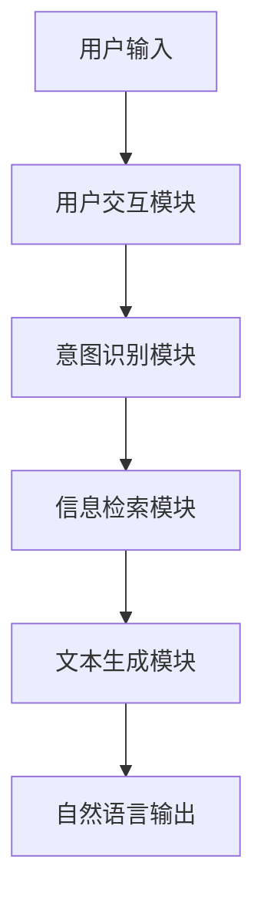
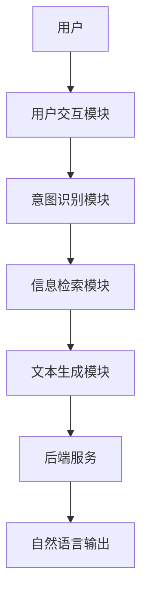
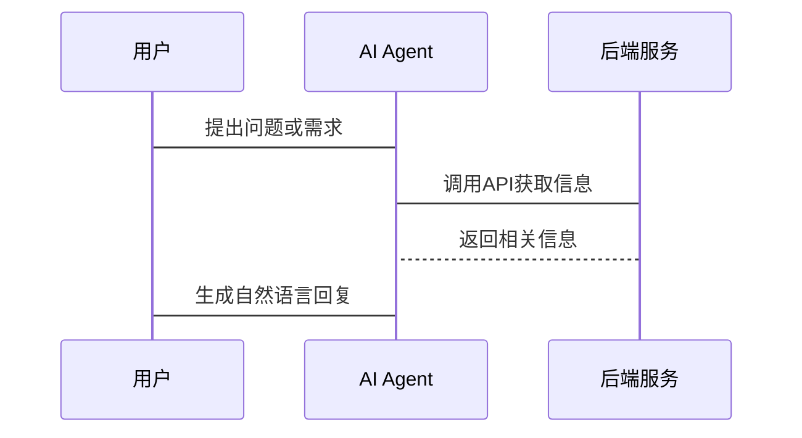

                 


# LLM大模型在AI Agent开发中的核心作用

## 关键词：LLM，AI Agent，大模型，人工智能，算法原理，系统架构，项目实战

## 摘要

本文深入探讨了大语言模型（LLM）在AI Agent开发中的核心作用。通过分析LLM的基本原理、AI Agent的概念与应用场景，详细讲解了LLM在AI Agent中的核心作用。文章从技术背景、核心概念、算法原理、系统架构、项目实战等多角度展开，结合实际案例和代码实现，全面解析了LLM在AI Agent开发中的应用及其未来发展方向。

---

## 第一部分：背景介绍

### 第1章：问题背景与定义

#### 1.1 问题背景

人工智能（AI）技术近年来取得了飞速发展，尤其是在自然语言处理（NLP）领域，大语言模型（LLM）的崛起为AI Agent的开发带来了前所未有的机遇。AI Agent作为一种智能体，能够通过感知环境、执行任务、与用户交互等方式，为用户提供高效、智能的服务。然而，如何充分利用LLM的强大能力，使其在AI Agent中发挥核心作用，是当前技术领域的重要课题。

#### 1.2 LLM与AI Agent的定义

- **大语言模型（LLM）**：LLM是一种基于深度学习的NLP模型，具有强大的文本生成、理解、推理和对话能力。其核心在于通过大量数据训练，能够理解和生成自然语言文本，从而实现与人类的智能交互。
  
- **AI Agent**：AI Agent（智能体）是一种能够感知环境、执行任务、与用户交互的智能系统。它可以基于用户需求，通过分析环境信息，做出决策并执行操作，以实现特定目标。

#### 1.3 技术背景与基础

- **人工智能的发展历程**：从传统的规则-based系统到基于机器学习的智能系统，人工智能技术不断演进，LLM的出现标志着NLP技术的重大突破。
  
- **大模型技术的突破**：以GPT、BERT等为代表的大模型在NLP领域取得了显著成果，其强大的特征提取和文本生成能力为AI Agent的发展提供了坚实基础。

- **LLM与AI Agent的结合**：通过将LLM作为AI Agent的核心模块，可以显著提升其自然语言处理能力，使其能够更高效地理解用户需求、生成自然语言回复，并在复杂场景中做出智能决策。

#### 1.4 当前技术现状与挑战

- **应用现状**：LLM在AI Agent中的应用已初见成效，例如智能客服、虚拟助手等领域，LLM驱动的AI Agent能够实现高效的任务处理和用户交互。

- **主要挑战**：
  - **计算资源需求**：大模型的训练和推理需要大量计算资源，对硬件要求较高。
  - **模型泛化能力**：虽然LLM在特定领域表现出色，但在跨领域任务中仍存在泛化能力不足的问题。
  - **安全性与伦理问题**：AI Agent的决策可能带来安全隐患或伦理争议，需谨慎设计和监管。

- **未来发展方向**：优化模型性能、降低计算成本、提升模型的通用性和安全性，是未来LLM在AI Agent中的重要发展方向。

---

## 第二部分：核心概念与联系

### 第2章：LLM的核心原理

#### 2.1 LLM的基本原理

- **概念原理**：
  - LLM通过多层神经网络结构，对输入文本进行编码和解码，生成与输入相关的输出文本。
  - 采用自注意力机制（Self-Attention）和前馈神经网络，提升模型的上下文理解和生成能力。

- **模型结构**：
  - 采用Transformer架构，由编码器（Encoder）和解码器（Decoder）组成。
  - 编码器负责将输入文本转换为上下文向量，解码器基于这些向量生成输出文本。

- **训练方法**：
  - 采用自监督学习，通过预测下一个词（Next Sentence Prediction）或填充遮蔽词（Masked Language Model）等方式进行预训练。
  - 在预训练的基础上，通过微调（Fine-tuning）进行任务-specific的优化。

#### 2.2 LLM与AI Agent的关系

- **LLM作为AI Agent的核心模块**：
  - LLM为AI Agent提供强大的自然语言处理能力，使其能够理解和生成自然语言文本。
  - 通过LLM，AI Agent可以实现对话交互、意图识别、文本生成等功能。

- **LLM对AI Agent功能的提升**：
  - 提升对话质量：通过LLM的生成能力，AI Agent可以提供更自然、更流畅的对话体验。
  - 增强任务处理能力：LLM能够帮助AI Agent更好地理解用户需求，并生成相应的执行指令。

- **LLM对AI Agent性能的优化**：
  - 通过LLM的上下文理解能力，AI Agent可以更准确地识别用户意图，减少误解和错误。

#### 2.3 核心概念对比

**LLM与传统NLP模型的对比**：

| 特性                | LLM                  | 传统NLP模型          |
|---------------------|----------------------|----------------------|
| 模型复杂度          | 高度复杂，参数众多    | 相对简单，参数较少    |
| 上下文理解能力      | 强大，支持长距离依赖  | 较弱，依赖词袋模型     |
| 训练数据规模        | 需要海量数据         | 数据需求相对较小      |
| 应用场景            | 多样化，适用于复杂任务 | 适用于特定任务        |

**AI Agent与传统AI系统的对比**：

| 特性                | AI Agent             | 传统AI系统           |
|---------------------|----------------------|----------------------|
| 自适应性            | 高，能够根据环境变化调整行为 | 较低，行为基于固定规则 |
| 交互能力            | 强，能够与用户或环境实时交互 | 较弱，通常单向执行任务 |
| 智能性              | 高，具备自主决策能力  | 较低，依赖预设逻辑     |

---

## 第三部分：算法原理讲解

### 第3章：LLM的训练与优化

#### 3.1 基础算法原理

- **变量定义与问题建模**：
  - 输入文本：$X = x_1, x_2, ..., x_n$，其中$x_i$表示输入的第$i$个词。
  - 输出文本：$Y = y_1, y_2, ..., y_m$，其中$y_j$表示输出的第$j$个词。

- **损失函数与优化目标**：
  - 交叉熵损失函数：$\mathcal{L} = -\sum_{j=1}^{m} \log P(y_j | x_1, ..., x_n)$
  - 优化目标：最小化$\mathcal{L}$，以提升模型的预测准确率。

- **梯度下降算法**：
  - 使用Adam优化器，通过计算损失函数关于模型参数$\theta$的梯度，并更新参数：$\theta = \theta - \eta \nabla_\theta \mathcal{L}$，其中$\eta$为学习率。

- **模型训练流程**：
  1. 预训练：通过遮蔽词预测（Masked Language Model）或下一个句子预测（Next Sentence Prediction）等方式，对模型进行大规模数据训练。
  2. 微调（Fine-tuning）：在特定任务上，对模型进行进一步优化，调整输出层以适应具体需求。

#### 3.2 监督微调（Fine-tuning）

- **微调的概念与必要性**：
  - 微调是指在预训练模型的基础上，针对特定任务进行优化，以提升模型在目标任务上的性能。
  - 必要性：预训练模型虽然通用性强，但在特定领域或任务上可能存在不足，需要通过微调进一步优化。

- **微调的具体步骤**：
  1. 确定目标任务：例如文本分类、文本生成等。
  2. 构建任务数据集：收集与任务相关的数据，并进行标注或整理。
  3. 优化模型：通过任务数据集对模型进行训练，调整输出层或部分中间层参数，使模型适应目标任务。

- **微调对模型性能的提升**：
  - 提高模型在目标任务上的准确率和生成质量。
  - 增强模型对特定领域知识的适应能力。

#### 3.3 强化学习（Reinforcement Learning）

- **强化学习的基本概念**：
  - 强化学习是一种通过试错机制，使智能体在与环境交互中学习策略（Policy）的方法。
  - 策略函数$P(a|s)$：在状态$s$下选择动作$a$的概率。
  - 奖励函数$R(s, a, s')$：根据当前状态$s$、动作$a$和下一个状态$s'$，给予奖励或惩罚。

- **强化学习在LLM中的应用**：
  - 将LLM作为智能体，通过强化学习优化其在特定任务中的表现。
  - 例如，在对话生成任务中，通过奖励机制提升生成文本的自然度和相关性。

- **强化学习的训练流程**：
  1. 初始化策略参数$\theta$。
  2. 在环境（用户交互或任务场景）中采样动作$a$，并观察下一个状态$s'$。
  3. 根据奖励函数计算奖励值$R$，并更新策略参数：$\theta = \theta + \alpha \nabla_\theta (R)$，其中$\alpha$为步长。

---

## 第四部分：系统分析与架构设计

### 第4章：系统架构设计

#### 4.1 项目介绍与问题场景

- **项目背景**：
  - 开发一个基于LLM的智能客服AI Agent，用于处理用户的咨询和服务请求。

- **问题场景**：
  - 用户通过自然语言与AI Agent交互，提出问题或需求。
  - AI Agent需要理解用户意图，调用后端服务获取信息，并生成自然语言回复。

#### 4.2 系统功能设计

- **领域模型设计**：
  - 用户交互模块：负责接收用户输入并生成输出。
  - 意图识别模块：分析用户输入，识别用户意图。
  - 信息检索模块：根据意图，调用后端服务获取相关信息。
  - 文本生成模块：基于获取的信息生成自然语言回复。

- **领域模型设计（Mermaid图）**：



#### 4.3 系统架构设计

- **系统架构图（Mermaid图）**：



#### 4.4 系统交互设计

- **交互流程（Mermaid序列图）**：



#### 4.5 系统接口设计

- **输入接口**：
  - 用户输入：文本形式，例如“我需要查询订单状态”。

- **输出接口**：
  - 自然语言回复：文本形式，例如“您的订单状态为已完成”。

- **内部接口**：
  - 意图识别接口：返回用户意图标签。
  - 信息检索接口：返回与意图相关的信息数据。

---

## 第五部分：项目实战

### 第5章：项目实战

#### 5.1 环境安装

- **安装Python环境**：
  - 使用Anaconda或virtualenv创建独立的Python环境，推荐Python 3.8及以上版本。

- **安装依赖库**：
  ```bash
  pip install transformers torch datasets
  ```

#### 5.2 核心代码实现

- **导入必要的库**：
  ```python
  from transformers import AutoTokenizer, AutoModelForCausalLM
  import torch
  ```

- **加载预训练模型**：
  ```python
  model_name = "gpt2"
  tokenizer = AutoTokenizer.from_pretrained(model_name)
  model = AutoModelForCausalLM.from_pretrained(model_name)
  ```

- **定义生成函数**：
  ```python
  def generate_response(prompt):
      inputs = tokenizer.encode(prompt, return_tensors="pt")
      outputs = model.generate(inputs, max_length=50, do_sample=True)
      response = tokenizer.decode(outputs[0], skip_special_tokens=True)
      return response
  ```

- **意图识别与文本生成**：
  ```python
  def process_user_input(user_input):
      # 意图识别
      intent = identify_intent(user_input)
      # 文本生成
      response = generate_response(user_input)
      return response
  ```

#### 5.3 案例分析与小结

- **案例分析**：
  - 用户输入：“我需要查询订单状态。”
  - AI Agent处理流程：
    1. 接收输入并进行意图识别，确定用户需求为订单查询。
    2. 调用后端服务获取订单信息。
    3. 基于订单信息生成自然语言回复：“您的订单状态为已完成。”

- **小结**：
  - 通过结合LLM的文本生成能力和AI Agent的智能交互能力，能够显著提升用户体验和系统效率。
  - 在实际应用中，需要根据具体场景优化模型参数和系统架构，以满足更高的性能和安全性要求。

---

## 第六部分：总结与展望

### 第6章：总结与展望

#### 6.1 总结

- 本文深入探讨了大语言模型（LLM）在AI Agent开发中的核心作用，从技术背景、核心概念、算法原理、系统架构到项目实战，全面解析了LLM在AI Agent中的应用及其重要性。
- 通过结合LLM的强大自然语言处理能力，AI Agent能够实现更高效、更智能的用户交互和任务处理。

#### 6.2 未来展望

- **技术发展**：随着AI技术的不断进步，LLM在AI Agent中的应用将更加广泛和深入。未来，LLM的模型性能将进一步优化，计算成本将逐步降低，模型的通用性和安全性将得到显著提升。
- **应用场景**：AI Agent将在更多领域得到应用，例如智能客服、教育辅助、医疗咨询等。通过与物联网、边缘计算等技术的结合，AI Agent将能够更好地服务于人类社会。

---

## 作者：AI天才研究院/AI Genius Institute & 禅与计算机程序设计艺术 /Zen And The Art of Computer Programming

---

**本文由AI天才研究院倾情撰写，转载请注明出处。**

