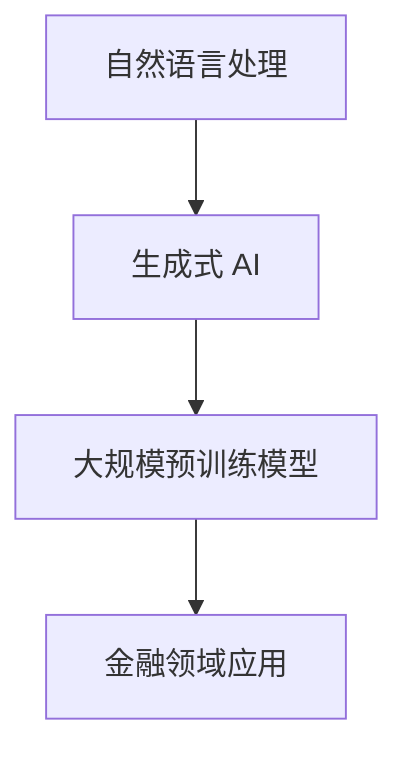
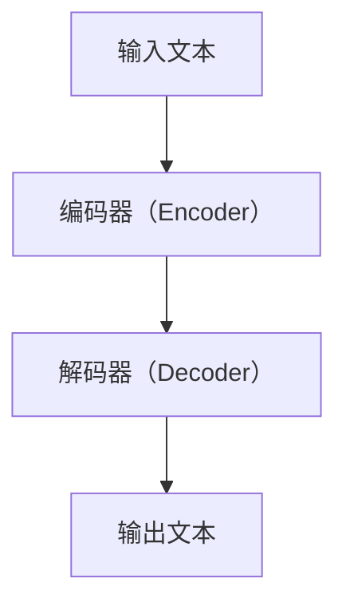
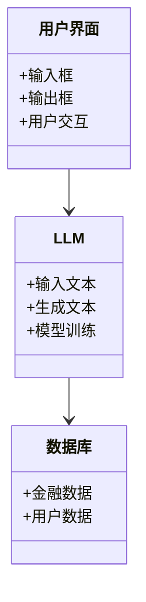

                 


# LLM大模型在金融领域的应用前景与挑战

> 关键词：LLM大模型、金融领域、人工智能、自然语言处理、风险管理、智能投顾

> 摘要：本文探讨了大语言模型（LLM）在金融领域的应用前景与挑战。首先介绍了LLM的基本概念及其在金融中的潜在价值，然后详细分析了LLM在金融行业的技术基础、应用场景、技术挑战与解决方案。最后，通过项目实战案例，展示了LLM在金融中的具体应用，并总结了未来的发展方向。

---

# 第一部分: 引言

## 第1章: 引言

### 1.1 LLM大模型的背景与意义

#### 1.1.1 大语言模型（LLM）的定义与技术背景
大语言模型（Large Language Model, LLM）是指基于深度学习的自然语言处理模型，具有 billions 参数规模，能够理解并生成人类语言。LLM 的核心在于其强大的语言理解和生成能力，这使得它在金融领域具有广泛的应用潜力。

#### 1.1.2 LLM在金融领域的应用价值
金融行业对数据的处理、分析和决策有极高的要求。LLM 的引入可以显著提升金融业务的效率和准确性。例如，在智能投顾、风险评估、金融数据分析等领域，LLM 可以提供实时、精准的支持。

#### 1.1.3 本书的研究目标与意义
本书旨在探讨 LLM 在金融领域的应用前景与挑战，通过理论分析和实践案例，为金融行业提供技术支持和实践参考。通过本书，读者可以了解 LLM 在金融中的具体应用场景，并掌握解决相关技术问题的方法。

### 1.2 问题背景与问题描述

#### 1.2.1 传统金融行业的痛点与挑战
传统金融行业在数据处理、客户交互、风险管理等方面面临诸多痛点。例如，金融数据分析的复杂性、客户服务的多样性、风险评估的准确性等。

#### 1.2.2 LLM技术如何解决金融行业的问题
LLM 的自然语言处理能力可以显著提升金融行业的数据处理效率和客户交互体验。例如，LLM 可以通过分析海量文本数据，提供精准的市场分析和风险评估。

#### 1.2.3 LLM在金融领域的边界与外延
LLM 在金融领域的应用不仅限于文本分析，还包括智能投顾、金融预测、客户服务等多个方面。其边界在于 LLM 的能力范围，而外延则随着技术进步不断扩展。

### 1.3 问题解决与核心概念

#### 1.3.1 LLM的核心概念与组成要素
LLM 的核心概念包括：自然语言处理（NLP）、生成式 AI、大规模预训练模型等。这些概念共同构成了 LLM 的技术基础。

#### 1.3.2 核心概念的属性特征对比表
| 核心概念 | 属性 | 特征 |
|----------|------|------|
| NLP      | 数据处理 | 文本分析、语义理解 |
| 生成式 AI | 生成能力 | 文本生成、创造性 |
| 大规模预训练模型 | 参数规模 | billions 级别 |

#### 1.3.3 ER实体关系图（Mermaid流程图）


---

# 第二部分: LLM大模型的技术基础

## 第2章: LLM大模型的技术基础

### 2.1 LLM的核心原理

#### 2.1.1 大语言模型的算法原理（Mermaid流程图）


#### 2.1.2 模型结构与训练方法
LLM 通常采用Transformer架构，由编码器和解码器组成。训练过程包括预训练和微调两个阶段。

#### 2.1.3 LLM与传统AI的区别
LLM 的区别在于其规模和通用性。传统AI通常针对特定任务进行优化，而 LLM 则具有更强的通用性和可扩展性。

### 2.2 LLM的数学模型与公式

#### 2.2.1 概率分布与损失函数
文本生成的损失函数通常采用交叉熵损失：
$$ \text{Loss} = -\sum_{i=1}^{n} \log P(y_i | y_{<i}) $$

#### 2.2.2 注意力机制（Attention）公式
注意力机制的计算公式为：
$$ \text{Attention}(Q, K, V) = \text{softmax}\left(\frac{QK^T}{\sqrt{d_k}}\right)V $$

#### 2.2.3 解码器（Decoder）的数学模型
解码器的输出可以表示为：
$$ P(y_t | y_{<t}, x) = \text{softmax}(W_{o}h_t + b_o) $$

### 2.3 LLM在金融中的技术应用

#### 2.3.1 自然语言处理（NLP）在金融中的应用
NLP 可以用于金融文本分析、情感分析、市场情绪监测等。

#### 2.3.2 生成式AI在金融场景中的实现
生成式AI可以用于生成金融报告、撰写新闻稿、自动生成投资建议等。

#### 2.3.3 LLM与金融数据的结合
通过结合金融数据和LLM，可以实现更精准的市场预测和风险评估。

---

# 第三部分: 金融行业的智能化转型

## 第3章: 金融行业的智能化转型

### 3.1 金融行业的现状与挑战

#### 3.1.1 传统金融业务的痛点
传统金融业务在数据处理、客户交互、风险管理等方面存在效率低下、成本高昂等问题。

#### 3.1.2 数字化转型的必要性
随着数字化转型的推进，金融行业需要更加智能化的解决方案来应对市场竞争和客户需求。

#### 3.1.3 LLM在金融智能化中的作用
LLM 可以通过提供实时数据分析、智能交互、自动化决策等能力，显著提升金融行业的智能化水平。

### 3.2 LLM驱动的金融智能化

#### 3.2.1 智能投顾与财富管理
智能投顾可以通过 LLM 分析客户需求和市场趋势，提供个性化的投资建议。

#### 3.2.2 风险评估与信用评分
LLM 可以通过分析文本数据，提供更精准的风险评估和信用评分。

#### 3.2.3 金融数据分析与预测
通过 LLM 分析海量金融数据，可以实现市场趋势预测和投资组合优化。

### 3.3 LLM在金融中的应用场景

#### 3.3.1 客户服务与支持
LLM 可以通过自然语言处理技术，提供智能客服支持，提升客户体验。

#### 3.3.2 金融报告与文档生成
LLM 可以生成金融报告、市场分析等文档，节省时间和成本。

#### 3.3.3 金融市场的实时分析
通过 LLM 实现实时市场分析，帮助投资者做出快速决策。

---

# 第四部分: LLM在金融中的技术挑战与解决方案

## 第4章: LLM在金融中的技术挑战与解决方案

### 4.1 技术挑战

#### 4.1.1 模型训练的数据质量
金融数据的质量直接影响模型的性能。需要确保数据的准确性和代表性。

#### 4.1.2 模型的可解释性问题
金融行业的决策需要高度的透明性和可解释性。LLM 的黑箱特性可能影响其在金融领域的应用。

#### 4.1.3 计算资源与成本问题
训练和部署 LLM 需要大量的计算资源和高昂的成本。

### 4.2 数据挑战

#### 4.2.1 数据隐私与合规性
金融数据的隐私保护和合规性要求对 LLM 的应用提出了更高的要求。

#### 4.2.2 数据多样性与代表性
金融数据的多样性和代表性直接影响模型的泛化能力。

#### 4.2.3 数据更新与维护
金融数据的实时性和动态性要求模型能够快速更新和维护。

### 4.3 监管与伦理挑战

#### 4.3.1 金融行业的监管要求
金融行业的严格监管要求对 LLM 的应用提出了更高的标准。

#### 4.3.2 LLM的伦理问题
LLM 的误用可能导致伦理问题，例如虚假信息的传播、金融市场的操纵等。

#### 4.3.3 透明化与合规性解决方案
需要通过技术手段实现 LLM 的透明化和合规性，例如通过可解释 AI（XAI）技术提升模型的可解释性。

---

# 第五部分: 项目实战——LLM在金融中的应用案例

## 第5章: 项目实战——LLM在金融中的应用案例

### 5.1 项目背景与需求分析

#### 5.1.1 项目目标
本项目旨在通过 LLM 实现智能投顾服务，帮助客户进行个性化投资决策。

#### 5.1.2 项目需求
需求包括：数据收集与处理、模型训练与部署、用户界面设计与实现。

### 5.2 项目实战

#### 5.2.1 系统功能设计（领域模型 Mermaid 类图）


#### 5.2.2 系统架构设计（Mermaid 架构图）
```mermaid
container 金融数据源 {
    数据库
    数据预处理模块
}
container LLM 模型 {
    编码器
    解码器
}
container 用户界面 {
    输入框
    输出框
}
金融数据源 --> LLM 模型
用户界面 --> LLM 模型
```

#### 5.2.3 代码实现与分析
以下是项目的核心代码片段：
```python
class LLM:
    def __init__(self, model_path):
        self.model = load_model(model_path)
    
    def generate(self, input_text):
        return self.model.generate(input_text)

class Database:
    def __init__(self, db_path):
        self.db = connect(db_path)
    
    def save_data(self, data):
        self.db.execute("INSERT INTO financial_data VALUES (?)", (data,))
```

### 5.3 项目小结

#### 5.3.1 项目总结
通过本项目，我们展示了 LLM 在智能投顾中的应用。LLM 的引入显著提升了服务的效率和精准度。

#### 5.3.2 注意事项
在实际应用中，需要注意数据隐私和模型的可解释性问题。

#### 5.3.3 拓展阅读
建议读者进一步研究 LLM 的可解释性技术，以及如何在金融中实现更复杂的场景。

---

# 结语

LLM 在金融领域的应用前景广阔，但也面临诸多挑战。通过技术进步和最佳实践，我们可以逐步克服这些挑战，推动金融行业的智能化转型。

作者：AI天才研究院/AI Genius Institute & 禅与计算机程序设计艺术 /Zen And The Art of Computer Programming

--- 

**本文由作者精心整理编写，转载请注明出处。**

