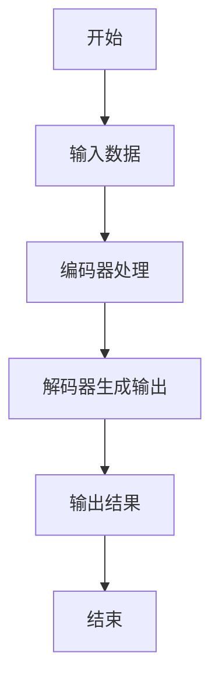
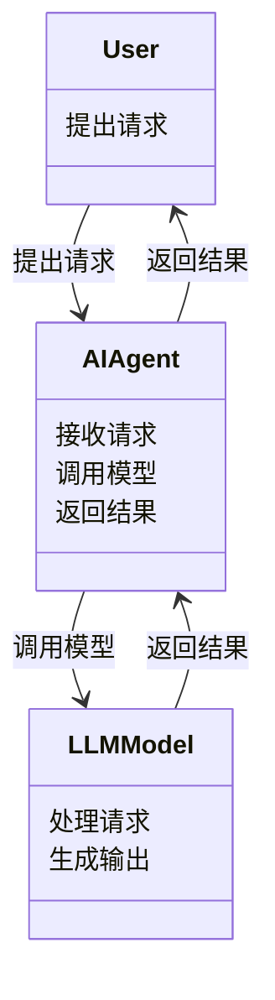

                 


# LLM大模型概述：AI Agent开发的基石

> 关键词：LLM，AI Agent，大语言模型，人工智能，机器学习，自然语言处理，深度学习

> 摘要：本文系统地介绍了大语言模型（LLM）的基本概念、核心原理、算法实现、系统架构及实际应用。通过对LLM的深入分析，探讨其在AI Agent开发中的关键作用，并结合项目实战，总结了开发经验和最佳实践。本文旨在为AI Agent开发者提供坚实的理论基础和实践指导。

---

## 第一部分: LLM大模型的背景与现状

### 第1章: LLM大模型的背景与现状

#### 1.1 LLM大模型的起源与演进

##### 1.1.1 从传统NLP到大模型的演进

- **传统NLP的局限性**：早期的自然语言处理技术依赖于规则和浅层特征，无法处理复杂的语义关系。
- **深度学习的突破**：基于深度学习的神经网络（如RNN、LSTM）推动了NLP技术的进步。
- **大模型的兴起**：2018年，BERT和GPT等预训练模型的出现，标志着大模型时代的开始。

##### 1.1.2 大模型技术的突破与革命

- **预训练技术**：通过大规模数据的预训练，模型能够捕获语言的深层特征。
- **Transformer架构**：基于自注意力机制的Transformer模型在多个任务上表现出色。
- **多模态融合**：结合视觉、听觉等多模态信息，提升模型的综合理解能力。

##### 1.1.3 当前LLM大模型的技术特点

- **参数规模**：参数量从百万到万亿级别，模型复杂度显著提高。
- **通用性**：能够处理多种任务，如文本生成、问答系统、机器翻译等。
- **实时性与可扩展性**：通过并行计算和分布式训练，实现高效推理。

#### 1.2 LLM大模型的核心概念与技术特点

##### 1.2.1 大语言模型的基本定义

- **定义**：大语言模型（LLM）是一种基于深度学习的自然语言处理模型，通过大量数据的预训练，能够理解和生成人类语言。

##### 1.2.2 LLM与传统NLP模型的对比

| 对比维度 | LLM | 传统NLP模型 |
|----------|-----|------------|
| 数据需求 | 需要大量标注数据 | 通常需要少量标注数据 |
| 模型复杂度 | 参数量大，架构复杂 | 参数量较小，架构简单 |
| 任务通用性 | 能够处理多种任务 | 通常针对单一任务优化 |

##### 1.2.3 大模型的训练与推理特点

- **训练特点**：
  - 需要海量高质量数据。
  - 采用分布式训练和并行计算优化训练效率。
- **推理特点**：
  - 基于Transformer架构，通过自注意力机制生成高质量文本。

#### 1.3 LLM大模型的应用现状与未来趋势

##### 1.3.1 当前主要应用领域

- **文本生成**：智能写作、内容生成。
- **问答系统**：智能客服、知识问答。
- **机器翻译**：多语言翻译。
- **情感分析**：情感分析、舆情监控。

##### 1.3.2 未来技术发展趋势

- **多模态融合**：结合视觉、听觉等信息，提升模型的理解能力。
- **小样本学习**：减少对海量数据的依赖，提升模型的泛化能力。
- **实时推理**：优化模型推理速度，提升应用场景的实时性。

##### 1.3.3 LLM大模型对AI Agent的影响

- **智能交互**：通过LLM，AI Agent能够更自然地与人类进行对话。
- **任务处理**：AI Agent可以利用LLM理解用户需求，执行复杂任务。
- **决策支持**：LLM为AI Agent提供强大的语言理解和生成能力，支持其决策过程。

---

## 第二部分: LLM大模型的核心概念与联系

### 第2章: LLM大模型的核心概念与联系

#### 2.1 LLM大模型的核心原理

##### 2.1.1 概念结构与核心要素

- **输入**：文本数据或用户指令。
- **模型**：基于Transformer的深度神经网络。
- **输出**：生成的文本或决策结果。

##### 2.1.2 LLM的数学模型基础

- **编码器-解码器结构**：编码器将输入文本转换为向量表示，解码器基于向量生成输出文本。
- **自注意力机制**：模型能够关注输入中的重要部分，提升语义理解能力。

##### 2.1.3 大模型的训练与优化过程

- **预训练**：使用大规模通用数据进行无监督训练，目标是最小化预测错误。
- **微调**：针对具体任务进行有监督微调，提升任务相关性。

#### 2.2 核心概念对比分析

##### 2.2.1 LLM与AI Agent的关系

- **LLM是AI Agent的核心组件**：AI Agent通过LLM进行语言理解和生成。
- **AI Agent是LLM的应用场景**：LLM为AI Agent提供强大的语言处理能力。

##### 2.2.2 大模型与其他AI技术的对比

- **与传统NLP的对比**：LLM具有更强的通用性和任务处理能力。
- **与图像识别的对比**：LLM处理的是文本数据，而图像识别处理的是视觉数据。

##### 2.2.3 LLM在不同应用场景中的表现

- **文本生成**：LLM表现出色，生成质量高。
- **问答系统**：LLM能够理解和回答复杂问题。
- **机器翻译**：LLM在多语言翻译中表现优异。

#### 2.3 实体关系图与核心要素分析

##### 2.3.1 LLM大模型的ER实体关系图

```mermaid
er
actor: User
agent: AI Agent
model: LLM
repository: Data Repository

actor --> agent: 提出请求
agent --> model: 调用模型
model --> repository: 获取数据
agent --> actor: 返回结果
```

##### 2.3.2 核心要素的详细分析

- **用户（Actor）**：提出需求和指令。
- **AI Agent**：接收指令，调用LLM模型。
- **LLM模型**：处理请求，生成响应。
- **数据仓库**：存储训练和推理所需的数据。

##### 2.3.3 概念结构与核心要素的关联

- **用户**与**AI Agent**之间是请求与响应的关系。
- **AI Agent**通过**LLM模型**实现语言理解和生成。
- **LLM模型**依赖**数据仓库**进行训练和推理。

---

## 第三部分: LLM大模型的算法原理

### 第3章: LLM大模型的算法原理

#### 3.1 大模型的训练过程

##### 3.1.1 数据预处理与特征提取

- **数据清洗**：去除噪声数据，确保数据质量。
- **特征提取**：将文本数据转换为向量表示，常用Word Embedding。

##### 3.1.2 模型结构与参数优化

- **编码器-解码器结构**：编码器将输入文本转换为向量，解码器基于向量生成输出。
- **参数优化**：通过反向传播和梯度下降优化模型参数。

##### 3.1.3 损失函数与优化算法

- **损失函数**：交叉熵损失函数。
- **优化算法**：Adam优化器。

#### 3.2 大模型的推理过程

##### 3.2.1 解码策略与生成机制

- **贪心解码**：每次选择概率最大的词生成输出。
- **随机采样**：随机选择生成词，提升生成多样性。
- **束搜索**：生成多个候选结果，选择最优解。

##### 3.2.2 注意力机制的实现

- **自注意力机制**：模型能够关注输入中的重要部分。
- **位置编码**：引入位置信息，提升模型对序列的理解能力。

##### 3.2.3 模型调参与优化

- **参数调整**：根据任务需求调整模型参数。
- **模型剪枝**：减少模型复杂度，提升推理速度。

#### 3.3 大模型的算法流程图



---

## 第四部分: LLM大模型的数学模型与公式

### 第4章: LLM大模型的数学模型与公式

#### 4.1 概率分布与损失函数

##### 4.1.1 概率分布

- **条件概率**：$P(y|x)$，表示在输入$x$的条件下，输出$y$的概率。
- **交叉熵损失函数**：$$\text{Loss} = -\sum_{i=1}^{n} \text{log} P(y_i|x)$$

##### 4.1.2 损失函数

- **交叉熵损失**：$$\text{Cross-Entropy Loss} = -\sum_{i=1}^{n} y_i \log(a_i)$$
- **权重更新**：$$\theta_{new} = \theta_{old} - \eta \frac{\partial L}{\partial \theta}$$

#### 4.2 注意力机制与优化算法

##### 4.2.1 注意力机制

- **查询、键、值**：$$Q, K, V$$
- **注意力计算**：$$\text{Attention}(Q, K, V) = \text{softmax}\left(\frac{QK^T}{\sqrt{d_k}}\right)V$$

##### 4.2.2 Adam优化器

- **参数更新**：$$\theta_{t+1} = \theta_t - \eta \frac{\beta_2}{1-\beta_2^t} \frac{1}{1-\beta_1^t} g_t$$
- **动量和方差**：$$m_t = \beta_1 m_{t-1} + (1-\beta_1)g_t$$
$$v_t = \beta_2 v_{t-1} + (1-\beta_2)g_t^2$$

---

## 第五部分: LLM大模型的系统分析与架构设计

### 第5章: LLM大模型的系统分析与架构设计

#### 5.1 AI Agent的系统架构

##### 5.1.1 功能模块设计

- **输入模块**：接收用户指令。
- **模型模块**：调用LLM模型进行推理。
- **输出模块**：生成并返回结果。

##### 5.1.2 系统架构图



##### 5.1.3 接口设计与交互流程

- **输入接口**：接收文本输入或用户指令。
- **输出接口**：返回生成的文本或决策结果。
- **交互流程**：用户提出请求 -> AI Agent调用模型 -> 模型生成结果 -> 返回用户。

---

## 第六部分: LLM大模型的项目实战

### 第6章: LLM大模型的项目实战

#### 6.1 环境配置与数据准备

##### 6.1.1 环境安装

- **Python**：3.8+
- **框架**：TensorFlow/PyTorch
- **依赖库**：Hugging Face Transformers

##### 6.1.2 数据集准备

- **训练数据**：通用文本数据集。
- **测试数据**：用于模型评估。

#### 6.2 系统核心实现

##### 6.2.1 模型实现

```python
from transformers import AutoModelForCausalLM, AutoTokenizer

tokenizer = AutoTokenizer.from_pretrained('gpt2')
model = AutoModelForCausalLM.from_pretrained('gpt2')
```

##### 6.2.2 推理实现

```python
def generate_text(prompt):
    inputs = tokenizer.encode(prompt, return_tensors='pt')
    outputs = model.generate(inputs, max_length=50, do_sample=True)
    return tokenizer.decode(outputs[0], skip_special_tokens=True)
```

##### 6.2.3 系统实现

```python
class AIAssistant:
    def __init__(self):
        self.model = ...
        self.tokenizer = ...

    def process_request(self, request):
        response = self.model.generate(request)
        return response
```

#### 6.3 实际案例分析

##### 6.3.1 案例选择

- **智能客服系统**：基于LLM实现自动回复。

##### 6.3.2 系统实现

- **训练阶段**：使用公司内部数据进行微调。
- **推理阶段**：用户提出问题，AI Agent调用模型生成回复。

##### 6.3.3 系统分析

- **性能优化**：通过模型剪枝和量化提升推理速度。
- **效果评估**：通过准确率、召回率等指标评估模型性能。

#### 6.4 项目小结

##### 6.4.1 核心实现总结

- **模型选择**：选择合适的LLM模型。
- **数据准备**：确保数据质量和数量。
- **系统优化**：优化模型推理速度和响应时间。

##### 6.4.2 开发经验总结

- **数据的重要性**：数据质量直接影响模型性能。
- **模型的选择**：根据任务需求选择合适的模型。
- **系统的优化**：优化模型和系统的性能，提升用户体验。

---

## 第七部分: LLM大模型的最佳实践

### 第7章: LLM大模型的最佳实践

#### 7.1 开发经验总结

##### 7.1.1 小结

- **理论基础**：掌握LLM的核心原理和算法实现。
- **实践经验**：通过项目实战积累经验。
- **系统优化**：优化模型和系统的性能。

##### 7.1.2 注意事项

- **数据隐私**：确保数据的安全和隐私。
- **模型调优**：根据具体任务进行模型调优。
- **用户体验**：注重用户体验，优化交互流程。

#### 7.2 拓展阅读

##### 7.2.1 推荐书籍

- 《深度学习》：Ian Goodfellow等著。
- 《自然语言处理入门》：NLP入门必读。

##### 7.2.2 推荐论文

- 《Attention Is All You Need》：Transformer论文。
- 《BERT: Pre-training of Deep Bidirectional Transformers for NLP》：BERT论文。

---

## 作者：AI天才研究院/AI Genius Institute & 禅与计算机程序设计艺术 /Zen And The Art of Computer Programming

---

通过以上结构化的内容，您可以逐步展开每一章和每一节的内容，确保文章逻辑清晰、结构紧凑，同时涵盖技术原理和实际应用的深度分析。

