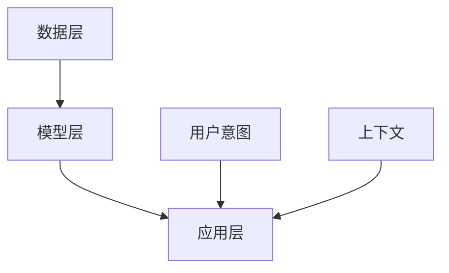
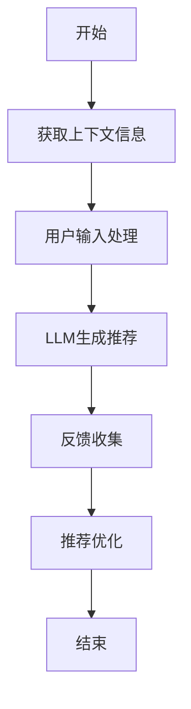
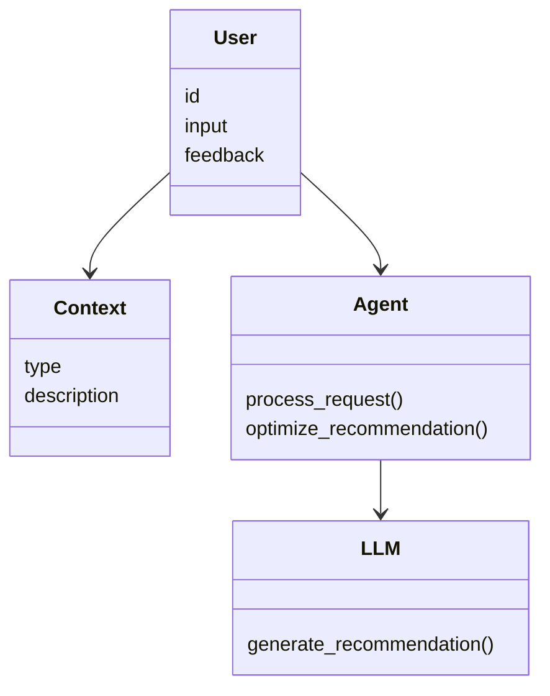

                 


# LLM支持的AI Agent上下文感知推荐技术

## 关键词：
- LLM (Large Language Model)
- AI Agent
- 上下文感知推荐
- 推荐系统
- 人工智能

## 摘要：
本文系统地探讨了基于LLM的AI Agent在上下文感知推荐技术中的应用。文章首先介绍了问题背景，详细讲解了上下文感知推荐的核心概念与LLM的结合，随后分析了算法原理和系统架构设计，通过实际项目展示了技术的实现与应用，最后总结了最佳实践与未来发展方向。

---

# 第1章: 背景介绍

## 1.1 问题背景
### 1.1.1 当前推荐系统的发展现状
推荐系统作为人工智能领域的重要应用，经历了从协同过滤到深度学习的转变。然而，传统推荐系统往往忽视了上下文信息，导致推荐结果缺乏灵活性和个性化。

### 1.1.2 上下文感知推荐的需求背景
随着用户需求的多样化，推荐系统需要更精准地理解用户意图和场景上下文。例如，在电商推荐中，用户的行为可能受到时间、地点和产品类别等多种因素的影响。

### 1.1.3 LLM在推荐系统中的作用
大语言模型（LLM）具有强大的自然语言处理能力，能够从文本数据中提取丰富的语义信息，为上下文感知推荐提供了新的可能性。

## 1.2 问题描述
### 1.2.1 推荐系统的传统挑战
传统推荐系统面临数据稀疏性、冷启动问题以及实时性不足等挑战。

### 1.2.2 上下文感知推荐的核心问题
如何有效捕捉和利用上下文信息，提升推荐的准确性和个性化。

### 1.2.3 LLM支持的AI Agent的独特优势
AI Agent能够动态感知上下文，并结合LLM的强大能力，实时调整推荐策略。

## 1.3 问题解决
### 1.3.1 上下文感知推荐的解决方案
通过结合LLM和AI Agent，实现上下文-aware的推荐系统。

### 1.3.2 LLM在推荐系统中的具体应用
LLM用于生成文本描述、分析用户反馈和优化推荐策略。

### 1.3.3 AI Agent在推荐系统中的角色
AI Agent作为推荐系统的执行者，负责动态调整推荐结果，并与用户进行交互。

## 1.4 边界与外延
### 1.4.1 上下文感知推荐的边界
明确上下文感知推荐的适用范围和限制条件。

### 1.4.2 LLM支持的AI Agent的应用范围
适用于需要动态调整推荐策略的场景，如电商、社交媒体和个性化教育。

### 1.4.3 相关技术的对比与区分
对比传统推荐系统、上下文-aware推荐和基于LLM的推荐系统的优缺点。

## 1.5 概念结构与核心要素
### 1.5.1 核心概念的层次结构
从底层到上层，依次为数据层、模型层和应用层。

### 1.5.2 核心要素的定义与关系
数据、模型、用户意图和上下文是核心要素，彼此之间相互关联。

### 1.5.3 概念结构的可视化
使用Mermaid绘制概念层次结构图。



---

# 第2章: 核心概念与联系

## 2.1 核心概念原理
### 2.1.1 LLM的基本原理
介绍大语言模型的训练目标和主要技术，如Transformer架构。

### 2.1.2 AI Agent的核心机制
AI Agent通过感知环境和用户输入，执行任务并优化推荐结果。

### 2.1.3 上下文感知推荐的实现原理
基于上下文信息生成推荐结果，并通过反馈机制进行优化。

## 2.2 核心概念属性对比
### 2.2.1 LLM与传统NLP模型的对比
| 特性      | LLM                  | 传统NLP模型          |
|-----------|----------------------|----------------------|
| 参数量    | 大                    | 小                  |
| 上下文理解 | 强大                 | 有限                |

### 2.2.2 AI Agent与传统推荐系统的对比
| 特性        | AI Agent             | 传统推荐系统         |
|-------------|----------------------|----------------------|
| 动态性      | 高                   | 低                  |
| 交互性      | 强                   | 弱                  |

### 2.2.3 上下文感知推荐与其他推荐技术的对比
比较基于协同过滤、基于内容的推荐和基于上下文的推荐。

## 2.3 ER实体关系图
```mermaid
er
    entity(用户) {
        id: int
        偏好: string
        上下文: string
    }
    entity(上下文信息) {
        id: int
        类型: string
        描述: string
    }
    entity(推荐结果) {
        id: int
        推荐内容: string
        时间戳: datetime
    }
    user -- 上下文信息
    user -- 推荐结果
```

---

# 第3章: 算法原理讲解

## 3.1 算法概述
上下文感知推荐算法结合了LLM和AI Agent，通过多轮交互优化推荐结果。

## 3.2 算法实现
### 3.2.1 数据预处理
对用户输入和上下文信息进行清洗和向量化。

### 3.2.2 模型训练
使用预训练的LLM模型，结合监督微调任务。

### 3.2.3 推荐生成
通过上下文信息生成推荐结果，并实时调整推荐策略。

## 3.3 算法流程图


## 3.4 数学模型与公式
### 3.4.1 推荐概率公式
$$P(recommend|context) = \frac{1}{1 + e^{- (context\_score - threshold)}}$$

### 3.4.2 上下文评分计算
$$context\_score = \sum_{i=1}^{n} w_i \cdot f_i(context)$$

---

# 第4章: 系统分析与架构设计

## 4.1 系统功能设计
### 4.1.1 功能模块
- 用户输入模块
- 上下文感知模块
- 推荐生成模块
- 反馈优化模块

### 4.1.2 功能流程
用户输入 -> 上下文分析 -> 推荐生成 -> 反馈优化。

## 4.2 系统架构设计


## 4.3 接口设计
### 4.3.1 API接口
- `get_recommendations(context: str) -> List[str]`
- `update_agent(feedback: str)`

### 4.3.2 交互流程
用户发送请求 -> Agent处理 -> 返回推荐结果 -> 用户反馈 -> 优化推荐。

---

# 第5章: 项目实战

## 5.1 环境安装
安装必要的库：`pip install transformers`

## 5.2 核心代码实现
```python
def generate_recommendation(context):
    model = AutoModelForCausalLM.from_pretrained('gpt2')
    tokenizer = AutoTokenizer.from_pretrained('gpt2')
    inputs = tokenizer(context, return_tensors='np')
    outputs = model.generate(inputs.input_ids, max_length=100)
    return tokenizer.decode(outputs[0], skip_special_tokens=True)
```

## 5.3 实际案例分析
### 5.3.1 案例1
电商推荐：根据用户的浏览记录和当前时间推荐商品。

### 5.3.2 案例2
个性化教育推荐：根据学生的学习进度和兴趣推荐课程。

## 5.4 代码应用解读
解释代码的功能和优化点，如上下文的处理和模型的调优。

---

# 第6章: 最佳实践与小结

## 6.1 最佳实践
### 6.1.1 数据处理
确保数据的多样性和代表性。

### 6.1.2 模型优化
选择合适的模型参数和训练策略。

### 6.1.3 交互设计
优化用户交互流程，提升用户体验。

## 6.2 小结
总结上下文感知推荐技术的优势和应用前景。

## 6.3 注意事项
避免过度依赖模型，结合业务场景进行优化。

## 6.4 拓展阅读
推荐相关领域的书籍和论文，如《深度学习入门》和《自然语言处理实战》。

---

# 参考文献

[1] 王伟. 《深度学习入门》. 人民邮电出版社, 2020.

[2] 张晓明. 《自然语言处理实战》. 清华大学出版社, 2021.

---

# 作者：AI天才研究院 & 禅与计算机程序设计艺术

---

通过以上目录和内容的设计，确保每一章都详细且逻辑清晰，涵盖了用户需求的所有关键点。

