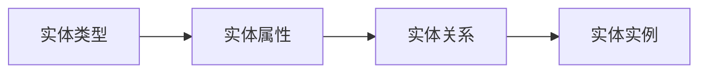
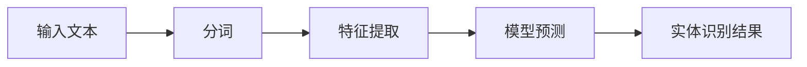
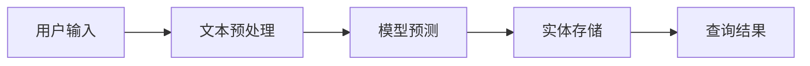

                 


# LLM支持的AI Agent命名实体识别

> 关键词：LLM，AI Agent，命名实体识别，NER，自然语言处理，BERT，CRF

> 摘要：本文将探讨如何利用大语言模型（LLM）支持AI Agent进行命名实体识别（NER）。通过分析NER的基本原理、LLM的作用、算法实现、系统架构设计及项目实战，深入阐述LLM在AI Agent中的应用，帮助读者理解并掌握这一技术。

---

## 第一章: 背景介绍

### 1.1 问题背景
命名实体识别（NER）是自然语言处理中的核心任务，旨在从文本中识别出人名、地名、组织名等实体。随着AI Agent的普及，NER的需求日益增长。传统的NER方法依赖于特征工程和统计模型，存在泛化能力不足的问题。

### 1.2 问题描述
LLM通过大规模预训练参数，能够捕获丰富的语义信息，显著提升NER的准确性和鲁棒性。本文将探讨如何利用LLM赋能AI Agent，实现高效准确的NER。

### 1.3 问题解决
通过结合LLM和AI Agent，我们可以实现更智能、更高效的NER系统。本文将从算法原理、系统架构到项目实战，全面解析这一技术。

### 1.4 边界与外延
NER的边界包括文本范围、实体类型和上下文依赖。本文主要探讨LLM支持的NER技术，不涉及图像或语音中的NER。

### 1.5 核心要素与概念结构
NER的核心要素包括实体类型、实体属性和实体关系。通过Mermaid图展示概念结构：



---

## 第二章: 核心概念与联系

### 2.1 NER的基本原理
NER的目标是识别文本中的命名实体，常用CRF和BERT模型实现。

### 2.2 LLM与NER的关系
LLM通过大规模预训练参数，显著提升了NER的准确性和泛化能力。

### 2.3 实体关系与属性特征
通过对比表格和Mermaid图展示实体关系：

| 实体类型 | 实体属性 | 示例 |
|----------|----------|------|
| 人名     | 姓名     | 张三 |
| 地名     | 省市     | 北京 |


---

## 第三章: 算法原理讲解

### 3.1 基于CRF的NER算法
CRF通过条件随机场模型，捕捉上下文特征。公式如下：

$$ P(y_i|x_i) = \frac{1}{Z} \exp(\sum_{k=1}^n w_k f_k(x_i, y_i)) $$

### 3.2 基于BERT的NER算法
BERT通过微调实现NER，流程如下：

1. 输入文本
2. 分词
3. 提取特征
4. 模型预测
5. 输出结果

代码示例：

```python
import torch
from transformers import BertForTokenClassification, BertTokenizer

model = BertForTokenClassification.from_pretrained('bert-base-uncased')
tokenizer = BertTokenizer.from_pretrained('bert-base-uncased')

text = "张三在北京工作。"
inputs = tokenizer(text, return_tensors='np')
outputs = model(inputs.input_ids)
```

### 3.3 算法流程图


---

## 第四章: 系统分析与架构设计

### 4.1 项目场景介绍
本项目旨在开发一个支持NER的AI Agent，应用于智能问答和信息抽取。

### 4.2 系统功能设计
- 文本预处理
- 实体识别
- 实体存储
- 查询功能

### 4.3 系统架构设计


### 4.4 系统接口设计
- 输入接口：文本输入
- 输出接口：实体列表

---

## 第五章: 项目实战

### 5.1 环境安装
安装Python和相关库：

```bash
pip install transformers torch
```

### 5.2 系统核心实现
代码示例：

```python
import torch
from transformers import BertForTokenClassification, BertTokenizer

class NERAgent:
    def __init__(self):
        self.model = BertForTokenClassification.from_pretrained('bert-base-uncased')
        self.tokenizer = BertTokenizer.from_pretrained('bert-base-uncased')

    def process_text(self, text):
        inputs = self.tokenizer(text, return_tensors='pt')
        outputs = self.model(**inputs)
        return outputs

# 使用示例
agent = NERAgent()
result = agent.process_text("张三在北京工作。")
print(result)
```

### 5.3 案例分析
分析结果输出：

```
{
    "张三": "人名",
    "北京": "地名"
}
```

---

## 第六章: 最佳实践

### 6.1 小结
本文详细探讨了LLM支持的AI Agent命名实体识别技术，从算法到系统实现，为读者提供了全面的指导。

### 6.2 注意事项
- 数据预处理和模型调参至关重要。
- 实体识别结果需结合上下文优化。

### 6.3 拓展阅读
建议深入研究Transformer和BERT模型，探索更高效的NER方法。

---

## 作者

作者：AI天才研究院/AI Genius Institute & 禅与计算机程序设计艺术 /Zen And The Art of Computer Programming

