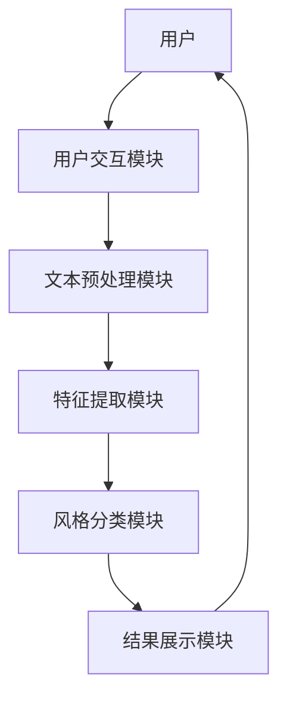

                 


# LLM支持的AI Agent文本风格识别

## 关键词：LLM, AI Agent, 文本风格识别, 语言模型, 智能代理

## 摘要：  
本文探讨了如何利用大语言模型（LLM）支持的AI Agent进行文本风格识别。通过分析LLM与AI Agent的协同工作原理，结合实际应用场景，详细阐述了文本风格识别的算法原理、系统架构设计及项目实现。本文旨在为开发者和研究人员提供一个全面的技术指南，帮助他们理解并实现基于LLM的AI Agent文本风格识别系统。

---

## 目录大纲：LLM支持的AI Agent文本风格识别

---

### 第一部分：背景介绍

#### 第1章：问题背景与问题描述

##### 1.1 问题背景
- **1.1.1 大语言模型（LLM）的发展与应用**  
  - LLM的崛起：从GPT-3到GPT-4，大语言模型的能力不断增强，应用场景不断扩大。  
  - LLM在自然语言处理（NLP）中的地位：作为强大的工具，LLM能够处理复杂的文本生成、理解和推理任务。  

- **1.1.2 AI Agent在智能系统中的角色**  
  - AI Agent的定义：AI Agent是能够感知环境、执行任务并做出决策的智能实体。  
  - AI Agent的应用场景：从虚拟助手到智能客服，AI Agent在多个领域发挥重要作用。  

- **1.1.3 文本风格识别的重要性**  
  - 文本风格识别的定义：通过分析文本特征，识别其风格、语气或类别。  
  - 文本风格识别的应用场景：内容推荐、情感分析、文本分类等。  

##### 1.2 问题描述
- **1.2.1 文本风格识别的定义与挑战**  
  - 文本风格识别的目标：识别文本的风格特征，如正式、非正式、幽默、严肃等。  
  - 文本风格识别的挑战：文本的多样性、数据的不平衡性、模型的泛化能力等。  

- **1.2.2 LLM支持的AI Agent在文本风格识别中的作用**  
  - LLM作为AI Agent的核心：LLM能够理解和生成自然语言，为AI Agent提供强大的语言处理能力。  
  - AI Agent通过LLM实现文本风格识别的优势：结合上下文理解，提供更精准的风格分类。  

- **1.2.3 问题解决的必要性**  
  - 提高文本处理的准确性和效率：通过LLM的支持，AI Agent能够更高效地完成文本风格识别任务。  
  - 扩大AI Agent的应用范围：文本风格识别能力的提升，使得AI Agent能够应用于更多领域，如个性化推荐、智能写作辅助等。  

##### 1.3 问题解决与边界
- **1.3.1 解决方案的提出**  
  - 综合利用LLM和AI Agent的技术优势，设计一个高效的文本风格识别系统。  

- **1.3.2 边界与外延**  
  - 限定条件：仅关注基于LLM的AI Agent文本风格识别，不涉及其他类型AI Agent或传统NLP方法。  
  - 外延：未来可能扩展到多模态数据处理、实时风格识别等领域。  

- **1.3.3 核心要素与组成**  
  - LLM模型：如GPT-3、PaLM等。  
  - AI Agent架构：任务感知、环境交互、决策推理。  
  - 文本风格特征：语义、句式、词汇选择等。  

---

### 第二部分：核心概念与联系

#### 第2章：核心概念原理

##### 2.1 LLM与AI Agent的关系
- **2.1.1 LLM的基本原理**  
  - 基于Transformer架构的LLM：通过自注意力机制，LLM能够捕捉文本中的长距离依赖关系。  
  - 模型训练：基于大量文本数据，采用监督学习或无监督学习方式进行训练。  

- **2.1.2 AI Agent的基本原理**  
  - AI Agent的感知与决策：通过传感器或API获取环境信息，结合内部模型进行推理，做出决策。  
  - AI Agent的执行与反馈：根据决策执行操作，并根据反馈调整策略。  

- **2.1.3 LLM支持的AI Agent的协同工作原理**  
  - LLM作为AI Agent的语言处理核心：AI Agent通过调用LLM API，获取文本理解和生成的能力。  
  - LLM与AI Agent的协同：AI Agent利用LLM进行文本分析，LLM通过AI Agent的上下文理解，提供更精准的语言处理结果。  

##### 2.2 核心概念对比
- **2.2.1 LLM与传统NLP方法的对比**  
  | 特性             | LLM                     | 传统NLP方法             |
  |------------------|-------------------------|--------------------------|
  | 模型复杂度       | 高，基于深度学习         | 低，基于规则或浅层模型   |
  | 处理能力         | 强大，支持多种任务       | 较弱，通常针对特定任务   |
  | 需要的标注数据   | 较少，采用预训练         | 较多，依赖人工标注       |

- **2.2.2 AI Agent与传统文本分类方法的对比**  
  | 特性             | AI Agent                | 传统文本分类方法         |
  |------------------|-------------------------|--------------------------|
  | 任务目标         | 多任务，支持复杂场景     | 单任务，专注于特定分类    |
  | 环境交互能力     | 强，能够与环境动态交互   | 弱，通常仅处理静态数据   |
  | 决策能力         | 强，基于上下文推理       | 弱，通常基于固定规则     |

- **2.2.3 文本风格识别与其他文本处理任务的对比**  
  | 特性             | 文本风格识别             | 文本分类                 |
  |------------------|-------------------------|--------------------------|
  | 任务目标         | 识别文本的风格特征       | 分类文本到预定义类别     |
  | 处理粒度         | 微观，关注语义和语境     | 宏观，关注整体分类       |
  | 应用场景         | 内容推荐、情感分析       | 信息分类、垃圾邮件检测   |

##### 2.3 ER实体关系图  
```mermaid
er
    entity LLM {
        id
        model_name
        parameters
    }
    entity AI_Agent {
        id
        task
        user_query
    }
    entity Text_Style {
        id
        style_type
        features
    }
    LLM --> AI_Agent: 提供语言模型支持
    AI_Agent --> Text_Style: 识别文本风格
```

---

### 第三部分：算法原理

#### 第3章：算法原理讲解

##### 3.1 基于LLM的文本风格识别算法

###### 3.1.1 算法概述
- 算法目标：利用LLM提取文本特征，训练风格分类模型。  
- 算法流程：  
  1. 文本预处理：分词、去停用词、提取句法特征。  
  2. 特征提取：利用LLM生成文本表示，提取语义和语境特征。  
  3. 风格分类：基于提取的特征，训练分类器，进行文本风格预测。  

###### 3.1.2 算法流程图  
```mermaid
flow
    st1
    op1
    st2
    op2
    st3
    op3
    st4
    op4
    st5
```

###### 3.1.3 核心算法代码实现
```python
def preprocess_text(text):
    # 分词
    tokens = text.split()
    # 去停用词
    filtered_tokens = [token for token in tokens if token not in STOP_WORDS]
    return filtered_tokens

def extract_features(tokens, llm_model):
    # 利用LLM生成文本表示
    embeddings = llm_model.embeddings(tokens)
    return embeddings

def train_classifier(features, labels):
    # 使用SVM进行训练
    from sklearn import svm
    clf = svm.SVC()
    clf.fit(features, labels)
    return clf

# 示例代码
text = "This is a sample text."
llm_model = load_llm_model()
features = extract_features(preprocess_text(text), llm_model)
classifier = train_classifier(features, labels)
prediction = classifier.predict([text])
print(f"Predicted style: {prediction}")
```

###### 3.1.4 数学模型与公式
- 文本表示的向量化：  
  $$ \text{embedding}(x_i) = f(x_i) $$  
  其中，$f$ 是LLM的嵌入函数，$x_i$ 是输入的文本片段。  

- 风格分类的损失函数：  
  $$ L = \sum_{i=1}^{n} (y_i \neq \hat{y}_i) $$  
  其中，$y_i$ 是真实标签，$\hat{y}_i$ 是模型预测结果。  

---

### 第四部分：系统分析与架构设计

#### 第4章：系统分析与架构设计

##### 4.1 项目介绍与系统功能设计
- **4.1.1 项目应用场景**  
  - 在线内容推荐系统：根据用户偏好推荐符合其风格偏好的内容。  
  - 智能写作辅助工具：根据用户输入的文本，自动识别其风格，并提供改进建议。  

- **4.1.2 系统功能模块**  
  - 文本预处理模块：负责文本的分词、去停用词等预处理操作。  
  - 特征提取模块：利用LLM生成文本嵌入，提取风格特征。  
  - 风格分类模块：基于提取的特征，进行风格分类。  
  - 用户交互模块：提供用户输入界面，展示分类结果。  

##### 4.2 系统架构设计
- **4.2.1 系统架构图**  


- **4.2.2 接口设计**  
  - 输入接口：用户输入文本或查询请求。  
  - 输出接口：分类结果或改进建议。  

- **4.2.3 交互流程图**  
```mermaid
sequence
    用户 -> 用户交互模块: 提交文本
    用户交互模块 -> 文本预处理模块: 发起预处理任务
    文本预处理模块 -> 特征提取模块: 提交预处理结果
    特征提取模块 -> 风格分类模块: 发起分类任务
    风格分类模块 -> 结果展示模块: 提交分类结果
    结果展示模块 -> 用户: 显示结果
```

---

### 第五部分：项目实战

#### 第5章：项目实战与案例分析

##### 5.1 环境安装与配置
- **5.1.1 安装Python与必要的库**  
  ```bash
  pip install numpy scikit-learn transformers
  ```

- **5.1.2 安装LLM模型**  
  ```bash
  pip install openai
  ```

##### 5.2 核心代码实现
- **5.2.1 文本预处理代码**  
  ```python
  def preprocess_text(text):
      tokens = text.split()
      filtered_tokens = [token for token in tokens if token not in STOP_WORDS]
      return filtered_tokens
  ```

- **5.2.2 特征提取代码**  
  ```python
  def extract_features(tokens, llm_model):
      embeddings = llm_model.embeddings(tokens)
      return embeddings
  ```

- **5.2.3 风格分类代码**  
  ```python
  def train_classifier(features, labels):
      from sklearn import svm
      clf = svm.SVC()
      clf.fit(features, labels)
      return clf
  ```

##### 5.3 实际案例分析
- 案例背景：识别用户输入的文本风格为正式或非正式。  
- 案例实现：  
  ```python
  text = "Hello, how are you?"
  processed_text = preprocess_text(text)
  features = extract_features(processed_text, llm_model)
  prediction = train_classifier(features, labels).predict([text])
  print(f"Text style: {prediction}")
  ```

---

### 第六部分：最佳实践与总结

#### 第6章：最佳实践与总结

##### 6.1 最佳实践
- **6.1.1 系统优化建议**  
  - 提升模型的泛化能力：增加多样化的训练数据。  
  - 优化特征提取方法：结合句法和语义特征，提高分类精度。  

- **6.1.2 注意事项**  
  - 数据隐私与安全：处理用户文本时，需注意数据隐私保护。  
  - 模型的可解释性：确保模型结果的可解释性，方便调试和优化。  

##### 6.2 小结
- 通过结合LLM和AI Agent，我们能够实现高效的文本风格识别系统。  
- 本文详细介绍了系统的背景、核心概念、算法原理、架构设计和项目实现，为开发者提供了完整的解决方案。  

##### 6.3 未来展望
- 探索多模态数据处理：结合图像、音频等多模态数据，提升AI Agent的综合处理能力。  
- 实现实时风格识别：优化算法和架构，支持实时文本风格分类。  

##### 6.4 拓展阅读
- 推荐阅读《Large Language Models: A Survey》和《Introduction to AI Agents》。

---

### 作者：AI天才研究院/AI Genius Institute & 禅与计算机程序设计艺术/Zen And The Art of Computer Programming

