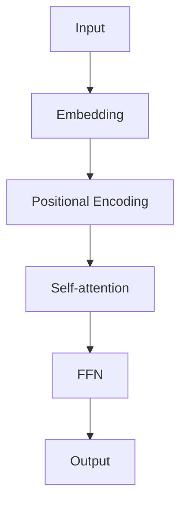
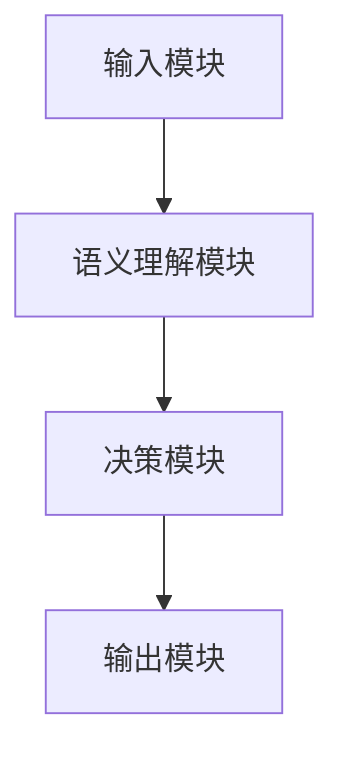
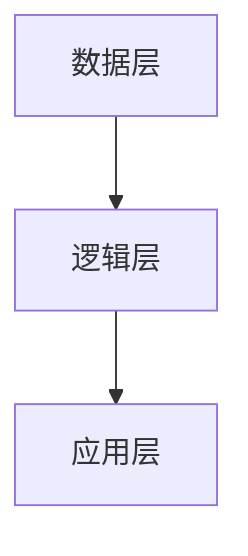

                 


# LLM支持的AI Agent语义理解优化

> 关键词：LLM, AI Agent, 语义理解优化, 自然语言处理, 智能系统设计

> 摘要：随着大语言模型（LLM）技术的快速发展，AI Agent 的语义理解能力得到了显著提升。本文详细探讨了如何利用 LLM 优化 AI Agent 的语义理解，从理论基础到实际应用，结合具体案例，分析了 LLM 在语义理解中的核心作用及优化策略。

---

## 目录

1. [背景介绍](#背景介绍)
   - 1.1 AI Agent 的定义与特点
   - 1.2 大语言模型的基本概念
   - 1.3 AI Agent 与大语言模型的结合方式

2. [语义理解的核心问题](#语义理解的核心问题)
   - 2.1 语义理解的定义与挑战
   - 2.2 LLM 在语义理解中的优势
   - 2.3 优化目标与关键指标

3. [基于 LLM 的语义理解机制](#基于 LLM 的语义理解机制)
   - 3.1 大语言模型的训练与微调
   - 3.2 基于 Transformer 的模型结构
   - 3.3 基于上下文的推理过程

4. [AI Agent 语义理解的优化策略](#AI Agent 语义理解的优化策略)
   - 4.1 微调 LLM 的策略
   - 4.2 基于提示的优化方法
   - 4.3 多模型融合的优化方案

5. [系统架构与实现方案](#系统架构与实现方案)
   - 5.1 系统功能模块划分
   - 5.2 系统架构设计
   - 5.3 系统接口设计

6. [项目实战与案例分析](#项目实战与案例分析)
   - 6.1 项目背景与目标
   - 6.2 项目实现步骤
   - 6.3 实际案例分析

7. [总结与展望](#总结与展望)
   - 7.1 核心内容回顾
   - 7.2 未来研究方向
   - 7.3 注意事项与建议

---

## 背景介绍

### 1.1 AI Agent 的定义与特点
AI Agent（智能代理）是一种能够感知环境并采取行动以实现目标的智能实体。它可以通过接收输入、分析信息、执行任务与环境进行交互。

#### 1.1.1 AI Agent 的定义
AI Agent 是一种智能系统，能够根据环境信息自主决策并执行任务。它可以分为以下几类：
- **简单反射型 Agent**：基于当前输入做出简单反应。
- **基于模型的反射型 Agent**：通过内部状态模型进行决策。
- **目标驱动型 Agent**：根据目标选择最优行动。
- **效用驱动型 Agent**：通过最大化效用函数来决策。

#### 1.1.2 大语言模型的特点
大语言模型（LLM）是基于深度学习的自然语言处理模型，具有以下特点：
- **大规模参数**：通常包含 billions 量级的参数。
- **预训练**：通过大量无监督数据进行预训练。
- **上下文理解**：能够捕捉上下文信息，生成连贯的文本。
- **可微调**：可以通过微调任务特定数据进行优化。

#### 1.1.3 AI Agent 与大语言模型的结合方式
AI Agent 可以利用 LLM 的强大语义理解能力来提升自身的任务执行能力。例如：
- **任务理解**：通过 LLM 理解用户需求。
- **自然语言交互**：通过 LLM 实现流畅的对话。
- **决策支持**：利用 LLM 分析上下文信息，辅助决策。

---

## 语义理解的核心问题

### 2.1 语义理解的定义与挑战
语义理解是让计算机能够理解人类语言的深层含义。其核心挑战包括：
- **歧义性**：同一个词语或句子可能有多种含义。
- **上下文依赖性**：语义理解依赖于上下文信息。
- **知识表示**：如何有效地表示和利用知识。

### 2.2 LLM 在语义理解中的优势
大语言模型在语义理解方面具有显著优势：
- **大规模预训练**：通过海量数据学习语言规律。
- **上下文感知**：能够捕捉上下文信息，生成连贯的语义。
- **可微调性**：可以根据具体任务进行微调，适应不同场景。

### 2.3 优化目标与关键指标
优化目标是提升 AI Agent 的语义理解能力，关键指标包括：
- **准确率**：语义理解的正确性。
- **响应速度**：语义理解的效率。
- **可解释性**：语义理解过程的透明性。

---

## 基于 LLM 的语义理解机制

### 3.1 大语言模型的训练与微调
大语言模型的训练通常采用 Transformer 架构，通过自注意力机制捕捉长距离依赖关系。

#### 3.1.1 基于 Transformer 的模型结构


#### 3.1.2 微调策略
微调是通过特定任务的数据对模型进行 fine-tuning，流程如下：
1. **加载预训练模型**。
2. **定义任务数据集**。
3. **微调模型**。
4. **评估性能**。

### 3.2 基于上下文的推理过程
大语言模型的推理过程可以通过以下步骤实现：
1. **输入处理**：将输入文本转换为向量表示。
2. **自注意力计算**：计算每个词与其他词的相关性。
3. **前向网络处理**：通过前向网络生成输出向量。
4. **解码**：将输出向量解码为自然语言文本。

---

## AI Agent 语义理解的优化策略

### 4.1 微调 LLM 的策略
微调策略包括：
- **任务特定数据**：使用与任务相关的数据进行微调。
- **小批量训练**：减少 batch size，提高模型泛化能力。
- **学习率调整**：采用适当的学习率衰减策略。

### 4.2 基于提示的优化方法
提示（Prompt）是一种常用的优化方法，通过设计合适的提示引导模型生成符合要求的输出。

#### 4.2.1 提示设计
提示设计包括：
- **模板化提示**：使用模板化的提示结构。
- **动态提示**：根据输入内容动态生成提示。
- **多轮对话提示**：模拟多轮对话过程。

### 4.3 多模型融合的优化方案
多模型融合可以通过以下方式实现：
- **投票机制**：多个模型生成候选答案，通过投票选择最优答案。
- **加权融合**：根据模型的性能赋予不同的权重。
- **混合策略**：结合多种模型的优势，提升整体性能。

---

## 系统架构与实现方案

### 5.1 系统功能模块划分
系统功能模块包括：
- **输入模块**：接收用户输入。
- **语义理解模块**：利用 LLM 进行语义分析。
- **决策模块**：根据语义结果做出决策。
- **输出模块**：返回执行结果。

#### 5.1.1 功能模块划分


### 5.2 系统架构设计
系统架构采用分层设计，包括数据层、逻辑层和应用层。

#### 5.2.1 系统架构图


### 5.3 系统接口设计
系统接口设计包括：
- **输入接口**：接收用户输入。
- **输出接口**：返回处理结果。
- **日志接口**：记录系统运行状态。

---

## 项目实战与案例分析

### 6.1 项目背景与目标
项目目标是开发一个基于 LLM 的 AI Agent，实现高效的语义理解与任务执行。

#### 6.1.1 项目背景
随着自然语言处理技术的快速发展，AI Agent 的应用领域不断扩大，例如智能客服、智能助手等。

### 6.2 项目实现步骤
1. **环境搭建**：安装必要的依赖库。
2. **数据准备**：收集和整理训练数据。
3. **模型训练**：基于 LLM 进行微调。
4. **系统集成**：将模型集成到 AI Agent 系统中。
5. **测试与优化**：进行系统测试并优化性能。

#### 6.2.1 代码实现
以下是训练过程的代码示例：
```python
import torch
from torch import nn
from torch.optim import Adam

class LlamaModel(nn.Module):
    def __init__(self, vocab_size):
        super().__init__()
        self.embedding = nn.Embedding(vocab_size, 64)
        self.transformer = nn.Transformer(64, 8, 2)
        self.fc = nn.Linear(64, vocab_size)
    
    def forward(self, x):
        x = self.embedding(x)
        x = self.transformer(x, x)
        x = self.fc(x)
        return x

# 初始化模型
vocab_size = 10000
model = LlamaModel(vocab_size)

# 定义优化器和损失函数
optimizer = Adam(model.parameters(), lr=0.001)
criterion = nn.CrossEntropyLoss()

# 训练过程
for epoch in range(10):
    for batch in batches:
        optimizer.zero_grad()
        outputs = model(batch)
        loss = criterion(outputs, labels)
        loss.backward()
        optimizer.step()
```

---

## 总结与展望

### 7.1 核心内容回顾
本文详细探讨了如何利用 LLM 优化 AI Agent 的语义理解能力，从理论到实践，全面分析了 LLM 在语义理解中的作用。

### 7.2 未来研究方向
未来的研究方向包括：
- **更高效的语言模型**：开发更高效的模型架构。
- **多模态语义理解**：结合视觉、听觉等多模态信息。
- **可解释性增强**：提升语义理解的可解释性。

### 7.3 注意事项与建议
- **数据质量**：确保训练数据的质量和多样性。
- **模型调优**：合理调整模型参数，避免过拟合。
- **实际应用**：结合具体场景，优化系统的实用性。

---

作者：AI天才研究院/AI Genius Institute & 禅与计算机程序设计艺术 /Zen And The Art of Computer Programming

---

通过本文的详细讲解，读者可以系统地掌握 LLM 支持的 AI Agent 语义理解优化的核心内容，并能够在实际项目中灵活应用这些知识。

