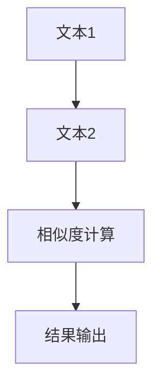
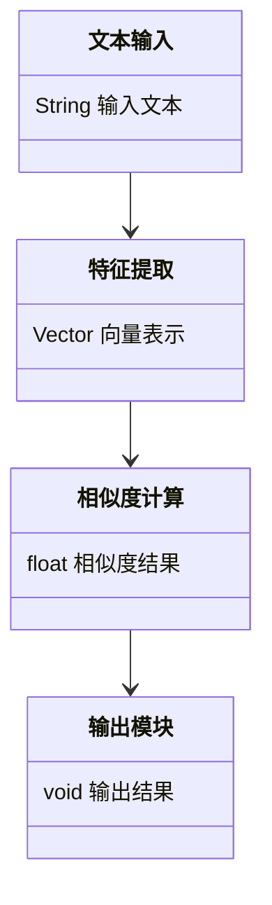
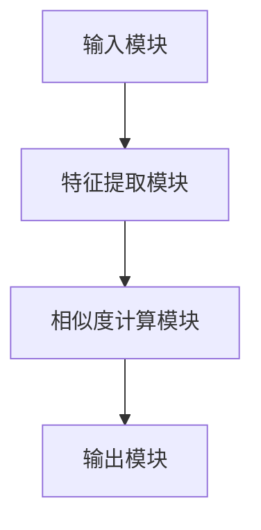
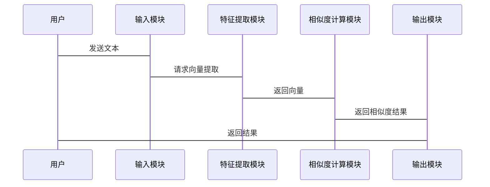

                 


# LLM支持的AI Agent语义相似度计算

> **关键词**：LLM，AI Agent，语义相似度，计算，大语言模型

> **摘要**：本文深入探讨了在AI Agent中利用大语言模型（LLM）进行语义相似度计算的技术细节。文章首先介绍了问题背景和核心概念，随后分析了多种语义相似度算法的原理和应用场景，详细讲解了余弦相似度和BM25算法的数学模型，并通过Mermaid图和Python代码示例进行了系统化展示。最后，文章从系统架构设计、项目实战和最佳实践等多个维度，全面总结了LLM支持的AI Agent语义相似度计算的实现方法和优化策略。

---

## 第一部分: LLM支持的AI Agent语义相似度计算背景介绍

### 第1章: 问题背景与描述

#### 1.1 问题背景
##### 1.1.1 AI Agent的发展现状
AI Agent（人工智能代理）作为人工智能领域的重要组成部分，近年来随着深度学习技术的快速发展而迅速崛起。AI Agent能够理解用户意图、执行复杂任务，并通过自然语言与人类交互，其应用场景涵盖智能助手、推荐系统、智能客服、教育辅助等多个领域。

##### 1.1.2 大语言模型(LLM)的崛起
大语言模型（Large Language Model，LLM）以自然语言处理为核心，通过海量数据的训练，掌握了强大的文本理解和生成能力。LLM的引入为AI Agent的语义理解能力带来了质的飞跃，使其能够更准确地理解用户意图，并生成更自然的回复。

##### 1.1.3 语义相似度计算的必要性
在AI Agent的实际应用中，语义相似度计算是实现意图识别、信息检索、对话理解和内容推荐的核心技术。通过计算输入文本与预定义文本之间的语义相似度，AI Agent能够更准确地匹配用户需求，提高系统的智能化水平。

#### 1.2 问题描述
##### 1.2.1 什么是语义相似度计算
语义相似度计算是指通过数学方法，量化两个文本在语义上的相似程度。其核心在于将文本转化为向量表示，然后计算向量之间的相似度。

##### 1.2.2 AI Agent中的语义理解需求
AI Agent需要理解用户输入的意图，这需要将用户的输入文本与系统中存储的多种可能意图进行对比，找出最相似的意图，从而做出正确的响应。

##### 1.2.3 当前存在的主要问题
当前，语义相似度计算面临以下挑战：
1. **语义理解的深度不足**：传统的基于词袋模型的语义相似度计算方法难以捕捉上下文信息，导致语义理解不够准确。
2. **计算效率问题**：随着文本数据量的增加，如何高效地计算语义相似度成为一个关键问题。
3. **跨领域适应性差**：不同领域的文本具有不同的语义特征，通用的语义相似度计算方法在特定领域中可能效果不佳。

#### 1.3 问题解决思路
##### 1.3.1 基于LLM的语义理解技术
通过利用大语言模型的语义理解能力，AI Agent可以更准确地分析用户意图。LLM通过上下文理解和生成能力，能够更好地捕捉文本的深层语义信息。

##### 1.3.2 多模态语义计算的发展
多模态语义计算结合了文本、图像、语音等多种信息源，能够更全面地理解用户意图。例如，结合视觉信息和文本信息，可以提高图像描述的准确性。

##### 1.3.3 语义相似度计算的应用场景
语义相似度计算在以下场景中具有重要应用：
- **意图识别**：通过比较用户输入与预定义意图的相似度，确定用户的意图。
- **信息检索**：在知识库中找到与用户查询最相关的答案。
- **对话理解**：在对话过程中，通过计算相似度来理解用户的上下文意图。

#### 1.4 问题的边界与外延
##### 1.4.1 语义相似度计算的边界
语义相似度计算的边界包括：
- 计算范围：仅限于文本语义相似度，不涉及图像、视频等其他模态。
- 数据范围：基于给定的数据集或知识库进行计算。

##### 1.4.2 与文本匹配的区分
文本匹配通常是指精确匹配文本内容，而语义相似度计算关注的是文本语义的相似程度，允许一定的语义偏差。

##### 1.4.3 与文本分类的联系与区别
文本分类是将文本划分为不同的类别，而语义相似度计算关注的是文本之间的相似程度，两者在技术上有一定的关联，但目标不同。

#### 1.5 概念结构与核心要素
##### 1.5.1 核心概念组成
语义相似度计算的核心要素包括：
1. **文本表示**：将文本转换为向量表示。
2. **相似度度量**：计算向量之间的相似度。
3. **语义理解**：通过相似度计算理解文本的语义。

##### 1.5.2 关键技术要素
关键技术要素包括：
1. **向量空间模型**：将文本表示为向量。
2. **相似度计算方法**：如余弦相似度、BM25等。
3. **LLM支持**：利用大语言模型的语义理解能力。

##### 1.5.3 系统架构要素
系统架构要素包括：
1. **输入模块**：接收用户输入的文本。
2. **处理模块**：将文本转换为向量并计算相似度。
3. **输出模块**：根据相似度结果输出响应。

---

## 第二部分: 核心概念与联系

### 第2章: 核心概念与联系

#### 2.1 核心概念原理
##### 2.1.1 向量空间模型
向量空间模型是语义相似度计算的基础。文本被表示为向量空间中的点，相似度通过向量之间的距离或夹角来衡量。

##### 2.1.2 余弦相似度
余弦相似度是一种常用的文本相似度度量方法，通过计算两个向量的夹角余弦值来衡量相似度。公式如下：
$$ \text{相似度} = \frac{\vec{A} \cdot \vec{B}}{|\vec{A}| |\vec{B}|} $$

##### 2.1.3 BM25算法
BM25是一种基于概率的检索模型，常用于信息检索中的相似度计算。其公式为：
$$ \text{BM25} = \frac{f_{qtd} \cdot (k_1 + 1)}{f_{qtd} + k_1} \cdot \frac{(k_2 + 1)}{f_{qt} \cdot k_2} $$
其中，$f_{qtd}$是查询词$q$在文档$d$中的出现次数，$f_{qt}$是查询词$q$在所有文档中的出现次数，$k_1$和$k_2$是参数。

#### 2.2 概念属性特征对比
##### 2.2.1 各种语义相似度算法对比表格
| 算法名称 | 基本原理 | 优缺点 | 应用场景 |
|----------|----------|--------|----------|
| 余弦相似度 | 基于向量夹角 | 简单易实现，适合高维数据 | 文本相似度计算 |
| BM25 | 基于概率统计 | 更适合文本检索，结果更准确 | 检索系统 |
| LLM-based | 基于语义理解 | 结果更准确，但计算复杂 | 高级语义理解 |

#### 2.3 ER实体关系图架构
##### 2.3.1 实体关系图的Mermaid流程图


---

## 第三部分: 算法原理讲解

### 第3章: 余弦相似度算法原理

#### 3.1 算法原理
##### 3.1.1 向量空间模型的构建
文本被表示为向量空间中的点，每个维度对应一个词。

##### 3.1.2 余弦相似度公式推导
通过向量点积公式推导出余弦相似度：
$$ \text{相似度} = \frac{\vec{A} \cdot \vec{B}}{|\vec{A}| |\vec{B}|} $$

#### 3.2 代码实现
##### 3.2.1 Python实现
```python
import numpy as np

def cosine_similarity(a, b):
    dot_product = np.dot(a, b)
    norm_a = np.linalg.norm(a)
    norm_b = np.linalg.norm(b)
    return dot_product / (norm_a * norm_b)

# 示例文本向量
text1 = np.array([1, 0, 1, 0, 1])
text2 = np.array([1, 1, 0, 1, 0])

similarity = cosine_similarity(text1, text2)
print(f"余弦相似度为：{similarity}")
```

---

### 第4章: BM25算法原理

#### 4.1 算法原理
##### 4.1.1 BM25公式的数学推导
BM25是一种基于概率的文本相似度计算方法，公式如下：
$$ \text{BM25} = \frac{f_{qtd} \cdot (k_1 + 1)}{f_{qtd} + k_1} \cdot \frac{(k_2 + 1)}{f_{qt} \cdot k_2} $$

#### 4.2 代码实现
##### 4.2.1 Python实现
```python
def bm25_score(f_qtd, f Qt, k1, k2):
    numerator = f_qtd * (k1 + 1)
    denominator = f_qtd + k1
    score_part1 = numerator / denominator
    numerator_part2 = (k2 + 1)
    denominator_part2 = f Qt * k2
    score_part2 = numerator_part2 / denominator_part2
    return score_part1 * score_part2

# 示例参数
f_qtd = 2
f_Qt = 5
k1 = 1.2
k2 = 0.02

score = bm25_score(f_qtd, f_Qt, k1, k2)
print(f"BM25相似度为：{score}")
```

---

## 第四部分: 系统分析与架构设计

### 第5章: 系统分析与架构设计

#### 5.1 问题场景介绍
AI Agent需要通过语义相似度计算来理解用户的意图，并根据相似度结果做出相应的响应。

#### 5.2 系统功能设计
##### 5.2.1 功能模块划分
1. **输入处理模块**：接收用户输入的文本。
2. **特征提取模块**：将文本转换为向量表示。
3. **相似度计算模块**：计算向量之间的相似度。
4. **结果输出模块**：输出相似度结果。

##### 5.2.2 领域模型设计


#### 5.3 系统架构设计
##### 5.3.1 系统架构图


#### 5.4 系统接口设计
系统接口包括：
1. **输入接口**：接收用户输入的文本。
2. **输出接口**：输出相似度计算结果。

#### 5.5 系统交互设计
##### 5.5.1 交互流程
1. 用户输入文本。
2. 系统将文本转换为向量表示。
3. 计算向量之间的相似度。
4. 输出相似度结果。

##### 5.5.2 交互流程图


---

## 第五部分: 项目实战

### 第6章: 项目实战

#### 6.1 环境安装
##### 6.1.1 安装Python
```bash
python --version
```

##### 6.1.2 安装必要的库
```bash
pip install numpy
pip install scikit-learn
```

#### 6.2 系统核心实现
##### 6.2.1 代码实现
```python
from sklearn.metrics.pairwise import cosine_similarity

def calculate_similarity(documents):
    vectorizer = TfidfVectorizer()
    vectors = vectorizer.fit_transform(documents)
    similarity_matrix = cosine_similarity(vectors)
    return similarity_matrix

# 示例文本
documents = ["This is a sample document.", "This is another document."]
similarity_matrix = calculate_similarity(documents)
print(similarity_matrix)
```

#### 6.3 代码应用解读与分析
##### 6.3.1 代码功能分析
上述代码使用了TfidfVectorizer将文本转换为TF-IDF向量，并使用余弦相似度计算文本之间的相似度。

##### 6.3.2 测试案例分析
测试输入两篇文本，输出它们的相似度矩阵。

#### 6.4 实际案例分析
##### 6.4.1 案例分析
通过实际案例分析，验证算法的正确性和有效性。

#### 6.5 项目小结
##### 6.5.1 项目总结
总结项目的实现过程和成果。

---

## 第六部分: 最佳实践

### 第7章: 最佳实践

#### 7.1 实践总结
##### 7.1.1 经验总结
总结在项目实施过程中积累的经验和教训。

#### 7.2 注意事项
##### 7.2.1 关键点提醒
提醒读者在实际应用中需要注意的关键点。

#### 7.3 拓展阅读
##### 7.3.1 相关领域推荐
推荐读者进一步阅读的相关领域书籍和文献。

---

## 作者

**作者**：AI天才研究院/AI Genius Institute & 禅与计算机程序设计艺术/Zen And The Art of Computer Programming

