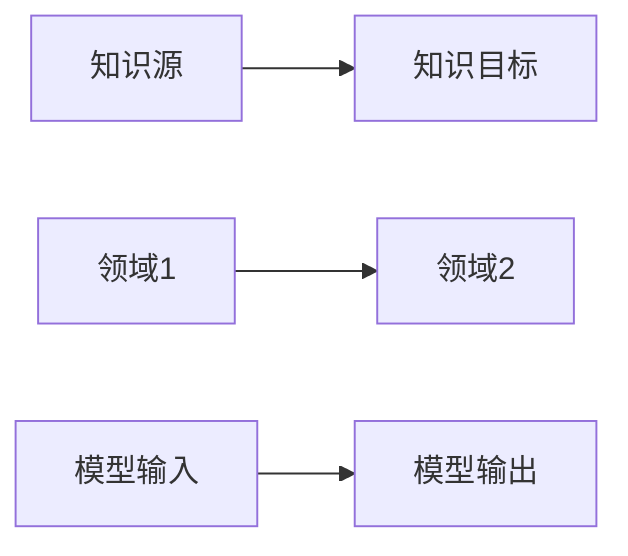
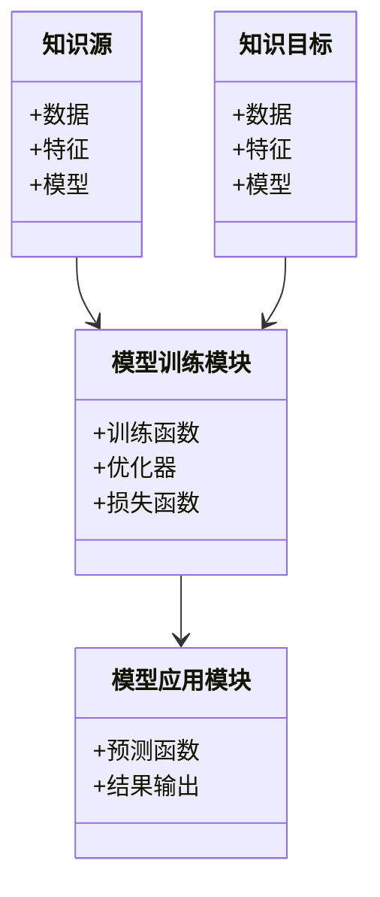
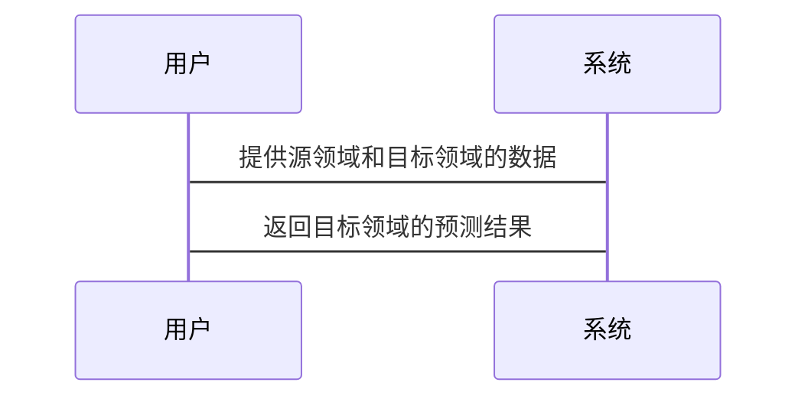

                 


# LLM支持的AI Agent跨域知识迁移技术

> 关键词：LLM, AI Agent, 跨域知识迁移, 大语言模型, 人工智能, 知识表示, 迁移学习

> 摘要：本文将深入探讨LLM支持的AI Agent在跨域知识迁移技术中的应用。通过分析跨域知识迁移的背景、核心概念、算法原理、系统架构、项目实战等多方面内容，本文旨在为读者提供一个全面的技术视角，帮助读者理解如何通过LLM技术实现AI Agent在不同领域间的知识迁移。文章还将结合实际案例，详细讲解技术实现过程，并提供代码示例和系统设计图，为读者提供实用的技术参考。

---

# 第一部分: 背景与概述

## 第1章: 跨域知识迁移的背景与意义

### 1.1 跨域知识迁移的定义与核心概念

#### 1.1.1 跨域知识迁移的定义
跨域知识迁移是指将一个领域中的知识、经验或模型迁移到另一个领域中，以解决新领域的问题。其核心在于通过共享知识或模型参数，实现不同领域之间的知识共享和复用。

#### 1.1.2 跨域知识迁移的核心要素
- **知识表示**：知识的表达形式，如符号、向量或图结构。
- **迁移策略**：如何将知识从一个领域迁移到另一个领域。
- **适应机制**：在目标领域中调整和优化知识的策略。

#### 1.1.3 跨域知识迁移的应用场景
- **医疗领域**：将疾病诊断知识迁移到药物研发。
- **金融领域**：将风险管理知识迁移到信用评估。
- **教育领域**：将学习方法迁移到教学设计。

### 1.2 LLM与AI Agent的结合

#### 1.2.1 大语言模型（LLM）的基本概念
大语言模型（Large Language Model, LLM）是指基于深度学习训练的大型神经网络模型，能够理解和生成自然语言文本。其核心是通过大量数据训练，掌握语言的模式和语义。

#### 1.2.2 AI Agent的定义与功能
AI Agent（人工智能代理）是一种能够感知环境、自主决策并执行任务的智能体。它可以基于LLM提供强大的语言理解和生成能力，从而实现复杂任务的自动化。

#### 1.2.3 LLM支持的AI Agent的优势
- **强大的语言处理能力**：LLM能够理解上下文、推理和生成自然语言。
- **跨领域适应性**：通过跨域知识迁移，AI Agent可以在不同领域中灵活应用。
- **高效性**：LLM的快速响应能力使得AI Agent能够高效完成任务。

### 1.3 跨域知识迁移的必要性与挑战

#### 1.3.1 跨域知识迁移的必要性
- **数据稀缺性**：在某些领域中，数据量有限，难以单独训练模型。
- **通用性需求**：AI Agent需要在多个领域中通用，以提高利用率。

#### 1.3.2 跨域知识迁移的主要挑战
- **领域差异性**：不同领域的数据分布和语义可能差异较大，导致迁移效果不佳。
- **模型适应性**：如何在目标领域中调整模型参数，使其适应新任务。

#### 1.3.3 跨域知识迁移的技术边界
- **迁移范围**：知识迁移的深度和广度。
- **模型鲁棒性**：模型在不同领域中的稳定性和可靠性。

## 第2章: 跨域知识迁移的核心概念与联系

### 2.1 跨域知识迁移的核心概念

#### 2.1.1 知识表示与迁移的基本原理
知识表示是跨域迁移的基础。常用的知识表示方法包括符号表示、向量表示和图结构表示。符号表示通过规则明确知识，向量表示通过语义向量捕捉语义相似性，图结构表示通过节点和边表示知识的关联性。

#### 2.1.2 跨域迁移的数学模型
跨域迁移可以通过多种数学模型实现，如基于分布的迁移学习、基于图的迁移学习等。这些模型通过优化目标函数，使得源领域和目标领域的特征空间对齐。

#### 2.1.3 跨域迁移的关键技术
- **特征对齐**：通过映射函数将源领域和目标领域的特征对齐。
- **对抗训练**：通过生成对抗网络（GAN）实现领域间特征的共享。

### 2.2 跨域知识迁移的核心要素对比

#### 2.2.1 不同迁移策略的对比分析
- **直接迁移**：直接使用源领域的模型到目标领域，适用于领域差异性较小的情况。
- **参数微调**：对模型参数进行微调，使其适应目标领域。
- **对抗训练**：通过生成对抗网络实现领域间特征的共享。

#### 2.2.2 不同模型的性能对比
- **线性模型**：如SVM和线性回归，适用于低维数据。
- **深度学习模型**：如CNN和RNN，适用于高维数据。
- **大语言模型**：如GPT和BERT，适用于自然语言处理任务。

#### 2.2.3 不同应用场景的对比
- **文本分类**：将源领域的文本分类模型迁移到目标领域。
- **图像分类**：将源领域的图像分类模型迁移到目标领域。
- **自然语言生成**：将源领域的生成模型迁移到目标领域。

### 2.3 跨域知识迁移的ER实体关系图



---

# 第二部分: 跨域知识迁移的核心算法与技术

## 第3章: 跨域知识迁移的算法原理

### 3.1 跨域知识迁移的基本算法

#### 3.1.1 基于迁移学习的算法原理

迁移学习是一种通过将一个领域中的知识迁移到另一个领域的学习方法。其核心在于找到源领域和目标领域的共同特征，并通过优化目标领域的任务性能。

#### 3.1.2 跨域迁移的数学模型

跨域迁移可以通过多种数学模型实现，如基于分布的迁移学习、基于图的迁移学习等。这些模型通过优化目标函数，使得源领域和目标领域的特征空间对齐。

#### 3.1.3 跨域迁移的实现步骤

跨域迁移的实现步骤包括：

1. 数据预处理：对源领域和目标领域的数据进行清洗和标注。
2. 特征提取：通过特征提取方法提取源领域和目标领域的特征。
3. 模型训练：在源领域上训练模型，并将其迁移到目标领域。
4. 参数调整：通过参数微调或对抗训练优化模型在目标领域的性能。

#### 3.1.4 跨域迁移的算法代码示例

```python
import torch
import torch.nn as nn

# 定义模型
class迁移学习模型(nn.Module):
    def __init__(self, input_dim, hidden_dim, output_dim):
        super(迁移学习模型, self).__init__()
        self.fc1 = nn.Linear(input_dim, hidden_dim)
        self.fc2 = nn.Linear(hidden_dim, output_dim)
        self.relu = nn.ReLU()

    def forward(self, x):
        x = self.fc1(x)
        x = self.relu(x)
        x = self.fc2(x)
        return x

# 训练函数
def train_model(model, optimizer, criterion, source_loader, target_loader, epochs):
    for epoch in range(epochs):
        for batch_source, batch_target in zip(source_loader, target_loader):
            # 前向传播
            outputs = model(batch_source)
            # 计算损失
            loss = criterion(outputs, batch_target)
            # 反向传播和优化
            optimizer.zero_grad()
            loss.backward()
            optimizer.step()
    return model

# 使用迁移学习模型进行训练
model = 迁移学习模型(input_dim, hidden_dim, output_dim)
optimizer = torch.optim.Adam(model.parameters(), lr=0.001)
criterion = nn.CrossEntropyLoss()
trained_model = train_model(model, optimizer, criterion, source_loader, target_loader, epochs=10)
```

### 3.2 跨域知识迁移的优化算法

#### 3.2.1 参数微调的优化方法

参数微调是一种常见的迁移学习方法，通过在目标领域上微调模型参数，使其适应目标领域的任务。

#### 3.2.2 对抗训练

对抗训练是一种通过生成对抗网络（GAN）实现领域间特征共享的方法。其核心在于通过生成器和判别器的对抗训练，使得生成器能够生成与目标领域相似的特征。

#### 3.2.3 其他优化算法

- **自适应迁移学习**：根据目标领域的数据分布自适应调整迁移策略。
- **多任务学习**：通过同时学习多个任务，实现跨领域知识的共享。

---

# 第三部分: 跨域知识迁移的系统架构与设计

## 第4章: 跨域知识迁移的系统架构设计

### 4.1 问题场景介绍

跨域知识迁移系统需要实现以下功能：

1. 接收源领域和目标领域的数据。
2. 对数据进行预处理和特征提取。
3. 训练和优化模型。
4. 输出目标领域的预测结果。

### 4.2 项目介绍

本项目旨在通过大语言模型实现AI Agent在不同领域的知识迁移。系统包括数据预处理模块、模型训练模块和模型应用模块。

### 4.3 系统功能设计

#### 4.3.1 领域模型设计



#### 4.3.2 系统架构设计


### 4.4 系统接口设计

- **输入接口**：接收源领域和目标领域的数据。
- **输出接口**：输出目标领域的预测结果。

### 4.5 系统交互设计



---

# 第四部分: 跨域知识迁移的项目实战

## 第5章: 跨域知识迁移的项目实战

### 5.1 环境安装与配置

- **安装Python**：确保Python版本为3.6以上。
- **安装依赖库**：安装PyTorch、Transformers等库。

### 5.2 系统核心实现源代码

```python
import torch
from torch import nn
from torch.utils.data import DataLoader

# 数据集类
class CustomDataset(torch.utils.data.Dataset):
    def __init__(self, data, labels):
        self.data = data
        self.labels = labels

    def __len__(self):
        return len(self.data)

    def __getitem__(self, idx):
        return self.data[idx], self.labels[idx]

# 模型类
class迁移学习模型(nn.Module):
    def __init__(self, input_dim, hidden_dim, output_dim):
        super(迁移学习模型, self).__init__()
        self.fc1 = nn.Linear(input_dim, hidden_dim)
        self.fc2 = nn.Linear(hidden_dim, output_dim)
        self.relu = nn.ReLU()

    def forward(self, x):
        x = self.fc1(x)
        x = self.relu(x)
        x = self.fc2(x)
        return x

# 训练函数
def train_model(model, optimizer, criterion, source_loader, target_loader, epochs):
    for epoch in range(epochs):
        for batch_source, batch_target in zip(source_loader, target_loader):
            # 前向传播
            outputs = model(batch_source)
            # 计算损失
            loss = criterion(outputs, batch_target)
            # 反向传播和优化
            optimizer.zero_grad()
            loss.backward()
            optimizer.step()
    return model

# 主函数
def main():
    # 数据预处理
    source_data = ...  # 源领域数据
    source_labels = ...  # 源领域标签
    target_data = ...  # 目标领域数据
    target_labels = ...  # 目标领域标签

    # 创建数据集和数据加载器
    source_dataset = CustomDataset(source_data, source_labels)
    target_dataset = CustomDataset(target_data, target_labels)
    source_loader = DataLoader(source_dataset, batch_size=32, shuffle=True)
    target_loader = DataLoader(target_dataset, batch_size=32, shuffle=True)

    # 初始化模型、优化器和损失函数
    model = 迁移学习模型(input_dim=source_data.shape[1], hidden_dim=64, output_dim=len(set(source_labels)))
    optimizer = torch.optim.Adam(model.parameters(), lr=0.001)
    criterion = nn.CrossEntropyLoss()

    # 训练模型
    trained_model = train_model(model, optimizer, criterion, source_loader, target_loader, epochs=10)

    # 模型应用
    # （此处可以根据实际需求编写预测代码）

if __name__ == "__main__":
    main()
```

### 5.3 代码应用解读与分析

- **数据预处理**：将源领域和目标领域的数据进行清洗和标注。
- **模型训练**：在源领域上训练模型，并将其迁移到目标领域。
- **模型应用**：使用训练好的模型进行目标领域的预测。

### 5.4 案例分析与详细讲解

假设我们有一个医疗领域的疾病诊断模型，希望将其迁移到药物研发领域。通过跨域知识迁移，我们可以将疾病诊断的知识迁移到药物研发，从而提高药物研发的效率。

### 5.5 项目小结

跨域知识迁移是一种非常有用的技术，可以将一个领域中的知识迁移到另一个领域，从而提高模型的泛化能力和应用范围。

---

# 第五部分: 跨域知识迁移的总结与展望

## 第6章: 总结与展望

### 6.1 跨域知识迁移的核心技术总结

- **知识表示**：通过符号、向量或图结构表示知识。
- **迁移策略**：选择合适的迁移策略，如参数微调和对抗训练。
- **系统架构**：设计合理的系统架构，实现知识的高效迁移。

### 6.2 跨域知识迁移的技术挑战与解决方案

- **领域差异性**：通过对抗训练和特征对齐减少领域差异。
- **模型适应性**：通过参数微调和自适应迁移学习优化模型性能。

### 6.3 跨域知识迁移的未来发展与展望

- **多领域迁移**：研究如何在多个领域之间实现知识的迁移。
- **动态迁移**：研究如何在动态变化的领域中实现知识的迁移。
- **强化学习**：结合强化学习，进一步提升跨域迁移的效果。

---

# 作者：AI天才研究院/AI Genius Institute & 禅与计算机程序设计艺术 /Zen And The Art of Computer Programming

---

通过以上结构，我们可以看到，跨域知识迁移技术在AI Agent中的应用具有广阔的应用前景。未来，随着大语言模型的不断发展，跨域知识迁移技术将更加成熟，为AI Agent在更多领域中的应用提供有力支持。

