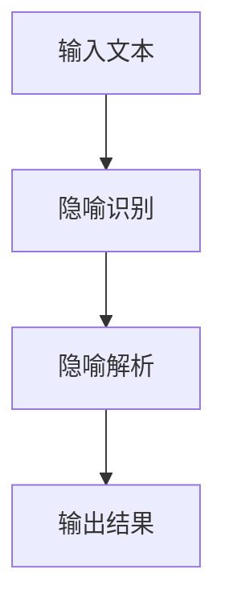

                 


# LLM支持的AI Agent隐喻理解能力

---

## 关键词：LLM, AI Agent, 隐喻理解, 自然语言处理, 人机交互

---

## 摘要：本文深入探讨了大语言模型（LLM）支持的AI Agent在隐喻理解能力方面的核心原理、算法实现和应用场景。通过分析隐喻理解的重要性，结合LLM的技术优势，本文详细阐述了AI Agent如何通过隐喻理解能力实现更自然、更贴近人类语言习惯的人机交互。同时，本文还探讨了当前研究中存在的挑战，并展望了未来的发展方向。

---

# 第一部分: LLM支持的AI Agent隐喻理解能力背景介绍

## 第1章: 隐喻理解能力的重要性与应用前景

### 1.1 隐喻理解能力的核心概念

隐喻是一种通过将一个概念映射到另一个概念来表达思想的语言现象。它在人类语言中无处不在，尤其是在文学、口语和日常交流中。隐喻的理解能力是衡量人类语言处理能力的重要指标，也是实现自然语言处理（NLP）和人机交互的关键挑战之一。

在AI Agent的应用中，隐喻理解能力显得尤为重要。AI Agent需要能够理解用户的隐喻表达，并在实际场景中正确应用这些隐喻。例如，在客服对话中，用户可能会使用“这只股票像过山车一样起伏”这样的隐喻，AI Agent需要能够识别并理解其中的隐喻含义，从而提供更准确的反馈或解决方案。

### 1.2 LLM与AI Agent的结合

大语言模型（LLM）是一种基于深度学习的自然语言处理模型，具有强大的文本生成和理解能力。AI Agent是一种能够自主感知环境、执行任务并进行人机交互的智能体。两者的结合使得AI Agent能够具备更强大的语言理解和生成能力。

LLM支持的AI Agent在隐喻理解方面具有显著优势。LLM通过大量的训练数据，能够捕捉到隐喻中的语义信息和上下文关系。AI Agent则通过LLM的支持，能够实时理解和解析用户的隐喻表达，并生成符合语境的反馈。

### 1.3 隐喻理解能力的现实应用

隐喻理解能力在多个领域都有广泛应用。例如，在教育领域，AI Agent可以通过隐喻理解帮助学生更好地理解复杂的概念；在医疗领域，隐喻理解可以帮助医生更准确地理解患者的症状描述；在商业领域，隐喻理解可以帮助AI Agent更好地理解客户的隐含需求。

当前，隐喻理解能力的研究主要集中在以下几个方面：隐喻识别、隐喻解析和隐喻生成。尽管取得了一定的进展，但隐喻理解的准确性和实时性仍然是亟待解决的问题。

---

## 第2章: 隐喻理解能力的核心概念与联系

### 2.1 隐喻理解的核心原理

隐喻理解的核心原理在于通过识别隐喻中的映射关系，理解其背后的意义。映射关系通常涉及概念属性的对比和关联。例如，在“时间是金钱”的隐喻中，“时间”和“金钱”之间的可量化性和稀缺性是映射的核心。

LLM通过其强大的语言模型能力，能够自动识别隐喻中的映射关系，并通过上下文信息进行隐喻解析。这种能力使得AI Agent能够更准确地理解用户的隐喻表达。

### 2.2 隐喻理解的关键特征

隐喻理解的关键特征包括相似性、语境依赖性和情感表达。相似性是隐喻理解的基础，指的是隐喻中的两个概念在某些属性上具有相似性。语境依赖性则是指隐喻的理解依赖于具体的上下文环境。情感表达则是隐喻理解中不可忽视的一部分，许多隐喻都带有强烈的情感色彩。

下表展示了隐喻理解的关键特征对比：

| 特征       | 描述                                                                 |
|------------|------------------------------------------------------------------|
| 相似性      | 隐喻中的两个概念在某些属性上具有相似性                               |
| 语境依赖性  | 隐喻的理解依赖于具体的上下文环境                                       |
| 情感表达    | 隐喻通常带有强烈的情感色彩，能够传递更复杂的情感信息                 |

### 2.3 隐喻理解的ER实体关系图

下图展示了隐喻理解的ER实体关系图，描述了隐喻理解能力在AI Agent中的核心关系。

```mermaid
er
actor(Agent, "LLM支持的AI Agent") {
    Agent --> "隐喻理解能力"
    "隐喻理解能力" --> "隐喻识别"
    "隐喻识别" --> "隐喻解析"
    "隐喻解析" --> "隐喻应用"
}
```

---

## 第3章: 基于LLM的隐喻理解算法原理

### 3.1 隐喻理解的算法流程

隐喻理解的算法流程包括数据预处理、隐喻识别、隐喻解析和隐喻应用四个步骤。下图展示了隐喻理解算法的流程图。



### 3.2 基于LLM的隐喻理解算法

基于LLM的隐喻理解算法通过结合语言模型和隐喻理解规则，实现隐喻的识别和解析。以下是算法的实现步骤：

1. **输入文本预处理**：对输入文本进行分词、句法分析和语义分析。
2. **隐喻识别**：通过对比概念属性，识别文本中的隐喻表达。
3. **隐喻解析**：基于上下文信息，解析隐喻的含义。
4. **隐喻应用**：将隐喻解析结果应用于实际场景，生成相应的反馈。

以下是一个简单的Python代码示例：

```python
def metaphor_understanding(text):
    # 数据预处理
    tokens = text.split()
    # 隐喻识别
    metaphor = identify_metaphor(tokens)
    # 隐喻解析
    metaphor_meaning = parse_metaphor(metaphor)
    # 隐喻应用
    return apply_metaphor(metaphor_meaning)
```

### 3.3 算法实现的数学模型

隐喻理解的数学模型主要基于注意力机制。以下是一个简化的注意力机制公式：

$$
\text{Attention}(Q, K, V) = \text{softmax}\left(\frac{QK^T}{\sqrt{d_k}}\right)V
$$

其中，\(Q\) 是查询向量，\(K\) 是键向量，\(V\) 是值向量，\(d_k\) 是键向量的维度。

---

## 第4章: 隐喻理解能力的系统架构设计

### 4.1 系统功能设计

隐喻理解能力的系统功能设计包括以下几个方面：

1. **隐喻识别**：识别文本中的隐喻表达。
2. **隐喻解析**：解析隐喻的含义。
3. **隐喻应用**：将隐喻解析结果应用于实际场景。

### 4.2 系统架构设计

下图展示了隐喻理解能力的系统架构设计。


### 4.3 系统接口设计

系统接口设计包括以下内容：

1. **输入接口**：接收用户输入的文本。
2. **输出接口**：输出隐喻理解结果。
3. **数据接口**：提供隐喻相关数据的存储和检索功能。

---

## 第5章: 项目实战与应用案例

### 5.1 项目环境安装

要实现隐喻理解能力的AI Agent，需要安装以下环境和工具：

1. **Python 3.8+**
2. **TensorFlow或PyTorch**
3. **Hugging Face Transformers库**

### 5.2 核心代码实现

以下是隐喻理解能力的Python代码实现示例：

```python
from transformers import pipeline

# 初始化隐喻识别模型
metaphor_pipeline = pipeline("text-classification", model="your_metaphor_model")

def process_input(text):
    # 输入文本预处理
    processed_text = text.lower()
    # 隐喻识别
    result = metaphor_pipeline(processed_text)
    # 隐喻解析
    if result['label'] == 'metaphor':
        return "隐喻识别成功"
    else:
        return "隐喻识别失败"

# 调用函数
print(process_input("时间是金钱"))
```

### 5.3 应用案例分析

以下是一个隐喻理解能力的实际应用案例：

**案例：** 用户输入“这只股票像过山车一样起伏”。

1. **隐喻识别**：识别出“过山车”是隐喻。
2. **隐喻解析**：解析出“股票价格波动剧烈”。
3. **隐喻应用**：生成相应的反馈，如“是的，最近市场波动较大，请注意风险。”

---

## 第6章: 总结与展望

### 6.1 研究总结

本文深入探讨了LLM支持的AI Agent在隐喻理解能力方面的核心原理、算法实现和应用场景。通过分析隐喻理解的重要性，结合LLM的技术优势，本文详细阐述了AI Agent如何通过隐喻理解能力实现更自然、更贴近人类语言习惯的人机交互。

### 6.2 研究意义

隐喻理解能力的实现不仅能够提升AI Agent的智能化水平，还能够增强人机交互的自然性和用户体验。本文的研究为未来的AI Agent开发提供了重要的理论和技术支持。

### 6.3 未来展望

尽管本文取得了一定的成果，但隐喻理解能力的研究仍然面临许多挑战。未来的研究方向包括：提高隐喻理解的准确性和实时性，扩展隐喻理解的应用场景，以及探索隐喻生成的新方法。

---

## 作者：AI天才研究院/AI Genius Institute & 禅与计算机程序设计艺术 /Zen And The Art of Computer Programming

