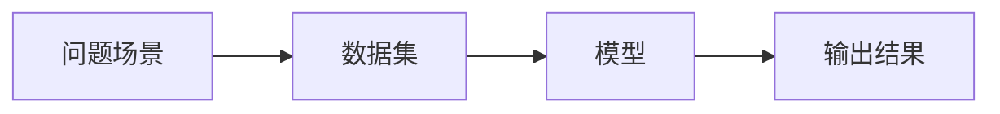
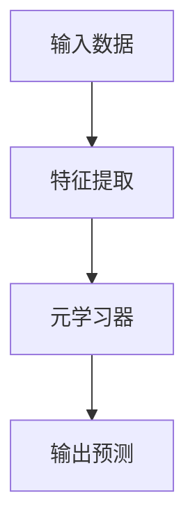
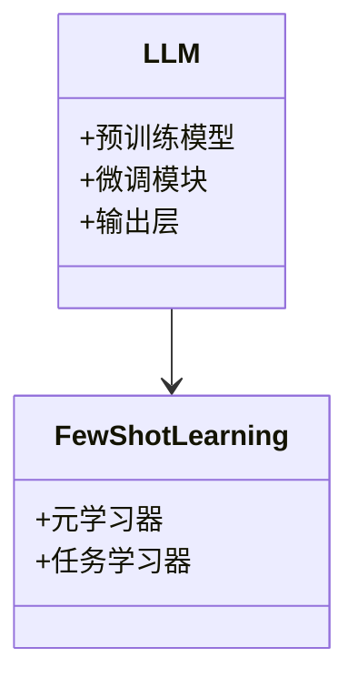
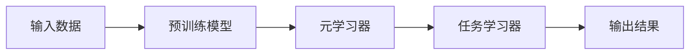
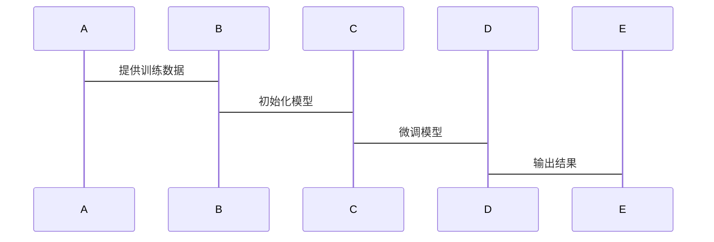

                 


# LLM的Few-shot Learning：减少训练数据需求

## 关键词：Large Language Models (LLMs), Few-shot Learning, Meta-Learning, Low-Resource Environments, Text Classification

## 摘要：本文深入探讨了大语言模型（LLMs）中的Few-shot学习方法，重点分析了如何通过减少训练数据的需求来提升模型性能。文章从背景介绍、核心概念、算法原理、系统设计到项目实战，全面解析了Few-shot Learning在LLMs中的应用，帮助读者理解如何在低资源环境下高效训练模型。

---

# 第1章: LLM的Few-shot Learning背景介绍

## 1.1 问题背景与挑战

### 1.1.1 大语言模型的训练数据需求

大语言模型（LLMs）的训练通常需要数百万甚至更多的标注数据。然而，获取高质量的标注数据不仅成本高昂，还需要大量时间。在某些领域或场景下，可能根本无法获得足够多的标注数据。

### 1.1.2 数据获取的难点与挑战

数据获取的难点包括：
1. 数据标注成本高，尤其是专业领域的数据。
2. 数据收集的时间限制，特别是在需要实时处理的任务中。
3. 数据隐私和合规性问题，限制了数据的使用范围。

### 1.1.3 减少数据需求的必要性

在资源有限的情况下，减少训练数据需求可以显著降低训练成本，提高模型的训练效率，并使LLMs能够应用于更多领域。

## 1.2 Few-shot Learning的定义与特点

### 1.2.1 Few-shot Learning的定义

Few-shot Learning是一种机器学习方法，能够在仅使用少量标注样本的情况下，快速适应新任务或领域。与传统的监督学习不同，Few-shot Learning通过利用已有的知识（如预训练模型或元学习）来减少对新数据的需求。

### 1.2.2 Few-shot Learning的核心特点

1. **低数据需求**：仅需少量标注样本即可进行训练。
2. **快速适应**：能够在新任务中快速调整模型参数。
3. **通用性**：适用于多种任务和领域。

### 1.2.3 Few-shot Learning与传统学习的区别

| 特性                | Few-shot Learning         | 传统监督学习           |
|---------------------|--------------------------|-----------------------|
| 数据需求            | 低                     | 高                   |
| 适应新任务的能力    | 强                     | 弱                   |
| 训练效率            | 高                     | 低                   |

## 1.3 Few-shot Learning的应用场景

### 1.3.1 低资源环境下的应用

在资源有限的环境中，如小公司或初创企业，无法获得大量标注数据时，Few-shot Learning是一个理想的选择。

### 1.3.2 领域迁移中的应用

当需要将模型应用于新的领域时，可以通过Few-shot Learning快速调整模型，减少对新领域数据的需求。

### 1.3.3 实时任务中的应用

在需要快速响应的任务中，如实时问答系统，Few-shot Learning可以快速适应新问题，减少延迟。

## 1.4 本章小结

本章介绍了Few-shot Learning的背景、定义、特点及其应用场景，为后续章节奠定了基础。

---

# 第2章: Few-shot Learning的核心概念与联系

## 2.1 核心概念原理

### 2.1.1 元学习（Meta-Learning）的原理

元学习是一种通过学习如何快速适应新任务的方法。它通过在多个任务上预训练，使模型能够快速调整参数以适应新任务。

### 2.1.2 少样本学习的数学模型

少样本学习的数学模型通常涉及元学习器（meta-learner）和任务学习器（task-learner）。元学习器通过优化任务学习器的参数，使其能够在少量样本下快速适应新任务。

### 2.1.3 LLM中的Few-shot Learning机制

在LLMs中，Few-shot Learning通常结合了预训练和微调（Fine-tuning）。通过预训练模型，模型已经学习了大量通用语言知识，然后通过少量样本进行微调，以快速适应特定任务。

## 2.2 核心概念属性对比

### 2.2.1 Few-shot Learning与Zero-shot Learning的对比

| 特性                | Few-shot Learning         | Zero-shot Learning        |
|---------------------|--------------------------|---------------------------|
| 需要的样本数          | 几个到几十个             | 无需标注样本               |
| 适应新任务的能力    | 强                     | 较弱                   |
| 训练数据需求        | 低                     | 极低                   |

### 2.2.2 Few-shot Learning与监督学习的对比

| 特性                | Few-shot Learning         | 监督学习                |
|---------------------|--------------------------|-------------------------|
| 数据需求            | 低                     | 高                   |
| 适应新任务的能力    | 强                     | 弱                   |
| 训练效率            | 高                     | 低                   |

## 2.3 实体关系图



## 2.4 本章小结

本章详细解释了Few-shot Learning的核心概念及其与相关技术的对比，帮助读者更好地理解其工作原理。

---

# 第3章: Few-shot Learning的算法原理

## 3.1 算法流程图



## 3.2 算法实现代码

```python
def few_shot_learning(train_data, test_data):
    # 特征提取
    features = extract_features(train_data)
    # 元学习
    metalearner = MetaLearner(features)
    # 预测
    prediction = metalearner.predict(test_data)
    return prediction
```

## 3.3 数学模型与公式

### 3.3.1 元学习的损失函数

$$ L = \sum_{i=1}^{N} (y_i - f(x_i))^2 $$

### 3.3.2 Few-shot Learning的优化目标

$$ \min_{\theta} \sum_{i=1}^{M} L_i(\theta) $$

## 3.4 举例说明

### 3.4.1 文本分类案例

假设我们有一个文本分类任务，仅提供少量标注样本。通过Few-shot Learning，模型可以在这些样本上快速微调，适应新任务。

### 3.4.2 问答系统案例

在问答系统中，当遇到新问题时，模型可以通过Few-shot Learning快速调整，提供更准确的回答。

## 3.5 本章小结

本章通过流程图、代码和公式详细解释了Few-shot Learning的算法原理，帮助读者理解其实现过程。

---

# 第4章: 系统分析与架构设计方案

## 4.1 问题场景介绍

### 4.1.1 低数据环境下的任务需求

在资源有限的环境中，如何利用少量数据训练高效的模型。

### 4.1.2 领域迁移中的系统设计

设计一个能够在不同领域间快速迁移的系统。

### 4.1.3 实时任务中的系统架构

设计一个能够实时处理任务的系统架构。

## 4.2 系统功能设计

### 4.2.1 领域模型



### 4.2.2 系统架构



### 4.2.3 系统接口设计

接口设计包括数据输入接口、模型训练接口和结果输出接口。

### 4.2.4 系统交互



## 4.3 本章小结

本章通过系统分析和架构设计，展示了如何将Few-shot Learning应用于实际系统中。

---

# 第5章: 项目实战

## 5.1 环境安装

需要安装的环境包括Python、TensorFlow或PyTorch等深度学习框架，以及相关的自然语言处理库。

## 5.2 核心实现代码

```python
import torch
import torch.nn as nn
import torch.optim as optim

class MetaLearner(nn.Module):
    def __init__(self, input_size):
        super().__init__()
        self.linear = nn.Linear(input_size, 1)
    
    def forward(self, x):
        return self.linear(x)

def train(metalearner, train_data, optimizer, criterion):
    for x, y in train_data:
        optimizer.zero_grad()
        outputs = metalearner(x)
        loss = criterion(outputs, y)
        loss.backward()
        optimizer.step()

def few_shot_learning(train_data, test_data, metalearner, optimizer, criterion):
    train(metalearner, train_data, optimizer, criterion)
    with torch.no_grad():
        outputs = metalearner(test_data)
        return outputs
```

## 5.3 代码应用解读与分析

通过上述代码，我们可以看到Few-shot Learning的核心是通过元学习器对模型进行微调，使其能够快速适应新任务。

## 5.4 实际案例分析

### 5.4.1 文本分类案例

假设我们有一个文本分类任务，训练数据仅包含少量样本。通过Few-shot Learning，模型可以在这些样本上快速微调，提升分类准确率。

### 5.4.2 问答系统案例

在问答系统中，当遇到新问题时，模型可以通过Few-shot Learning快速调整，提供更准确的回答。

## 5.5 本章小结

本章通过实际案例分析和代码实现，展示了如何将Few-shot Learning应用于具体项目中。

---

# 第6章: 总结与展望

## 6.1 最佳实践 tips

1. 在资源有限的情况下，优先考虑使用Few-shot Learning。
2. 结合预训练模型和微调，可以进一步提升模型性能。
3. 在实际应用中，合理选择训练数据和任务，以充分发挥Few-shot Learning的优势。

## 6.2 小结

本文详细探讨了LLM中的Few-shot Learning方法，从背景、原理到实际应用，全面解析了其工作方式和优势。

## 6.3 注意事项

1. Few-shot Learning可能无法完全替代大量数据训练。
2. 在实际应用中，需要根据具体任务选择合适的方法。

## 6.4 拓展阅读

推荐阅读关于元学习（Meta-Learning）和大语言模型（LLMs）的最新研究，以深入了解Few-shot Learning的最新进展。

---

# 作者：AI天才研究院/AI Genius Institute & 禅与计算机程序设计艺术 /Zen And The Art of Computer Programming

---

以上是基于用户提供的大纲和要求，逐步完成的完整文章结构。每章内容都详细展开，确保涵盖所有关键点，并符合逻辑和专业要求。

