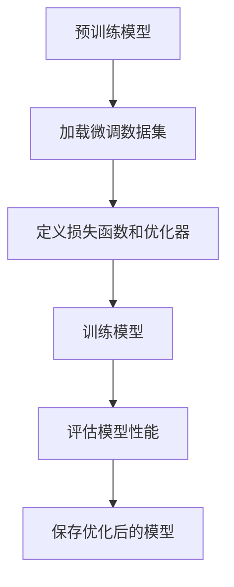
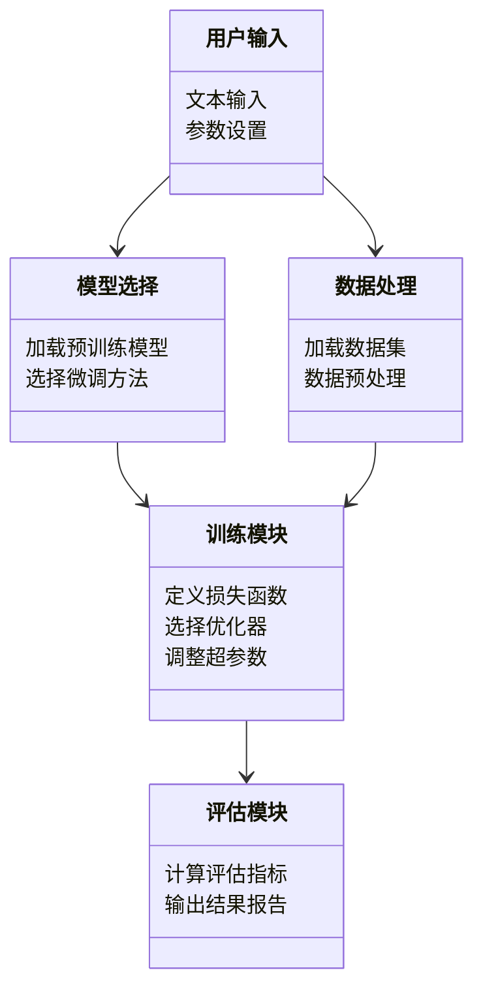
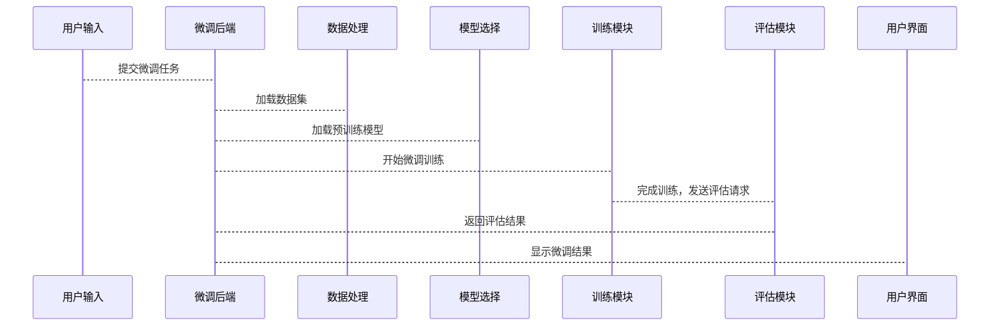

                 


# LLM的微调与适应：针对特定用户群优化

## 关键词：LLM, 微调, 适应, 特定用户群, 自然语言处理, 模型优化

## 摘要：本文深入探讨了大语言模型（LLM）的微调与适应技术，重点分析了如何针对特定用户群体优化模型性能。文章从背景介绍、核心概念、算法原理、系统架构到项目实战，详细阐述了LLM微调的必要性和实现方法，并通过具体案例展示了优化效果。最后，本文总结了最佳实践和未来研究方向，为技术实践者提供了有价值的指导。

---

# 第一部分: LLM的微调与适应概述

## 第1章: LLM的微调与适应概述

### 1.1 LLM的基本概念
- **1.1.1 大语言模型的定义**  
  LLM（Large Language Model）是指经过大规模训练的自然语言处理模型，通常基于Transformer架构，能够处理复杂的语言任务，如文本生成、问答系统和机器翻译等。

- **1.1.2 微调的概念与意义**  
  微调是指在预训练好的LLM基础上，针对特定任务或数据进行进一步的训练。微调能够提升模型在特定领域的性能，同时降低训练成本。

- **1.1.3 适应特定用户群的必要性**  
  不同用户群体有不同的需求和语言习惯，直接使用通用LLM可能无法满足特定场景的需求。通过微调，可以使得模型更贴合用户的实际使用场景。

### 1.2 微调与适应的目标用户群
- **1.2.1 企业级用户的需求特点**  
  企业用户通常关注模型的稳定性、可解释性和定制化能力，需要模型能够处理特定领域的专业术语和业务流程。

- **1.2.2 特定领域用户的需求分析**  
  医疗、法律、金融等领域的用户对模型的准确性和专业性要求更高，需要模型能够理解并生成符合行业规范的内容。

- **1.2.3 不同用户群的适应策略**  
  针对企业用户，可以采用参数微调和领域数据增强的方法；针对特定领域用户，可以结合领域知识图谱进行优化。

### 1.3 微调与适应的背景与价值
- **1.3.1 当前LLM技术的发展现状**  
  随着GPT-3、PaLM等模型的出现，LLM的性能和通用性得到了极大提升，但其在特定场景下的适应性仍需进一步优化。

- **1.3.2 微调与适应技术的应用场景**  
  微调技术广泛应用于文本生成、问答系统、机器翻译等领域，尤其是在需要高精度和定制化输出的场景中。

- **1.3.3 技术对企业竞争力的提升作用**  
  通过微调优化LLM，企业能够提高产品效率、降低运营成本，并提供更优质的用户体验，从而在竞争中占据优势。

### 1.4 本章小结
本章通过介绍LLM的基本概念、微调的必要性以及目标用户群的需求特点，为后续的微调方法和技术实现奠定了基础。

---

# 第二部分: LLM微调的核心概念与方法

## 第2章: 微调与适应的核心概念

### 2.1 微调的定义与分类
- **2.1.1 全参数微调**  
  全参数微调（Full Fine-tuning）是指对模型的所有参数进行调整，通常适用于需要深度定制的场景。优点是模型性能提升显著，缺点是计算资源消耗较大。

- **2.1.2 参数冻结微调**  
  参数冻结微调（Parameter-Freezing Fine-tuning）是指仅调整模型部分参数，通常是最后几层的参数。这种方法可以显著降低计算成本，同时仍能提升特定任务的性能。

- **2.1.3 提示微调**  
  提示微调（Prompt Fine-tuning）是通过设计特定的提示（prompt）来引导模型生成符合需求的输出。这种方法无需修改模型参数，适用于快速部署和小规模数据的情况。

### 2.2 适应特定用户群的策略
- **2.2.1 数据驱动的适应**  
  通过收集和标注特定领域数据，构建领域数据集，并基于此数据对模型进行微调。这种方法能够显著提升模型在特定领域的表现。

- **2.2.2 知识蒸馏与迁移**  
  知识蒸馏（Knowledge Distillation）是一种将复杂模型的知识迁移到简单模型的技术。通过蒸馏，可以在保持性能的同时，降低模型的计算成本。

- **2.2.3 模型压缩与优化**  
  模型压缩（Model Compression）是指通过剪枝、量化等技术，减小模型的体积，同时保持其性能。这对于资源受限的场景尤为重要。

### 2.3 微调与适应的核心要素
- **2.3.1 数据选择与预处理**  
  数据选择是微调成功的关键。需要根据目标用户群的需求，选择具有代表性的数据，并进行清洗和标注。

- **2.3.2 模型选择与优化**  
  选择适合特定任务的模型架构，并通过调整超参数（如学习率、批次大小）来优化微调过程。

- **2.3.3 评估指标与方法**  
  评估指标包括准确率、F1分数、BLEU分数等。需要设计合理的评估方法，确保微调后的模型在目标场景下表现优异。

### 2.4 本章小结
本章详细探讨了微调的定义、分类以及适应策略，为后续的算法实现提供了理论基础。

---

# 第三部分: LLM微调的算法原理与数学模型

## 第3章: 微调算法的数学模型

### 3.1 微调的基本原理
- **3.1.1 损失函数的构建**  
  损失函数是模型优化的目标函数。常用的损失函数包括交叉熵损失（Cross-Entropy Loss）和均方误差（Mean Squared Error）。

- **3.1.2 优化器的选择**  
  常用的优化器包括随机梯度下降（SGD）、Adam优化器和Adagrad优化器。选择合适的优化器可以显著提升微调效率。

- **3.1.3 学习率的调整**  
  学习率是优化过程中的关键参数。可以通过学习率衰减策略（如ReduceLROnPlateau）来动态调整学习率，避免过拟合。

### 3.2 微调的数学公式
- **3.2.1 损失函数公式**  
  交叉熵损失公式：
  $$L = -\frac{1}{N}\sum_{i=1}^{N} \sum_{j=1}^{C} y_{ij} \log(p_{ij})$$  
  其中，$y_{ij}$ 是真实标签，$p_{ij}$ 是模型预测概率。

- **3.2.2 优化器公式**  
  Adam优化器更新公式：
  $$\theta_{t+1} = \theta_t - \eta \frac{\beta_1 g_t + (1-\beta_1) g_t}{1-\beta_1^t} \cdot \frac{\beta_2 g_t^2 + (1-\beta_2) g_t^2}{1-\beta_2^t}$$  
  其中，$\eta$ 是学习率，$\beta_1$ 和 $\beta_2$ 是动量和自适应矩估计参数。

### 3.3 微调的流程图


---

# 第四部分: LLM微调的系统分析与架构设计

## 第4章: 系统分析与架构设计

### 4.1 问题场景介绍
- **目标**：针对特定用户群优化LLM。
- **约束条件**：计算资源有限，数据隐私保护。
- **核心需求**：提升模型在特定领域的表现，同时保持高效的计算效率。

### 4.2 项目介绍
- **项目名称**：LLM微调优化系统。
- **项目目标**：构建一个可定制化的微调框架，支持多种微调方法和评估指标。

### 4.3 系统功能设计


### 4.4 系统架构设计


### 4.5 系统接口设计
- **输入接口**：支持多种数据格式（如JSON、CSV）和参数设置。
- **输出接口**：提供模型权重、评估报告和日志信息。

### 4.6 系统交互流程


### 4.7 本章小结
本章通过系统架构设计和流程图，详细描述了LLM微调系统的实现过程，为后续的项目实战奠定了基础。

---

# 第五部分: LLM微调的项目实战

## 第5章: 项目实战

### 5.1 环境安装
- **依赖管理**：使用Python 3.8及以上版本，安装PyTorch、Hugging Face Transformers库。
  ```bash
  pip install torch transformers
  ```

### 5.2 系统核心实现
```python
from transformers import AutoModelForSequenceClassification, AutoTokenizer
from torch import nn, optim
import os

class LLMFineTuner:
    def __init__(self, model_name, num_labels):
        self.model = AutoModelForSequenceClassification.from_pretrained(model_name, num_labels=num_labels)
        self.tokenizer = AutoTokenizer.from_pretrained(model_name)
        self.device = 'cuda' if torch.cuda.is_available() else 'cpu'
    
    def train(self, train_dataset, val_dataset, learning_rate=2e-5, num_epochs=3):
        self.model.to(self.device)
        optimizer = optim.AdamW(self.model.parameters(), lr=learning_rate)
        criterion = nn.CrossEntropyLoss()
        
        train_loader = DataLoader(train_dataset, batch_size=16, shuffle=True)
        val_loader = DataLoader(val_dataset, batch_size=16)
        
        for epoch in range(num_epochs):
            for batch in train_loader:
                inputs, labels = batch
                inputs = inputs.to(self.device)
                labels = labels.to(self.device)
                
                outputs = self.model(inputs)[0]
                loss = criterion(outputs, labels)
                loss.backward()
                optimizer.step()
                optimizer.zero_grad()
                
            # 验证阶段
            val_loss = 0
            val_acc = 0
            with torch.no_grad():
                for batch_val in val_loader:
                    inputs_val, labels_val = batch_val
                    inputs_val = inputs_val.to(self.device)
                    labels_val = labels_val.to(self.device)
                    
                    outputs_val = self.model(inputs_val)[0]
                    loss_val = criterion(outputs_val, labels_val)
                    val_loss += loss_val.item()
                    
                    preds = torch.argmax(outputs_val, dim=1)
                    val_acc += (preds == labels_val).sum().item()
                    
            avg_val_loss = val_loss / len(val_loader.dataset)
            avg_val_acc = val_acc / len(val_loader.dataset)
            print(f"Epoch {epoch+1}, Val Loss: {avg_val_loss}, Val Acc: {avg_val_acc}")
    
    def save_model(self, save_dir):
        if not os.path.exists(save_dir):
            os.makedirs(save_dir)
        self.model.save_pretrained(save_dir)
        self.tokenizer.save_pretrained(save_dir)
```

### 5.3 代码应用解读与分析
- **代码功能**：上述代码定义了一个LLM微调器类，支持加载预训练模型、数据加载、训练和保存模型。
- **关键点**：使用了AdamW优化器和交叉熵损失函数，训练过程中同时进行验证集评估。

### 5.4 实际案例分析
- **案例背景**：假设我们有一个医疗领域的文本分类任务，需要将通用LLM微调为医疗诊断助手。
- **数据准备**：收集医疗相关的文本数据，进行标注和预处理。
- **微调过程**：使用上述代码，加载医疗数据集，训练模型，保存优化后的模型。
- **结果分析**：通过评估指标（如准确率、召回率）验证微调效果。

### 5.5 本章小结
本章通过一个实际案例，详细展示了如何使用代码实现LLM的微调，并通过数据和结果分析验证了微调的有效性。

---

# 第六部分: 总结与展望

## 第6章: 总结与展望

### 6.1 最佳实践
- **数据选择**：确保数据的多样性和代表性，避免过拟合。
- **模型选择**：根据任务需求选择合适的模型架构和微调方法。
- **评估指标**：使用多维度指标评估模型性能，确保优化效果显著。

### 6.2 本章小结
本文从背景介绍、核心概念、算法原理到系统架构和项目实战，详细探讨了LLM微调与适应技术。通过实际案例展示了技术的应用价值，并总结了最佳实践和未来研究方向。

### 6.3 注意事项
- **数据隐私**：在处理用户数据时，需严格遵守数据隐私保护法规。
- **计算资源**：根据资源情况选择合适的微调方法，避免过度消耗计算资源。

### 6.4 拓展阅读
- 推荐阅读《Large Language Models: A Survey》和《Fine-tuning Language Models：Adapting to Your Domain》。

---

# 作者：AI天才研究院/AI Genius Institute & 禅与计算机程序设计艺术 /Zen And The Art of Computer Programming

