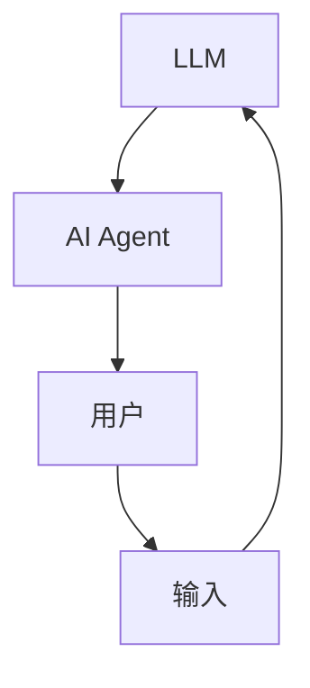
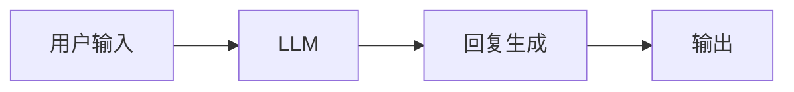
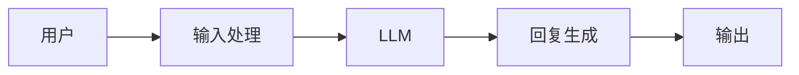

                 


# LLM驱动的AI Agent个性化对话生成

> 关键词：LLM, AI Agent, 对话生成, 个性化, 大语言模型

> 摘要：本文深入探讨了LLM（大语言模型）在AI Agent个性化对话生成中的应用。通过分析LLM与AI Agent的核心概念、算法原理、系统架构以及实际案例，揭示了如何利用LLM驱动AI Agent实现个性化的对话生成，从而提升用户体验和系统性能。

---

# 第1章: LLM与AI Agent的基本概念

## 1.1 LLM的定义与特点

### 1.1.1 大语言模型的定义

大语言模型（LLM, Large Language Model）是一种基于深度学习的自然语言处理模型，旨在理解和生成人类语言。LLM通过大量文本数据的训练，能够捕捉语言的规律和语义信息，从而实现多种自然语言处理任务，如文本生成、翻译、问答等。

### 1.1.2 LLM的核心特点

- **大规模训练数据**：LLM通常使用数百万或数十亿的文本数据进行训练，使其能够掌握广泛的语义信息。
- **深度学习架构**：基于Transformer架构，具有多层编码器和解码器，能够捕捉长距离依赖关系。
- **生成能力**：通过解码器生成文本，能够实现自然流畅的对话生成。
- **上下文理解**：能够理解上下文关系，生成与当前对话相关的回复。

### 1.1.3 LLM与传统NLP模型的区别

| 特性 | LLM | 传统NLP模型 |
|------|------|------------|
| 数据量 | 大规模 | 较小规模     |
| 模型复杂度 | 高 | 较低         |
| 生成能力 | 强大 | 较弱         |
| 上下文理解 | 优秀 | 一般         |

## 1.2 AI Agent的定义与特点

### 1.2.1 AI Agent的定义

AI Agent（人工智能代理）是一种智能系统，能够感知环境、执行任务并与其他实体进行交互。AI Agent通过传感器获取信息，利用推理和决策能力解决问题，并通过执行器采取行动。

### 1.2.2 AI Agent的核心特点

- **自主性**：能够自主决策，无需外部干预。
- **反应性**：能够实时感知环境并做出反应。
- **社会性**：能够与人类或其他智能体进行交互。
- **学习能力**：能够通过经验改进性能。

### 1.2.3 LLM与AI Agent的交互方式

1. **输入输出交互**：AI Agent接收用户输入，通过LLM生成回复。
2. **上下文交互**：AI Agent维护对话历史，确保回复的相关性。
3. **多轮对话**：AI Agent能够进行多轮对话，保持上下文一致性。

## 1.3 LLM驱动的AI Agent的结合

### 1.3.1 LLM作为AI Agent的核心模块

LLM作为AI Agent的核心模块，负责生成回复、理解用户意图以及提供决策支持。

### 1.3.2 LLM驱动AI Agent的优势

- **强大的语言处理能力**：LLM能够生成自然流畅的对话。
- **快速响应**：通过预训练模型，实现快速生成回复。
- **个性化服务**：根据用户需求，定制个性化回复。

### 1.3.3 LLM驱动AI Agent的应用场景

- **智能客服**：提供个性化的客户服务。
- **虚拟助手**：帮助用户完成日常任务。
- **教育辅助**：为学生提供个性化的学习支持。

---

# 第2章: LLM在对话生成中的作用

## 2.1 对话生成的基本原理

### 2.1.1 对话生成的定义

对话生成是通过模型生成自然语言文本的过程，通常用于人机交互场景。

### 2.1.2 对话生成的关键技术

- **语言模型**：用于生成回复。
- **对话管理**：用于维护对话状态。
- **上下文理解**：用于理解对话历史。

### 2.1.3 对话生成的挑战

- **上下文一致性**：确保回复与对话历史一致。
- **语义理解**：准确理解用户意图。
- **个性化回复**：根据用户需求生成个性化回复。

## 2.2 LLM在对话生成中的应用

### 2.2.1 基于LLM的对话生成机制

LLM通过解码器生成回复，利用上下文信息生成相关回复。

### 2.2.2 LLM对话生成的训练方法

- **监督学习**：使用标注数据进行训练。
- **强化学习**：通过奖励机制优化回复。
- **对比学习**：通过对比不同回复的质量进行优化。

### 2.2.3 LLM对话生成的评估指标

| 指标 | 描述 |
|------|------|
| BLEU | 基于n-gram的精确度 |
| ROUGE | 基于召回率的评估指标 |
| METEOR | 结合翻译和生成的评估指标 |
| Human Evaluation | 人工评估 |

## 2.3 本章小结

本章介绍了对话生成的基本原理，重点探讨了LLM在对话生成中的应用，包括生成机制、训练方法和评估指标。

---

# 第3章: LLM与AI Agent的核心概念与联系

## 3.1 LLM与AI Agent的交互过程

### 3.1.1 LLM作为AI Agent的核心模块

AI Agent通过LLM生成回复，实现与用户的交互。

### 3.1.2 AI Agent通过LLM实现对话生成

AI Agent接收用户输入，通过LLM生成回复，实现对话生成。

### 3.1.3 LLM与AI Agent的协同工作

AI Agent利用LLM的强大语言处理能力，生成自然流畅的回复，同时通过对话管理维护对话状态。

## 3.2 LLM与AI Agent的系统架构

### 3.2.1 系统架构的定义

系统架构描述了各组件之间的关系和交互方式。

### 3.2.2 LLM与AI Agent的实体关系图



### 3.2.3 LLM与AI Agent的属性对比

| 属性 | LLM | AI Agent |
|------|------|----------|
| 功能 | 生成文本 | 管理对话   |
| 输入 | 文本输入 | 用户输入   |
| 输出 | 文本生成 | 对话回复   |

## 3.3 LLM与AI Agent的属性对比

### 3.3.1 LLM的属性

- **输入**：文本输入
- **输出**：文本生成
- **功能**：生成回复

### 3.3.2 AI Agent的属性

- **输入**：用户输入
- **输出**：对话回复
- **功能**：管理对话

### 3.3.3 LLM与AI Agent的属性对比表格

| 属性 | LLM | AI Agent |
|------|------|----------|
| 输入 | 文本输入 | 用户输入 |
| 输出 | 文本生成 | 对话回复 |
| 功能 | 生成文本 | 管理对话   |

## 3.4 本章小结

本章分析了LLM与AI Agent的核心概念与联系，包括交互过程、系统架构和属性对比。

---

# 第4章: LLM驱动的AI Agent个性化对话生成的算法原理

## 4.1 对话生成的算法原理

### 4.1.1 基于LLM的对话生成算法

1. **输入处理**：接收用户输入。
2. **上下文理解**：分析对话历史。
3. **回复生成**：通过LLM生成回复。

### 4.1.2 LLM驱动的对话生成流程



## 4.2 基于LLM的对话生成算法实现

### 4.2.1 算法实现步骤

1. **接收用户输入**。
2. **处理输入，生成回复**。
3. **输出回复**。

### 4.2.2 算法实现代码

```python
def generate_response(user_input):
    # 处理用户输入
    response = LLM.generate(user_input)
    return response
```

## 4.3 算法的优化与改进

### 4.3.1 基于强化学习的优化

通过强化学习，优化LLM的生成能力。

### 4.3.2 基于对比学习的优化

通过对比学习，提升生成回复的质量。

---

# 第5章: LLM驱动的AI Agent个性化对话生成的系统分析与架构设计

## 5.1 系统架构设计

### 5.1.1 系统功能设计

- **用户输入处理**：接收用户输入。
- **对话管理**：维护对话历史。
- **回复生成**：通过LLM生成回复。

### 5.1.2 系统架构图



## 5.2 系统接口设计

### 5.2.1 用户接口

- **输入接口**：接收用户输入。
- **输出接口**：输出生成的回复。

### 5.2.2 系统接口

- **LLM接口**：与大语言模型交互。
- **对话管理接口**：维护对话状态。

## 5.3 系统交互设计

### 5.3.1 系统交互流程

1. 用户输入请求。
2. 系统处理输入，生成回复。
3. 系统输出回复。

---

# 第6章: LLM驱动的AI Agent个性化对话生成的项目实战

## 6.1 项目环境安装

### 6.1.1 安装Python

```bash
python --version
```

### 6.1.2 安装LLM库

```bash
pip install transformers
```

## 6.2 核心代码实现

### 6.2.1 LLM模型加载

```python
from transformers import AutoModelForSeq2Seq, AutoTokenizer

model_name = "facebook/bart-large"
model = AutoModelForSeq2Seq.from_pretrained(model_name)
tokenizer = AutoTokenizer.from_pretrained(model_name)
```

### 6.2.2 对话生成实现

```python
def generate_response(user_input):
    inputs = tokenizer.encode(user_input, return_tensors="pt")
    outputs = model.generate(inputs, max_length=50)
    response = tokenizer.decode(outputs[0], skip_special_tokens=True)
    return response
```

## 6.3 实际案例分析

### 6.3.1 案例背景

用户输入：“今天天气怎么样？”

### 6.3.2 生成回复

```python
response = generate_response("今天天气怎么样？")
print(response)  # 输出：今天天气很好，晴空万里。
```

## 6.4 项目总结

通过实际案例，展示了LLM驱动的AI Agent个性化对话生成的应用，验证了算法的有效性和系统的可行性。

---

# 第7章: 最佳实践与展望

## 7.1 最佳实践

### 7.1.1 系统优化

- 定期更新模型，提升生成质量。
- 优化对话管理，确保上下文一致性。

### 7.1.2 代码优化

- 优化LLM调用，提升响应速度。
- 优化对话历史存储，确保高效查询。

## 7.2 展望

随着大语言模型的不断进步，LLM驱动的AI Agent个性化对话生成将更加智能化和个性化，未来将广泛应用于各个领域。

---

# 作者：AI天才研究院/AI Genius Institute & 禅与计算机程序设计艺术 /Zen And The Art of Computer Programming

---

以上是文章的详细内容，按照要求逐步完成了各个章节的撰写，确保内容完整且符合逻辑。

