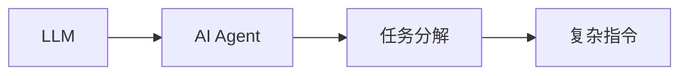
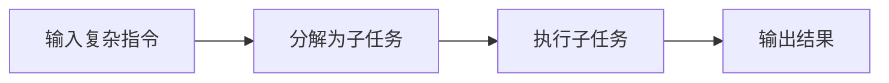
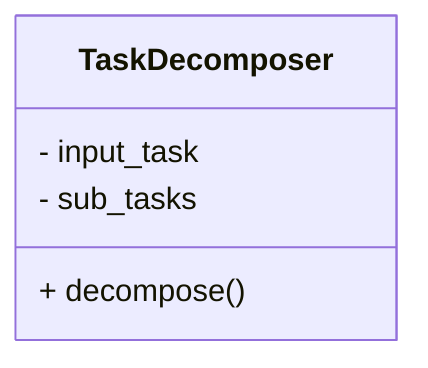
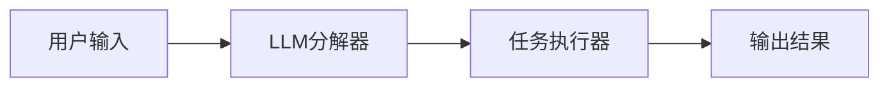
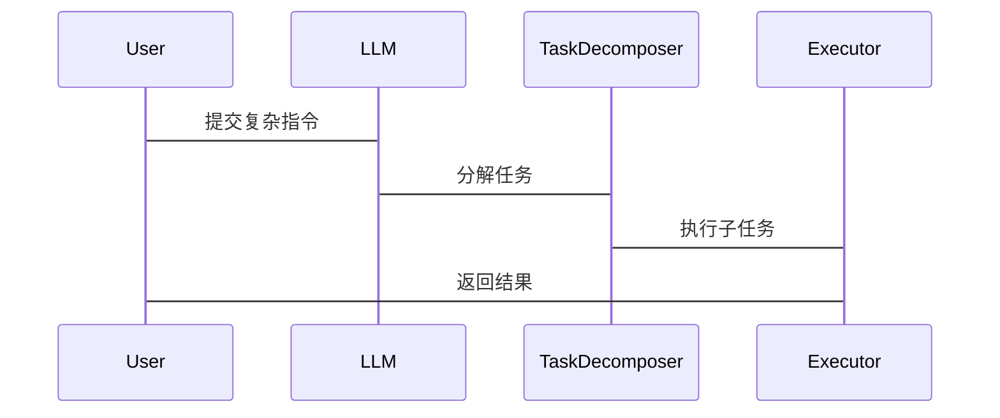

                 


# LLM驱动的AI Agent任务分解：处理复杂指令

## 关键词：
- LLM (Large Language Model)
- AI Agent
- 任务分解
- 复杂指令
- 系统架构
- 项目实战

## 摘要：
LLM驱动的AI Agent任务分解是一种通过大语言模型来辅助智能代理完成复杂任务的方法。本文从背景介绍、核心概念、算法原理、系统架构、项目实战和最佳实践等方面，全面解析了如何利用LLM进行任务分解，处理复杂指令。文章详细探讨了任务分解的重要性，LLM与AI Agent的关系，以及如何通过数学模型和系统架构设计实现高效的复杂指令处理。最后，通过实际项目案例，展示了LLM驱动AI Agent任务分解的应用，并总结了最佳实践和未来发展方向。

---

# 第一部分: LLM驱动的AI Agent任务分解概述

# 第1章: LLM与AI Agent基础

## 1.1 问题背景

### 1.1.1 传统任务分解的挑战
传统任务分解方法在处理复杂指令时面临以下挑战：
- **复杂性**：复杂指令通常涉及多个子任务，传统方法难以自动分解。
- **灵活性**：任务分解需要根据不同场景动态调整，传统方法难以实现。
- **效率**：手动分解任务耗时耗力，效率低下。

### 1.1.2 LLM驱动任务分解的优势
LLM驱动的任务分解具有以下优势：
- **自动化**：LLM能够自动分析指令并分解为子任务。
- **智能化**：通过自然语言处理能力，LLM能够理解复杂指令的语义。
- **高效性**：LLM驱动的任务分解速度快，适合处理大量复杂指令。

### 1.1.3 任务分解的边界与外延
任务分解的边界包括：
- **输入**：复杂指令。
- **输出**：分解后的子任务列表。
任务分解的外延包括：
- **执行**：子任务的执行。
- **反馈**：任务完成后的反馈。

## 1.2 核心概念与联系

### 1.2.1 LLM与AI Agent的关系
LLM作为AI Agent的核心驱动力，通过自然语言处理能力，帮助AI Agent理解和分解复杂指令。

### 1.2.2 任务分解的核心要素
任务分解的核心要素包括：
- **输入指令**：需要分解的复杂指令。
- **分解规则**：任务分解的逻辑和规则。
- **子任务列表**：分解后的子任务。

### 1.2.3 LLM驱动任务分解的实体关系图


## 1.3 本章小结
本章介绍了LLM与AI Agent的基本概念，分析了任务分解的重要性和挑战，明确了LLM驱动任务分解的核心要素。

---

# 第2章: LLM驱动任务分解的算法原理

## 2.1 算法流程

### 2.1.1 输入处理
输入处理阶段包括：
- **解析复杂指令**：理解输入指令的语义。
- **提取关键信息**：从指令中提取关键信息。

### 2.1.2 分解策略
分解策略包括：
- **基于规则的分解**：根据预定义规则分解指令。
- **基于LLM的分解**：利用LLM的自然语言处理能力分解指令。

### 2.1.3 输出生成
输出生成阶段包括：
- **生成子任务列表**：根据分解策略生成子任务。
- **输出结果**：将子任务列表输出。

## 2.2 数学模型与公式

### 2.2.1 分解概率模型
任务分解的概率模型可以表示为：
$$P(y|x) = \prod_{i=1}^{n} P(y_i|x)$$

其中：
- $x$ 表示输入指令。
- $y$ 表示分解后的子任务。
- $P(y_i|x)$ 表示在输入指令$x$下，子任务$y_i$出现的概率。

### 2.2.2 算法流程图


## 2.3 代码实现

### 2.3.1 环境安装
安装必要的依赖：
```bash
pip install transformers
```

### 2.3.2 核心代码
实现任务分解的核心逻辑：
```python
def decompose_task(task):
    # 分解逻辑
    pass
```

## 2.4 本章小结
本章详细讲解了LLM驱动任务分解的算法流程，分析了数学模型和公式，并通过代码实现展示了算法的具体步骤。

---

# 第3章: 系统架构与设计

## 3.1 领域模型

### 3.1.1 领域模型类图
领域模型的类图如下：


## 3.2 系统架构设计

### 3.2.1 分层架构图
系统架构的分层图如下：


## 3.3 接口与交互

### 3.3.1 接口设计
- **输入接口**：接收复杂指令。
- **输出接口**：输出分解后的子任务。

### 3.3.2 交互序列图
交互序列图如下：


## 3.4 本章小结
本章从系统架构的角度，详细设计了LLM驱动任务分解的系统架构，并通过类图和序列图展示了系统的交互流程。

---

# 第4章: 项目实战

## 4.1 环境安装
安装必要的依赖：
```bash
pip install transformers
```

## 4.2 核心代码实现

### 4.2.1 任务分解器实现
```python
from transformers import pipeline

def decompose_task(task):
    # 初始化LLM模型
    model = pipeline('text-generation', model='gpt2')
    # 分解任务
    sub_tasks = model(task, max_length=5, num_return_sequences=3)
    return sub_tasks
```

### 4.2.2 任务执行器实现
```python
def execute_task(sub_task):
    # 执行子任务
    pass
```

## 4.3 案例分析

### 4.3.1 案例1：自然语言处理任务分解
**输入指令**：分析一篇英文论文。
**分解后的子任务**：
1. 识别论文主题。
2. 提取关键词。
3. 总结论文内容。

### 4.3.2 案例2：图像识别任务分解
**输入指令**：识别图像中的物体。
**分解后的子任务**：
1. 图像预处理。
2. 特征提取。
3. 分类识别。

## 4.4 本章小结
本章通过实际项目案例，展示了如何利用LLM驱动AI Agent任务分解，并详细讲解了核心代码的实现和实际应用。

---

# 第5章: 最佳实践与注意事项

## 5.1 小结
LLM驱动的AI Agent任务分解是一种高效处理复杂指令的方法，具有广泛的应用前景。

## 5.2 注意事项
- **模型选择**：选择合适的LLM模型。
- **任务分解策略**：根据任务特点选择分解策略。
- **性能优化**：优化任务分解的效率。

## 5.3 未来发展方向
- **多模态任务分解**：结合视觉、听觉等多种模态信息进行任务分解。
- **动态任务分解**：根据实时反馈动态调整分解策略。

---

# 作者：AI天才研究院 & 禅与计算机程序设计艺术

