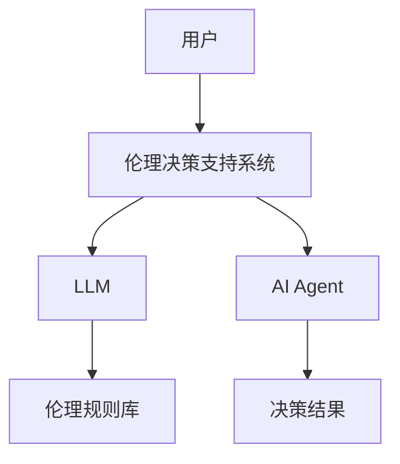
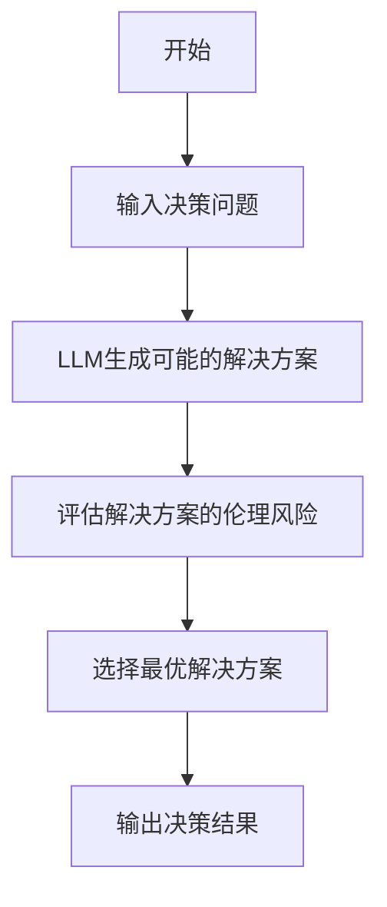
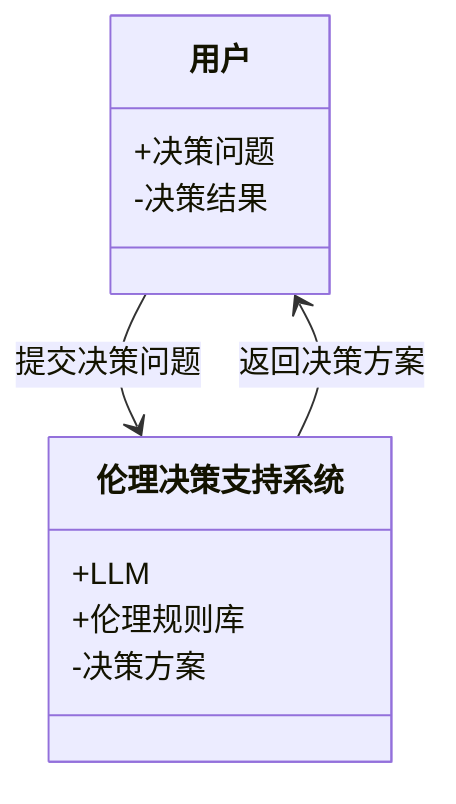
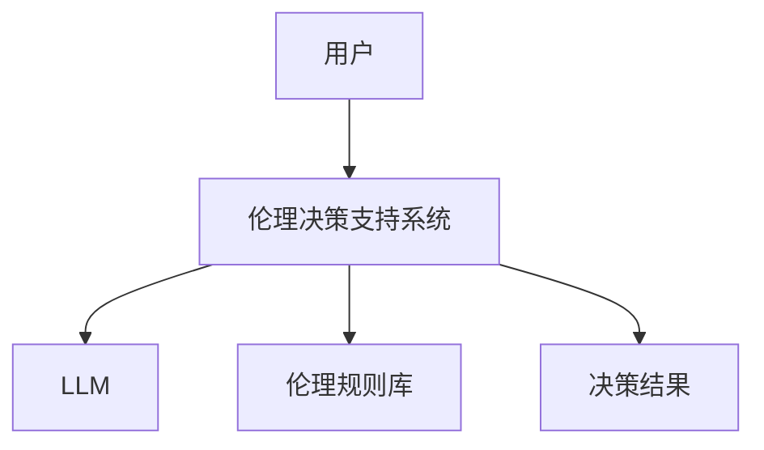
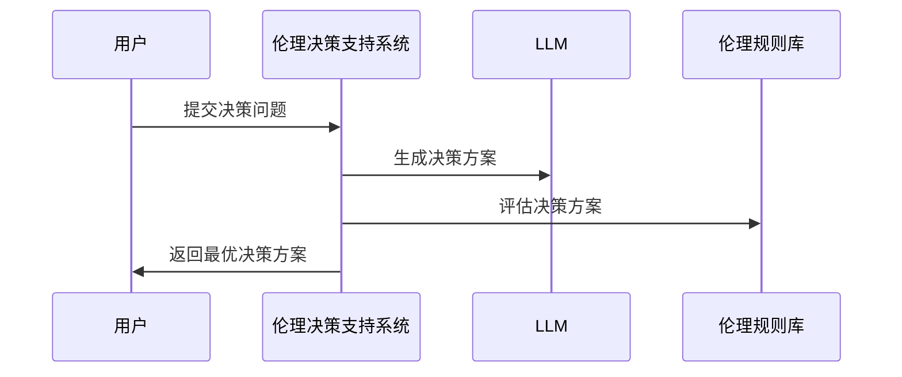

                 


# LLM驱动的AI Agent伦理决策支持系统

## 关键词：
- LLM (Large Language Model)
- AI Agent
- 伦理决策
- 系统架构
- 项目实战

## 摘要：
本文详细探讨了LLM驱动的AI Agent在伦理决策支持系统中的应用。文章首先介绍了伦理决策支持系统的基本概念和背景，然后分析了LLM在伦理决策中的作用，接着详细讲解了算法原理和系统架构设计。通过实际项目案例，展示了如何构建和实现这样的系统，并总结了最佳实践和未来发展方向。

---

## 第一部分：背景介绍

### 第1章：LLM驱动的AI Agent伦理决策支持系统概述

#### 1.1 问题背景
- **AI Agent的发展现状**：AI Agent（智能体）作为计算机科学中的重要概念，广泛应用于自动驾驶、智能助手、机器人等领域。随着技术的进步，AI Agent需要在复杂环境中做出决策，尤其是在涉及伦理问题时，传统的基于规则的决策系统显得力不从心。
- **LLM技术的崛起与应用**：大语言模型（LLM）如GPT-3、GPT-4等在自然语言处理领域取得了突破性进展，能够理解和生成人类语言，并在多个领域展现出强大的能力。将LLM应用于AI Agent的决策过程中，可以显著提升决策的灵活性和复杂性。
- **伦理决策在AI系统中的重要性**：AI系统在做出决策时，可能面临复杂的伦理问题，例如自动驾驶中的紧急情况决策、医疗AI的诊断建议等。如何在这些场景中做出符合伦理的决策，是当前AI研究的重要方向。

#### 1.2 问题描述
- **AI Agent决策中的伦理挑战**：AI Agent在复杂环境中需要考虑多种因素，例如利益最大化、风险最小化等，但这些决策可能引发伦理争议。例如，自动驾驶在紧急情况下可能需要在保护乘客和保护路人之间做出权衡。
- **LLM在伦理决策中的潜在问题**：虽然LLM能够生成多种决策方案，但其输出可能受到训练数据的限制，存在偏见或不符合伦理规范的情况。此外，LLM的决策过程往往缺乏透明性，使得用户难以理解决策的依据。
- **伦理决策支持系统的必要性**：为了确保AI Agent的决策符合伦理规范，需要一个专门的支持系统，通过LLM的能力生成多种决策方案，并通过伦理规则进行筛选和优化。

#### 1.3 问题解决
- **LLM驱动的伦理决策支持系统的解决方案**：通过将LLM与伦理规则库结合，AI Agent可以在决策过程中生成多种符合伦理的方案，并通过动态调整规则权重，选择最优的决策方案。
- **系统的目标与核心功能**：系统的目标是辅助AI Agent在复杂环境中做出符合伦理的决策。核心功能包括伦理规则生成、决策方案评估、伦理风险预警等。
- **系统的边界与外延**：系统的边界包括AI Agent的决策范围和适用场景，外延则涉及伦理决策支持系统的优化和扩展，例如与其他AI系统的集成。

#### 1.4 核心概念与联系
- **核心概念原理**：伦理决策支持系统通过LLM生成决策方案，并结合伦理规则库对方案进行评估和优化。AI Agent作为决策主体，利用系统提供的支持做出最终决策。
- **核心概念属性特征对比**：以下是伦理决策支持系统、LLM、AI Agent的核心属性对比：

| 概念       | 描述                                                                 |
|------------|----------------------------------------------------------------------|
| 伦理决策支持系统 | 通过LLM和伦理规则库辅助AI Agent做出符合伦理的决策。                     |
| LLM        | 基于大规模数据训练的自然语言模型，能够生成多种决策方案。                   |
| AI Agent    | 具备自主决策能力的智能体，利用伦理决策支持系统优化决策过程。               |

- **ER实体关系图**：以下是伦理决策支持系统的核心实体关系图（使用Mermaid流程图）：



---

## 第二部分：核心概念与联系

### 第2章：伦理决策支持系统的原理与架构

#### 2.1 核心概念原理
- **LLM在伦理决策中的作用**：LLM通过生成多种可能的决策方案，为AI Agent提供丰富的选择。这些方案需要经过伦理规则库的筛选和优化，确保符合伦理规范。
- **AI Agent的决策过程**：AI Agent根据当前环境和任务需求，调用伦理决策支持系统生成决策方案，并结合实时反馈调整决策策略。
- **伦理规则的编码与应用**：伦理规则库中的规则需要以结构化的方式存储，例如通过IF-THEN规则或概率模型。这些规则用于评估和优化LLM生成的决策方案。

#### 2.2 核心概念属性特征对比表格
以下是伦理决策支持系统、LLM、AI Agent的属性对比：

| 概念       | 描述                                                                 |
|------------|----------------------------------------------------------------------|
| 伦理决策支持系统 | 通过LLM和伦理规则库辅助AI Agent做出符合伦理的决策。                     |
| LLM        | 基于大规模数据训练的自然语言模型，能够生成多种决策方案。                   |
| AI Agent    | 具备自主决策能力的智能体，利用伦理决策支持系统优化决策过程。               |

#### 2.3 ER实体关系图（Mermaid流程图）
以下是伦理决策支持系统的核心实体关系图：


---

## 第三部分：算法原理讲解

### 第3章：LLM驱动的伦理决策算法

#### 3.1 算法原理
- **基于LLM的伦理推理模型**：模型通过LLM生成多个可能的决策方案，然后利用伦理规则库对这些方案进行评估和优化。评估过程包括对决策方案的伦理风险、社会影响等因素的分析。
- **决策树算法在伦理选择中的应用**：决策树是一种常用的分类算法，可以将伦理决策问题分解为多个子问题，通过构建决策树来优化决策过程。例如，在自动驾驶的紧急决策中，决策树可以帮助AI Agent在保护乘客和保护路人之间做出权衡。
- **基于概率的伦理决策模型**：通过概率模型评估不同决策方案的伦理风险，选择概率最小的方案。例如，利用贝叶斯网络对决策方案进行概率分析。

#### 3.2 算法流程图（Mermaid）
以下是基于LLM的伦理决策算法流程图：



#### 3.3 算法数学模型
以下是一个简单的基于概率的伦理决策模型示例：

$$ P(决策方案) = \prod_{i=1}^{n} P(伦理规则_i) $$

其中，$P(伦理规则_i)$表示第i个伦理规则的概率。

---

## 第四部分：系统分析与架构设计

### 第4章：LLM驱动的伦理决策支持系统架构

#### 4.1 问题场景介绍
- **问题场景**：AI Agent需要在复杂环境中做出决策，例如自动驾驶中的紧急情况处理、医疗AI的诊断建议等。

#### 4.2 系统功能设计
- **功能需求**：包括伦理规则生成、决策方案评估、伦理风险预警等。
- **领域模型**：以下是领域模型的Mermaid类图：



#### 4.3 系统架构设计
- **系统架构图**：以下是系统架构的Mermaid架构图：



#### 4.4 系统接口设计
- **接口描述**：用户通过API向伦理决策支持系统提交决策问题，系统返回最优的决策方案。
- **交互流程图**：以下是系统交互的Mermaid序列图：



---

## 第五部分：项目实战

### 第5章：LLM驱动的伦理决策支持系统实现

#### 5.1 环境安装
- **依赖项**：Python 3.8+, PyTorch, Hugging Face库（如transformers）。

#### 5.2 核心代码实现
以下是伦理决策支持系统的Python实现示例：

```python
from transformers import GPT2LMHeadModel, GPT2Tokenizer

class EthicalDecisionSupportSystem:
    def __init__(self, model_name="gpt2"):
        self.model = GPT2LMHeadModel.from_pretrained(model_name)
        self.tokenizer = GPT2Tokenizer.from_pretrained(model_name)
        self.ethical_rules = []  # 存储伦理规则

    def add_ethical_rule(self, rule):
        self.ethical_rules.append(rule)

    def generate_decision_options(self, problem):
        inputs = self.tokenizer(problem, return_tensors="np")
        outputs = self.model.generate(inputs.input_ids, max_length=50)
        return self.tokenizer.decode(outputs[0], skip_special_tokens=True)

    def evaluate_ethical_risk(self, decision_option):
        # 简单的评估方法，可根据具体伦理规则进行扩展
        risk_score = 0
        for rule in self.ethical_rules:
            if rule in decision_option:
                risk_score += 1
        return risk_score

    def get_optimal_decision(self, decision_options):
        optimal_decision = None
        min_risk = float('inf')
        for option in decision_options:
            risk = self.evaluate_ethical_risk(option)
            if risk < min_risk:
                min_risk = risk
                optimal_decision = option
        return optimal_decision
```

#### 5.3 项目实战：自动驾驶伦理决策系统
- **案例分析**：在自动驾驶中，AI Agent需要在紧急情况下做出决策。假设发生车祸，AI Agent需要在保护乘客和保护路人之间做出权衡。
- **系统实现**：通过伦理决策支持系统生成多个决策方案，并评估每个方案的伦理风险，选择最优的方案。

#### 5.4 实际案例分析
- **案例描述**：自动驾驶在紧急情况下需要做出决策，例如撞车或转向，导致不同的伤亡结果。
- **系统决策过程**：
  1. 用户输入决策问题。
  2. LLM生成多个决策方案。
  3. 伦理规则库评估每个方案的伦理风险。
  4. 系统选择最优的决策方案并输出。

#### 5.5 项目小结
- **实现过程中的挑战**：如何确保LLM生成的决策方案符合伦理规范，以及如何动态调整伦理规则的权重。
- **解决方法**：通过引入更多的伦理规则和优化评估算法，提升系统的伦理决策能力。

---

## 第六部分：最佳实践

### 第6章：伦理决策支持系统的最佳实践

#### 6.1 小结
- **系统优势**：通过结合LLM和伦理规则库，伦理决策支持系统能够辅助AI Agent在复杂环境中做出符合伦理的决策。
- **系统局限性**：当前系统仍存在一些局限性，例如伦理规则的动态调整和LLM的透明性问题。

#### 6.2 注意事项
- **数据隐私与安全**：在处理用户的决策问题时，需要确保数据的隐私和安全。
- **伦理规则的动态调整**：根据实际情况动态调整伦理规则的权重，确保系统能够适应不同的场景。

#### 6.3 拓展阅读
- **相关书籍**：《The Ethics of AI》、《机器学习中的伦理问题》。
- **相关论文**：搜索Google Scholar上关于LLM和伦理决策的相关论文。

---

## 作者

作者：AI天才研究院/AI Genius Institute & 禅与计算机程序设计艺术 /Zen And The Art of Computer Programming

---

# 结语

通过本文的详细讲解，我们了解了LLM驱动的AI Agent伦理决策支持系统的原理、架构和实现方法。未来，随着AI技术的不断发展，伦理决策支持系统将在更多领域发挥重要作用。

