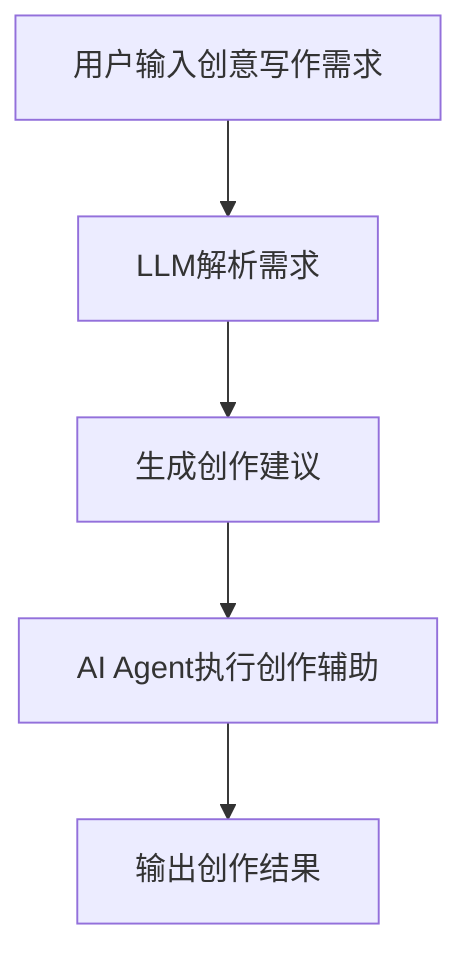
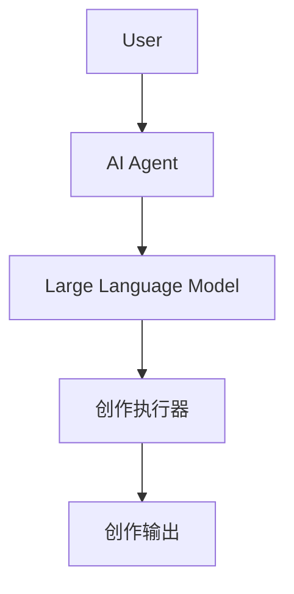

                 


# LLM驱动的AI Agent创意写作助手

> 关键词：LLM, AI Agent, 创意写作, 人工智能, 语言模型  
> 摘要：本文探讨了如何利用大语言模型（LLM）驱动的AI Agent作为创意写作的辅助工具，分析其工作原理、系统架构，并通过实例展示其实现过程，最后提出最佳实践建议。

---

## 第一部分: LLM驱动的AI Agent创意写作助手背景介绍

### 第1章: 创意写作的痛点与LLM的潜力

#### 1.1 创意写作的痛点与挑战
- 创意写作需要灵感和逻辑，但创作者常面临灵感枯竭、思路受阻等问题。
- 创作过程涉及大量重复性工作，如大纲规划、语言润色等，效率低下。
- 创作者需要不断学习新知识和技能，以提升作品质量。

#### 1.2 LLM在创意写作中的应用潜力
- LLM具备强大的文本生成和理解能力，可辅助创作者完成灵感激发、内容扩展等任务。
- 通过自然语言处理技术，LLM能够识别上下文并提供针对性建议。
- LLM支持多语言创作，拓展创作者的创作范围。

#### 1.3 AI Agent在创作辅助中的角色定位
- AI Agent作为用户的智能助手，负责协调LLM与创作工具，实现自动化创作流程。
- AI Agent可根据用户需求，实时调整创作策略，优化创作结果。

---

## 第2章: LLM与AI Agent的核心概念与联系

### 2.1 核心概念原理

#### 2.1.1 LLM的基本原理
- LLM基于Transformer架构，通过自注意力机制捕捉上下文信息。
- 生成文本时，模型根据输入序列预测下一个词，逐步构建完整句子。

#### 2.1.2 AI Agent的核心机制
- AI Agent接收用户指令后，分解任务，调用LLM生成相关内容。
- 通过状态管理模块，AI Agent实时跟踪创作进度，动态调整创作策略。

#### 2.1.3 创意写作的辅助模式
- 灵感激发：AI Agent提供创作主题相关的灵感和思路。
- 内容生成：LLM根据用户输入生成具体段落或场景描述。
- 后期优化：AI Agent协助润色语言，调整故事节奏。

### 2.2 核心概念对比表
| 概念 | 特性 | 描述 |
|------|------|------|
| LLM | 模型能力 | 大语言模型的生成与理解能力 |
| AI Agent | 行为模式 | 基于LLM的智能决策与执行 |

### 2.3 ER实体关系图
```mermaid
er
actor: User
agent: AI Agent
llm: Large Language Model
document: 创意写作内容
rule: 创作规则
action: 操作行为
```

---

## 第三部分: LLM驱动的AI Agent算法原理

### 第3章: LLM驱动AI Agent的算法原理

#### 3.1 算法流程图


#### 3.2 算法实现代码
```python
def llm_agent_assistant(prompt):
    # LLM解析需求
    response = llm.generate_response(prompt)
    # 生成创作建议
    suggestions = parse_response(response)
    # AI Agent执行创作辅助
    action = select_action(suggestions)
    # 输出创作结果
    return execute_action(action)
```

#### 3.3 数学模型与公式
- LLM的文本生成基于概率模型，常用交叉熵损失函数优化：
  $$ \text{Loss} = -\sum_{i=1}^{n} \log P(w_i|w_{<i}) $$
- 自注意力机制的计算公式为：
  $$ \text{Attention}(Q, K, V) = \text{softmax}\left(\frac{QK^T}{\sqrt{d_k}}\right)V $$

---

## 第四部分: 系统分析与架构设计

### 第4章: 系统架构设计

#### 4.1 项目背景与目标
- 项目目标：构建一个基于LLM的AI Agent，辅助用户完成创意写作任务。
- 项目背景：随着AI技术的发展，自动化创作工具的需求日益增长。

#### 4.2 系统功能设计
- 灵感激发模块：提供创作主题相关的灵感和思路。
- 内容生成模块：根据用户输入生成具体段落或场景描述。
- 后期优化模块：协助润色语言，调整故事节奏。

#### 4.3 系统架构图


---

## 第五部分: 项目实战

### 第5章: 项目实战

#### 5.1 环境安装
- 安装Python和相关库（如Hugging Face Transformers库）。
- 配置LLM模型（如GPT-3）的API密钥。

#### 5.2 核心代码实现
```python
from transformers import GPT2LMHeadModel, GPT2Tokenizer

# 初始化模型和分词器
tokenizer = GPT2Tokenizer.from_pretrained('gpt2')
model = GPT2LMHeadModel.from_pretrained('gpt2')

# 定义创作辅助函数
def create_content(prompt):
    inputs = tokenizer.encode(prompt, return_tensors='np')
    outputs = model.generate(inputs, max_length=500, temperature=0.7)
    return tokenizer.decode(outputs[0], skip_special_tokens=True)
```

#### 5.3 实际案例分析
- 案例：用户输入“创作一个科幻小说的开头”，AI Agent生成灵感建议并完成创作。
- 分析：LLM生成文本后，AI Agent根据反馈调整创作策略，优化创作结果。

---

## 第六部分: 最佳实践与小结

### 第6章: 最佳实践与小结

#### 6.1 最佳实践
- 定期更新模型参数，保持创作助手的性能。
- 根据创作需求调整模型超参数（如温度、重复率）。
- 结合多模态数据（如图像、音频）丰富创作内容。

#### 6.2 小结
- 本文详细探讨了LLM驱动的AI Agent在创意写作中的应用。
- 通过算法实现和系统设计，展示了如何构建高效的创作辅助工具。
- 展望：未来，LLM与AI Agent的结合将推动创意写作进入新的高度。

---

## 注意事项
- 本文所述方法需结合实际创作需求进行调整。
- 创作者应根据自身风格选择合适的创作策略。

## 拓展阅读
- 《生成式人工智能：原理与应用》
- 《大语言模型的文本生成技术》
- 《AI Agent在创作领域的应用》

---

作者：AI天才研究院/AI Genius Institute & 禅与计算机程序设计艺术 /Zen And The Art of Computer Programming

