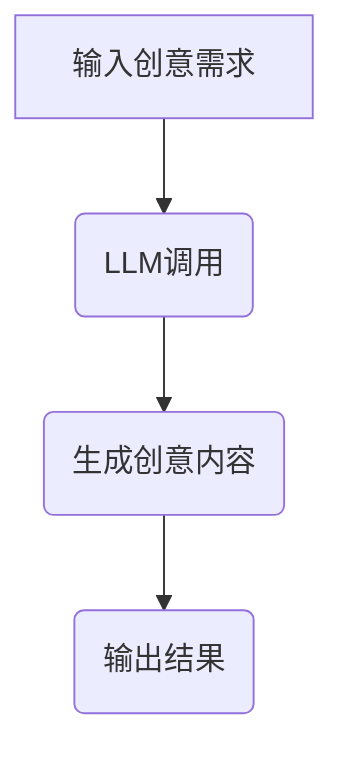
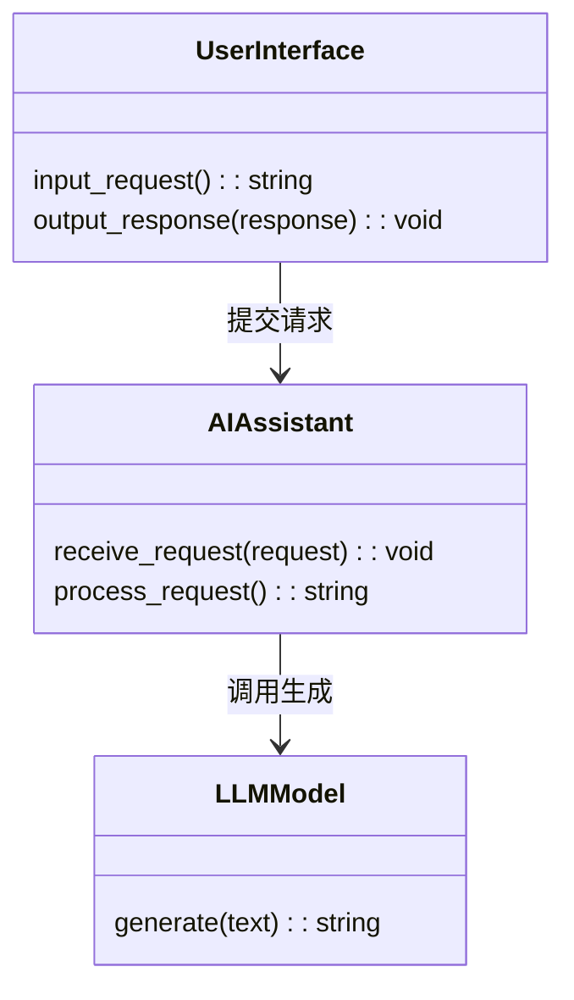
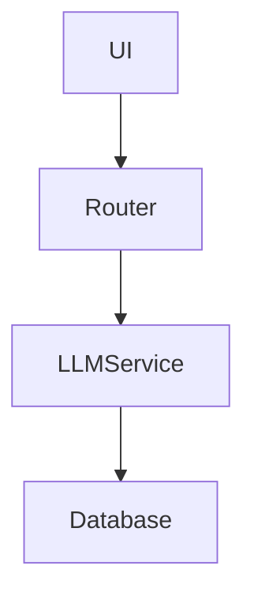
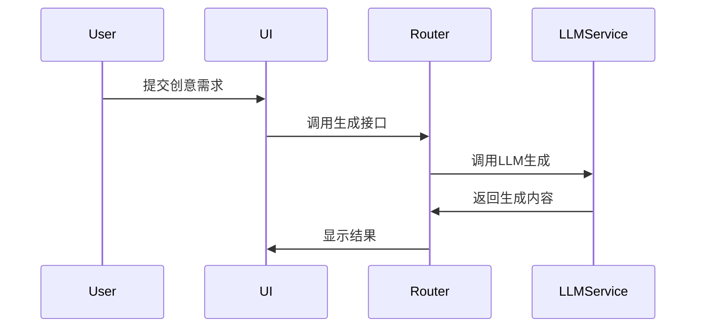

                 


# LLM驱动的AI Agent创意生成系统

> **关键词**: 大语言模型 (LLM), AI Agent, 创意生成, 人工智能, 系统架构, 算法原理

> **摘要**: 本文系统地探讨了如何利用大语言模型 (LLM) 驱动 AI Agent 来实现创意生成。文章首先介绍了 LLM 和 AI Agent 的基本概念及其结合的背景，随后分析了 LLM 和 AI Agent 的核心原理，详细讲解了 LLM 驱动 AI Agent 的算法原理，提出了系统架构设计方案，并通过实际案例展示了项目的实现过程。最后，文章总结了最佳实践和未来发展方向。

---

## 第一章: LLM驱动的AI Agent背景与概念

### 1.1 LLM与AI Agent的基本概念

#### 1.1.1 大语言模型 (LLM) 的定义
大语言模型（LLM, Large Language Model）是一种基于深度学习的自然语言处理模型，通常基于Transformer架构，通过大量文本数据进行预训练，能够理解和生成人类语言。LLM 的核心在于其强大的语言生成能力和上下文理解能力，广泛应用于文本生成、对话系统、机器翻译等领域。

#### 1.1.2 AI Agent 的核心概念
AI Agent（人工智能代理）是一种智能体，能够感知环境、执行任务并做出决策。AI Agent 可以是软件程序，也可以是硬件设备，其核心在于通过感知和行动与环境交互，完成特定目标。AI Agent 可以分为简单反射型、基于模型的反应型、目标驱动型和效用驱动型等。

#### 1.1.3 LLM与AI Agent的结合
将 LLM 集成到 AI Agent 中，使得 AI Agent 具备强大的语言理解和生成能力。LLM 作为 AI Agent 的“大脑”，负责处理输入信息、生成输出指令，并通过不断学习和优化提升创意生成的效果。

### 1.2 问题背景与问题描述

#### 1.2.1 创意生成的挑战
创意生成是一个复杂的过程，需要结合知识、经验、逻辑推理和情感表达。传统的 AI 技术在创意生成方面存在局限性，难以真正理解人类的创意过程。

#### 1.2.2 LLM在创意生成中的优势
LLM 拥有海量的数据训练和强大的生成能力，能够生成多样化、高质量的创意内容。LLM 的语言生成能力为 AI Agent 提供了强大的工具，使其能够辅助人类完成创意任务。

#### 1.2.3 AI Agent在创意生成中的角色
AI Agent 作为 LLM 的载体，负责接收用户的输入、调用 LLM 进行创意生成，并将结果反馈给用户。AI Agent 还能够通过学习用户的偏好，优化生成内容，提升用户体验。

### 1.3 问题解决与边界

#### 1.3.1 创意生成的实现路径
通过 LLM 驱动的 AI Agent，用户可以输入创意需求，系统根据需求生成创意内容。生成的内容可以是文本、图像、音乐等多种形式。

#### 1.3.2 LLM驱动AI Agent的边界
LLM 驱动的 AI Agent 的边界包括输入输出格式、生成内容的类型、系统性能的限制等。需要明确系统的功能边界，避免超出能力范围。

#### 1.3.3 系统的外延与应用范围
系统的外延包括与其他系统的集成、数据接口的扩展等。应用范围涵盖创意设计、内容生成、辅助决策等多个领域。

### 1.4 概念结构与核心要素

#### 1.4.1 LLM驱动AI Agent的系统架构
系统架构包括输入模块、LLM 调用模块、创意生成模块、输出模块等。各模块协同工作，完成创意生成任务。

#### 1.4.2 核心要素的组成与关系
核心要素包括 LLM 模型、AI Agent 的行为逻辑、用户输入输出接口、生成内容的存储与管理等。各要素相互关联，共同实现创意生成的目标。

#### 1.4.3 系统的输入输出流程
输入包括用户的创意需求，输出包括生成的创意内容。输入输出流程需要清晰，确保系统高效运行。

## 第二章: LLM与AI Agent的核心原理

### 2.1 LLM的核心原理

#### 2.1.1 大语言模型的训练机制
LLM 通过监督学习和无监督学习相结合的方式进行训练，模型参数通过反向传播优化，以最小化预测误差。

#### 2.1.2 概率生成模型的数学基础
LLM 的生成过程基于概率分布，通过计算每个词的条件概率，生成最可能的序列。数学模型涉及概率论、优化理论等。

#### 2.1.3 模型的可解释性与局限性
LLM 的可解释性较差，生成的内容可能存在逻辑错误或不符合常识。模型的局限性包括对未见数据的处理能力不足等。

### 2.2 AI Agent的核心原理

#### 2.2.1 AI Agent的行为决策机制
AI Agent 通过感知环境、分析任务目标，选择最优行为路径。行为决策基于知识库和推理逻辑。

#### 2.2.2 知识表示与推理逻辑
AI Agent 通过知识图谱、规则库等方式表示知识，并通过逻辑推理得出结论。

#### 2.2.3 Agent与环境的交互模式
AI Agent 与环境的交互包括输入感知、输出行动，以及与外部系统的数据交换。

### 2.3 LLM与AI Agent的联系

#### 2.3.1 LLM作为AI Agent的智能核心
LLM 为 AI Agent 提供强大的语言理解和生成能力，是 AI Agent 的智能核心。

#### 2.3.2 LLM驱动的创意生成过程
通过 LLM 的生成能力，AI Agent 可以辅助用户完成创意任务，如写作、设计、策划等。

#### 2.3.3 系统的整体架构与协作
系统架构包括 LLM 模型、AI Agent 的行为逻辑、用户输入输出接口等，各部分协作完成创意生成任务。

### 2.4 核心概念对比与特征分析

#### 2.4.1 LLM与传统NLP模型的对比
| 特性          | LLM                  | 传统NLP模型          |
|---------------|----------------------|----------------------|
| 模型规模       | 大                   | 小                   |
| 训练数据       | 海量                 | 较少                 |
| 生成能力       | 强                   | 弱                   |
| 应用场景       | 多样化               | 有限                 |

#### 2.4.2 AI Agent与传统AI系统的对比
| 特性          | AI Agent             | 传统AI系统           |
|---------------|----------------------|----------------------|
| 交互能力       | 强                   | 弱                   |
| 自主性         | 高                   | 中                   |
| 环境适应性     | 强                   | 弱                   |

#### 2.4.3 LLM驱动AI Agent的独特性
LLM 驱动的 AI Agent 结合了大语言模型的生成能力和 AI Agent 的自主决策能力，能够实现复杂的创意生成任务。

### 2.5 ER实体关系图
```mermaid
erd
    entity LLM {
        id
        模型参数
        训练数据
    }
    entity AI Agent {
        id
        行为逻辑
        知识库
    }
    entity 创意生成 {
        id
        内容
        用户需求
    }
    LLM -- 训练数据: 输入
    AI Agent -- 行为逻辑: 决策
    创意生成 -- 用户需求: 输入
    创意生成 -- LLM: 生成内容
    AI Agent -- 创意生成: 执行
```

---

## 第三章: LLM驱动的AI Agent算法原理

### 3.1 算法流程图


### 3.2 算法实现代码
```python
def generate_creative_idea(llm_model, user_input):
    # 调用LLM模型生成创意内容
    response = llm_model.generate(user_input)
    return response.text
```

### 3.3 算法的数学模型
$$ P(\text{output} | \text{input}) = \frac{\exp(-E)}{\sum_{i} \exp(-E_i)} $$
其中，E 是模型的损失值，E_i 是其他可能的损失值。

### 3.4 算法的优化与改进
通过调整模型参数、优化训练数据、引入反馈机制等方式，提升算法的生成效果和效率。

---

## 第四章: 系统分析与架构设计

### 4.1 系统功能设计

#### 4.1.1 领域模型类图


#### 4.1.2 系统架构图


#### 4.1.3 接口设计与交互流程图


---

## 第五章: 项目实战

### 5.1 环境安装与配置
安装必要的依赖，如Python、LLM库等。

### 5.2 核心代码实现
```python
import llm_model

class AIAssistant:
    def __init__(self, llm):
        self.llm = llm

    def generate_idea(self, prompt):
        return self.llm.generate(prompt)
```

### 5.3 案例分析与实现
通过具体案例展示如何利用 LLM 驱动的 AI Agent 完成创意生成任务。

---

## 第六章: 最佳实践

### 6.1 小结
总结全文的核心内容和关键点。

### 6.2 注意事项
提醒读者在实际应用中需要注意的问题。

### 6.3 拓展阅读
推荐相关领域的书籍和资源，供读者进一步学习。

---

## 作者：AI天才研究院/AI Genius Institute & 禅与计算机程序设计艺术 /Zen And The Art of Computer Programming

---

通过以上内容，我们可以看到，LLM驱动的AI Agent创意生成系统是一个复杂的系统工程，涉及多个方面的技术细节和实现步骤。通过系统化的分析和实践，我们可以更好地理解和应用这一技术，为创意生成领域带来新的可能性。

