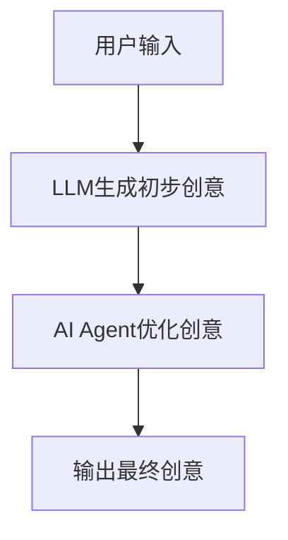
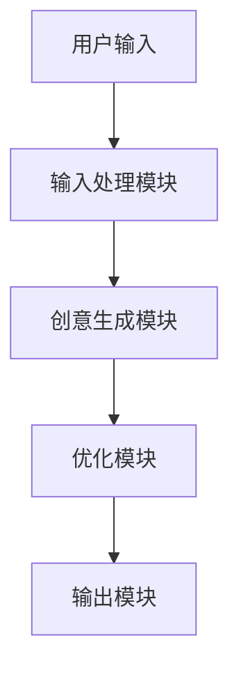
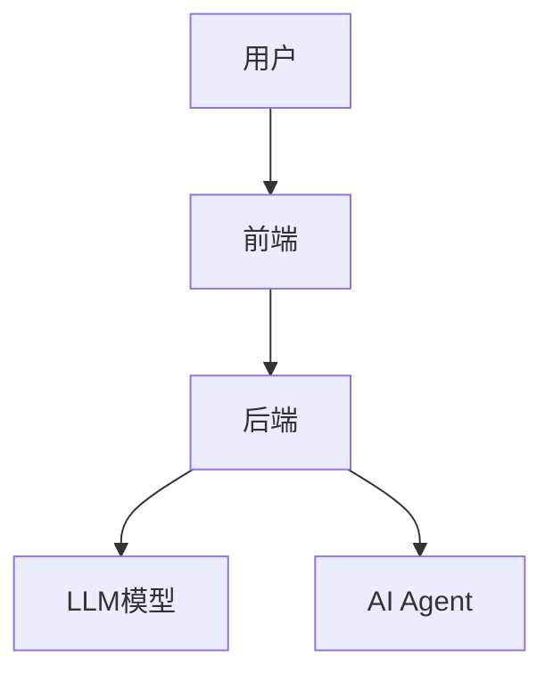
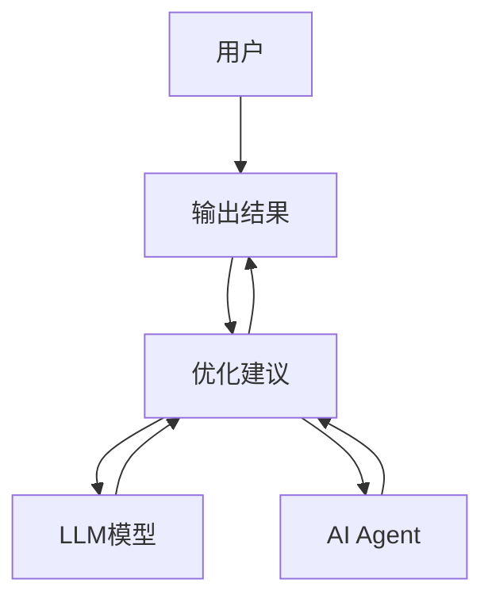

                 


# LLM驱动的AI Agent创意生成：突破思维局限

> 关键词：LLM、AI Agent、创意生成、自然语言处理、人工智能、模型驱动

> 摘要：本文探讨了如何利用大语言模型（LLM）驱动AI代理（AI Agent）进行创意生成。通过分析LLM与AI Agent的核心概念、算法原理、系统架构及实际应用案例，本文旨在揭示LLM在创意生成中的独特优势，并提供构建基于LLM的AI Agent的详细指导。通过对比分析、算法详解和项目实战，本文为读者提供了一个全面理解LLM驱动AI Agent创意生成的框架。

---

# 第一部分: LLM驱动的AI Agent创意生成概述

## 第1章: LLM与AI Agent概述

### 1.1 LLM的基本概念与原理

#### 1.1.1 大语言模型的定义与特点
大语言模型（LLM, Large Language Model）是一种基于深度学习的自然语言处理模型，通常基于Transformer架构，通过大量数据训练而成。LLM的特点包括：
- **大规模训练数据**：通常使用 billions of parameters，能够捕捉语言的复杂性。
- **上下文理解**：通过自注意力机制，模型可以理解上下文关系。
- **生成能力**：能够生成自然流畅的文本，适用于多种任务，如翻译、问答、摘要、创意写作等。

#### 1.1.2 LLM的核心技术与实现原理
LLM的核心技术包括：
- **Transformer架构**：由Vaswani等人提出，包含编码器和解码器，通过自注意力机制捕捉文本中的关系。
- **自注意力机制**：通过计算词与词之间的关系，生成位置-aware的表示。
- **训练目标**：通常采用自回归的方式，预测下一个词的概率分布。

#### 1.1.3 LLM的应用场景与优势
LLM广泛应用于：
- **文本生成**：创意写作、内容生成。
- **对话系统**：智能客服、虚拟助手。
- **代码生成**：生成代码片段或完整的程序。
- **多语言支持**：支持多种语言的翻译和生成。

### 1.2 AI Agent的基本概念与类型

#### 1.2.1 AI Agent的定义与分类
AI Agent是一种智能体，能够感知环境、自主决策并执行任务。AI Agent可以分为：
- **简单反射式Agent**：基于当前状态和动作规则进行决策。
- **基于模型的反射式Agent**：维护环境模型，能够推理和规划。
- **目标驱动的Agent**：基于目标进行决策和行动。
- **学习驱动的Agent**：通过经验改进性能。

#### 1.2.2 AI Agent的核心功能与特点
AI Agent的核心功能包括：
- **感知**：通过传感器或接口获取环境信息。
- **推理**：基于感知信息进行逻辑推理。
- **决策**：根据推理结果选择最优动作。
- **执行**：通过执行机构完成任务。

#### 1.2.3 AI Agent与传统软件的区别
AI Agent与传统软件的区别在于：
- **自主性**：能够自主决策，而非完全依赖于用户输入。
- **适应性**：能够根据环境变化调整行为。
- **学习能力**：能够通过经验改进性能。

### 1.3 LLM驱动的AI Agent创意生成的背景与意义

#### 1.3.1 创意生成的定义与挑战
创意生成是指通过计算机程序生成创新性、独特性的内容，如文学作品、广告文案、产品设计等。创意生成的挑战包括：
- **多样性**：生成的内容需要多样化，避免重复。
- **创新性**：内容需要具有创新性，超越已有作品。
- **可控制性**：用户需要能够控制生成的内容方向。

#### 1.3.2 LLM在创意生成中的作用
LLM在创意生成中的作用包括：
- **提供丰富的语言模型**：能够生成多种风格和主题的内容。
- **支持多模态创作**：结合视觉、听觉等模态信息，丰富创作形式。
- **实时反馈与优化**：根据用户反馈实时调整生成内容。

#### 1.3.3 创意生成的边界与外延
创意生成的边界包括：
- **生成内容的版权问题**：生成内容的版权归属需要明确。
- **内容的可验证性**：生成内容的真实性和可信度需要验证。
- **伦理问题**：避免生成有害或不适当的内容。

### 1.4 本章小结
本章介绍了LLM和AI Agent的基本概念、核心原理和应用场景，分析了LLM驱动的AI Agent在创意生成中的优势和挑战。下一章将深入探讨LLM与AI Agent的核心概念与联系。

---

## 第2章: LLM与AI Agent的核心概念

### 2.1 LLM的核心概念与原理

#### 2.1.1 LLM的训练过程与模型结构
LLM的训练过程包括：
1. **数据预处理**：清洗数据、分词、构建词表。
2. **模型初始化**：初始化Transformer模型的权重。
3. **损失函数计算**：使用交叉熵损失函数计算预测值与真实值的差异。
4. **反向传播与优化**：通过反向传播更新模型参数，优化损失函数。

#### 2.1.2 LLM的输入输出机制与生成原理
LLM的输入输出机制包括：
- **输入**：文本序列，如“故事的开头是...”。
- **输出**：生成的文本序列，如“一个阳光明媚的早晨，...”。

生成原理基于自回归策略，模型逐步预测下一个词，生成完整的文本序列。

#### 2.1.3 LLM的注意力机制与上下文理解
注意力机制通过计算输入序列中每个词的重要性，生成位置-aware的表示。公式如下：

$$
\text{Attention}(Q, K, V) = \text{softmax}\left(\frac{QK^T}{\sqrt{d_k}}\right)V
$$

其中，$Q$、$K$、$V$分别是查询、键、值向量，$d_k$是键的维度。

### 2.2 AI Agent的核心概念与功能

#### 2.2.1 AI Agent的目标设定与决策机制
AI Agent的目标设定包括：
- **明确目标**：如“帮助用户完成任务”。
- **模糊目标**：如“提供创意建议”。

决策机制包括：
- **规则驱动**：基于预定义的规则进行决策。
- **模型驱动**：基于机器学习模型进行决策。

#### 2.2.2 AI Agent的感知与交互能力
AI Agent的感知能力包括：
- **文本理解**：通过NLP技术理解用户输入。
- **多模态感知**：结合视觉、听觉等信息。

交互能力包括：
- **自然语言对话**：与用户进行流畅的对话。
- **多轮交互**：支持连续的上下文交互。

#### 2.2.3 AI Agent的自主学习与进化能力
AI Agent的自主学习能力包括：
- **在线学习**：在运行中更新模型。
- **离线学习**：利用历史数据进行批量训练。

### 2.3 LLM与AI Agent的结合与协同

#### 2.3.1 LLM作为AI Agent的核心驱动力
LLM作为AI Agent的核心驱动力，能够提供强大的语言理解和生成能力。例如，AI Agent可以通过LLM生成创意文案，通过LLM进行多语言对话。

#### 2.3.2 LLM与AI Agent的协同工作流程
协同工作流程包括：
1. **目标设定**：AI Agent设定创意生成的目标。
2. **输入处理**：LLM处理用户的输入，生成初步创意。
3. **反馈优化**：AI Agent根据用户反馈优化生成内容。
4. **输出结果**：输出最终的创意生成结果。

#### 2.3.3 LLM与AI Agent的系统架构与交互模式
系统架构包括：
- **前端**：用户与AI Agent交互的界面。
- **后端**：LLM模型和AI Agent的逻辑处理部分。

交互模式包括：
- **单向交互**：用户输入，AI Agent生成输出。
- **双向交互**：用户与AI Agent进行多轮对话。

### 2.4 核心概念对比分析

#### 2.4.1 LLM与传统NLP模型的对比
| 特性       | LLM                     | 传统NLP模型         |
|------------|--------------------------|---------------------|
| 模型规模     | 大型或超大型（ billions） | 小型或中型           |
| 训练数据量   | 巨量数据                 | 较小数据             |
| 任务能力     | 多任务通用               | 专用任务             |

#### 2.4.2 AI Agent与传统自动程序的对比
| 特性       | AI Agent                  | 传统自动程序         |
|------------|---------------------------|---------------------|
| 自主性       | 高度自主                 | 无自主性             |
| 学习能力     | 具备学习能力             | 无学习能力           |
| 适应性       | 能够适应环境变化         | 无法适应环境变化       |

#### 2.4.3 LLM驱动的AI Agent与人类协作的对比
| 特性       | LLM驱动的AI Agent        | 人类协作             |
|------------|--------------------------|---------------------|
| 效率         | 高效                     | 较低                 |
| 创新性       | 可能性高                 | 取决于团队能力       |
| 可扩展性     | 易扩展                   | 较难扩展             |

### 2.5 本章小结
本章分析了LLM与AI Agent的核心概念与联系，探讨了它们的协同工作流程和系统架构。下一章将深入讲解LLM驱动的AI Agent的算法原理与数学模型。

---

## 第3章: LLM的算法原理与数学模型

### 3.1 LLM的训练过程与算法框架

#### 3.1.1 基于Transformer的模型结构
Transformer模型由编码器和解码器组成，编码器用于理解输入序列，解码器用于生成输出序列。编码器和解码器均包含多个Transformer层。

#### 3.1.2 自注意力机制的数学公式
自注意力机制的计算公式为：

$$
\text{Attention}(Q, K, V) = \text{softmax}\left(\frac{QK^T}{\sqrt{d_k}}\right)V
$$

其中，$Q$、$K$、$V$分别是查询、键、值向量，$d_k$是键的维度。

#### 3.1.3 梯度下降与优化
常用的优化方法包括Adam优化器，其更新公式为：

$$
\theta = \theta - \eta \nabla_\theta \mathcal{L}
$$

其中，$\eta$是学习率，$\nabla_\theta \mathcal{L}$是损失函数对参数的梯度。

### 3.2 AI Agent的算法原理与数学模型

#### 3.2.1 AI Agent的决策算法
常用决策算法包括：
- **Q-learning**：通过经验回放和策略评估优化动作价值。
- **Policy Gradient**：直接优化策略的参数，最大化预期奖励。

#### 3.2.2 AI Agent的感知与交互算法
感知算法包括：
- **文本理解**：使用预训练的LLM模型进行文本分析。
- **多模态融合**：结合视觉、听觉等多种模态信息。

交互算法包括：
- **对话生成**：基于生成式模型生成回复。
- **意图识别**：通过NLP技术识别用户的意图。

### 3.3 LLM与AI Agent的协同算法

#### 3.3.1 LLM驱动的创意生成算法
创意生成算法包括：
- **序列生成**：逐步生成文本序列。
- **多样性控制**：通过温度参数或核化技术控制生成的多样性。

#### 3.3.2 AI Agent的自适应优化算法
自适应优化算法包括：
- **在线学习**：实时更新模型参数。
- **经验回放**：存储历史交互数据，优化决策策略。

### 3.4 算法流程图（Mermaid）



### 3.5 本章小结
本章详细讲解了LLM和AI Agent的算法原理与数学模型，分析了它们的协同工作流程。下一章将介绍系统的分析与架构设计方案。

---

## 第4章: 系统分析与架构设计方案

### 4.1 问题场景介绍

#### 4.1.1 项目背景
本项目旨在构建一个基于LLM的AI Agent系统，用于创意生成。

#### 4.1.2 项目目标
- 实现创意生成功能。
- 提供用户友好的交互界面。
- 支持多模态信息的处理。

### 4.2 项目介绍

#### 4.2.1 项目名称
LLM驱动的AI Agent创意生成系统。

#### 4.2.2 项目核心功能
- 文本生成。
- 多模态创作。
- 用户反馈优化。

### 4.3 系统功能设计

#### 4.3.1 功能模块划分
系统功能模块包括：
- **输入处理模块**：接收用户输入。
- **创意生成模块**：基于LLM生成创意内容。
- **优化模块**：根据用户反馈优化生成内容。
- **输出模块**：输出最终创意内容。

#### 4.3.2 功能模块交互流程
功能模块交互流程如下：



### 4.4 系统架构设计

#### 4.4.1 系统架构图（Mermaid）



#### 4.4.2 关键模块说明
- **前端**：用户与系统的交互界面。
- **后端**：处理用户请求，调用LLM和AI Agent模块。
- **LLM模型**：负责生成创意内容。
- **AI Agent**：负责优化生成内容。

### 4.5 接口设计

#### 4.5.1 API接口定义
- **输入接口**：`POST /generate`
- **输出接口**：`GET /result`

#### 4.5.2 数据格式
- 输入格式：JSON格式。
- 输出格式：JSON格式。

### 4.6 系统交互设计

#### 4.6.1 交互流程图（Mermaid）



### 4.7 本章小结
本章分析了系统的功能需求和架构设计，介绍了接口设计和交互流程。下一章将通过项目实战，详细讲解系统的实现过程。

---

## 第5章: 项目实战

### 5.1 环境安装

#### 5.1.1 安装Python
```bash
python --version
# 输出：Python 3.8.5
```

#### 5.1.2 安装依赖库
```bash
pip install torch transformers
```

### 5.2 系统核心实现源代码

#### 5.2.1 LLM模型实现
```python
import torch
from transformers import AutoTokenizer, AutoModelForCausalLM

class LLMGenerator:
    def __init__(self, model_name):
        self.tokenizer = AutoTokenizer.from_pretrained(model_name)
        self.model = AutoModelForCausalLM.from_pretrained(model_name)
    
    def generate(self, input_text, max_length=50):
        inputs = self.tokenizer(input_text, return_tensors="pt")
        outputs = self.model.generate(**inputs, max_length=max_length)
        return self.tokenizer.decode(outputs[0], skip_special_tokens=True)
```

#### 5.2.2 AI Agent实现
```python
class AIAssistant:
    def __init__(self):
        self.llm = LLMGenerator("gpt2")
    
    def generate_creative_idea(self, prompt):
        return self.llm.generate(prompt)
    
    def optimize(self, content, feedback):
        # 简单的优化逻辑，可根据具体需求实现
        return content + " " + feedback
```

### 5.3 代码应用解读与分析

#### 5.3.1 核心代码解读
- `LLMGenerator`类实现了基于预训练模型的文本生成功能。
- `AIAssistant`类通过调用LLM模型生成创意内容，并根据用户反馈优化生成结果。

#### 5.3.2 代码功能分析
- `generate`方法：根据输入生成文本。
- `optimize`方法：根据用户反馈优化生成内容。

### 5.4 实际案例分析与详细讲解

#### 5.4.1 案例背景
用户输入：“写一篇关于未来科技的文章。”

#### 5.4.2 系统处理流程
1. **输入处理模块**：接收用户输入。
2. **创意生成模块**：生成初步创意内容。
3. **优化模块**：根据用户反馈优化内容。
4. **输出模块**：输出最终创意内容。

#### 5.4.3 代码实现细节
```python
assistant = AIAssistant()
creative_idea = assistant.generate_creative_idea("未来科技的发展趋势")
optimized_idea = assistant.optimize(creative_idea, "未来科技")
print(optimized_idea)
```

### 5.5 项目小结
本章通过实际案例展示了基于LLM的AI Agent系统的实现过程，详细讲解了核心代码的功能和应用。下一章将总结项目经验，提供最佳实践建议。

---

## 第6章: 最佳实践与总结

### 6.1 项目经验总结

#### 6.1.1 成功经验
- **模型选择**：选择适合任务的LLM模型。
- **系统设计**：合理设计系统架构，确保系统的可扩展性和可维护性。
- **用户反馈**：及时收集用户反馈，优化生成内容。

#### 6.1.2 常见问题
- **生成内容的质量不稳定**：需要优化模型或增加约束条件。
- **系统性能瓶颈**：需要优化代码和选择合适的硬件。

### 6.2 小结与注意事项

#### 6.2.1 小结
本项目展示了如何利用LLM驱动AI Agent进行创意生成，提供了系统的实现方法和最佳实践建议。

#### 6.2.2 注意事项
- **版权问题**：生成内容的版权归属需要明确。
- **伦理问题**：避免生成有害或不适当的内容。
- **性能优化**：根据需求优化系统的性能。

### 6.3 拓展阅读与深入学习

#### 6.3.1 拓展阅读
- **推荐书籍**：《深度学习》（Deep Learning, Ian Goodfellow等著）
- **推荐论文**：《Attention Is All You Need》
- **推荐工具**：Hugging Face的Transformers库。

#### 6.3.2 深入学习方向
- **多模态生成**：结合视觉、听觉等模态信息进行创意生成。
- **强化学习**：通过强化学习优化AI Agent的决策策略。
- **实时生成**：实现低延迟的实时创意生成。

### 6.4 本章小结
本章总结了项目的成功经验与注意事项，提供了拓展阅读和深入学习的方向。希望读者能够通过本文系统地理解LLM驱动的AI Agent创意生成的实现与应用。

---

# 作者：AI天才研究院/AI Genius Institute & 禅与计算机程序设计艺术 /Zen And The Art of Computer Programming

