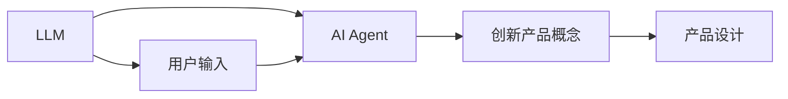
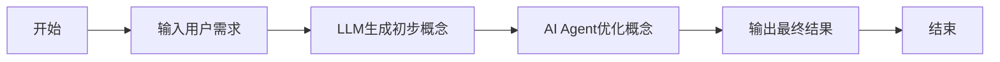
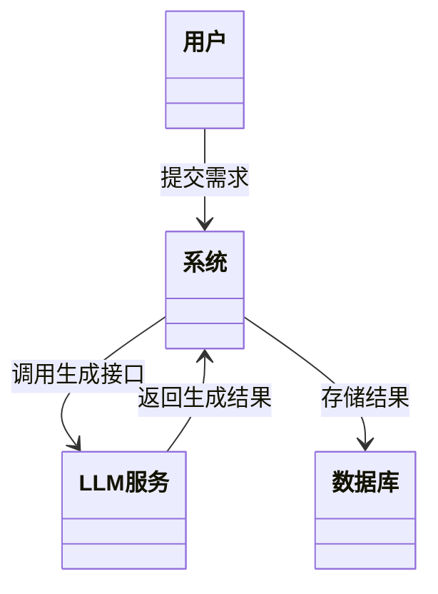
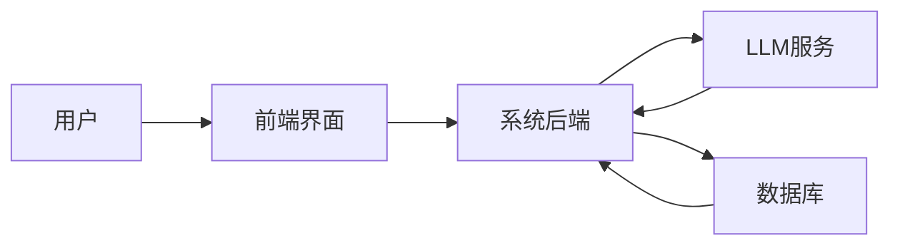
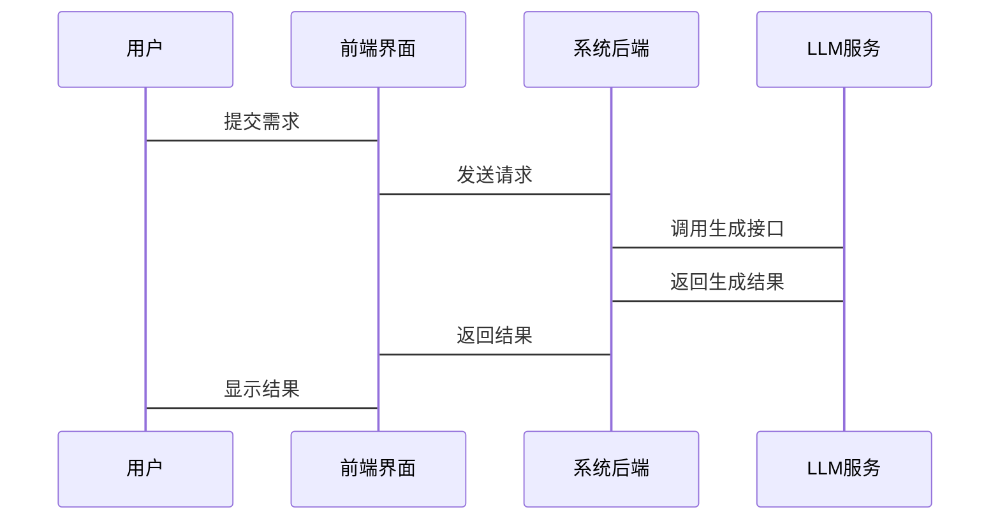

                 


# LLM驱动的AI Agent创新产品概念生成器

> 关键词：LLM、AI Agent、创新产品概念、生成器、人工智能、机器学习

> 摘要：本文探讨了如何利用大语言模型（LLM）驱动的AI Agent来生成创新产品概念。通过分析LLM与AI Agent的结合，详细阐述了其算法原理、系统架构、项目实战及最佳实践，为读者提供了从理论到实践的全面指南。

---

# 第一部分: LLM驱动的AI Agent创新产品概念生成器背景介绍

## 第1章: LLM驱动的AI Agent概述

### 1.1 问题背景

#### 1.1.1 当前AI技术的发展现状
人工智能（AI）技术近年来取得了显著进展，特别是在大语言模型（LLM）领域。LLM如GPT-3、GPT-4和PaLM等模型，通过海量数据的训练，具备了强大的自然语言处理能力。这些模型能够生成高质量的文本、回答复杂问题，并在多个领域展现出接近人类的水平。

#### 1.1.2 LLM技术的崛起与应用
随着计算能力的提升和算法的优化，LLM的应用范围不断扩大。LLM不仅在文本生成、机器翻译等方面表现出色，还在问答系统、对话生成、内容创作等领域展现了巨大潜力。LLM的崛起为AI Agent的发展提供了强大的技术支持。

#### 1.1.3 AI Agent的概念与特点
AI Agent是一种能够感知环境、执行任务并做出决策的智能体。它通过与用户或环境的交互，完成特定目标。AI Agent的特点包括自主性、反应性、目标导向性和社交能力。与传统自动化工具相比，AI Agent更注重动态环境中的实时响应和问题解决。

### 1.2 问题描述

#### 1.2.1 创新产品概念生成的挑战
创新产品概念的生成需要结合市场趋势、用户需求和技术创新。传统方法依赖人工调研和经验判断，效率低且难以捕捉新兴趋势。如何利用AI技术快速生成创新产品概念成为一个重要挑战。

#### 1.2.2 LLM在AI Agent中的作用
LLM能够理解和生成自然语言，具备强大的文本处理能力。将其与AI Agent结合，可以实现更智能的产品概念生成。LLM为AI Agent提供了强大的语言理解和生成能力，使其能够更好地理解用户需求并生成创新方案。

#### 1.2.3 当前市场对LLM驱动AI Agent的需求
随着市场竞争的加剧，企业对快速生成创新产品概念的需求日益迫切。LLM驱动的AI Agent能够帮助企业在短时间内生成高质量的产品概念，降低研发成本，提高效率。

### 1.3 问题解决

#### 1.3.1 LLM驱动AI Agent的核心优势
- **高效性**：LLM能够快速生成大量文本，显著提高产品概念生成的效率。
- **创新性**：通过结合LLM的创意生成能力，AI Agent能够产生更具创新性的产品概念。
- **适应性**：AI Agent能够根据实时反馈和市场变化动态调整产品概念。

#### 1.3.2 创新产品概念生成的关键步骤
1. **需求分析**：理解用户需求和市场趋势。
2. **概念生成**：利用LLM生成多个产品概念。
3. **优化与筛选**：根据反馈优化概念并筛选出最佳方案。
4. **方案实施**：将最终概念转化为具体产品方案。

#### 1.3.3 技术实现的可行性分析
LLM驱动的AI Agent技术实现是可行的，主要得益于近年来LLM技术的快速发展和计算能力的提升。然而，实现过程中需要考虑数据隐私、模型调优和用户体验等问题。

### 1.4 边界与外延

#### 1.4.1 LLM驱动AI Agent的适用场景
LLM驱动的AI Agent适用于需要文本生成、创意设计和问题解决的领域，如产品设计、市场营销和客户服务等。

#### 1.4.2 技术边界与限制
- **数据质量**：生成结果依赖于训练数据的质量和多样性。
- **模型能力**：模型的生成能力受限于其训练数据和参数量。
- **计算资源**：LLM的运行需要大量计算资源，限制了其在资源受限环境中的应用。

#### 1.4.3 与其他AI技术的对比
- **传统NLP模型**：传统NLP模型专注于特定任务，缺乏通用性和灵活性。
- **AI Agent**：传统AI Agent依赖规则和预定义逻辑，灵活性较低。
- **LLM驱动AI Agent**：结合了LLM的强大语言能力和AI Agent的自主性，具备更高的灵活性和创新性。

### 1.5 概念结构与核心要素

#### 1.5.1 LLM驱动AI Agent的核心要素
1. **LLM模型**：提供强大的语言生成能力。
2. **AI Agent架构**：实现自主决策和任务执行。
3. **用户交互界面**：方便用户与AI Agent的互动。
4. **数据源**：提供生成所需的数据支持。

#### 1.5.2 创新产品概念生成的逻辑框架
1. **输入需求**：用户输入需求或问题。
2. **生成概念**：AI Agent利用LLM生成多个产品概念。
3. **优化与筛选**：根据反馈优化概念并筛选出最佳方案。
4. **输出结果**：生成最终的产品概念或设计方案。

#### 1.5.3 系统架构的关键组成部分
- **前端界面**：用户输入需求和查看生成结果。
- **后端逻辑**：处理用户输入并调用LLM生成概念。
- **LLM服务**：提供语言生成服务。
- **数据存储**：存储生成的概念和用户反馈。

### 1.6 本章小结

本章介绍了LLM驱动的AI Agent及其在创新产品概念生成中的应用。通过分析问题背景、技术优势和实现可行性，明确了LLM驱动AI Agent的核心要素和系统架构。为后续章节的深入探讨奠定了基础。

---

## 第2章: LLM与AI Agent的核心概念与联系

### 2.1 核心概念原理

#### 2.1.1 LLM的基本原理
LLM通过大量数据的预训练，掌握了语言的结构和语义。在生成文本时，模型根据输入的上下文，预测下一个词或句子，生成符合逻辑的文本。

#### 2.1.2 AI Agent的基本原理
AI Agent通过感知环境、理解任务目标，执行一系列动作以达到目标。它能够自主决策，适应环境变化。

#### 2.1.3 LLM驱动AI Agent的结合方式
LLM为AI Agent提供了强大的语言理解和生成能力。AI Agent利用LLM生成文本、理解用户需求，并结合自身逻辑进行决策和执行。

### 2.2 核心概念对比

#### 2.2.1 LLM与传统NLP模型的对比
| 特性 | LLM | 传统NLP模型 |
|------|------|-------------|
| 数据需求 | 需要海量数据 | 需要特定领域数据 |
| 模型复杂度 | 参数量大，结构复杂 | 参数量小，结构简单 |
| 生成能力 | 具备强大的文本生成能力 | 生成能力有限 |

#### 2.2.2 AI Agent与传统任务自动化工具的对比
| 特性 | AI Agent | 传统自动化工具 |
|------|-----------|----------------|
| 自主性 | 高 | 低 |
| 反应性 | 高 | 低 |
| 目标导向性 | 高 | 低 |
| 适应性 | 高 | 低 |

#### 2.2.3 LLM驱动AI Agent的独特性
LLM驱动的AI Agent结合了LLM的强大语言能力和AI Agent的自主决策能力，能够进行复杂的问题解决和创新性的产品概念生成。

### 2.3 实体关系图（ER图）



### 2.4 本章小结

本章详细分析了LLM和AI Agent的核心概念及其联系。通过对比和ER图的绘制，明确了LLM驱动AI Agent的独特性和系统架构。

---

## 第3章: LLM驱动的AI Agent的算法原理

### 3.1 算法原理概述

#### 3.1.1 LLM的基本算法流程
LLM的基本算法流程包括预训练和微调两个阶段。预训练阶段，模型通过大量的无监督学习任务（如语言模型任务）进行预训练。微调阶段，模型根据具体任务进行有监督微调。

#### 3.1.2 AI Agent的任务分解
AI Agent的任务分解包括目标识别、环境感知、决策制定和任务执行四个步骤。

#### 3.1.3 LLM驱动AI Agent的协同机制
LLM驱动的AI Agent通过协同机制，实现语言生成和任务执行的无缝结合。AI Agent利用LLM生成文本，同时结合自身逻辑进行决策和执行。

### 3.2 算法流程图



### 3.3 算法实现细节

#### 3.3.1 LLM的数学模型
LLM的核心数学模型是基于Transformer架构的自注意力机制。模型通过计算输入序列中每个词与其他词的相关性，生成预测词。

#### 3.3.2 AI Agent的决策逻辑
AI Agent的决策逻辑基于状态空间和动作空间的分析。通过评估不同动作的收益，选择最优动作以达到目标。

#### 3.3.3 协同机制的实现
协同机制通过接口调用实现。AI Agent调用LLM的生成接口，获取生成结果，并结合自身逻辑进行优化。

### 3.4 本章小结

本章详细讲解了LLM驱动的AI Agent的算法原理，包括模型流程、任务分解和协同机制。通过算法流程图和数学模型的分析，为后续章节的系统设计奠定了基础。

---

## 第4章: LLM驱动的AI Agent系统分析与架构设计

### 4.1 系统分析

#### 4.1.1 问题场景介绍
假设我们正在设计一个创新产品概念生成系统，用户可以通过输入需求，快速获得多个创新的产品概念。

#### 4.1.2 项目介绍
本项目旨在利用LLM驱动的AI Agent，生成创新产品概念。系统将提供用户友好的界面，方便用户输入需求并查看生成结果。

### 4.2 系统功能设计

#### 4.2.1 领域模型


#### 4.2.2 系统架构设计


#### 4.2.3 接口设计
- 用户输入接口：用于提交需求。
- 生成结果接口：返回生成的产品概念。
- 数据存储接口：存储生成结果和用户反馈。

#### 4.2.4 交互流程


### 4.3 本章小结

本章通过系统分析和架构设计，明确了创新产品概念生成系统的实现方案。通过领域模型、系统架构图和交互流程图的绘制，为系统的开发提供了指导。

---

## 第5章: LLM驱动的AI Agent项目实战

### 5.1 环境安装

#### 5.1.1 安装Python
```bash
# 安装Python
sudo apt-get install python3
```

#### 5.1.2 安装LLM库
```bash
pip install transformers
pip install torch
```

#### 5.1.3 安装其他依赖
```bash
pip install flask
pip install requests
```

### 5.2 系统核心实现源代码

#### 5.2.1 LLM服务接口
```python
from transformers import pipeline

# 初始化生成器
generator = pipeline('text-generation', model='gpt2')

def generate_concept(prompt):
    result = generator(prompt, max_length=50, num_return_sequences=3)
    return [r['generated_text'] for r in result]
```

#### 5.2.2 系统后端接口
```python
from flask import Flask, request, jsonify

app = Flask(__name__)

@app.route('/generate', methods=['POST'])
def generate():
    data = request.json
    prompt = data['prompt']
    concepts = generate_concept(prompt)
    return jsonify({'concepts': concepts})

if __name__ == '__main__':
    app.run(debug=True)
```

#### 5.2.3 用户界面实现
```html
<!DOCTYPE html>
<html>
<head>
    <title>创新产品概念生成器</title>
</head>
<body>
    <h1>创新产品概念生成器</h1>
    <form id="form" onsubmit="generateConcept(event)">
        <input type="text" id="prompt" placeholder="请输入需求...">
        <button type="submit">生成概念</button>
    </form>
    <div id="result"></div>

    <script>
        function generateConcept(event) {
            event.preventDefault();
            const prompt = document.getElementById('prompt').value;
            fetch('/generate', {
                method: 'POST',
                headers: {
                    'Content-Type': 'application/json',
                },
                body: JSON.stringify({ prompt: prompt })
            })
            .then(response => response.json())
            .then(data => {
                document.getElementById('result').innerHTML = '<h3>生成结果:</h3>' + 
                data.concepts.map(concept => `<p>${concept}</p>`).join('');
            });
        }
    </script>
</body>
</html>
```

### 5.3 案例分析与实际应用

#### 5.3.1 案例分析
假设用户输入需求为“智能手表”，系统将生成多个创新产品概念，如“健康监测智能手表”、“运动追踪智能手表”等。

#### 5.3.2 代码实现解读
- **LLM服务接口**：负责生成产品概念。
- **系统后端接口**：处理用户请求并调用LLM生成结果。
- **用户界面**：提供用户输入和结果显示界面。

#### 5.3.3 优化与改进
- **数据多样性**：通过引入更多样化的数据，提高生成概念的质量。
- **用户反馈机制**：根据用户反馈优化生成算法。
- **性能优化**：通过并行计算和缓存机制提高系统性能。

### 5.4 本章小结

本章通过项目实战，详细讲解了LLM驱动AI Agent的实现过程。从环境安装到代码实现，再到案例分析，为读者提供了完整的实践指南。

---

## 第6章: LLM驱动的AI Agent最佳实践与注意事项

### 6.1 最佳实践

#### 6.1.1 数据质量
确保训练数据的质量和多样性，避免生成低质量或不相关的内容。

#### 6.1.2 模型调优
根据具体任务需求，对LLM进行微调和优化，提高生成效果。

#### 6.1.3 用户体验
设计用户友好的界面，确保用户能够方便地使用系统。

### 6.2 注意事项

#### 6.2.1 数据隐私
在处理用户数据时，需注意数据隐私和安全，避免数据泄露。

#### 6.2.2 计算资源
LLM的运行需要大量计算资源，需确保服务器的性能和稳定性。

#### 6.2.3 模型鲁棒性
通过测试和优化，提高模型的鲁棒性，确保系统在各种场景下都能稳定运行。

### 6.3 拓展阅读

#### 6.3.1 LLM的前沿技术
阅读最新的学术论文和技术报告，了解LLM领域的最新进展。

#### 6.3.2 AI Agent的应用案例
研究其他领域的AI Agent应用案例，借鉴其成功经验。

### 6.4 本章小结

本章总结了LLM驱动AI Agent的最佳实践和注意事项，为读者提供了实际应用中的宝贵经验。

---

## 第7章: 总结与展望

### 7.1 总结

本文详细探讨了LLM驱动的AI Agent在创新产品概念生成中的应用。从背景介绍到系统设计，再到项目实战，全面分析了技术实现的各个方面。通过理论分析和实践案例，为读者提供了系统的知识体系。

### 7.2 展望

随着AI技术的不断发展，LLM驱动的AI Agent将在更多领域展现出强大的应用潜力。未来的研究方向包括优化模型性能、提升用户体验和扩展应用场景。我们期待LLM驱动的AI Agent在创新产品概念生成领域取得更多突破。

---

# 作者：AI天才研究院/AI Genius Institute & 禅与计算机程序设计艺术 /Zen And The Art of Computer Programming

