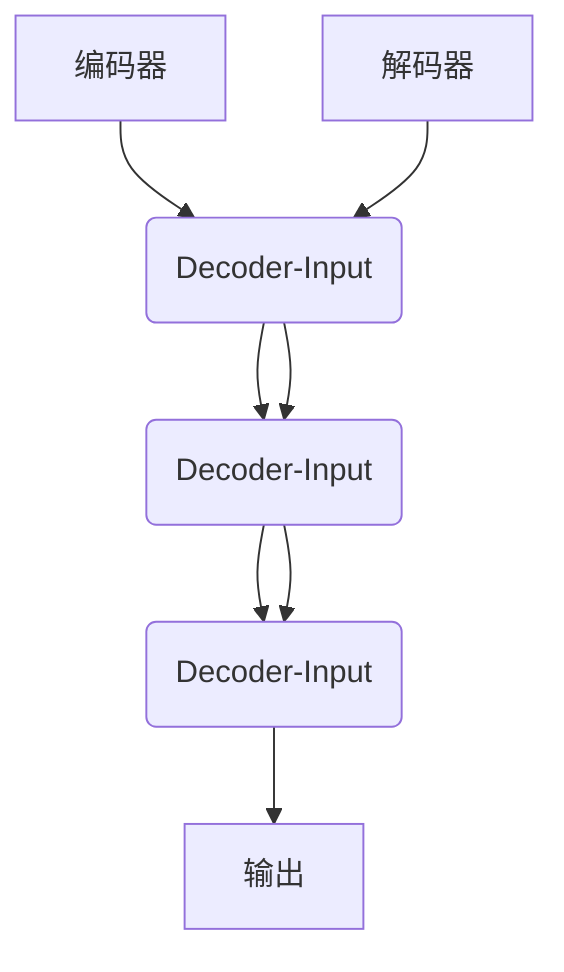
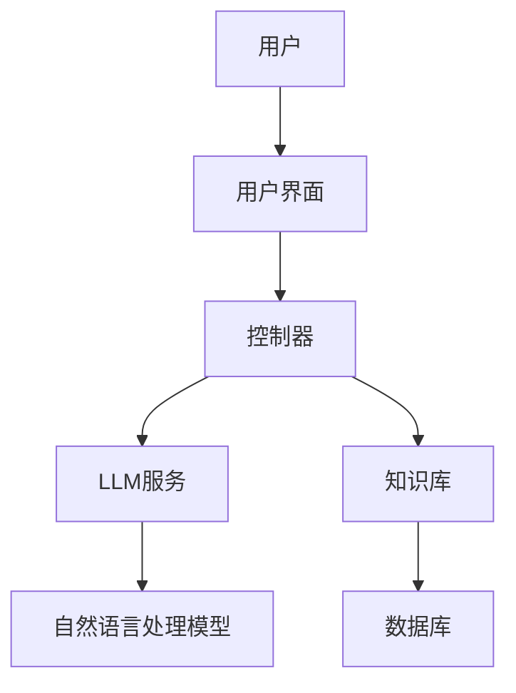
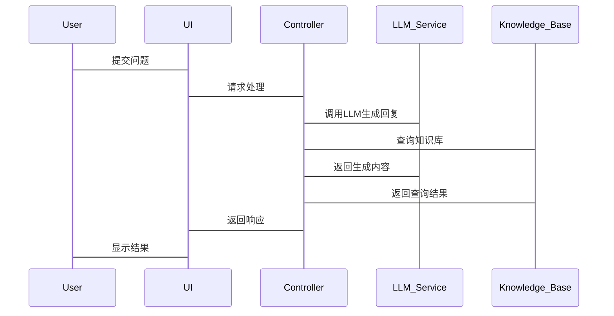

                 


# LLM驱动的AI Agent创新产品设计

---

## 关键词

LLM, AI Agent, 大语言模型, 人工智能, 自然语言处理, 人机交互

---

## 摘要

随着大语言模型（LLM）技术的飞速发展，AI Agent（人工智能代理）作为人机交互的重要形式，正在成为智能化产品设计的核心驱动力。本文从LLM与AI Agent的基本概念出发，深入探讨其核心原理、系统架构、算法实现及应用场景。通过分析LLM驱动的AI Agent的技术优势，结合实际项目案例，详细讲解如何设计和实现一个高效、智能的AI Agent系统。文章内容涵盖从理论到实践的全过程，旨在为技术开发者和产品经理提供有价值的参考和启发。

---

# 第一部分: LLM与AI Agent的基础

## 第1章: LLM与AI Agent的基本概念

### 1.1 LLM的基本概念

#### 1.1.1 大语言模型的定义

大语言模型（Large Language Model, LLM）是指基于深度学习技术训练的大型神经网络模型，能够理解和生成人类语言。其核心目标是通过大量数据的训练，掌握语言的语义、语法和上下文关系，从而实现自然语言处理任务，如文本生成、问答、翻译等。

#### 1.1.2 LLM的核心特点

- **大规模数据训练**：LLM通常使用海量文本数据进行训练，参数量巨大（如GPT-3的175B参数）。
- **自注意力机制**：通过自注意力机制捕捉文本中的长程依赖关系，理解上下文。
- **通用性**：能够处理多种语言和任务，具备较强的泛化能力。
- **生成能力**：可以生成连贯且符合语义的文本，甚至接近人类写作水平。

#### 1.1.3 LLM与传统NLP模型的区别

传统的NLP模型（如SVM、CRF等）通常依赖特征工程，处理任务单一，且性能受限于特征提取的效果。而LLM通过端到端的深度学习，能够自动学习文本特征，处理任务更加通用化和自动化。

### 1.2 AI Agent的基本概念

#### 1.2.1 AI Agent的定义

AI Agent（人工智能代理）是指能够感知环境、理解用户需求，并通过执行一系列动作来实现目标的智能系统。它可以是一个软件程序，也可以是一个硬件设备，其核心在于具备自主决策和交互能力。

#### 1.2.2 AI Agent的核心功能

- **感知环境**：通过传感器、API等方式获取外部信息。
- **理解需求**：解析用户的输入，识别意图和情感。
- **推理与决策**：基于知识库和推理引擎，生成解决方案。
- **执行操作**：通过调用服务或驱动硬件，完成具体任务。
- **人机交互**：以自然语言或图形界面与用户进行实时互动。

#### 1.2.3 AI Agent的分类

- **基于规则的Agent**：通过预定义的规则进行决策，适用于简单任务。
- **基于知识的Agent**：依赖知识库进行推理，适用于复杂场景。
- **基于学习的Agent**：利用机器学习模型进行自主决策，具备更强的适应性。
- **混合型Agent**：结合多种方法，根据场景切换策略。

### 1.3 LLM与AI Agent的关系

#### 1.3.1 LLM作为AI Agent的核心驱动力

LLM通过强大的语言理解与生成能力，为AI Agent提供了自然语言处理的核心模块，使其能够与用户进行流畅的对话交互。

#### 1.3.2 LLM如何赋能AI Agent

- **语义理解**：LLM能够准确理解用户的意图和需求。
- **知识表示**：通过大规模训练，LLM掌握了丰富的知识库。
- **动态推理**：基于上下文，LLM能够实时生成合理的回复。
- **多语言支持**：LLM具备处理多种语言的能力，扩展了AI Agent的应用场景。

#### 1.3.3 LLM与AI Agent的协同工作模式

AI Agent通过调用LLM API，利用其生成能力完成对话交互。同时，AI Agent还可以结合其他技术（如知识图谱、实时数据）进一步增强其智能性。

### 1.4 LLM驱动的AI Agent的应用场景

#### 1.4.1 智能客服

通过LLM驱动的AI Agent可以实现24小时在线的智能客服，能够理解用户的问题并提供准确的解答。

#### 1.4.2 智能助手

AI Agent可以作为个人助手，帮助用户处理日程安排、信息检索、任务提醒等事务。

#### 1.4.3 智慧教育

在教育领域，AI Agent可以作为虚拟助教，为学生提供个性化的学习建议和辅导。

#### 1.4.4 智能金融

AI Agent可以辅助金融顾问，为用户提供投资建议、风险评估等服务。

---

## 第2章: LLM驱动的AI Agent技术发展背景

### 2.1 大语言模型的发展历程

#### 2.1.1 从Word2Vec到BERT

- **Word2Vec**：早期的词向量模型，主要用于生成词嵌入。
- **BERT**：引入了自注意力机制和Transformer架构，显著提升了语义理解能力。

#### 2.1.2 GPT系列模型的崛起

- **GPT-1**：初步展示了生成式模型的能力。
- **GPT-2**：参数量更大，生成文本质量显著提升。
- **GPT-3**：拥有1750亿个参数，具备强大的通用性。

#### 2.1.3 当前主流LLM模型介绍

- **GPT-3**：由OpenAI开发，参数规模庞大。
- **PaLM**：Google推出的大规模语言模型，性能优越。
- **Bert**：适用于多种NLP任务的开源模型。

### 2.2 AI Agent的历史与现状

#### 2.2.1 AI Agent的起源

AI Agent的概念可以追溯到20世纪80年代，早期的AI Agent主要应用于专家系统和自动推理领域。

#### 2.2.2 知识图谱与对话系统的发展

- **知识图谱**：构建了结构化的知识库，为AI Agent提供了丰富的语义信息。
- **对话系统**：从基于规则的对话系统到基于深度学习的生成式对话系统，经历了多次技术革新。

#### 2.2.3 当前AI Agent的技术瓶颈

- **实时性**：大规模模型的推理速度较慢，难以满足实时交互的需求。
- **可解释性**：黑箱模型的决策过程难以解释，影响了用户信任。
- **多模态支持**：目前大多数AI Agent仅支持文本交互，难以处理图像、语音等多模态信息。

### 2.3 LLM驱动的AI Agent的技术优势

#### 2.3.1 自然语言处理能力的提升

LLM具备强大的文本生成和理解能力，使AI Agent能够与用户进行更自然的对话。

#### 2.3.2 知识表示与推理能力的增强

通过大规模训练，LLM掌握了丰富的知识，能够进行动态推理和上下文理解。

#### 2.3.3 人机交互的智能化

LLM使得AI Agent的交互更加智能化，能够根据用户反馈动态调整响应策略。

---

## 第3章: LLM驱动的AI Agent的核心原理

### 3.1 大语言模型的基本原理

#### 3.1.1 变压器模型的结构

变压器模型（Transformer）由编码器和解码器组成，编码器负责将输入文本转换为向量表示，解码器负责根据编码结果生成目标文本。



#### 3.1.2 注意力机制的作用

注意力机制通过计算输入序列中每个词的重要性，赋予关键位置更高的权重，从而提升模型的语义理解能力。

#### 3.1.3 梯度下降与训练方法

通常使用Adam优化器进行训练，通过计算损失函数（如交叉熵损失）的梯度，优化模型参数。

### 3.2 AI Agent的工作原理

#### 3.2.1 信息感知与理解

AI Agent通过自然语言处理技术，解析用户的输入，提取意图和实体信息。

#### 3.2.2 知识推理与决策

基于知识库和推理引擎，AI Agent生成合理的回复或操作指令。

#### 3.2.3 人机交互与反馈

通过对话历史和用户反馈，AI Agent动态调整其交互策略，提升用户体验。

### 3.3 LLM与AI Agent的结合原理

#### 3.3.1 LLM作为AI Agent的核心驱动力

AI Agent调用LLM API，利用其生成能力和理解能力完成对话交互。

#### 3.3.2 LLM与AI Agent的协同工作模式

AI Agent结合LLM的生成能力，进一步扩展功能，如结合实时数据、第三方服务等。

---

## 第4章: LLM驱动的AI Agent的算法实现

### 4.1 基于LLM的对话生成算法

#### 4.1.1 算法流程

1. **输入处理**：将用户的输入文本进行分词和编码。
2. **生成回复**：通过LLM生成初步回复。
3. **过滤与优化**：根据业务需求，对生成内容进行调整和优化。
4. **输出结果**：返回最终的回复内容。

#### 4.1.2 代码实现

```python
def generate_response(user_input):
    # 对用户输入进行分词和编码
    inputs = tokenizer(user_input, return_tensors='np')
    # 调用LLM模型生成回复
    outputs = model.generate(**inputs, max_length=50)
    # 解码生成文本
    response = tokenizer.decode(outputs[0], skip_special_tokens=True)
    return response
```

#### 4.1.3 数学公式

生成式模型的损失函数通常采用交叉熵损失：

$$ \mathcal{L} = -\sum_{i=1}^{n} \sum_{j=1}^{k} y_{i,j} \log(p(y_{i,j}|x_i)) $$

其中，$y_{i,j}$是真实标签的概率，$p(y_{i,j}|x_i)$是模型预测的概率。

### 4.2 基于LLM的意图识别算法

#### 4.2.1 算法流程

1. **输入文本**：接收用户的输入文本。
2. **文本编码**：将文本转换为向量表示。
3. **意图分类**：基于训练好的分类模型，识别用户的意图。
4. **返回结果**：输出识别到的意图和相关实体。

#### 4.2.2 代码实现

```python
def recognize_intent(user_input):
    # 转换为向量表示
    inputs = tokenizer(user_input, return_tensors='pt')
    # 预测意图
    outputs = model(**inputs)
    # 获取概率分布
    probabilities = outputs[0].softmax(dim=1)
    # 获取意图标签
    intent_label = torch.argmax(probabilities, dim=1).item()
    return intent_label
```

#### 4.2.3 数学公式

意图分类模型的损失函数通常采用交叉熵损失：

$$ \mathcal{L} = -\sum_{i=1}^{n} \sum_{j=1}^{k} y_{i,j} \log(p(y_{i,j}|x_i)) $$

其中，$y_{i,j}$是真实标签的概率，$p(y_{i,j}|x_i)$是模型预测的概率。

---

## 第5章: LLM驱动的AI Agent的系统架构

### 5.1 系统功能设计

#### 5.1.1 需求分析

- **用户需求**：实现一个支持多轮对话的AI Agent。
- **功能需求**：支持文本交互、意图识别、知识库查询、任务执行。

#### 5.1.2 系统功能模块

- **用户界面层**：提供对话界面和用户输入功能。
- **业务逻辑层**：处理用户的请求，调用相应服务。
- **模型服务层**：负责LLM的调用和结果生成。
- **知识库层**：存储和管理相关知识和数据。

#### 5.1.3 功能实现

- **对话历史记录**：记录用户的对话历史，用于上下文理解。
- **意图识别**：识别用户的意图和实体信息。
- **知识库查询**：根据意图查询相关知识。
- **任务执行**：根据指令执行相关任务。

### 5.2 系统架构设计

#### 5.2.1 系统架构图



#### 5.2.2 模块功能说明

- **用户界面（UI）**：接收用户的输入，显示对话内容。
- **控制器（Controller）**：处理用户的请求，协调各模块的工作。
- **LLM服务（LLM_Service）**：负责调用大语言模型，生成回复。
- **知识库（Knowledge_Base）**：存储和管理相关知识，支持快速查询。

### 5.3 接口设计

#### 5.3.1 API接口定义

- **API端点**：`/api/v1/agent`
- **请求方法**：POST
- **请求参数**：
  - `user_input`：用户的输入文本。
- **响应格式**：
  ```json
  {
      "status": "success",
      "message": "对话内容",
      "data": {
          "intent": "查询天气",
          "response": "今天北京的天气是多云，温度在15-25摄氏度之间。"
      }
  }
  ```

#### 5.3.2 交互流程

1. 用户通过UI输入问题。
2. UI将输入传递给Controller。
3. Controller调用LLM服务生成回复。
4. Controller查询知识库获取相关信息。
5. Controller将结果返回给UI，展示给用户。

### 5.4 交互序列图



---

## 第6章: LLM驱动的AI Agent的项目实战

### 6.1 环境安装与配置

#### 6.1.1 安装依赖

```bash
pip install transformers torch
```

#### 6.1.2 下载模型

```bash
wget https://example.com/model.pth
```

### 6.2 系统核心实现

#### 6.2.1 对话生成模块

```python
from transformers import AutoTokenizer, AutoModelForCausalLM

tokenizer = AutoTokenizer.from_pretrained('gpt2')
model = AutoModelForCausalLM.from_pretrained('gpt2')

def generate_response(user_input):
    inputs = tokenizer(user_input, return_tensors='pt')
    outputs = model.generate(**inputs, max_length=50)
    response = tokenizer.decode(outputs[0], skip_special_tokens=True)
    return response
```

#### 6.2.2 意图识别模块

```python
import torch
from torch import nn

class IntentClassifier(nn.Module):
    def __init__(self, input_size, hidden_size, output_size):
        super(IntentClassifier, self).__init__()
        self.fc = nn.Linear(input_size, hidden_size)
        self.dropout = nn.Dropout(0.5)
        self.fc2 = nn.Linear(hidden_size, output_size)
    
    def forward(self, x):
        x = self.fc(x)
        x = self.dropout(x)
        x = self.fc2(x)
        return x

model = IntentClassifier(input_size=768, hidden_size=256, output_size=5)
criterion = nn.CrossEntropyLoss()
optimizer = torch.optim.Adam(model.parameters(), lr=0.001)
```

### 6.3 案例分析与实现解读

#### 6.3.1 案例分析

假设我们开发一个智能客服AI Agent，用户输入“我的订单在哪里？”，系统需要识别用户的意图是查询订单状态，并调用订单查询API获取相关信息。

#### 6.3.2 实现解读

- **意图识别**：模型识别出用户的意图是“查询订单”。
- **知识库查询**：系统调用订单查询API，获取用户的订单信息。
- **生成回复**：LLM生成回复内容，如“您的订单号123456的状态是已发货，预计将在3天内送达。”

### 6.4 项目小结

通过实际项目的实现，我们可以看到LLM驱动的AI Agent的强大能力。从环境配置到代码实现，每一步都需要仔细设计和测试。意图识别和对话生成是系统的核心模块，直接影响用户体验。

---

## 第7章: LLM驱动的AI Agent的最佳实践

### 7.1 最佳实践 tips

- **模型选择**：根据具体需求选择合适的LLM模型，避免过度使用复杂模型。
- **数据处理**：确保数据质量和多样性，提升模型的泛化能力。
- **实时性优化**：通过模型剪枝、量化等技术，提升推理速度。
- **可解释性增强**：通过可视化工具，帮助用户理解AI Agent的决策过程。
- **多模态扩展**：逐步扩展AI Agent的功能，支持更多类型的输入和输出。

### 7.2 小结

通过本文的介绍，我们详细探讨了LLM驱动的AI Agent的技术背景、核心原理和系统架构。通过实际项目案例，展示了如何将理论应用于实践，设计并实现一个高效的AI Agent系统。

### 7.3 注意事项

- **数据隐私**：确保用户数据的安全性和隐私性，遵守相关法律法规。
- **性能优化**：在实际应用中，需要关注模型的推理速度和资源消耗。
- **用户体验**：从用户角度出发，设计友好的交互界面和反馈机制。

### 7.4 拓展阅读

- **《深度学习》—— Ian Goodfellow**
- **《大语言模型技术与应用》—— 中国人工智能学会**
- **《人机交互设计》—— Ben Shneiderman**

---

## 作者

**作者：AI天才研究院/AI Genius Institute & 禅与计算机程序设计艺术 /Zen And The Art of Computer Programming**

