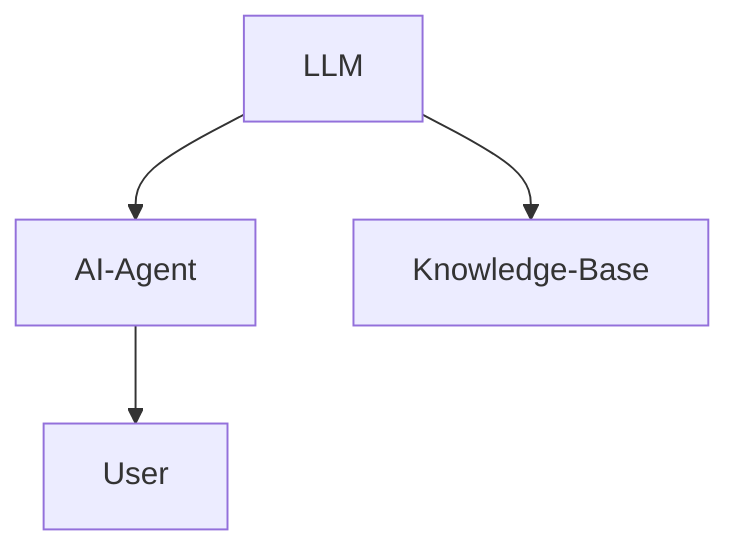

                 


# LLM驱动的AI Agent创新思维训练方法

## 关键词：LLM, AI Agent, 创新思维, 自然语言处理, 生成式AI, 知识图谱

## 摘要：本文探讨如何结合大语言模型（LLM）和AI代理（AI Agent）的能力，创新性地设计训练方法，提升AI系统在复杂场景下的创新思维能力。文章从理论基础、算法原理、系统架构到实战项目，全面解析LLM驱动的AI Agent的实现与应用，旨在为研究人员和开发者提供实用的指导和启示。

---

## 正文

### 第一部分：背景介绍

#### 第1章：LLM与AI Agent概述

##### 1.1 LLM驱动的AI Agent基本概念

- **生成式AI与传统AI的区别**  
  生成式AI能够根据输入生成新的内容，如文本、图像或代码，而传统AI主要依赖规则或预设数据进行分类、识别等任务。LLM（Large Language Model）作为生成式AI的核心代表，具备强大的理解和生成能力。

- **大语言模型（LLM）的核心能力**  
  LLM通过深度学习训练，能够理解上下文，生成连贯且合理的文本。其核心能力包括自然语言理解、文本生成、上下文推理和知识整合。

- **AI Agent的定义与类型**  
  AI Agent是一种智能实体，能够感知环境并采取行动以实现目标。根据功能，AI Agent可以分为任务型、服务型和自主型；根据智能水平，分为规则驱动、数据驱动和自适应型。

- **LLM驱动AI Agent的应用场景**  
  在教育中，AI Agent可以辅助学生解决学习难题；在医疗领域，可以提供辅助诊断建议；在企业中，可以作为智能助手优化决策流程。

#### 1.2 LLM与AI Agent的协同工作

- **协同工作的优势**  
  LLM提供强大的生成和理解能力，AI Agent负责执行具体任务，两者结合实现人机协作。

- **创新思维训练的核心价值**  
  通过LLM驱动的AI Agent，可以模拟人类的创新思维过程，帮助用户学习和训练创新思维能力。

---

### 第二部分：核心概念与联系

#### 第2章：LLM与AI Agent的核心原理

##### 2.1 LLM的内部机制

- **注意力机制的原理**  
  注意力机制通过计算输入序列中各部分的重要性，决定模型在生成文本时关注哪些内容。公式表示为：
  $$\text{Attention}(Q, K, V) = \text{softmax}\left(\frac{QK^T}{\sqrt{d_k}}\right)V$$
  其中，$Q$、$K$、$V$分别是查询、键和值向量，$d_k$是向量维度。

- **生成式模型的训练流程**  
  LLM通过监督学习训练，输入真实文本，模型预测下一个词的概率分布，目标是最小化预测与真实之间的误差。

##### 2.2 AI Agent的行为决策机制

- **基于LLM的生成策略**  
  AI Agent根据用户输入生成多种可能的回应，选择最优的策略执行。

- **多目标优化的实现**  
  在决策过程中，AI Agent需要在多个目标之间找到平衡，例如准确性和流畅性。这可以通过多任务学习或加权损失函数实现。

##### 2.3 LLM与AI Agent的协同工作

- **实时交互的流程**  
  用户向AI Agent提出问题，Agent通过LLM生成回答，并根据反馈调整后续交互策略。

- **知识库的整合与更新**  
  AI Agent利用外部知识库（如知识图谱）补充LLM生成的信息，确保回答的准确性和相关性。

##### 2.4 核心概念对比

| **特性**         | **LLM**              | **AI Agent**          |
|-------------------|----------------------|-----------------------|
| 核心能力          | 生成和理解文本       | 执行任务和决策        |
| 依赖数据          | 需大量文本数据       | 需任务目标和环境数据   |
| 应用场景          | 文本生成、对话       | 任务执行、环境交互    |

##### 2.5 实体关系图



---

### 第三部分：算法原理

#### 第3章：LLM与AI Agent的算法解析

##### 3.1 LLM的算法结构

- **Transformer模型的结构**  
  Transformer由编码器和解码器组成，编码器负责将输入文本转化为向量表示，解码器根据向量生成输出文本。

- **生成式AI的流程**  
  ```mermaid
  graph TD
  Input-->Encoder
  Encoder-->Decoder
  Decoder-->Output
  ```

##### 3.2 AI Agent的决策算法

- **基于LLM的生成策略**  
  AI Agent根据输入生成多个候选回应，选择最优的回应执行。

- **多目标优化的数学模型**  
  优化目标可以表示为：
  $$\min_{\theta} \sum_{i=1}^n \lambda_i L_i(\theta)$$
  其中，$\lambda_i$是目标权重，$L_i$是对应的目标损失函数。

##### 3.3 注意力机制的数学公式

- **计算注意力得分**  
  对于输入序列中的每个词，计算其与其他词的注意力得分：
  $$\text{score}(i, j) = Q[i]K[j]^T$$
  其中，$Q$和$K$分别是查询和键矩阵。

---

### 第四部分：系统分析与架构设计

#### 第4章：系统分析与架构设计

##### 4.1 问题场景介绍

- **用户需求**  
  用户希望与AI Agent进行自然对话，获取创新思维训练的建议。

- **系统功能设计**  
  系统需要实现自然语言理解、生成式回复和创新思维训练功能。

##### 4.2 系统架构设计

- **领域模型类图**  
  ```mermaid
  classDiagram
  class User
  class LLM
  class AI-Agent
  class Knowledge-Base
  User --> LLM
  User --> AI-Agent
  AI-Agent --> Knowledge-Base
  ```

- **系统架构图**  
  ```mermaid
  graph TD
  User-->API-Gateway
  API-Gateway-->LLM
  API-Gateway-->AI-Agent
  AI-Agent-->Knowledge-Base
  ```

##### 4.3 系统接口设计

- **用户输入接口**  
  用户通过自然语言输入问题，系统解析并传递给AI Agent。

- **系统输出接口**  
  系统根据LLM生成的回复，通过文本或语音形式反馈给用户。

##### 4.4 系统交互流程

- **交互序列图**  
  ```mermaid
  sequenceDiagram
  User->>+API-Gateway: 提问
  API-Gateway->>+LLM: 请求生成回复
  LLM->>-API-Gateway: 返回生成文本
  API-Gateway->>+AI-Agent: 分析问题
  AI-Agent->>-API-Gateway: 提供解决方案
  API-Gateway->>-User: 返回回复
  ```

---

### 第五部分：项目实战

#### 第5章：项目实战

##### 5.1 环境安装

- **安装Python和相关库**  
  安装Python 3.8及以上版本，然后安装以下库：
  ```
  pip install transformers torch
  ```

##### 5.2 核心代码实现

- **定义LLM接口**  
  ```python
  class LLMInterface:
      def generate(self, input_text):
          pass
  ```

- **定义AI Agent接口**  
  ```python
  class AI-Agent:
      def __init__(self, llm):
          self.llm = llm
      def respond(self, input_text):
          response = self.llm.generate(input_text)
          return response
  ```

##### 5.3 代码解读与分析

- **LLM接口实现**  
  使用预训练的模型，如GPT-3，实现文本生成功能。

- **AI Agent实现**  
  将LLM与知识库结合，提供更准确的回复。

##### 5.4 实际案例分析

- **案例：创新思维训练**  
  用户输入“如何解决这个问题”，AI Agent生成多个解决方案，帮助用户训练创新思维。

##### 5.5 项目小结

- **经验总结**  
  项目成功的关键在于模型选择和知识库的构建，同时需要不断优化交互流程。

---

### 第六部分：最佳实践

#### 第6章：最佳实践

##### 6.1 实践建议

- **选择合适的模型**  
  根据需求选择适合的LLM模型，如较小的模型适合快速响应，较大的模型适合复杂任务。

- **数据处理与模型调优**  
  对数据进行清洗和预处理，优化模型参数，如学习率和批次大小。

##### 6.2 注意事项

- **数据隐私**  
  确保用户数据的安全性和隐私性。

- **模型泛化能力**  
  避免过拟合，确保模型在不同场景下的泛化能力。

##### 6.3 拓展阅读

- **推荐书籍**  
  - 《Deep Learning》
  - 《自然语言处理入门》

---

## 附录

- **参考文献**  
  列出使用的文献和资料。

- **工具资源**  
  推荐的开源库和工具，如Hugging Face Transformers、PyTorch等。

---

## 作者

**作者：AI天才研究院 & 禅与计算机程序设计艺术**

---

通过以上步骤，我们可以系统地构建一个完整的LLM驱动的AI Agent创新思维训练方法框架，为研究人员和开发者提供清晰的指导和参考。

