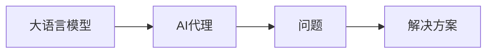
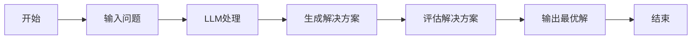
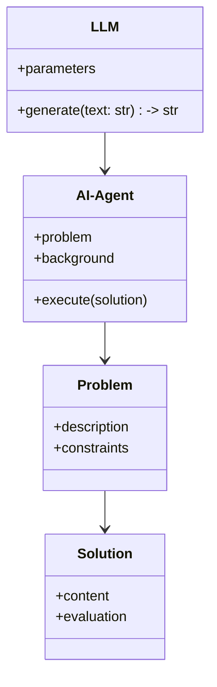
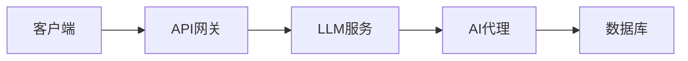
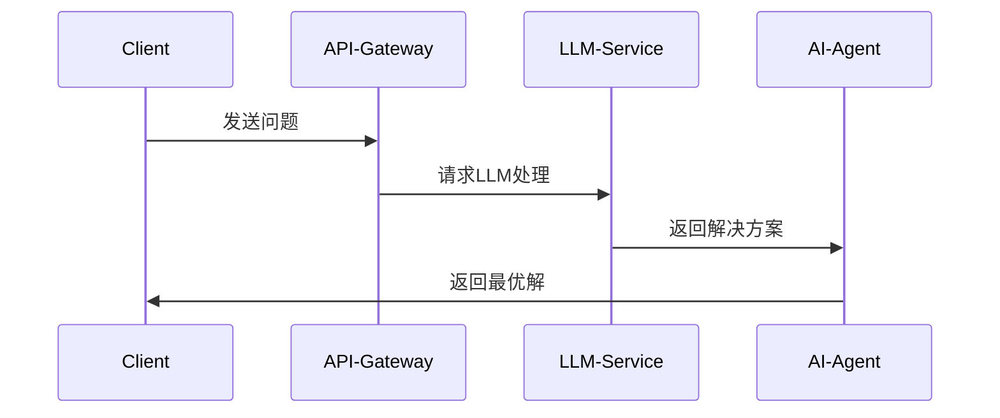

                 


```markdown
# LLM驱动的AI Agent创造性问题解决框架

> 关键词：LLM，AI Agent，创造性问题解决，大语言模型，人工智能

> 摘要：本文探讨了利用大语言模型（LLM）驱动的AI代理（AI Agent）在创造性问题解决中的应用框架。通过分析LLM与AI Agent的核心概念及其相互关系，详细阐述了基于LLM的AI Agent的算法原理、系统架构设计、数学模型及其实现方法。本文还通过具体案例展示了如何将理论应用于实践，并总结了最佳实践和未来发展方向。

---

# 第一部分: 背景与问题背景

## 第1章: 背景与问题背景

### 1.1 问题背景

#### 1.1.1 LLM与AI Agent的结合
大语言模型（Large Language Models, LLM）如GPT系列和BERT系列，通过其强大的语言理解和生成能力，为AI代理（AI Agent）提供了强大的语义处理和对话能力。AI Agent通过整合LLM，能够更自然地理解和生成人类语言，从而在创造性问题解决中表现出更高的灵活性和创造性。

#### 1.1.2 创造性问题解决的定义
创造性问题解决是指通过创新的思维方式和方法，寻找非常规的解决方案。这种解决问题的方式不仅依赖于数据和逻辑推理，还需要模型具备一定的创造性思维能力。LLM驱动的AI Agent通过其语言理解和生成能力，能够更好地模拟人类的创造性思维过程。

#### 1.1.3 当前AI Agent在问题解决中的局限性
传统的AI Agent主要依赖于规则和逻辑推理，难以处理复杂、模糊或需要创造性思维的问题。LLM的引入弥补了这一不足，使AI Agent能够处理更复杂、更需要创造性的任务。

### 1.2 问题描述

#### 1.2.1 LLM驱动AI Agent的核心优势
- **强大的语言理解能力**：LLM能够理解复杂的上下文和语义信息。
- **自然语言生成能力**：LLM能够生成自然流畅的语言输出。
- **可扩展性**：LLM可以通过微调和参数调整，适应不同领域的创造性问题解决任务。

#### 1.2.2 创造性问题解决的关键要素
- **创新性**：解决方案必须具有创新性，能够突破常规思维。
- **适应性**：能够适应不同的问题场景和输入条件。
- **效率**：能够在合理的时间内找到高质量的解决方案。

#### 1.2.3 当前技术的挑战与机遇
- **挑战**：LLM的计算成本高，模型的可解释性不足，创造性输出的质量不稳定。
- **机遇**：通过不断优化模型结构和训练策略，可以进一步提升LLM驱动的AI Agent的创造性问题解决能力。

---

# 第二部分: 核心概念与联系

## 第2章: 核心概念与联系

### 2.1 LLM与AI Agent的关系

#### 2.1.1 LLM的定义与特点
- **定义**：LLM是一种基于深度学习的自然语言处理模型，具有强大的语言理解和生成能力。
- **特点**：
  - 大规模参数（如GPT-3的175B参数）。
  - 微调能力强，可以根据具体任务进行优化。
  - 支持多种语言和任务。

#### 2.1.2 AI Agent的定义与特点
- **定义**：AI Agent是一种智能体，能够感知环境、自主决策并执行任务。
- **特点**：
  - 多模态交互能力。
  - 自主学习与适应能力。
  - 高效的决策和执行能力。

#### 2.1.3 LLM驱动AI Agent的实现机制
- **输入**：问题描述和相关背景信息。
- **输出**：生成的解决方案和执行步骤。

### 2.2 核心概念对比分析

#### 2.2.1 LLM与传统NLP模型的对比

| 属性 | LLM | 传统NLP模型 |
|------|------|--------------|
| 参数量 | 大规模（如10^8+） | 较小（如10^6） |
| 任务适应性 | 强，可以通过微调适应多种任务 | 较弱，通常针对特定任务设计 |
| 计算资源需求 | 高 | 较低 |

#### 2.2.2 AI Agent与传统AI算法的对比

| 属性 | AI Agent | 传统AI算法 |
|------|----------|-------------|
| 决策能力 | 强，基于环境反馈动态调整 | 较弱，通常基于预定义规则 |
| 交互能力 | 强，支持多轮对话和复杂交互 | 较弱，通常单向执行任务 |
| 可解释性 | 较低 | 较高 |

#### 2.2.3 创造性问题解决与其他问题解决方式的对比

| 属性 | 创造性问题解决 | 传统问题解决 |
|------|---------------|---------------|
| 思维模式 | 创新性、发散性 | 逻辑性、收敛性 |
| 解决方案 | 非常规、独特 | 标准、常规 |

### 2.3 实体关系图



---

# 第三部分: 算法原理与流程

## 第3章: 算法原理与流程

### 3.1 LLM驱动的AI Agent算法流程

#### 3.1.1 算法输入
- **问题描述**：用户提供的需要解决的问题。
- **背景信息**：与问题相关的上下文信息。

#### 3.1.2 算法处理步骤
1. **问题解析**：AI Agent通过LLM解析问题的语义和结构。
2. **生成解决方案**：LLM生成多个可能的解决方案。
3. **方案评估**：AI Agent对生成的方案进行评估，选择最优解。
4. **执行步骤生成**：AI Agent生成具体的执行步骤。

#### 3.1.3 算法输出
- **解决方案**：经过评估的最优解决方案。
- **执行步骤**：具体的实施步骤和注意事项。

#### 3.1.4 算法流程图



### 3.2 数学模型与公式

#### 3.2.1 损失函数
$$ \text{Loss} = -\sum_{i=1}^{n} \log p(y_i|x_i) $$

其中，$y_i$ 是目标输出，$x_i$ 是输入。

#### 3.2.2 注意力机制
$$ \text{Attention}(Q, K, V) = \text{softmax}\left(\frac{QK^T}{\sqrt{d_k}}\right)V $$

其中，$Q$ 是查询向量，$K$ 是键向量，$V$ 是值向量，$d_k$ 是向量的维度。

#### 3.2.3 解码器输出
$$ \text{Output} = \text{FFN}(x) $$

其中，$\text{FFN}$ 是前馈神经网络。

### 3.3 算法实现示例

```python
def llm_agent(problem, background):
    # 解析问题
    parsed_problem = parse(problem, background)
    # 生成解决方案
    solutions = generate_solutions(parsed_problem)
    # 评估解决方案
    evaluated = evaluate(solutions)
    # 选择最优解
    best_solution = select_best(evaluated)
    return best_solution

def parse(problem, background):
    # 解析问题的语义和结构
    pass

def generate_solutions(parsed_problem):
    # 使用LLM生成解决方案
    pass

def evaluate(solutions):
    # 评估解决方案的质量
    pass

def select_best(evaluated):
    # 选择最优解
    pass
```

---

# 第四部分: 系统分析与架构设计

## 第4章: 系统分析与架构设计

### 4.1 问题场景介绍

#### 4.1.1 系统应用场景
- **领域**：创造性问题解决，如产品设计、营销策略制定等。
- **用户**：需要创造性解决方案的企业和个人。

#### 4.1.2 系统目标
- 提供高效的创造性问题解决工具。
- 提供个性化的解决方案。

### 4.2 系统功能设计

#### 4.2.1 领域模型设计



#### 4.2.2 系统架构设计



#### 4.2.3 系统接口设计
- **输入接口**：接收问题描述和背景信息。
- **输出接口**：返回解决方案和执行步骤。

#### 4.2.4 系统交互设计



---

# 第五部分: 项目实战

## 第5章: 项目实战

### 5.1 环境安装

```bash
pip install transformers
pip install torch
pip install mermaid
```

### 5.2 系统核心实现

#### 5.2.1 LLM初始化

```python
from transformers import AutoTokenizer, AutoModelForCausalLM
model_name = "gpt2"
tokenizer = AutoTokenizer.from_pretrained(model_name)
model = AutoModelForCausalLM.from_pretrained(model_name)
```

#### 5.2.2 AI Agent实现

```python
class AI-Agent:
    def __init__(self, model, tokenizer):
        self.model = model
        self.tokenizer = tokenizer

    def generate_solution(self, problem):
        inputs = self.tokenizer(problem, return_tensors="pt")
        outputs = self.model.generate(**inputs, max_length=100)
        solution = self.tokenizer.decode(outputs[0], skip_special_tokens=True)
        return solution
```

#### 5.2.3 问题解决流程

```python
agent = AI-Agent(model, tokenizer)
problem = "如何设计一个高效的在线教育平台？"
solution = agent.generate_solution(problem)
print(solution)
```

### 5.3 案例分析

#### 5.3.1 案例描述
用户输入：如何设计一个高效的在线教育平台？

#### 5.3.2 解决方案
生成的解决方案可能包括：
1. 构建用户友好的界面。
2. 提供多种课程形式。
3. 引入互动教学工具。

#### 5.3.3 结果展示
$$ \text{Solution} = \text{设计一个用户友好的在线教育平台} $$

### 5.4 项目小结

---

# 第六部分: 总结与展望

## 第6章: 总结与展望

### 6.1 总结
本文详细探讨了LLM驱动的AI Agent在创造性问题解决中的应用框架，从核心概念到系统架构，再到项目实战，为读者提供了一个全面的视角。通过分析和实践，展示了如何利用LLM的强大能力来提升AI Agent的创造性问题解决能力。

### 6.2 展望
未来，随着LLM技术的不断进步和AI Agent的智能化提升，创造性问题解决将更加高效和智能。我们需要进一步优化模型结构，提升计算效率，并探索更多创新的应用场景。

---

# 第七部分: 最佳实践与注意事项

## 第7章: 最佳实践与注意事项

### 7.1 最佳实践
- **选择合适的模型**：根据具体任务选择适合的LLM模型。
- **优化模型性能**：通过微调和参数调整提升模型效果。
- **监控与维护**：定期监控系统性能，及时进行维护和优化。

### 7.2 注意事项
- **数据隐私**：确保数据的安全和隐私。
- **模型的可解释性**：提升模型的可解释性，便于用户理解和信任。
- **计算资源**：合理分配计算资源，确保系统的高效运行。

---

# 第八部分: 拓展阅读

## 第8章: 拓展阅读

### 8.1 推荐书籍
- 《深度学习》—— Ian Goodfellow
- 《人工智能：一种现代的方法》—— Stuart Russell

### 8.2 推荐论文
- "Attention Is All You Need" —— Vaswani et al.
- "Generative Pre-trained Transformer" —— Radford et al.

---

# 结语

通过本文的探讨，我们深入理解了LLM驱动的AI Agent在创造性问题解决中的潜力和应用。希望本文的内容能够为相关领域的研究和实践提供有价值的参考。

---

作者：AI天才研究院/AI Genius Institute & 禅与计算机程序设计艺术 /Zen And The Art of Computer Programming
```

