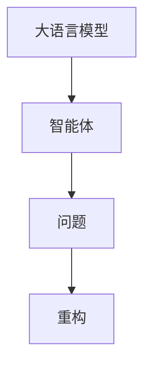
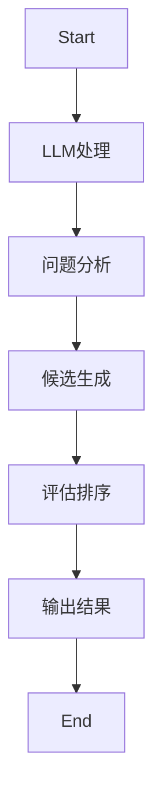
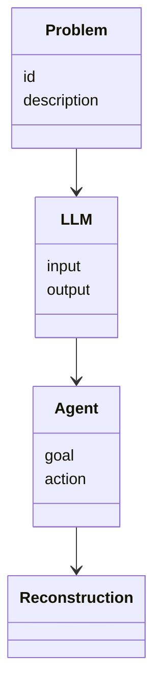
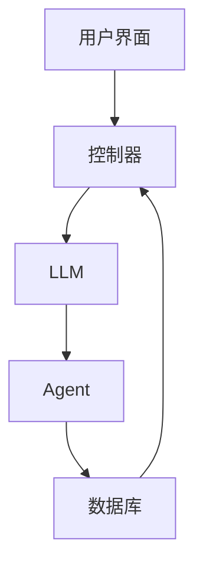
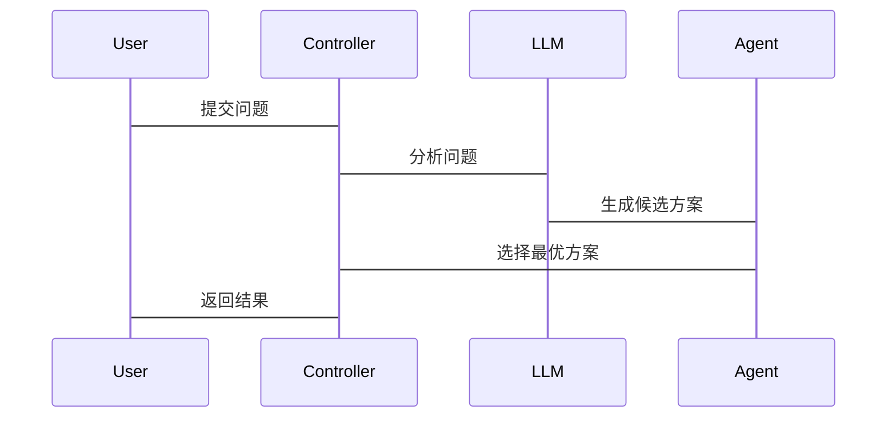

                 


# LLM驱动的AI Agent创造性问题重构

> 关键词：LLM, AI Agent, 创造性问题重构, 大语言模型, 智能体, 问题解决

> 摘要：本文深入探讨了LLM驱动的AI Agent在创造性问题重构中的应用，分析了其核心概念、算法原理、系统架构及实际案例，旨在为技术人员提供理论与实践的双重指导。

---

## 第一部分: LLM驱动的AI Agent创造性问题重构背景介绍

### 第1章: LLM驱动的AI Agent概述

#### 1.1 问题背景与描述
- **问题背景**: 当前AI技术快速发展，大语言模型（LLM）和AI Agent的应用日益广泛。然而，如何利用LLM提升AI Agent的创造性问题解决能力，仍是一个亟待探索的领域。
- **问题描述**: LLM驱动的AI Agent需要通过创造性问题重构，将复杂问题转化为可执行的任务，从而提高问题解决的效率和质量。
- **解决方法**: 通过分析LLM与AI Agent的结合方式，提出创造性问题重构的实现路径。
- **概念结构**: LLM提供语言理解和生成能力，AI Agent负责目标设定和决策，创造性问题重构则是两者的协同过程。
- **核心要素**: 包括LLM模型、AI Agent架构、问题重构算法、任务执行机制等。

#### 1.2 问题解决与边界
- **创造性问题重构的定义**: 将原始问题转换为适合AI Agent执行的新问题，强调创造性和灵活性。
- **LLM在问题重构中的作用**: 提供语言理解和生成能力，帮助AI Agent更好地理解问题并提出解决方案。
- **AI Agent的智能决策能力**: 基于LLM的输出，AI Agent能够做出最优决策，推动问题解决过程。

#### 1.3 概念结构与核心要素
- **LLM与AI Agent的关系**: LLM为AI Agent提供语言能力，AI Agent为LLM提供应用场景。
- **创造性问题重构的系统架构**: 包括问题输入、LLM处理、问题重构、任务执行四个阶段。
- **核心要素的组成与功能**:
  - LLM模型: 提供语言理解和生成能力。
  - AI Agent架构: 负责目标设定和决策。
  - 问题重构算法: 将原始问题转化为可执行任务。
  - 任务执行机制: 执行重构后的问题，输出结果。

### 第2章: LLM与AI Agent的核心原理

#### 2.1 核心概念原理
- **LLM的工作原理**: 基于大规模数据训练，生成与输入相关的文本。
- **AI Agent的智能决策机制**: 基于LLM的输出，结合环境信息，做出最优决策。
- **创造性问题重构的实现逻辑**: 将原始问题分解，重新组合，生成新的问题描述。

#### 2.2 核心概念特征对比
- **LLM与传统NLP模型的对比**:
  | 特性 | LLM | 传统NLP模型 |
  |------|------|-------------|
  | 数据量 | 大规模 | 较小规模 |
  | 模型复杂度 | 高 | 较低 |
  | 应用场景 | 多样化 | 有限 |
- **AI Agent与传统脚本式智能体的对比**:
  | 特性 | AI Agent | 传统脚本式智能体 |
  |------|-----------|------------------|
  | 自主性 | 高 | 低 |
  | 学习能力 | 强 | 无 |
  | 环境适应性 | 强 | 弱 |
- **创造性问题重构与传统问题解决的对比**:
  | 特性 | 创造性问题重构 | 传统问题解决 |
  |------|----------------|---------------|
  | 创新性 | 高 | 中 |
  | 复杂性 | 高 | 中 |
  | 灵活性 | 高 | 中 |

#### 2.3 ER实体关系图


### 第3章: LLM与AI Agent的算法原理

#### 3.1 算法原理概述
- **LLM的训练过程**: 基于大规模数据，使用自监督学习，优化模型参数。
- **AI Agent的决策算法**: 基于LLM生成的候选动作，结合环境反馈，选择最优动作。
- **创造性问题重构的算法框架**: 包括问题分析、候选生成、评估排序、输出结果四个步骤。

#### 3.2 算法原理的数学模型
- **损失函数**:
  $$ \text{Loss} = -\sum_{i=1}^{n} \log p(x_i|y_i) $$
  其中，\( x_i \) 是输入，\( y_i \) 是输出，\( p(x_i|y_i) \) 是模型生成的概率。
- **优化算法**:
  $$ \theta_{t+1} = \theta_t - \eta \frac{\partial \text{Loss}}{\partial \theta} $$
  其中，\( \eta \) 是学习率，\( \theta \) 是模型参数。

#### 3.3 算法实现流程


#### 3.4 算法实现代码示例
```python
import torch
import torch.nn as nn
import torch.optim as optim

class LLM(nn.Module):
    def __init__(self, input_size, hidden_size, output_size):
        super(LLM, self).__init__()
        self.embedding = nn.Embedding(input_size, hidden_size)
        self.lstm = nn.LSTM(hidden_size, hidden_size)
        self.fc = nn.Linear(hidden_size, output_size)
        
    def forward(self, x):
        x = self.embedding(x)
        x, _ = self.lstm(x)
        x = self.fc(x)
        return x

# 初始化模型和优化器
model = LLM(input_size, hidden_size, output_size)
optimizer = optim.Adam(model.parameters(), lr=learning_rate)

# 训练过程
for epoch in range(num_epochs):
    for batch in batches:
        outputs = model(batch)
        loss = criterion(outputs, labels)
        optimizer.zero_grad()
        loss.backward()
        optimizer.step()
```

### 第4章: 系统分析与架构设计

#### 4.1 系统分析
- **问题场景**: 需要解决的复杂问题，如优化任务流程、提高决策效率等。
- **系统功能设计**: 需要实现问题输入、LLM处理、问题重构、任务执行等功能。
- **领域模型图**:


#### 4.2 系统架构设计
- **系统架构图**:


#### 4.3 系统接口设计
- **输入接口**: 接收用户输入的问题描述。
- **输出接口**: 输出问题重构后的结果和执行结果。
- **内部接口**: LLM与Agent之间的交互接口。

#### 4.4 系统交互设计


### 第5章: 项目实战

#### 5.1 环境安装
- 安装必要的库，如PyTorch、transformers等。

#### 5.2 核心代码实现
```python
from transformers import AutoTokenizer, AutoModelForCausalLM

tokenizer = AutoTokenizer.from_pretrained("gpt2")
model = AutoModelForCausalLM.from_pretrained("gpt2")

def reconstruct_problem(original_problem):
    inputs = tokenizer(original_problem, return_tensors="pt")
    outputs = model.generate(inputs.input_ids, max_length=50)
    return tokenizer.decode(outputs[0], skip_special_tokens=True)

# 示例
original_problem = "如何提高工作效率？"
reconstructed_problem = reconstruct_problem(original_problem)
print(reconstructed_problem)
```

#### 5.3 代码解读与分析
- **tokenizer**: 使用预训练的分词器处理输入问题。
- **model**: 加载预训练的LLM模型。
- **reconstruct_problem函数**: 接收原始问题，生成重构后的问题。
- **示例**: 输入“如何提高工作效率？”，输出可能是一个更具体的问题，如“如何优化工作流程以提高效率？”。

#### 5.4 实际案例分析
- **案例背景**: 某公司希望优化其客户服务流程。
- **问题重构**: 将“如何提高客户满意度？”重构为“如何优化客户服务流程以提高客户满意度？”。
- **解决方案**: AI Agent根据重构后的问题，生成多个候选方案，选择最优方案执行。

### 第6章: 最佳实践与总结

#### 6.1 小结
- **关键点回顾**: LLM与AI Agent的结合，创造性问题重构的重要性，算法实现的关键步骤。
- **注意事项**: 数据质量、模型训练、算法选择、系统设计等。

#### 6.2 注意事项
- **数据质量**: 确保训练数据的多样性和代表性。
- **模型选择**: 根据具体任务选择合适的LLM模型。
- **系统设计**: 优化系统架构，确保高效性和可扩展性。

#### 6.3 未来趋势
- **技术进步**: 更强大的LLM模型和更智能的AI Agent。
- **应用拓展**: 更多领域的应用，如教育、医疗、金融等。

#### 6.4 拓展阅读
- 推荐书籍：《Deep Learning》、《Artificial Intelligence: A Modern Approach》。
- 推荐论文：相关领域的最新研究成果。

---

# 作者：AI天才研究院 & 禅与计算机程序设计艺术

---

以上是完整的文章内容，涵盖了从背景介绍到项目实战的各个方面，详细讲解了LLM驱动的AI Agent创造性问题重构的核心概念、算法原理、系统架构及实际应用。希望对读者有所帮助！

