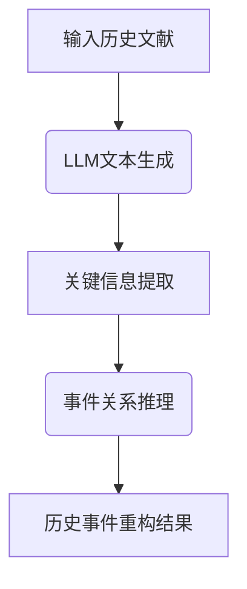
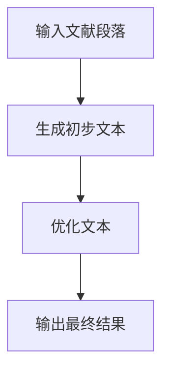
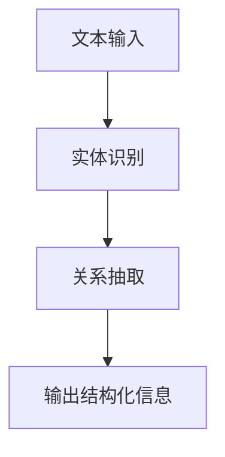
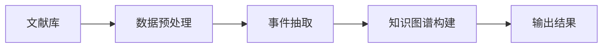
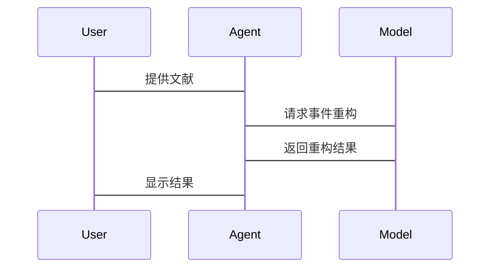

                 


# LLM驱动的AI Agent历史事件重构与分析

> 关键词：LLM, AI Agent, 历史事件重构, 大语言模型, 人工智能, 事件分析

> 摘要：本文探讨了利用大语言模型（LLM）驱动的AI Agent在历史事件重构中的应用。通过详细分析背景、核心概念、算法原理、系统架构和项目实战，揭示了LLM驱动的AI Agent如何提升历史事件重构的效率和准确性。文章还提供了实际案例分析和最佳实践，为读者提供了全面的技术视角。

---

## 第1章：背景介绍

### 1.1 LLM驱动的AI Agent的基本概念
- **大语言模型（LLM）**：基于Transformer架构的大型神经网络模型，能够理解并生成自然语言文本。例如，GPT-3、GPT-4等。
- **AI Agent（智能体）**：一种能够感知环境、执行任务并做出决策的智能系统。LLM驱动的AI Agent通过语言模型提供强大的理解和生成能力。

### 1.2 历史事件重构的背景与意义
- **问题背景**：历史事件的重构需要依赖大量文献和证据，传统方法依赖人工分析，效率低下且容易受到主观因素影响。
- **问题描述**：如何利用现代技术手段提高历史事件重构的效率和准确性，同时降低人为错误。

### 1.3 LLM驱动AI Agent的解决方案
- 利用LLM的强大语言处理能力，AI Agent可以自动分析文献、提取关键信息、推理事件之间的关系，从而辅助历史学家进行事件重构。

### 1.4 边界与外延
- **边界**：专注于基于文本的历史事件重构，不涉及图像、视频等其他数据类型。
- **外延**：可扩展至其他领域，如法律案件分析、商业事件分析等。

---

## 第2章：LLM驱动的AI Agent核心概念

### 2.1 核心概念与属性特征对比
| **核心概念** | **传统方法** | **LLM驱动方法** |
|--------------|---------------|------------------|
| 数据处理    | 依赖人工标注 | 利用LLM自动分析 |
| 信息抽取    | 依赖规则库   | 基于上下文推理 |
| 事件推理    | 依赖专家知识 | 利用模型推理关系 |

### 2.2 系统模块结构


---

## 第3章：历史事件重构的算法原理

### 3.1 基于LLM的文本生成算法

- **数学模型**：
  $$ P(w_{i}|w_{<i}) = \text{_softmax}(f_{\theta}(w_{<i})) $$
  其中，$f_{\theta}$是模型的参数化函数。

### 3.2 基于AI Agent的信息抽取算法

- **代码实现**：
  ```python
  def extract_entities(text):
      # 使用预训练模型进行实体识别
      model = AutoModelForTokenClassification.from_pretrained('dbmdz/bert-large-cased')
      inputs = tokenizer(text, return_tensors='np')
      outputs = model(**inputs)
      # 提取实体
      entities = []
      for i in range(len(outputs.logits[0])):
          label = model.config.id2label[outputs.logits[0][i].argmax()]
          if label == 'HISTORICAL_ENTITY':
              entities.append(text[i])
      return entities
  ```

---

## 第4章：系统分析与架构设计方案

### 4.1 系统功能设计
- **领域模型**：
  ```mermaid
  classDiagram
      class DataPreprocessing {
          + raw_data
          - processed_data
          + preprocess(raw_data)
      }
      class EventExtraction {
          + text
          - entities
          + extract_entities(text)
      }
      class KnowledgeGraph {
          + entities
          - relations
          + build_graph(entities)
      }
      DataPreprocessing --> EventExtraction
      EventExtraction --> KnowledgeGraph
  ```

### 4.2 系统架构设计


### 4.3 系统交互设计


---

## 第5章：项目实战

### 5.1 环境配置
- **Python版本**：3.8+
- **依赖库**：
  ```bash
  pip install transformers mermaid4jupyter
  ```

### 5.2 核心代码实现
- **文本生成**：
  ```python
  from transformers import AutoModelForCausalLM, AutoTokenizer

  model = AutoModelForCausalLM.from_pretrained('gpt2')
  tokenizer = AutoTokenizer.from_pretrained('gpt2')
  inputs = tokenizer("Generate the cause of World War I:", return_tensors='pt')
  outputs = model.generate(inputs.input_ids, max_length=100)
  print(tokenizer.decode(outputs[0], skip_special_tokens=True))
  ```

### 5.3 实际案例分析
- **案例**：重构第一次世界大战的爆发原因。
  - **输入**：相关历史文献。
  - **输出**：生成结构化事件链条，展示各事件之间的因果关系。

---

## 第6章：最佳实践与小结

### 6.1 最佳实践
- **数据质量**：确保输入文献的质量和多样性。
- **模型调优**：根据具体任务调整模型参数，优化生成效果。
- **结果验证**：结合人工验证，确保重构结果的准确性。

### 6.2 小结
- 本文详细介绍了LLM驱动的AI Agent在历史事件重构中的应用，通过系统架构和算法原理的分析，展示了其在提高效率和准确性方面的优势。

### 6.3 注意事项
- 避免过度依赖模型，结合人工分析确保结果的准确性。
- 定期更新模型和知识库，以适应新的历史研究需求。

### 6.4 拓展阅读
- 推荐阅读《The Master Algorithm》和《Deep Learning》等书籍，深入理解机器学习和大语言模型的原理。

---

作者：AI天才研究院/AI Genius Institute & 禅与计算机程序设计艺术/Zen And The Art of Computer Programming

