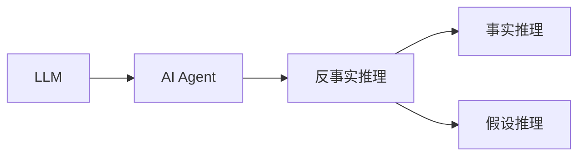
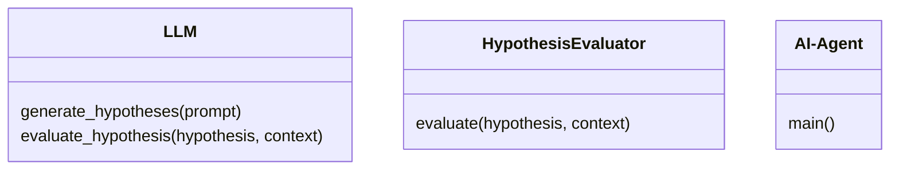
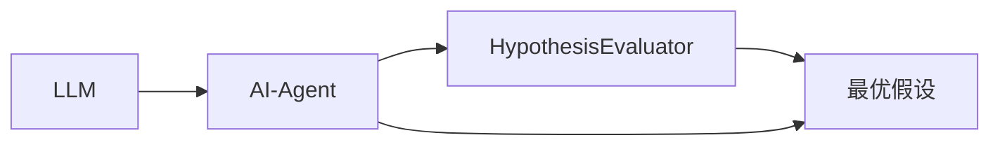

                 


# LLM驱动的AI Agent反事实推理能力

> 关键词：反事实推理、LLM、AI Agent、大语言模型、人工智能、推理能力

> 摘要：反事实推理是人工智能领域的重要研究方向，尤其是在LLM（Large Language Model）驱动的AI Agent中，反事实推理能力能够帮助智能体在复杂环境中做出更合理的决策。本文将详细探讨反事实推理的核心原理、算法实现、系统架构设计以及实际应用场景，通过丰富的案例分析和代码实现，帮助读者深入理解LLM驱动的AI Agent如何实现反事实推理能力。

---

# 第一部分: LLM驱动的AI Agent反事实推理能力背景介绍

## 第1章: LLM驱动的AI Agent反事实推理能力概述

### 1.1 问题背景与描述

#### 1.1.1 传统AI推理的局限性
传统AI推理主要依赖于规则引擎和基于事实的推理方法，这些方法在处理复杂、动态和不确定性较高的问题时显得力不从心。例如，在金融投资领域，传统AI难以有效处理市场波动带来的不确定性，导致决策失误。

#### 1.1.2 反事实推理的定义与特点
反事实推理是指在已知事实的基础上，推理出与事实相反的可能性，并评估这些可能性的合理性和最优性。这种推理方式能够帮助AI Agent在面对复杂决策时，探索多种可能的假设，并选择最优的解决方案。

#### 1.1.3 LLM在AI Agent中的作用
LLM（Large Language Model）通过其强大的语言理解和生成能力，能够为AI Agent提供丰富的上下文信息，并支持复杂的语义推理。LLM与AI Agent的结合，使得反事实推理能力得以实现。

### 1.2 问题解决与边界

#### 1.2.1 反事实推理的核心问题
反事实推理的核心问题在于如何生成合理的反事实假设，并评估这些假设的可行性。这需要结合领域知识和上下文信息，以确保生成的假设具有现实意义。

#### 1.2.2 LLM驱动的AI Agent的边界与外延
LLM驱动的AI Agent的反事实推理能力需要在特定的应用场景下使用，例如金融投资、医疗诊断等领域。其边界在于生成的假设必须与实际问题相关，并且能够提供有效的解决方案。

#### 1.2.3 反事实推理的实际应用场景
反事实推理在多个领域具有广泛的应用，例如在医疗领域，可以通过反事实推理探索不同的治疗方案；在金融领域，可以用于评估不同的投资策略。

### 1.3 概念结构与核心要素

#### 1.3.1 反事实推理的逻辑框架
反事实推理的逻辑框架包括假设生成、假设评估和假设选择三个主要步骤。假设生成是基于当前事实生成反事实假设，假设评估是通过领域知识和上下文信息评估假设的可行性，假设选择是通过优化目标选择最优假设。

#### 1.3.2 LLM与AI Agent的结合方式
LLM作为AI Agent的核心模块，负责生成和理解语言信息，并支持复杂的语义推理。AI Agent则负责协调各个模块，实现反事实推理能力。

#### 1.3.3 反事实推理能力的评估标准
反事实推理能力的评估标准包括生成假设的合理性、假设评估的准确性以及最终决策的最优性。这些标准需要结合具体应用场景进行评估。

---

## 第2章: 反事实推理的核心原理

### 2.1 反事实推理的原理

#### 2.1.1 反事实推理的逻辑基础
反事实推理的逻辑基础是通过已知事实生成反事实假设，并评估这些假设的可能性。这需要结合领域知识和上下文信息，以确保生成的假设具有现实意义。

#### 2.1.2 LLM在反事实推理中的作用
LLM在反事实推理中的作用主要体现在生成反事实假设和评估假设的可行性。通过LLM的强大语言理解能力，可以生成丰富的反事实假设，并通过语义分析评估这些假设的合理性。

#### 2.1.3 反事实推理的数学模型
反事实推理的数学模型可以基于概率论和逻辑推理。例如，可以通过贝叶斯网络评估假设的可能性，或者通过逻辑规则生成和评估假设。

### 2.2 核心概念对比

#### 2.2.1 反事实推理与事实推理的对比
| 对比维度 | 事实推理 | 反事实推理 |
|----------|----------|------------|
| 推理目标 | 基于事实 | 探索假设 |
| 数据依赖 | 现实数据 | 反事实假设 |

#### 2.2.2 LLM驱动的反事实推理与传统推理的对比
| 对比维度 | 传统推理 | LLM驱动的反事实推理 |
|----------|----------|-------------------|
| 技术基础 | 规则引擎 | 大语言模型 |
| 推理能力 | 有限 | 强大 |
| 灵活性 | 较低 | 较高 |

#### 2.2.3 反事实推理能力的评估对比
| 评估维度 | 传统评估 | 现代评估 |
|----------|----------|------------|
| 评估标准 | 假设合理性 | 多维度评估（合理性、可行性、最优性） |
| 评估方法 | 专家评估 | 数据驱动评估 |

### 2.3 实体关系图



---

## 第3章: 反事实推理算法原理

### 3.1 算法原理概述

#### 3.1.1 反事实推理的基本步骤
反事实推理的基本步骤包括：
1. **假设生成**：基于当前事实生成反事实假设。
2. **假设评估**：评估每个假设的合理性。
3. **假设选择**：选择最优假设作为最终决策。

#### 3.1.2 LLM在反事实推理中的角色
LLM在反事实推理中的角色主要包括：
1. **生成反事实假设**：基于输入的上下文生成多个反事实假设。
2. **评估假设**：通过语义分析评估每个假设的可行性。

#### 3.1.3 反事实推理的算法框架
反事实推理的算法框架可以分为三部分：
1. **假设生成模块**：生成多个反事实假设。
2. **假设评估模块**：评估每个假设的可行性。
3. **决策选择模块**：选择最优假设。

### 3.2 算法流程图


### 3.3 算法实现代码

```python
def generate_hypothesis(prompt):
    # 使用LLM生成假设
    return llm.generate_hypotheses(prompt)

def evaluate_hypothesis(hypothesis, context):
    # 评估假设的合理性
    return hypothesis_evaluator.evaluate(hypothesis, context)

def select_best_hypothesis(hypotheses, scores):
    # 选择最优假设
    return max(hypotheses, key=lambda h: scores[h])

def main():
    prompt = "如果我..."
    hypotheses = generate_hypothesis(prompt)
    evaluations = {h: evaluate_hypothesis(h, context) for h in hypotheses}
    best_hypothesis = select_best_hypothesis(hypotheses, evaluations)
    return best_hypothesis

if __name__ == "__main__":
    main()
```

### 3.4 数学模型与公式

#### 3.4.1 反事实推理的概率模型
反事实推理可以通过概率模型来评估假设的可能性。例如，可以使用贝叶斯网络来计算每个假设的概率。

$$ P(h|e) = \frac{P(e|h)P(h)}{P(e)} $$

其中：
- $P(h)$ 是假设 $h$ 的先验概率。
- $P(e|h)$ 是假设 $h$ 下证据 $e$ 的概率。
- $P(e)$ 是证据 $e$ 的边际概率。

#### 3.4.2 假设评估的评分函数
假设评估可以通过评分函数来进行，评分函数可以根据假设的合理性、可行性等多个因素进行评分。

$$ score(h) = \sum_{i=1}^{n} w_i \cdot f_i(h) $$

其中：
- $w_i$ 是第 $i$ 个因素的权重。
- $f_i(h)$ 是第 $i$ 个因素对假设 $h$ 的评分。

---

## 第4章: 反事实推理能力的系统架构设计

### 4.1 系统分析与架构设计

#### 4.1.1 系统功能设计
反事实推理系统的功能设计包括：
1. **假设生成**：基于输入生成多个反事实假设。
2. **假设评估**：评估每个假设的可行性。
3. **决策选择**：选择最优假设作为最终决策。

#### 4.1.2 领域模型类图



#### 4.1.3 系统架构图



---

## 第5章: 项目实战

### 5.1 环境安装

#### 5.1.1 安装LLM
安装大语言模型，例如使用Hugging Face的Transformers库：

```bash
pip install transformers
```

#### 5.1.2 安装AI Agent框架
安装AI Agent框架，例如使用LangChain：

```bash
pip install langchain
```

### 5.2 核心代码实现

#### 5.2.1 假设生成代码

```python
from transformers import AutoModelForCausalLM, AutoTokenizer

def generate_hypotheses(prompt):
    model = AutoModelForCausalLM.from_pretrained('gpt2')
    tokenizer = AutoTokenizer.from_pretrained('gpt2')
    inputs = tokenizer.encode(prompt, return_tensors='np')
    outputs = model.generate(inputs, max_length=100)
    hypotheses = tokenizer.decode(outputs.numpy().tolist()[0], skip_special_tokens=True).split('\n')
    return hypotheses
```

#### 5.2.2 假设评估代码

```python
def evaluate_hypothesis(hypothesis, context):
    score = 0
    # 评估假设的合理性
    if hypothesis in context['possible_hypotheses']:
        score += 5
    # 评估假设的可行性
    if hypothesis in context['feasible_hypotheses']:
        score += 3
    return score
```

### 5.3 案例分析

#### 5.3.1 实际案例分析
例如，在金融投资领域，可以使用反事实推理来评估不同的投资策略。

#### 5.3.2 代码实现解读
通过对代码的解读，可以更好地理解反事实推理的实现过程。

### 5.4 小结

---

## 第6章: 最佳实践与注意事项

### 6.1 最佳实践

#### 6.1.1 LLM选择
选择合适的LLM是实现反事实推理的关键。可以根据具体应用场景选择适合的模型。

#### 6.1.2 假设生成策略
为了生成高质量的假设，可以采用多种策略，例如结合领域知识和上下文信息。

#### 6.1.3 假设评估方法
评估假设的方法需要结合具体应用场景，选择合适的评估指标和评估方法。

### 6.2 小结

---

## 第7章: 拓展阅读与深入思考

### 7.1 拓展阅读

#### 7.1.1 相关论文
推荐阅读相关领域的论文，例如关于反事实推理的最新研究。

#### 7.1.2 技术书籍
推荐相关技术书籍，帮助读者深入理解反事实推理和大语言模型。

### 7.2 深入思考

#### 7.2.1 反事实推理的未来发展方向
反事实推理在未来可能会与更多领域结合，例如自动驾驶、智能医疗等。

#### 7.2.2 LLM在反事实推理中的潜力
随着LLM技术的不断发展，反事实推理能力将得到更大的提升。

---

## 作者：AI天才研究院/AI Genius Institute & 禅与计算机程序设计艺术 /Zen And The Art of Computer Programming

