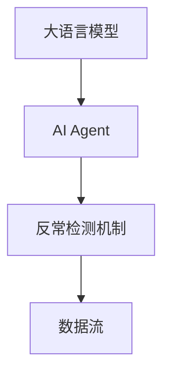
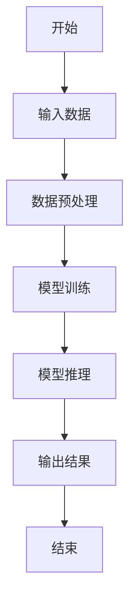
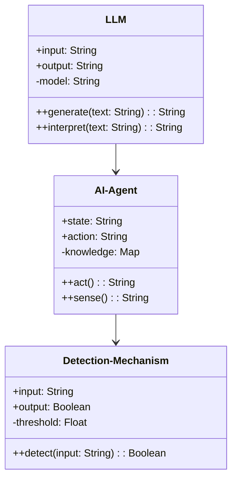
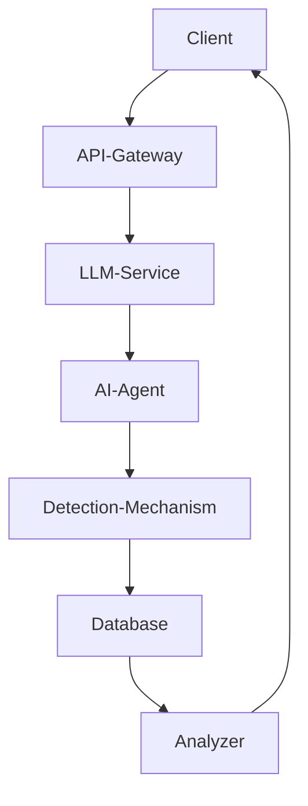
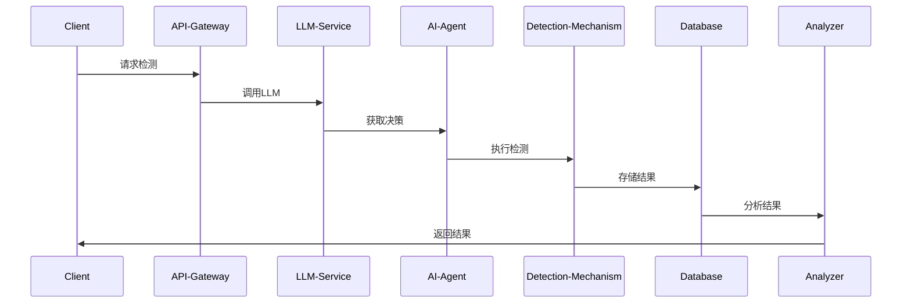

                 


# LLM驱动的AI Agent反常检测机制

**关键词**：LLM、AI Agent、反常检测、异常检测、大语言模型、智能体

**摘要**：本文探讨了LLM驱动的AI Agent反常检测机制的设计与实现。文章首先介绍了背景，包括问题背景、问题描述和解决方法。接着，详细讲解了核心概念与联系，包括核心原理、属性特征对比和ER实体关系图。然后，深入分析了算法原理，包括基于LLM的异常检测模型和算法流程图。随后，介绍了系统分析与架构设计，包括应用场景、系统功能设计、系统架构设计、系统接口设计和系统交互序列图。最后，通过项目实战展示了环境搭建、核心代码实现、案例分析，并总结了最佳实践、小结、注意事项和未来展望。

---

## 第一部分: 背景介绍

### 第1章: 背景介绍

#### 1.1 问题背景

##### 1.1.1 LLM与AI Agent的基本概念
- **大语言模型（LLM）**：LLM是一种基于深度学习的自然语言处理模型，能够理解和生成人类语言，如GPT系列模型。
- **AI Agent**：AI Agent是一种智能体，能够在环境中感知、决策和行动，以实现特定目标。

##### 1.1.2 反常检测的定义与重要性
- **反常检测**：识别数据或行为中的异常模式，用于安全监控、故障诊断等领域。
- **重要性**：及时发现异常，防止损失，提升系统可靠性。

##### 1.1.3 当前反常检测的主要挑战
- 数据稀疏性：异常数据少，难以训练。
- 模型鲁棒性：复杂场景下易出错。
- 实时性要求：需要快速检测。

#### 1.2 问题描述

##### 1.2.1 LLM驱动的AI Agent的工作原理
- LLM提供语言理解和生成能力，AI Agent利用这些能力进行决策和行动。

##### 1.2.2 反常检测在AI Agent中的应用场景
- 网络安全：检测异常流量。
- 设备监控：检测异常运行状态。

##### 1.2.3 反常检测机制的核心目标
- 快速、准确地识别异常行为或数据。

#### 1.3 问题解决

##### 1.3.1 LLM在反常检测中的作用
- 提供语言理解能力，辅助异常识别。

##### 1.3.2 AI Agent如何实现反常检测
- 分析输入数据，与正常模式对比，识别异常。

##### 1.3.3 反常检测机制的边界与外延
- 明确检测范围和应用场景。

#### 1.4 概念结构与核心要素

##### 1.4.1 反常检测机制的组成要素
- 数据源、检测算法、反馈机制。

##### 1.4.2 LLM与AI Agent的协同关系
- LLM提供理解能力，AI Agent提供执行能力。

##### 1.4.3 反常检测机制的数学模型
$$ P(abnormal | input) = \frac{P(input | abnormal)}{P(input)} $$

---

## 第二部分: 核心概念与联系

### 第2章: 核心概念与联系

#### 2.1 核心概念原理

##### 2.1.1 LLM的基本原理
- 基于神经网络，通过大量数据训练，生成语言。

##### 2.1.2 AI Agent的核心机制
- 感知、决策、行动。

##### 2.1.3 反常检测的数学模型
$$ P(x) = \frac{1}{Z}e^{-E(x)} $$

#### 2.2 概念属性特征对比

##### 2.2.1 LLM与传统机器学习模型的对比
| 特性 | LLM | 传统模型 |
|------|------|-----------|
| 数据需求 | 大 | 小       |
| 计算资源 | 高 | 中       |

##### 2.2.2 AI Agent与传统规则引擎的对比
| 特性 | AI Agent | 规则引擎 |
|------|-----------|----------|
| 灵活性 | 高       | 低       |
| 学习能力 | 强     | 无       |

##### 2.2.3 反常检测机制的性能指标
- 准确率、召回率、F1值。

#### 2.3 ER实体关系图


---

## 第三部分: 算法原理讲解

### 第3章: 算法原理讲解

#### 3.1 基于LLM的异常检测模型

##### 3.1.1 模型输入与输出
- 输入：文本数据。
- 输出：异常概率。

##### 3.1.2 模型训练过程
- 使用异常样本和正常样本训练模型。

##### 3.1.3 模型推理过程
- 对输入数据进行概率计算，判断是否异常。

#### 3.2 算法流程图


---

## 第四部分: 系统分析与架构设计

### 第4章: 系统分析与架构设计

#### 4.1 问题场景介绍

##### 4.1.1 应用场景
- 网络安全监控、设备运行状态监测。

#### 4.1.2 系统功能设计

##### 4.1.2.1 领域模型


##### 4.1.2.2 系统架构


##### 4.1.2.3 系统交互


---

## 第五部分: 项目实战

### 第5章: 项目实战

#### 5.1 环境安装与配置

##### 5.1.1 安装Python环境
- 使用Anaconda安装Python 3.9+。

##### 5.1.2 安装依赖库
```bash
pip install transformers torch
```

#### 5.2 核心代码实现

##### 5.2.1 检测模型实现
```python
import torch
import torch.nn as nn

class AnomalyDetector(nn.Module):
    def __init__(self, input_size, hidden_size, output_size):
        super(AnomalyDetector, self).__init__()
        self.rnn = nn.RNN(input_size, hidden_size, 1)
        self.fc = nn.Linear(hidden_size, output_size)

    def forward(self, x):
        out, _ = self.rnn(x)
        out = self.fc(out[:, -1, :])
        return out
```

##### 5.2.2 AI Agent实现
```python
class AI-Agent:
    def __init__(self, model):
        self.model = model

    def sense(self, input):
        return self.model(input)

    def act(self, action):
        return action
```

#### 5.3 案例分析与解读

##### 5.3.1 案例分析
- 网络流量监控：检测异常流量。

##### 5.3.2 案例解读
- 使用LLM分析流量数据，AI Agent执行检测动作。

#### 5.4 项目小结

##### 5.4.1 代码实现的关键点
- 模型训练和优化。

##### 5.4.2 项目部署的注意事项
- 确保计算资源充足。

##### 5.4.3 案例分析的典型经验
- 结合实际场景调整模型参数。

---

## 第六部分: 最佳实践与总结

### 第6章: 总结

#### 6.1 最佳实践 tips

##### 6.1.1 系统设计
- 明确需求，合理设计架构。

##### 6.1.2 代码实现
- 注重代码质量，确保可维护性。

##### 6.1.3 模型优化
- 定期更新模型，提升检测精度。

#### 6.2 小结

##### 6.2.1 核心内容回顾
- LLM驱动的AI Agent反常检测机制的设计与实现。

##### 6.2.2 重点内容复盘
- 算法原理、系统架构、项目实战。

#### 6.3 注意事项

##### 6.3.1 开发中注意事项
- 数据预处理的重要性。

##### 6.3.2 模型部署中的注意事项
- 确保模型稳定运行。

##### 6.3.3 使用中的注意事项
- 定期更新模型，避免过时。

#### 6.4 未来展望

##### 6.4.1 技术趋势
- 结合边缘计算，提升检测效率。

##### 6.4.2 应用场景拓展
- 智慧城市、智能医疗等领域的应用。

##### 6.4.3 挑战与机遇
- 更高的检测精度和更低的计算成本。

---

**作者：AI天才研究院/AI Genius Institute & 禅与计算机程序设计艺术 /Zen And The Art of Computer Programming**

