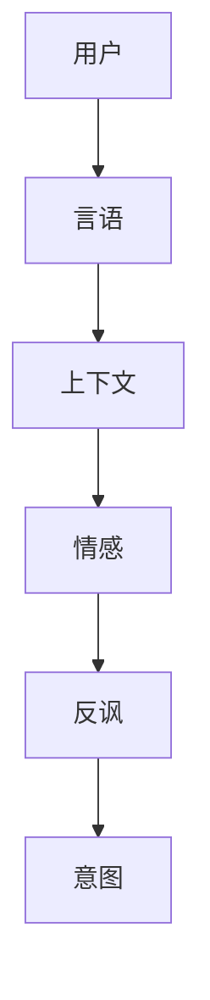
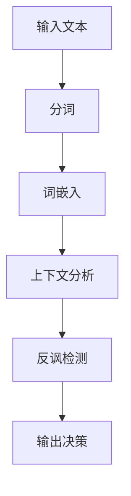
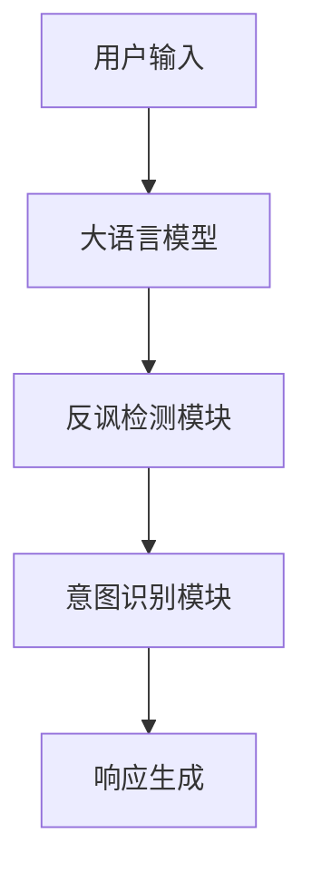

                 


# LLM驱动的AI Agent反讽理解能力

> 关键词：反讽理解能力, LLM, AI Agent, 自然语言处理, 情感分析, 意图识别

> 摘要：本文深入探讨了LLM（大语言模型）驱动的AI Agent如何实现反讽理解能力，分析了反讽理解的核心概念、算法原理、系统架构设计以及项目实战。通过详细的技术分析和代码实现，展示了如何让AI Agent具备识别和处理反讽的能力，从而提升人机交互的自然性和智能性。

---

## 第一部分: LLM驱动的AI Agent反讽理解能力背景介绍

### 第1章: 反讽理解能力的定义与重要性

#### 1.1 反讽的定义与类型

反讽是一种语言表达方式，通常通过表面含义与实际意图的差异来传递特定的情感或态度。它在日常交流中广泛存在，是人类语言理解能力的重要组成部分。

- **定义**：反讽是指通过言此指彼、以反面肯定正面等方式表达与表面意思相反或不同的含义。
- **类型**：
  1. **言语反讽**：通过语言本身的矛盾或夸张来表达反意。
  2. **情境反讽**：基于特定情境产生的反讽效果。
  3. **语境反讽**：依赖于上下文背景的反讽。

反讽的理解需要结合语境、情感和意图进行综合分析，这在人机交互中尤其重要。

#### 1.2 LLM驱动的AI Agent概述

- **LLM（Large Language Model）**：基于Transformer架构的大语言模型，如GPT、BERT等，具备强大的文本生成和理解能力。
- **AI Agent**：智能体，能够感知环境、执行任务并做出决策的智能系统。
- **结合意义**：LLM为AI Agent提供了强大的语言处理能力，使其能够理解和生成自然语言，进而实现更复杂的任务。

#### 1.3 反讽理解能力在AI Agent中的应用前景

- **应用场景**：客服对话、社交媒体分析、智能助手交互等。
- **优势**：提升用户体验，增强人机交互的自然性。
- **挑战**：反讽的理解需要结合上下文、情感和意图，实现难度较高。

---

### 第2章: 反讽理解能力的核心概念与联系

#### 2.1 反讽理解的核心概念

- **语境分析**：反讽的理解高度依赖于上下文信息。
- **情感分析**：反讽通常带有强烈的情感色彩。
- **意图识别**：反讽的意图往往与表面意思相反或不同。

#### 2.2 反讽理解能力的实体关系图



#### 2.3 反讽理解能力的算法原理



---

### 第3章: 反讽理解能力的数学模型与算法实现

#### 3.1 反讽理解的数学模型

- **情感分析模型**：基于词嵌入和深度学习模型（如LSTM、Transformer）进行情感分类。
- **反讽检测模型**：通过特征工程和模型微调，提升反讽检测的准确率。

#### 3.2 反讽理解算法的实现

- **数据预处理**：分词、去除停用词、提取特征。
- **模型训练**：使用预训练语言模型进行微调。
- **模型推理**：基于训练好的模型进行反讽检测。

---

### 第4章: 反讽理解能力的系统架构与设计

#### 4.1 系统架构设计



#### 4.2 系统功能设计

- **数据预处理模块**：处理输入文本，提取特征。
- **模型训练模块**：训练反讽检测模型和意图识别模型。
- **模型推理模块**：实时检测反讽并生成响应。
- **结果分析模块**：分析模型输出，优化性能。

---

### 第5章: 反讽理解能力的项目实战

#### 5.1 项目环境安装

```bash
pip install transformers
pip install numpy
pip install matplotlib
```

#### 5.2 核心代码实现

```python
from transformers import AutoTokenizer, AutoModelForSequenceClassification
import torch

class SarcasmDetector:
    def __init__(self, model_name):
        self.tokenizer = AutoTokenizer.from_pretrained(model_name)
        self.model = AutoModelForSequenceClassification.from_pretrained(model_name)

    def detect_sarcasm(self, text):
        inputs = self.tokenizer.encode(text, return_tensors="pt")
        outputs = self.model(inputs)
        prediction = torch.argmax(outputs.logits, dim=1).item()
        return prediction

# 使用示例
detector = SarcasmDetector("your_model_name")
text = "This is great work!"
result = detector.detect_sarcasm(text)
print(f"Sarcasm detected: {result}")
```

#### 5.3 代码解读与分析

- **模型加载**：使用预训练模型进行反讽检测。
- **输入处理**：将文本转换为模型可接受的格式。
- **模型推理**：生成反讽检测结果。

---

## 第6章: 总结与最佳实践

### 6.1 总结

- 反讽理解能力是LLM驱动的AI Agent的重要能力。
- 通过结合语境、情感和意图，可以实现高效的反讽检测。

### 6.2 最佳实践 Tips

- **数据质量**：确保训练数据的多样性和代表性。
- **模型优化**：通过微调和迁移学习提升性能。
- **用户体验**：在实际应用中注重反馈机制，优化交互体验。

---

## 作者：AI天才研究院/AI Genius Institute & 禅与计算机程序设计艺术 /Zen And The Art of Computer Programming

---

以上是《LLM驱动的AI Agent反讽理解能力》的详细目录大纲和文章内容，涵盖了从背景介绍到项目实战的各个方面，确保读者能够全面理解和掌握反讽理解能力在AI Agent中的实现与应用。

