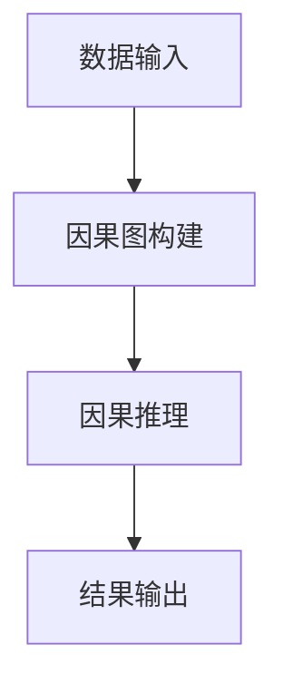

                 


# LLM驱动的AI Agent因果关系发现技术

> 关键词：LLM，AI Agent，因果关系，因果发现，机器学习，人工智能

> 摘要：本文深入探讨了利用大语言模型（LLM）驱动的AI代理（AI Agent）进行因果关系发现的技术。文章首先介绍了因果关系发现的重要性及其在AI Agent中的作用，然后详细分析了因果关系的基本概念、算法原理和系统架构。通过实际项目案例，展示了如何利用LLM驱动AI Agent实现因果关系发现，并提供了系统设计和实现的详细步骤。

---

## 第一部分: LLM驱动的AI Agent因果关系发现技术背景

### 第1章: 问题背景与问题描述

#### 1.1 问题背景
大语言模型（LLM）近年来在自然语言处理领域取得了显著进展，但其能力不仅仅局限于生成文本。LLM能够通过分析数据中的模式和关系，帮助AI Agent发现因果关系，从而在更复杂的任务中发挥作用。因果关系发现是理解数据内在结构的关键，能够使AI Agent做出更合理的决策和推理。

#### 1.2 问题描述
因果关系发现是指识别变量之间的因果关系，而不仅仅是相关性。传统的统计方法往往只能发现相关性，而无法确定因果方向。AI Agent需要具备因果推理能力，以便在动态环境中进行有效的决策。LLM驱动的AI Agent通过结合自然语言理解和因果推理，能够更准确地建模现实世界中的因果关系。

#### 1.3 问题解决方法
基于LLM的AI Agent通过因果图模型（Directed Acyclic Graph, DAG）来表示因果关系。通过分析数据中的条件独立性，算法能够逐步构建因果图，识别因果关系。LLM不仅提供自然语言理解能力，还能够辅助因果推理，使AI Agent具备更强大的分析能力。

#### 1.4 概念结构与核心要素
因果关系发现的核心要素包括因果图模型、条件独立性测试和因果推理算法。LLM在其中的作用是提供语义理解能力，帮助AI Agent更好地解析数据中的因果关系。

---

### 第2章: 核心概念与联系

#### 2.1 因果关系的基本概念
因果关系是指一个变量的变化导致另一个变量变化的关系。与相关性不同，因果关系关注的是变量之间的“原因”和“结果”关系。

#### 2.2 LLM驱动的AI Agent
AI Agent是一种能够感知环境、执行任务并做出决策的智能体。LLM为AI Agent提供了强大的自然语言理解和生成能力，使其能够处理复杂的语义信息。

#### 2.3 核心概念的联系
因果关系发现与AI Agent的结合使AI Agent能够理解数据中的因果结构，从而做出更合理的决策。LLM通过提供语义理解能力，增强了AI Agent的因果推理能力。

---

## 第二部分: 因果关系发现的算法原理

### 第3章: 基于约束的因果发现算法

#### 3.1 算法原理
基于约束的算法通过测试变量之间的条件独立性来构建因果图。如果两个变量在给定其他变量的条件下独立，则认为它们之间没有直接的因果关系。

#### 3.2 算法步骤
1. 初始化一个空的因果图。
2. 对每对变量，测试它们在其他变量下的条件独立性。
3. 如果条件独立性测试通过，则添加边。
4. 重复上述步骤，直到所有变量都处理完毕。

#### 3.3 数学模型
条件独立性测试可以通过计算变量之间的互信息来实现：
$$I(x, y | z) = I(x, y) - I(x, z) - I(y, z)$$

### 第4章: 基于评分的因果发现算法

#### 4.1 算法原理
基于评分的算法通过评估不同的因果图结构，选择最优的图结构。评分函数通常基于贝叶斯准则，考虑图结构的复杂性和数据的似然值。

#### 4.2 算法步骤
1. 生成所有可能的因果图结构。
2. 对每个图结构计算其评分。
3. 选择评分最高的图结构作为最优因果图。

#### 4.3 数学模型
评分函数可以表示为：
$$\text{score}(G) = \sum_{i=1}^{n} \log P(x_i | \text{pa}(x_i))$$

### 第5章: 基于搜索的因果发现算法

#### 5.1 算法原理
基于搜索的算法通过系统地搜索所有可能的因果图结构，评估每个结构的合理性，最终选择最优的因果图。

#### 5.2 算法步骤
1. 初始化一个空的因果图。
2. 添加边，构建可能的图结构。
3. 评估每个图结构的合理性。
4. 选择最优的图结构。

#### 5.3 数学模型
合理性评估通常基于变量之间的条件独立性测试：
$$P(x) = \prod_{i=1}^{n} P(x_i | \text{pa}(x_i))$$

---

## 第三部分: 系统分析与架构设计

### 第6章: 系统功能设计

#### 6.1 领域模型设计
因果关系发现系统需要能够处理多变量数据，构建因果图模型，并支持因果推理。

#### 6.2 系统架构设计
系统架构包括数据输入、因果图构建、因果推理和结果输出四个模块。

#### 6.3 接口设计
系统提供API接口，支持外部调用因果图构建和因果推理功能。

#### 6.4 交互流程
用户输入数据，系统构建因果图，并返回因果关系结果。

### 第7章: 系统架构图



---

## 第四部分: 项目实战

### 第8章: 项目环境安装

#### 8.1 环境要求
- Python 3.8+
- 安装必要的Python库，如networkx、scipy等。

#### 8.2 安装步骤
```bash
pip install networkx scipy
```

### 第9章: 核心实现代码

#### 9.1 因果图构建代码
```python
import networkx as nx

def build_causal_graph(data):
    G = nx.DiGraph()
    # 添加节点
    nodes = list(data.columns)
    G.add_nodes_from(nodes)
    # 添加边
    for i in range(len(nodes)):
        for j in range(i+1, len(nodes)):
            if is_independent(data, nodes[i], nodes[j], nodes[:i]):
                G.add_edge(nodes[i], nodes[j])
    return G
```

#### 9.2 因果推理代码
```python
def causal_inference(G, target):
    for node in G.nodes():
        if node == target:
            continue
        if G.has_edge(node, target):
            print(f"{node} 是 {target} 的原因")
```

### 第10章: 案例分析

#### 10.1 数据准备
```python
data = pd.DataFrame({
    'x': [1, 2, 3, 4, 5],
    'y': [2, 4, 6, 8, 10],
    'z': [3, 6, 9, 12, 15]
})
```

#### 10.2 因果图构建
```python
G = build_causal_graph(data)
```

#### 10.3 因果推理
```python
causal_inference(G, 'y')
```

---

## 第五部分: 总结与展望

### 第11章: 总结

通过本文的探讨，我们了解了如何利用LLM驱动的AI Agent进行因果关系发现。因果关系发现是理解数据内在结构的关键，能够使AI Agent具备更强大的分析能力。

### 第12章: 展望

未来的研究方向包括优化因果发现算法的效率，探索新的因果推理方法，以及在更多领域中的应用。

---

## 作者

作者：AI天才研究院/AI Genius Institute & 禅与计算机程序设计艺术 /Zen And The Art of Computer Programming

---

以上是《LLM驱动的AI Agent因果关系发现技术》的完整内容，涵盖了从背景介绍到项目实战的各个方面，希望对读者有所帮助。

