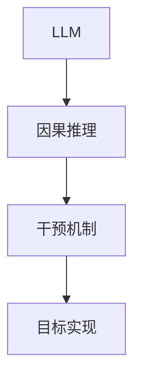
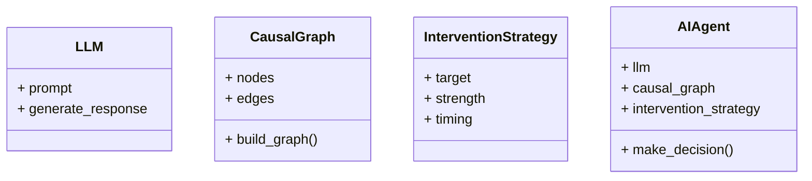

                 


# LLM驱动的AI Agent因果推理与干预

## 关键词：LLM, AI Agent, 因果推理, 干预机制, 大语言模型

## 摘要：  
本文探讨了利用大语言模型（LLM）驱动的AI Agent进行因果推理与干预的实现方法。通过分析因果关系和干预机制的核心概念、算法原理、系统架构以及实际案例，本文旨在揭示如何通过LLM实现智能决策和干预优化。

---

# 第一部分: 背景介绍

## 第1章: LLM驱动的AI Agent因果推理与干预概述

### 1.1 问题背景
#### 1.1.1 人工智能与大语言模型的演进  
近年来，人工智能（AI）技术迅速发展，尤其是大语言模型（LLM）的崛起，为AI Agent的智能化提供了强大的技术支持。LLM通过自然语言处理（NLP）能力，能够理解并生成人类语言，从而赋予AI Agent更强大的交互能力和决策能力。  

#### 1.1.2 因果推理在AI系统中的重要性  
因果推理是指识别变量之间的因果关系，并推断干预某一变量会对其他变量产生何种影响。在AI系统中，因果推理是实现智能决策和优化的核心技术。例如，在医疗领域，因果推理可以帮助AI Agent理解药物对患者的具体影响，并制定最佳治疗方案。  

#### 1.1.3 干预机制在智能决策中的作用  
干预机制是指通过改变系统中的某些变量，以达到预期目标的过程。在AI Agent中，干预机制能够根据因果推理的结果，动态调整系统行为，从而优化决策效果。例如，在金融领域，AI Agent可以通过干预机制优化投资组合，以最大化收益并最小化风险。  

### 1.2 问题描述  
#### 1.2.1 LLM驱动的AI Agent的基本概念  
LLM驱动的AI Agent是一种结合了大语言模型和智能体技术的系统。它能够通过自然语言理解和生成，与用户或环境进行交互，并根据因果推理结果做出决策和干预。  

#### 1.2.2 因果推理与干预的核心问题  
因果推理的核心问题是如何从数据中识别因果关系，并验证这些关系的可靠性。干预机制的核心问题是如何根据因果关系，设计有效的干预策略，并评估干预效果。  

#### 1.2.3 当前技术的局限性与挑战  
当前技术在因果推理与干预方面仍面临诸多挑战，例如如何处理复杂的因果关系网络，如何保证干预的可解释性和可控制性，以及如何在动态环境中实时调整干预策略。  

### 1.3 问题解决  
#### 1.3.1 LLM驱动AI Agent的解决方案  
通过将LLM与AI Agent结合，可以充分发挥大语言模型的自然语言处理能力，增强AI Agent的理解和生成能力，从而更好地支持因果推理与干预。  

#### 1.3.2 因果推理与干预的实现路径  
因果推理与干预的实现路径包括：  
1. 构建因果图模型，识别变量间的因果关系。  
2. 基于因果图设计干预策略。  
3. 使用LLM辅助因果推理与干预的实现。  

#### 1.3.3 技术实现的关键点  
技术实现的关键点包括：  
- 如何利用LLM辅助因果图的构建。  
- 如何设计高效的干预策略。  
- 如何评估干预效果并优化干预过程。  

### 1.4 边界与外延  
#### 1.4.1 技术边界  
LLM驱动的AI Agent因果推理与干预技术的边界主要集中在因果关系的识别和干预策略的设计上。目前，技术尚未完全解决动态环境下的实时干预问题。  

#### 1.4.2 应用场景的外延  
LLM驱动的AI Agent因果推理与干预技术的应用场景广泛，包括医疗、金融、教育、交通等领域。  

#### 1.4.3 与其他技术的关系  
该技术与自然语言处理（NLP）、机器学习（ML）、强化学习（RL）等技术密切相关。  

### 1.5 核心要素组成  
#### 1.5.1 LLM的作用  
LLM在因果推理与干预中的作用主要体现在自然语言理解与生成、因果关系识别和干预策略优化等方面。  

#### 1.5.2 因果推理的模型  
因果推理模型包括因果图模型、结构方程模型等。  

#### 1.5.3 干预机制的设计  
干预机制的设计需要考虑干预目标、干预强度、干预时机等因素。  

---

# 第二部分: 核心概念与联系

## 第2章: 因果推理与干预的核心概念

### 2.1 因果推理的基本原理
#### 2.1.1 因果关系的定义  
因果关系是指一个事件（原因）导致另一个事件（结果）发生的必然联系。例如，下雨（原因）导致地面湿滑（结果）。  

#### 2.1.2 因果图的构建  
因果图是一种用于表示变量间因果关系的有向图。通过构建因果图，可以清晰地展示变量间的因果关系。  

#### 2.1.3 调度因果推理的流程  
因果推理的流程包括：  
1. 收集数据。  
2. 构建因果图模型。  
3. 识别因果关系。  
4. 验证因果关系。  

### 2.2 干预机制的实现
#### 2.2.1 干预的基本概念  
干预机制是指通过改变系统中的某些变量，以达到预期目标的过程。例如，在教育领域，AI Agent可以通过干预机制调整学生的学习计划，以提高学习效果。  

#### 2.2.2 干预策略的设计  
干预策略的设计需要考虑以下因素：  
- 干预目标：明确干预的目的。  
- 干预强度：确定干预的力度。  
- 干预时机：选择干预的最佳时机。  

#### 2.2.3 干预效果的评估  
干预效果的评估可以通过实验方法进行，例如A/B测试。通过比较干预组和对照组的差异，可以评估干预效果。  

### 2.3 核心概念对比表  
| 概念 | 定义 | 属性 | 示例 |
|------|------|------|------|
| 因果关系 | 变量间的因果联系 | 可传递性、可解释性 | 吸烟 → 肺癌 |
| 干预机制 | 通过改变变量实现目标 | 可控性、可预测性 | 调整剂量 |

### 2.4 ER实体关系图  



---

# 第三部分: 算法原理讲解

## 第3章: 算法原理

### 3.1 因果推理算法  
因果推理算法的核心是构建因果图模型并识别因果关系。常用的算法包括结构方程模型（SEM）、贝叶斯网络等。  

#### 3.1.1 结构方程模型  
结构方程模型是一种用于估计因果关系的统计方法。通过构建结构方程，可以估计变量间的因果关系强度。  

#### 3.1.2 贝叶斯网络  
贝叶斯网络是一种有向无环图，用于表示变量间的概率关系。通过贝叶斯网络，可以进行概率推理和决策。  

### 3.2 干预算法  
干预算法的核心是设计干预策略并评估干预效果。常用的算法包括反事实推理、平均处理效应（ATE）等。  

#### 3.2.1 反事实推理  
反事实推理是一种用于评估干预效果的方法。通过假设干预发生或不发生，可以计算干预对结果的影响。  

#### 3.2.2 平均处理效应（ATE）  
平均处理效应是指在全体样本中，干预对结果的平均影响。ATE可以通过实验或观测数据进行估计。  

### 3.3 算法实现  
以下是一个简单的因果推理与干预算法的Python实现示例：  

```python
import pandas as pd
from causalnex.structure import AutoGraphicalModel
from causalnex.inference import do_calculus

# 构建因果图模型
model = AutoGraphicalModel()
model.add_edges([('X', 'Y'), ('Z', 'X')])
model.view_model()

# 进行因果推理
do_calculus(model, interventions={'X': 1}, target='Y')
```

### 3.4 数学模型与公式  
因果推理的数学模型包括结构方程模型和贝叶斯网络。例如，结构方程模型的数学表达式如下：  

$$ Y = \beta X + \epsilon $$  

其中，$Y$ 是结果变量，$X$ 是原因变量，$\beta$ 是因果系数，$\epsilon$ 是误差项。  

干预的数学模型可以表示为：  

$$ Y_{do(X=1)} = \beta X + \epsilon $$  

---

# 第四部分: 系统分析与架构设计

## 第4章: 系统分析与架构设计

### 4.1 问题场景介绍  
以医疗领域为例，考虑一个AI Agent帮助医生制定治疗方案的场景。医生需要根据患者的症状和病史，利用因果推理确定病因，并设计干预策略。  

### 4.2 系统功能设计  
系统功能包括：  
1. 数据收集与处理。  
2. 因果图构建与推理。  
3. 干预策略设计与优化。  

### 4.3 领域模型设计  
领域模型是一个用于表示系统功能的类图。以下是一个简单的领域模型：  



### 4.4 系统架构设计  
系统架构包括前端、后端和数据层。前端用于用户交互，后端负责业务逻辑处理，数据层存储和管理数据。  


---

# 第五部分: 项目实战

## 第5章: 项目实战

### 5.1 环境安装  
安装必要的Python库，例如 `pandas`, `numpy`, `causalnex` 等。  

### 5.2 代码实现  
以下是一个简单的因果推理与干预的Python代码示例：  

```python
import causalnex
from causalnex.structure import AutoGraphicalModel
from causalnex.inference import do_calculus

# 数据准备
data = pd.DataFrame({
    'X': [0, 1, 0, 1],
    'Y': [0, 1, 0, 1],
    'Z': [0, 0, 1, 1]
})

# 构建因果图模型
model = AutoGraphicalModel()
model.add_edges([('X', 'Y'), ('Z', 'X')])
model.view_model()

# 进行因果推理
do_calculus(model, interventions={'X': 1}, target='Y')
```

### 5.3 案例分析  
以医疗领域的案例为例，分析如何利用因果推理与干预优化治疗方案。  

---

# 第六部分: 最佳实践与小结

## 第6章: 最佳实践与小结

### 6.1 小结  
本文详细介绍了LLM驱动的AI Agent因果推理与干预的核心概念、算法原理、系统架构以及项目实战。通过这些内容，读者可以全面理解如何利用LLM实现智能决策和优化。  

### 6.2 注意事项  
在实际应用中，需要注意以下几点：  
1. 数据质量对因果推理结果的影响。  
2. 干预策略的可解释性和可控制性。  
3. 动态环境下的实时干预问题。  

### 6.3 拓展阅读  
推荐读者阅读以下书籍和论文：  
1. 《因果推断入门》  
2. 《大语言模型与人工智能》  

---

# 作者：AI天才研究院/AI Genius Institute & 禅与计算机程序设计艺术 /Zen And The Art of Computer Programming

