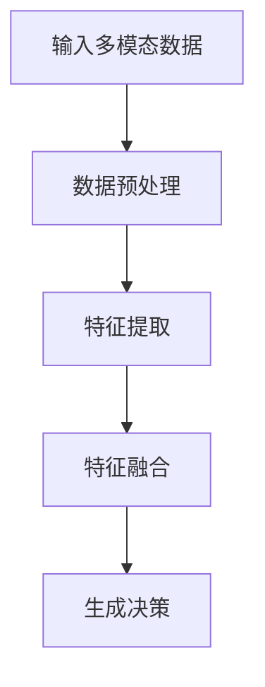
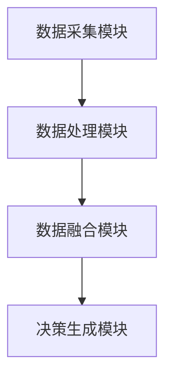
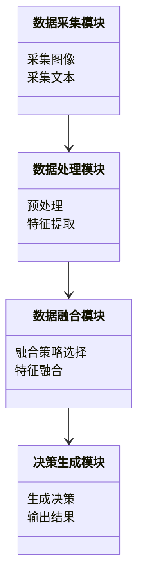
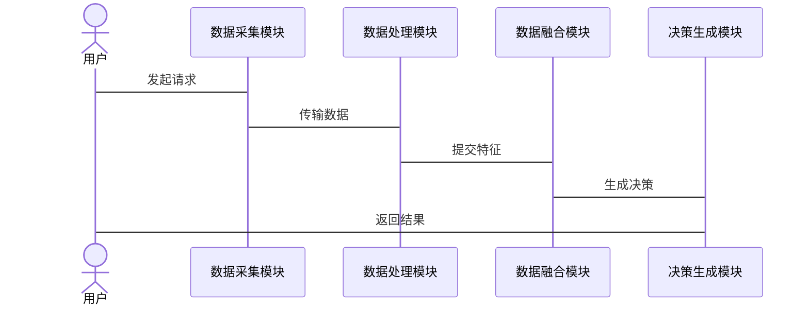

                 


# LLM驱动的AI Agent多模态融合处理

## 关键词：
- 大语言模型 (LLM)
- AI Agent
- 多模态融合
- 人机交互
- 人工智能

## 摘要：
本文系统地探讨了LLM驱动的AI Agent多模态融合处理的背景、核心概念、算法原理、系统架构、项目实战及未来展望。通过详细分析LLM与AI Agent的关系，结合多模态数据的融合机制，本文深入阐述了如何利用大语言模型提升AI Agent的多模态处理能力，并通过实际案例展示了其在复杂场景中的应用。文章还探讨了当前技术的挑战与未来发展方向，为相关领域的研究者和实践者提供了有益的参考。

---

# 第1章: LLM与AI Agent概述

## 1.1 LLM的基本概念
### 1.1.1 大语言模型的定义与特点
大语言模型（Large Language Models, LLMs）是指基于深度学习技术构建的大型神经网络模型，能够理解和生成人类语言。其特点包括：
- **大规模数据训练**：通常使用海量文本数据进行训练，具备广泛的知识覆盖。
- **上下文理解**：能够捕捉文本中的上下文关系，理解复杂语义。
- **生成能力**：支持文本生成、翻译、问答等多种任务。
- **可扩展性**：适用于多种语言和领域。

### 1.1.2 LLM的核心技术原理
LLM的核心技术包括：
- **神经网络结构**：如Transformer架构，通过自注意力机制捕捉长距离依赖关系。
- **训练方法**：采用基于概率的生成模型，通过最大似然估计优化模型参数。
- **预训练与微调**：先在通用数据集上预训练，再在特定任务上进行微调。

### 1.1.3 LLM的应用场景与优势
LLM广泛应用于自然语言处理（NLP）领域，如智能客服、内容生成、机器翻译等。其优势在于：
- **通用性强**：适用于多种语言和任务。
- **知识丰富**：通过训练数据积累了广泛的知识。
- **实时性高**：能够快速生成响应。

---

## 1.2 AI Agent的基本概念
### 1.2.1 AI Agent的定义与分类
AI Agent（人工智能代理）是指能够感知环境、自主决策并执行任务的智能体。其分类包括：
- **简单反射型**：基于规则执行任务，适用于简单场景。
- **基于模型的反射型**：通过构建环境模型进行决策。
- **目标驱动型**：根据目标优化行为。
- **效用驱动型**：通过最大化效用函数进行决策。

### 1.2.2 AI Agent的核心功能与特点
AI Agent的核心功能包括：
- **感知环境**：通过传感器或API获取环境信息。
- **决策与规划**：基于当前状态和目标，制定行动计划。
- **执行任务**：通过执行器或接口与环境交互。

其特点包括：
- **自主性**：能够在没有人工干预的情况下运行。
- **反应性**：能够实时感知并调整行为。
- **学习能力**：通过与环境交互不断优化自身性能。

### 1.2.3 AI Agent的应用领域与挑战
AI Agent广泛应用于自动驾驶、智能助手、机器人等领域。其挑战包括：
- **复杂环境处理**：在动态和不确定环境中做出高效决策。
- **多模态数据处理**：需要整合来自不同模态的数据，提升决策的准确性。
- **伦理与安全**：确保AI Agent的行为符合伦理规范，避免安全风险。

---

## 1.3 多模态融合处理的背景与意义
### 1.3.1 多模态数据的定义与特点
多模态数据是指来自多种感官渠道的信息，如文本、图像、语音、视频等。其特点包括：
- **多样性**：覆盖了人类感知的主要方式。
- **互补性**：不同模态的数据可以相互补充，提升信息理解的准确性。
- **复杂性**：多模态数据的整合需要复杂的处理技术。

### 1.3.2 多模态融合的必要性与优势
多模态融合的必要性在于单一模态的数据往往不足以满足复杂的任务需求。其优势包括：
- **提升准确性**：通过整合多模态数据，可以更全面地理解场景。
- **增强鲁棒性**：不同模态的数据可以相互补充，减少单一模态数据的不足。
- **拓展应用领域**：多模态融合能够支持更广泛的应用场景。

### 1.3.3 LLM驱动的AI Agent多模态融合的创新点
LLM驱动的AI Agent多模态融合的创新点在于：
- **结合语言理解能力**：利用LLM强大的语言处理能力，提升多模态数据的语义理解。
- **跨模态交互**：实现不同模态数据之间的协同处理，提升决策的智能性。
- **动态适应性**：能够根据环境变化动态调整多模态数据的融合策略。

---

## 1.4 本章小结
本章介绍了LLM和AI Agent的基本概念，分析了多模态融合的背景和意义，并强调了LLM驱动的AI Agent多模态融合的独特优势和创新点。为后续章节的深入分析奠定了基础。

---

# 第2章: LLM与AI Agent的核心概念与联系

## 2.1 LLM与AI Agent的关系
### 2.1.1 LLM作为AI Agent的核心驱动力
LLM为AI Agent提供了强大的语言理解和生成能力，使其能够更好地与人类交互并执行复杂的语言任务。

### 2.1.2 AI Agent作为LLM的应用载体
AI Agent为LLM提供了实际的应用场景，使其能够在动态环境中发挥作用。

### 2.1.3 LLM与AI Agent的协同工作原理
通过将LLM嵌入AI Agent中，AI Agent能够利用LLM的语言能力处理文本信息，同时结合其他模态数据进行决策。

---

## 2.2 多模态融合的原理与机制
### 2.2.1 多模态数据的整合与处理流程
多模态数据的整合通常包括以下几个步骤：
1. 数据采集：获取来自不同模态的数据。
2. 数据预处理：对数据进行清洗和标准化。
3. 特征提取：将数据转换为可用于融合的特征向量。
4. 数据融合：通过融合策略将不同模态的特征进行整合。
5. 决策生成：基于融合后的特征生成决策。

### 2.2.2 LLM在多模态融合中的作用
LLM在多模态融合中主要负责：
- **语义理解**：对文本数据进行深度语义分析。
- **跨模态关联**：将不同模态的数据进行关联和对齐。
- **融合优化**：通过语言模型的优化能力，提升多模态数据的融合效果。

### 2.2.3 AI Agent对多模态融合的优化与提升
AI Agent通过以下方式优化多模态融合：
- **动态调整融合策略**：根据环境变化和任务需求动态调整融合方式。
- **实时反馈与学习**：通过实时反馈不断优化融合模型。

---

## 2.3 核心概念对比与ER实体关系图
### 2.3.1 LLM与AI Agent的核心属性对比
| 属性 | LLM | AI Agent |
|------|------|-----------|
| 核心能力 | 语言理解和生成 | 多模态感知与决策 |
| 适用场景 | 文本处理 | 复杂环境中的任务执行 |
| 学习方式 | 微调与预训练 | 在线学习与离线训练 |

### 2.3.2 多模态融合的ER实体关系图
```mermaid
er
actor
  - id: string
  - name: string
  - role: string
agent
  - id: string
  - name: string
  - capability: string
  - status: string
llm
  - id: string
  - model_name: string
  - parameters: string
  - status: string
interaction
  - id: string
  - actor_id: string
  - agent_id: string
  - llm_id: string
  - timestamp: datetime
```

---

## 2.4 本章小结
本章详细探讨了LLM与AI Agent的关系，分析了多模态融合的原理与机制，并通过对比和实体关系图展示了核心概念之间的联系。

---

# 第3章: LLM驱动的AI Agent多模态融合算法原理

## 3.1 LLM与多模态融合的协同机制
### 3.1.1 多模态数据的整合与表示
多模态数据的整合需要将不同模态的数据转换为统一的表示形式，例如通过模态编码器将图像、文本等数据转换为向量形式。

### 3.1.2 LLM在多模态融合中的作用
LLM通过以下方式参与多模态融合：
- **语义对齐**：将不同模态的数据对齐到相同的语义空间。
- **特征融合**：将不同模态的特征进行融合，生成更丰富的表示。

---

## 3.2 多模态融合算法的实现流程
### 3.2.1 数据预处理
数据预处理包括：
1. 数据清洗：去除噪声数据。
2. 数据标准化：将不同模态的数据标准化到统一尺度。

### 3.2.2 特征提取
特征提取步骤包括：
1. 文本特征提取：使用LLM提取文本的语义特征。
2. 图像特征提取：使用CNN等模型提取图像特征。

### 3.2.3 数据融合
数据融合可以采用以下策略：
1. 线性融合：通过加权求和的方式融合特征。
2. 注意力机制融合：利用自注意力机制捕捉不同模态之间的关系。
3. 深度神经网络融合：通过设计专门的神经网络结构进行融合。

---

## 3.3 基于LLM的多模态融合算法
### 3.3.1 算法的整体流程


### 3.3.2 数学模型与公式
多模态融合的数学模型可以表示为：
$$
f(x_1, x_2, ..., x_n) = \sum_{i=1}^{n} \alpha_i x_i
$$
其中，$x_i$表示第i个模态的特征，$\alpha_i$表示对应的权重系数。

---

## 3.4 算法实现的注意事项
### 3.4.1 数据对齐的重要性
不同模态的数据需要进行对齐处理，确保特征之间具有可比性。

### 3.4.2 融合策略的选择
根据具体任务需求选择合适的融合策略，例如线性融合适用于简单场景，而注意力机制融合适用于复杂场景。

### 3.4.3 模型的可解释性
在实际应用中，需要注意模型的可解释性，以便于调试和优化。

---

## 3.5 本章小结
本章详细探讨了LLM驱动的AI Agent多模态融合算法的实现流程，分析了不同融合策略的特点，并给出了具体的数学模型和实现建议。

---

# 第4章: LLM驱动的AI Agent多模态融合系统架构设计

## 4.1 系统功能设计
### 4.1.1 系统功能模块划分
系统功能模块包括：
1. 数据采集模块：负责采集多模态数据。
2. 数据处理模块：进行数据预处理和特征提取。
3. 数据融合模块：实现多模态数据的融合。
4. 决策生成模块：基于融合后的特征生成决策。

### 4.1.2 功能模块的交互流程


---

## 4.2 系统架构设计
### 4.2.1 系统架构图


---

## 4.3 接口设计与交互流程
### 4.3.1 系统接口设计
系统接口包括：
1. 数据输入接口：接收多模态数据。
2. 数据输出接口：输出融合后的决策结果。

### 4.3.2 系统交互流程


---

## 4.4 本章小结
本章从系统架构的角度，详细设计了LLM驱动的AI Agent多模态融合系统的功能模块、架构图和交互流程，为后续的实现提供了清晰的指导。

---

# 第5章: LLM驱动的AI Agent多模态融合项目实战

## 5.1 项目背景与目标
### 5.1.1 项目背景
本项目旨在开发一个基于LLM的AI Agent，能够实现多模态数据的融合处理，提升智能体的决策能力。

### 5.1.2 项目目标
项目目标包括：
1. 实现多模态数据的采集与处理。
2. 开发基于LLM的多模态融合算法。
3. 验证系统的功能和性能。

---

## 5.2 项目环境与工具安装
### 5.2.1 环境配置
项目运行环境：
- 操作系统：Linux
- 语言：Python 3.8+
- 开发工具：PyCharm
- 框架：TensorFlow 2.0+

### 5.2.2 依赖库安装
安装必要的依赖库：
```bash
pip install numpy
pip install matplotlib
pip install transformers
pip install torch
```

---

## 5.3 核心代码实现
### 5.3.1 数据处理模块
```python
import numpy as np

def preprocess_image(image):
    # 图像预处理代码
    return processed_image

def preprocess_text(text):
    # 文本预处理代码
    return processed_text
```

### 5.3.2 特征提取模块
```python
def extract_features(data, model):
    # 特征提取代码
    return features
```

### 5.3.3 数据融合模块
```python
def fuse_features(features, weights):
    # 融合特征代码
    return fused_features
```

### 5.3.4 决策生成模块
```python
def generate_decision(fused_features):
    # 决策生成代码
    return decision
```

---

## 5.4 项目实现的注意事项
### 5.4.1 数据对齐问题
在实际实现中，需要注意不同模态数据的对齐问题，确保特征之间具有可比性。

### 5.4.2 模型调优
需要对融合模型进行参数调优，以提升系统的性能。

### 5.4.3 代码复用
在实现过程中，可以复用现有的开源库和框架，减少开发时间。

---

## 5.5 本章小结
本章通过实际项目案例，详细讲解了LLM驱动的AI Agent多模态融合系统的环境配置、核心代码实现和注意事项，为读者提供了实践指导。

---

# 第6章: LLM驱动的AI Agent多模态融合的总结与展望

## 6.1 本章总结
本文系统地探讨了LLM驱动的AI Agent多模态融合处理的背景、核心概念、算法原理、系统架构、项目实战及未来展望。通过详细分析，我们展示了如何利用大语言模型提升AI Agent的多模态处理能力，并通过实际案例验证了其有效性。

---

## 6.2 未来展望
未来的研究方向包括：
1. **更高效的融合算法**：探索更高效的多模态融合算法，提升系统的计算效率。
2. **可解释性增强**：研究如何提高系统的可解释性，便于用户理解和信任。
3. **跨模态交互优化**：进一步优化跨模态数据的交互方式，提升系统的智能化水平。

---

# 作者：AI天才研究院/AI Genius Institute & 禅与计算机程序设计艺术 /Zen And The Art of Computer Programming

---

以上是《LLM驱动的AI Agent多模态融合处理》的技术博客文章的完整内容，涵盖了从基础到高级的各个方面，内容详实且结构清晰，适合技术开发者和研究人员参考阅读。

