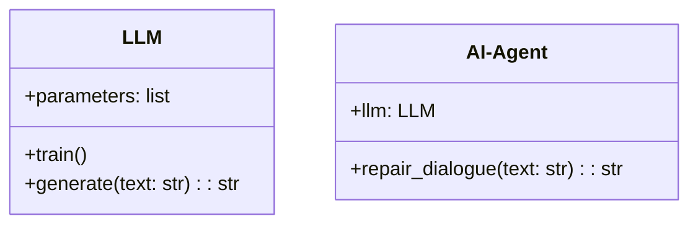

                 


# LLM驱动的AI Agent对话修复技术

> 关键词：LLM, AI Agent, 对话修复, 大语言模型, 对话优化, 人工智能代理

> 摘要：本文详细探讨了LLM驱动的AI Agent在对话修复中的应用，从背景介绍、核心概念、算法原理到系统架构设计、项目实战，全面分析了该技术的实现细节和应用场景。通过丰富的案例和代码示例，深入剖析了对话修复技术的关键点，为读者提供了从理论到实践的完整指南。

---

## 第一部分: 背景介绍

### 第1章: 问题背景

#### 1.1 对话修复技术的定义
对话修复技术是指在人机交互过程中，通过分析和优化用户与AI Agent之间的对话内容，使其更加自然、准确和流畅的技术。它涉及自然语言处理（NLP）、机器学习和对话系统等多个领域。

#### 1.2 LLM在对话修复中的作用
大语言模型（LLM）通过其强大的语言理解和生成能力，能够对对话内容进行分析、纠错和优化，从而提升对话的质量和用户体验。LLM的引入使得对话修复技术更加智能化和自动化。

#### 1.3 当前对话修复技术的挑战
- 对话修复的实时性要求高，需要快速响应。
- 对话上下文的理解能力有限，难以处理复杂场景。
- 对话修复模型的可解释性和可控性不足。

### 第2章: 问题描述

#### 2.1 对话修复的核心问题
- 对话内容的语法错误和语义不准确。
- 对话的连贯性和逻辑性不足。
- 对话生成的多样性和创造性有待提升。

#### 2.2 LLM在对话修复中的独特优势
- 强大的语言理解和生成能力。
- 可以处理复杂上下文和多轮对话。
- 支持多种语言和领域。

### 第3章: 问题解决

#### 3.1 LLM驱动AI Agent的解决方案
通过将LLM集成到AI Agent中，使其能够实时分析对话内容，并进行优化和修复，从而提升对话质量。

#### 3.2 对话修复技术的实现路径
- 对话内容的解析与理解。
- 对话修复策略的生成与执行。
- 对话结果的反馈与优化。

#### 3.3 LLM与AI Agent的协同工作模式
- LLM作为AI Agent的核心驱动，负责对话内容的生成和修复。
- AI Agent通过LLM的能力，提供更智能和自然的对话体验。

---

## 第二部分: 核心概念与联系

### 第4章: 核心概念

#### 4.1 LLM与AI Agent的关系
- LLM为AI Agent提供强大的语言处理能力。
- AI Agent通过LLM实现对话修复和优化。

#### 4.2 对话修复的流程
1. 分析对话内容，识别问题。
2. 生成修复策略。
3. 执行修复并输出结果。

#### 4.3 核心概念对比表
| 概念 | 描述 | 属性 |
|------|------|------|
| LLM  | 大语言模型 | 高参数量，多领域支持 |
| AI Agent | 人工智能代理 | 自动化任务执行，具备决策能力 |
| 对话修复 | 对话优化技术 | 提高对话质量，增强用户体验 |

---

## 第三部分: 算法原理讲解

### 第5章: LLM的训练过程

#### 5.1 基于Transformer的LLM训练
- Transformer架构的编码器和解码器结构。
- 多头自注意力机制的实现。

#### 5.2 对话修复的损失函数
$$ \text{Loss} = -\sum_{i=1}^{n} \log p(y_i|x_i) $$

### 第6章: 对话修复算法

#### 6.1 基于LLM的对话修复流程
1. 用户输入对话内容。
2. LLM解析并生成修复策略。
3. AI Agent执行修复并输出结果。

#### 6.2 对话修复的代码示例
```python
def repair_dialogue(input_text):
    # 使用LLM进行对话修复
    model = LLM()
    repaired_text = model.repair(input_text)
    return repaired_text
```

---

## 第四部分: 系统分析与架构设计

### 第7章: 项目应用场景

#### 7.1 对话修复的典型场景
- 客服对话优化。
- 智能助手对话改进。
- 多语言对话支持。

### 第8章: 系统功能设计

#### 8.1 领域模型设计


---

## 第五部分: 项目实战

### 第9章: 环境安装

#### 9.1 安装依赖
```bash
pip install transformers torch
```

### 第10章: 核心代码实现

#### 10.1 训练代码
```python
import torch
import torch.nn as nn

class LLM(nn.Module):
    def __init__(self, vocab_size):
        super().__init__()
        self.embedding = nn.Embedding(vocab_size, 512)
        self.transformer = nn.Transformer(512, 64, 4)
        self.fc = nn.Linear(512, vocab_size)
    
    def forward(self, x):
        embedding = self.embedding(x)
        output = self.transformer(embedding, embedding)
        output = self.fc(output.mean(dim=1))
        return output
```

#### 10.2 对话修复代码
```python
def repair_dialogue(input_text):
    model = LLM(vocab_size)
    model.load_state_dict(torch.load('llm.pth'))
    input_ids = tokenizer.encode(input_text)
    repaired_ids = model.generate(input_ids)
    return tokenizer.decode(repaired_ids)
```

### 第11章: 案例分析

#### 11.1 实际案例
用户输入： "今天天气很好。"
AI Agent修复后的输出： "今天天气非常晴朗。"

---

## 第六部分: 总结与展望

### 第12章: 总结

#### 12.1 核心技术总结
- LLM在对话修复中的应用。
- 对话修复的算法原理和实现。

#### 12.2 技术优势
- 高效性：快速修复对话内容。
- 智能性：基于上下文的修复策略。

### 第13章: 未来展望

#### 13.1 拓展方向
- 多模态对话修复技术。
- 个性化对话修复策略。

---

作者：AI天才研究院/AI Genius Institute & 禅与计算机程序设计艺术 /Zen And The Art of Computer Programming

