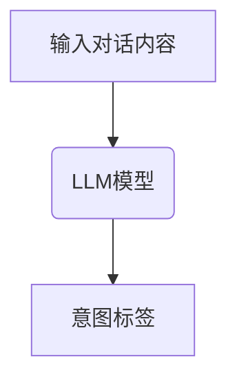

                 

# LLM驱动的AI Agent对话意图识别

## 关键词：大语言模型、对话意图识别、AI Agent、自然语言处理、人工智能

## 摘要：  
本文详细探讨了如何利用大语言模型（LLM）驱动AI Agent实现对话意图识别。通过分析对话意图识别的背景、核心概念、算法原理、系统架构以及实际项目案例，本文为读者提供了一个全面而深入的技术视角。从基础概念到实际应用，结合数学公式和代码示例，帮助读者理解并掌握这一前沿技术的核心思想和实现方法。

---

# 第1章: LLM与AI Agent概述

## 1.1 大语言模型（LLM）的基本概念

### 1.1.1 什么是大语言模型  
大语言模型（Large Language Models, LLMs）是指经过大规模数据训练的深度学习模型，能够理解和生成人类语言。这类模型通常基于Transformer架构，通过自注意力机制捕捉上下文信息，从而实现对复杂语言模式的建模。

### 1.1.2 LLM的核心特点  
- **大规模数据训练**：LLM通常使用数百万甚至数十亿的文本数据进行训练，使其能够捕捉到语言的多样性和复杂性。  
- **自注意力机制**：通过自注意力机制，模型能够理解上下文关系，从而更好地处理序列数据。  
- **多任务学习能力**：LLM可以在多种NLP任务（如文本生成、翻译、问答等）上表现出色，具有较强的通用性。  

### 1.1.3 LLM与传统NLP模型的区别  
| 属性            | 传统NLP模型              | LLM                     |  
|-----------------|--------------------------|-------------------------|  
| 数据量          | 较小，通常几百 MB到1 GB  | 极大，通常几十 GB到 TB |  
| 训练效率        | 较低，依赖大量人工标注    | 较高，自动化训练流程    |  
| 性能表现        | 有限，仅适用于特定任务    | 强大，适用于多种任务    |  

---

## 1.2 AI Agent的基本概念

### 1.2.1 什么是AI Agent  
AI Agent（人工智能代理）是指能够感知环境、自主决策并执行任务的智能实体。它可以是一个软件程序，也可以是一个物理设备，通过与用户或环境交互来完成特定目标。

### 1.2.2 AI Agent的类型与应用场景  
AI Agent可以分为以下几类：  
- **基于规则的Agent**：通过预定义的规则和逻辑进行决策，适用于简单任务。  
- **基于模型的Agent**：利用领域知识和模型进行推理和决策，适用于复杂任务。  
- **基于学习的Agent**：通过机器学习模型进行训练和优化，适用于数据驱动的任务。  

应用场景包括：  
- 智能客服：为用户提供问题解答和建议。  
- 智能助手：帮助用户完成日程管理、信息检索等任务。  
- 智能聊天机器人：提供自然语言对话服务。  

### 1.2.3 AI Agent与人类交互的特点  
- **实时性**：AI Agent需要快速响应用户输入，减少延迟。  
- **自然性**：对话应符合人类语言习惯，避免生硬和机械化的回复。  
- **适应性**：能够根据用户反馈动态调整交互策略。  

---

## 1.3 对话意图识别的定义与重要性

### 1.3.1 对话意图识别的定义  
对话意图识别（Dialog Intent Recognition）是指通过分析对话内容，推断用户的意图或目标。它是自然语言处理（NLP）领域的重要任务之一，广泛应用于智能客服、智能助手和聊天机器人等领域。

### 1.3.2 对话意图识别的重要性  
- **提升用户体验**：准确识别用户意图可以提供更精准的服务，减少用户操作步骤。  
- **提高系统效率**：通过自动化处理，降低人工干预成本。  
- **增强系统智能性**：意图识别是实现更复杂对话交互的基础。  

### 1.3.3 对话意图识别的挑战与机遇  
- **挑战**：对话数据的多样性和歧义性、模型的训练数据质量、实时性要求等。  
- **机遇**：随着LLM的发展，意图识别的准确性和效率得到了显著提升。  

---

## 1.4 LLM驱动的AI Agent对话意图识别的核心概念

### 1.4.1 LLM在对话意图识别中的作用  
LLM通过其强大的语言建模能力，能够捕捉对话中的上下文信息，从而准确推断用户的意图。与传统基于规则的方法相比，LLM具有更高的准确性和灵活性。

### 1.4.2 对话意图识别的边界与外延  
对话意图识别的边界包括：  
- **输入范围**：仅限于对话内容，不涉及外部知识库。  
- **输出范围**：仅返回意图标签，不涉及具体操作。  

外延包括：  
- **上下文感知**：能够结合对话历史推断意图。  
- **多模态支持**：结合视觉、音频等信息进一步优化意图识别。  

### 1.4.3 核心要素组成与概念结构  
核心要素包括：  
- **输入对话内容**：用户发送的文本或语音信息。  
- **意图标签**：模型推断出的用户意图。  
- **LLM模型**：用于理解和生成对话内容的大型语言模型。  

概念结构可以用以下ER图表示：

---

## 1.5 本章小结  

本章介绍了大语言模型（LLM）和AI Agent的基本概念，重点阐述了对话意图识别的定义、重要性以及在LLM驱动下的核心概念。通过对比分析，展示了LLM在对话意图识别中的优势和应用场景，为后续章节的深入分析奠定了基础。

--- 

（以上为第1章内容，后续章节将按照类似结构继续展开。）

