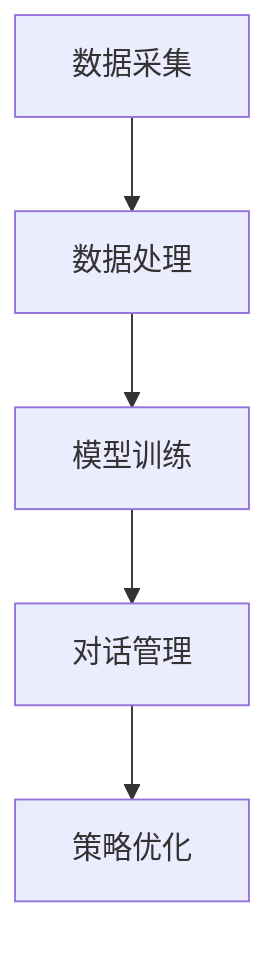

                 


# LLM驱动的AI Agent对话策略学习

**关键词**：Large Language Models (LLMs), AI Agents, 对话策略学习, 自然语言处理 (NLP), 强化学习 (Reinforcement Learning), 对话系统, 人机交互

**摘要**：本文深入探讨了利用大语言模型（LLM）驱动AI代理（AI Agent）对话策略学习的核心技术与实现方法。从问题背景到算法原理，从系统设计到项目实战，系统性地分析了LLM在对话策略学习中的应用，详细讲解了基于LLM的对话策略学习算法，分析了系统的架构设计，并通过实际案例展示了对话策略学习的实战过程。本文还总结了LLM驱动的对话策略学习的关键经验与最佳实践，为读者提供了全面的技术指南。

---

## 第1章: 问题背景与描述

### 1.1 问题背景

#### 1.1.1 当前AI对话系统的挑战
- 传统对话系统存在对话内容千篇一律、缺乏灵活性的问题。
- 用户需求复杂多样，对话系统难以准确理解和响应。
- 对话系统在处理长尾场景和复杂对话时表现不佳。

#### 1.1.2 LLM在对话系统中的应用潜力
- LLM具备强大的上下文理解和生成能力。
- LLM可以通过微调和强化学习进一步优化对话策略。
- LLM能够处理复杂的对话场景和长尾需求。

#### 1.1.3 对话策略学习的必要性
- 对话策略是连接用户需求与系统响应的核心桥梁。
- 通过策略学习，AI Agent可以更好地适应用户的个性化需求。
- 对话策略学习能够提升对话系统的效果和用户体验。

### 1.2 问题描述

#### 1.2.1 对话策略的基本概念
- 对话策略是AI Agent在特定对话场景下选择最优响应的规则集。
- 策略的有效性直接影响对话系统的用户体验。
- 对话策略需要兼顾准确性和流畅性。

#### 1.2.2 LLM驱动的对话策略学习特点
- 利用LLM的生成能力，对话策略学习可以实现更自然的对话生成。
- 基于LLM的策略学习能够处理复杂场景和长对话。
- LLM驱动的策略学习具备更强的泛化能力。

#### 1.2.3 对话策略学习的目标与范围
- 目标：提升AI Agent的对话生成能力和用户体验。
- 范围：覆盖从训练数据准备到策略优化的全过程。

### 1.3 问题解决与边界

#### 1.3.1 解决方案概述
- 利用LLM进行对话策略学习，通过监督微调和强化学习优化策略。
- 构建高效的对话管理模块，实现策略的灵活应用。

#### 1.3.2 对话策略学习的边界与限制
- 对话策略学习的边界：专注于对话生成和策略优化。
- 对话策略学习的限制：依赖高质量的训练数据和有效的评估指标。

#### 1.3.3 相关概念的外延与内涵
- 对话策略的外延：包括生成策略、选择策略等。
- 对话策略的内涵：以用户需求为导向，实现高效的对话交互。

---

## 第2章: 核心概念与联系

### 2.1 LLM与AI Agent的关系

#### 2.1.1 LLM的基本原理
- LLM通过大规模数据训练，具备强大的生成能力。
- LLM可以生成多样化的对话内容，满足不同的用户需求。

#### 2.1.2 AI Agent的核心功能
- AI Agent负责接收用户输入，生成对话响应。
- AI Agent需要根据对话历史和上下文选择合适的策略。

#### 2.1.3 LLM驱动的对话策略实现机制
- LLM作为AI Agent的核心模块，负责生成对话内容。
- 对话策略通过LLM的生成能力和强化学习优化。

### 2.2 对话策略学习的原理

#### 2.2.1 对话策略的定义与分类
- 对话策略：AI Agent在特定场景下的决策规则。
- 分类：基于规则的策略、基于模型的策略、基于强化学习的策略。

#### 2.2.2 基于LLM的对话策略学习方法
- 监督微调：基于标注数据优化LLM的生成能力。
- 强化学习：通过奖励机制优化对话策略。

#### 2.2.3 对话策略与用户需求的关联
- 对话策略需要根据用户需求动态调整。
- 用户需求是对话策略优化的核心驱动力。

### 2.3 核心概念对比分析

#### 2.3.1 LLM与传统NLP模型的对比
- LLM具备更强的生成能力和上下文理解能力。
- 传统NLP模型通常针对特定任务进行优化。

#### 2.3.2 AI Agent与传统对话系统的对比
- AI Agent具备更强的自主决策能力。
- 传统对话系统通常依赖预定义的规则和模板。

#### 2.3.3 对话策略学习与其他机器学习任务的对比
- 对话策略学习：以提升对话效果为目标。
- 其他任务：如分类、生成等，目标不同但方法有共通之处。

### 2.4 实体关系图

```mermaid
er
actor: 用户
agent: AI Agent
strategy: 对话策略
model: LLM模型
training_data: 训练数据
action: 对话动作
response: 对话回复
```

---

## 第3章: LLM驱动的对话策略学习算法原理

### 3.1 算法原理与流程

#### 3.1.1 对话策略学习的基本流程
- 数据预处理：清洗、标注和筛选训练数据。
- 模型训练：基于LLM进行监督微调。
- 策略优化：通过强化学习优化对话策略。

#### 3.1.2 基于LLM的对话策略学习算法
- 监督微调：通过标注数据优化模型生成能力。
- 强化学习：通过奖励机制优化对话策略。
- 对抗训练：通过生成对抗网络优化模型性能。

### 3.2 监督微调算法

#### 3.2.1 监督微调的流程
1. 数据预处理：清洗和标注训练数据。
2. 模型加载：加载预训练的LLM模型。
3. 微调训练：基于标注数据优化模型参数。
4. 模型评估：评估模型的生成效果。

#### 3.2.2 监督微调的数学模型
- 损失函数：交叉熵损失函数。
- 优化目标：最小化生成错误，提升生成质量。

### 3.3 强化学习算法

#### 3.3.1 强化学习的流程
1. 状态空间定义：包括对话历史、上下文等。
2. 动作空间定义：生成对话回复。
3. 奖励机制设计：基于对话效果和用户反馈设计奖励函数。
4. 模型训练：通过强化学习优化策略。

#### 3.3.2 强化学习的数学模型
- 状态-动作空间：S和A。
- 奖励函数：R(s, a)。
- 动作选择策略：π(a|s)。

---

## 第4章: 系统分析与架构设计

### 4.1 项目背景

#### 4.1.1 项目目标
- 构建一个基于LLM的AI对话系统。
- 实现高效的对话策略学习与优化。

#### 4.1.2 项目范围
- 对话系统设计：包括数据采集、模型训练、策略优化等。
- 系统架构设计：模块化设计，确保系统的可扩展性和灵活性。

### 4.2 系统功能设计

#### 4.2.1 功能模块
- 数据采集模块：负责数据的收集和处理。
- 模型训练模块：负责监督微调和强化学习。
- 对话管理模块：负责对话的生成和策略优化。

#### 4.2.2 功能流程图



### 4.3 系统架构设计

#### 4.3.1 系统架构图


---

## 第5章: 项目实战

### 5.1 环境安装

#### 5.1.1 安装依赖
- 安装Python和必要的库：如TensorFlow、PyTorch等。
- 安装LLM模型：如GPT-3、BERT等。

#### 5.1.2 环境配置
- 配置开发环境：如Jupyter Notebook、VS Code等。
- 配置模型参数：如设置训练轮数、学习率等。

### 5.2 核心代码实现

#### 5.2.1 数据处理代码

```python
def preprocess_data(data):
    # 数据清洗和标注
    processed_data = []
    for item in data:
        processed_data.append({
            'input': item['input'],
            'output': item['output']
        })
    return processed_data
```

#### 5.2.2 模型训练代码

```python
def train_model(model, train_data):
    # 监督微调
    optimizer = tf.keras.optimizers.Adam(lr=1e-4)
    loss_fn = tf.keras.losses.sparse_categorical_crossentropy
    model.compile(optimizer=optimizer, loss=loss_fn)
    model.fit(train_data, epochs=10, batch_size=32)
    return model
```

### 5.3 代码解读与分析

#### 5.3.1 数据处理代码解读
- 数据清洗：去除无效数据，保留有效的对话内容。
- 数据标注：根据标注规则对数据进行标注。

#### 5.3.2 模型训练代码解读
- 模型加载：加载预训练的LLM模型。
- 模型优化：设置优化器和损失函数。
- 模型训练：基于标注数据进行监督微调。

### 5.4 实际案例分析

#### 5.4.1 案例背景
- 某客服系统需要优化对话策略，提升用户体验。

#### 5.4.2 案例分析
- 数据采集：收集真实的用户对话数据。
- 模型训练：基于收集的数据进行监督微调。
- 对话管理：优化对话流程，提升响应速度。

### 5.5 实战小结

#### 5.5.1 实战总结
- 通过监督微调和强化学习优化对话策略。
- 系统设计需要模块化，确保系统的可扩展性和灵活性。

#### 5.5.2 注意事项
- 数据质量直接影响策略优化效果。
- 对话策略需要动态调整，适应用户的个性化需求。

---

## 第6章: 总结与展望

### 6.1 本文总结

#### 6.1.1 核心内容回顾
- 本文详细讲解了LLM驱动的对话策略学习的技术原理。
- 通过实际案例展示了对话策略学习的实战过程。

#### 6.1.2 关键经验总结
- 数据质量是对话策略优化的基础。
- 系统设计需要模块化，确保系统的灵活性和可扩展性。

### 6.2 未来展望

#### 6.2.1 技术发展
- 更先进的LLM模型将推动对话策略学习的发展。
- 多模态对话系统将提升用户体验。

#### 6.2.2 应用场景
- LLM驱动的对话策略学习将在更多领域得到应用。
- AI Agent将成为人机交互的核心技术。

---

## 作者

作者：AI天才研究院/AI Genius Institute & 禅与计算机程序设计艺术 /Zen And The Art of Computer Programming

