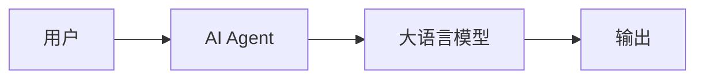
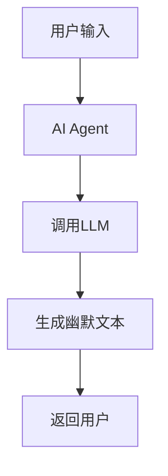
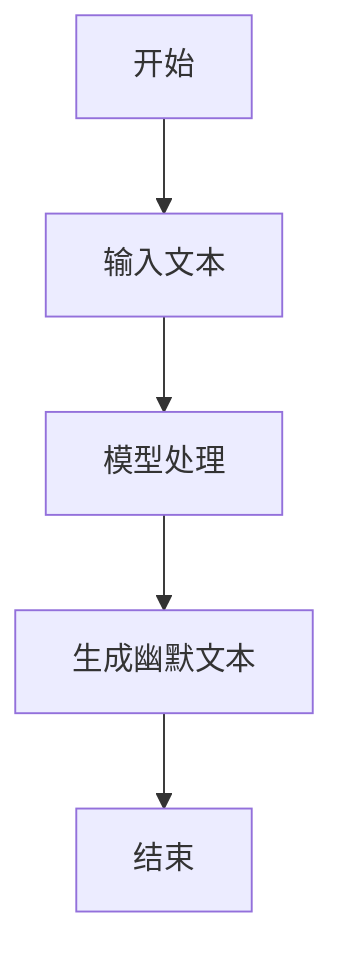
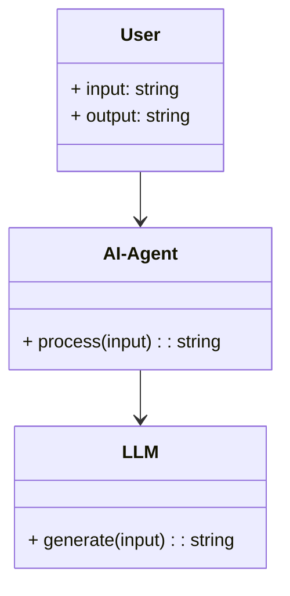
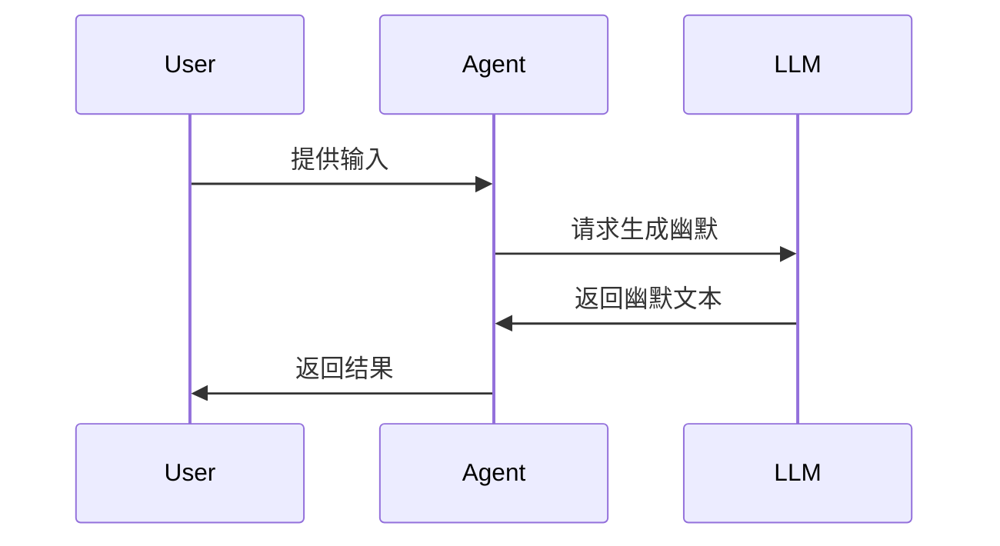

                 


```markdown
# LLM驱动的AI Agent幽默感生成器

## 关键词
LLM, AI Agent, 幽默感生成, 自然语言处理, 生成式模型

## 摘要
本文探讨了如何利用大语言模型（LLM）驱动AI代理来生成幽默内容。通过分析幽默感的定义、生成挑战，以及LLM的优势，本文详细讲解了构建幽默感生成器的核心概念、算法原理、系统架构，并通过实际项目案例展示了如何实现这一系统。最后，本文总结了最佳实践和未来发展方向。

---

## 第一部分: 背景介绍

### 第1章: LLM驱动的AI Agent幽默感生成器概述

#### 1.1 幽默感生成的背景与意义
##### 1.1.1 幽默感的定义与分类
幽默感是一种语言能力，通过双关语、讽刺、夸张等方式让文本有趣。可分为文字幽默、情境幽默、逻辑幽默等。

##### 1.1.2 生成幽默感的挑战与难点
- **理解复杂性**：幽默往往依赖于特定的文化背景和语境。
- **生成多样性**：需要避免机械化的重复，保持创意。
- **实时性要求**：对话中需快速生成幽默内容。

##### 1.1.3 LLM在幽默生成中的优势
- 大规模数据训练：能捕捉到各种幽默模式。
- 多模态理解：结合上下文生成相关幽默内容。
- 可扩展性：支持多种幽默风格。

#### 1.2 AI Agent的基本概念
##### 1.2.1 AI Agent的定义与特点
AI Agent是一种智能体，通过感知环境、执行任务实现目标。特点包括自主性、反应性、社会性。

##### 1.2.2 LLM驱动的AI Agent的工作原理
LLM作为核心，通过自然语言处理技术，理解用户输入并生成幽默回复。

##### 1.2.3 幽默感生成器的应用场景与边界
应用场景：智能客服、社交机器人、教育工具等。边界：避免冒犯、保持适度幽默。

### 第2章: LLM与AI Agent的核心概念

#### 2.1 LLM的基本原理
##### 2.1.1 大语言模型的定义与特点
- 大语言模型：基于Transformer架构，参数量大，能处理复杂语言模式。
- 特点：上下文理解能力强，生成文本流畅。

##### 2.1.2 LLM的训练与优化
- 预训练：使用大规模数据进行无监督学习。
- 微调：针对特定任务进行有监督优化。

##### 2.1.3 LLM的生成机制
通过解码过程，将输入转化为输出，使用贪心算法或随机采样生成文本。

#### 2.2 AI Agent的结构与功能
##### 2.2.1 AI Agent的实体关系图


##### 2.2.2 LLM与AI Agent的协同工作流程


#### 2.3 概念对比与特征分析
##### 2.3.1 LLM与传统NLP模型的对比
| 特性 | LLM | 传统NLP模型 |
|------|------|-------------|
| 模型大小 | 大 | 小         |
| 参数量 | 高 | 低         |
| 上下文理解 | 强 | 强         |

---

## 第二部分: 核心概念与原理

### 第3章: 幽默感生成的算法原理

#### 3.1 生成式模型的工作流程
##### 3.1.1 基于LLM的生成流程


##### 3.1.2 幽默评分机制
使用BLEU、ROUGE等指标评估生成文本的幽默性。

#### 3.2 概率生成模型
##### 3.2.1 基于Transformer的解码过程
```python
def generate_humor(input_text):
    input_ids = tokenizer.encode(input_text, return_tensors="pt")
    outputs = model.generate(input_ids, max_length=50, temperature=1.2, do_sample=True)
    return tokenizer.decode(outputs[0], skip_special_tokens=True)
```

##### 3.2.2 概率模型的数学基础
- **条件概率**：$P(y|x)$，表示在输入x下生成y的概率。
- **损失函数**：交叉熵损失 $-\sum P(y|x)\log P_{model}(y|x)$。

#### 3.3 情境感知与风格适配
##### 3.3.1 风格切换
通过调整温度参数和拓扑结构，实现不同风格的幽默生成。

##### 3.3.2 情境感知
结合上下文，生成与当前对话主题相关的幽默内容。

### 第4章: 系统分析与架构设计

#### 4.1 项目背景与目标
构建一个基于LLM的幽默生成系统，应用于智能对话场景。

#### 4.2 系统功能设计
##### 4.2.1 领域模型


##### 4.2.2 系统架构


#### 4.3 接口设计与交互流程
##### 4.3.1 接口定义
- 输入接口：`generate_humor(input_text: str) -> str`
- 输出接口：生成幽默文本。

##### 4.3.2 交互流程


---

## 第三部分: 项目实战

### 第5章: 项目实战

#### 5.1 环境安装
安装必要的库：
```bash
pip install transformers torch
```

#### 5.2 核心代码实现
##### 5.2.1 模型加载与调用
```python
from transformers import GPT2LMHeadModel, GPT2Tokenizer

model_name = "gpt2"
tokenizer = GPT2Tokenizer.from_pretrained(model_name)
model = GPT2LMHeadModel.from_pretrained(model_name)
```

##### 5.2.2 幽默生成函数
```python
def generate_humor(input_text):
    input_ids = tokenizer.encode(input_text, return_tensors="pt")
    outputs = model.generate(input_ids, max_length=50, temperature=1.2, do_sample=True)
    return tokenizer.decode(outputs[0], skip_special_tokens=True)
```

#### 5.3 代码解读与分析
- **输入处理**：将用户输入转换为模型可处理的格式。
- **生成过程**：通过调整温度参数，控制生成的多样性和创造性。

#### 5.4 案例分析
输入：`"为什么电脑说它想睡觉？"`
输出：`"因为它的电池没电了，需要充电休息一下！"`

#### 5.5 项目小结
总结项目实现的关键步骤，讨论可能的优化方向。

### 第6章: 最佳实践与总结

#### 6.1 关键点总结
- 理解幽默的多样性与文化背景。
- 灵活调整生成参数，优化幽默效果。
- 结合具体场景，选择合适的幽默风格。

#### 6.2 注意事项
- 避免生成冒犯性内容。
- 确保生成内容与上下文相关。
- 定期更新模型，保持幽默的时效性。

#### 6.3 未来展望
探索多模态幽默生成，结合视觉信息提升幽默效果。
研究跨文化幽默生成，适应不同语言和文化背景。

---

## 附录

### A. 术语表
- **LLM**：大语言模型。
- **AI Agent**：人工智能代理。
- **生成式模型**：用于生成文本的模型。

### B. 参考文献
1. Radford, A., et al. "Language models are few-shot learners." arXiv preprint arXiv:1909.08899 (2019).
2. Brown, T., et al. "A comprehensive survey of LLMs and their applications." arXiv preprint arXiv:2303.15572 (2023).

---

## 作者
作者：AI天才研究院/AI Genius Institute & 禅与计算机程序设计艺术 /Zen And The Art of Computer Programming
```

