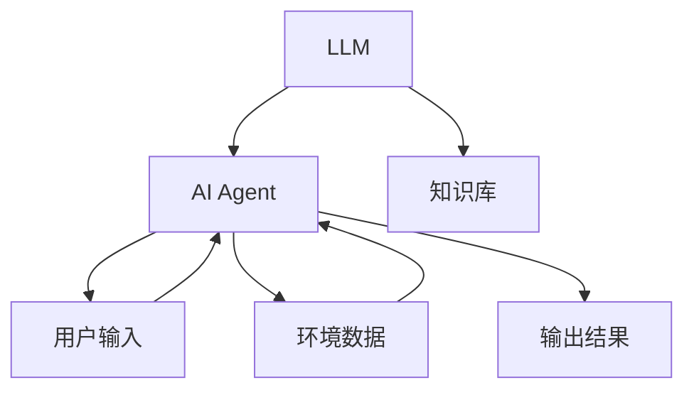
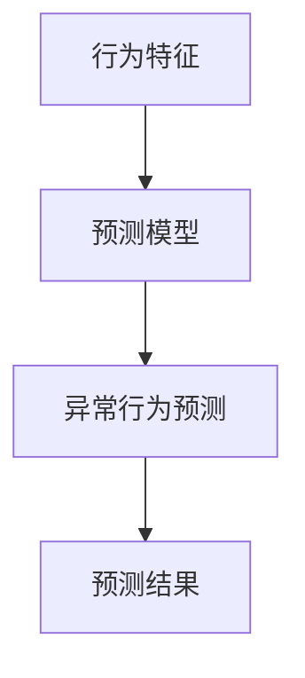
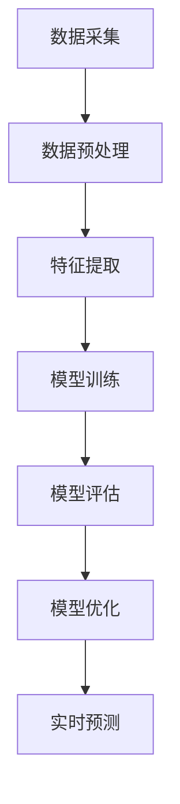
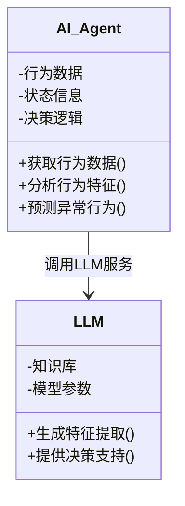
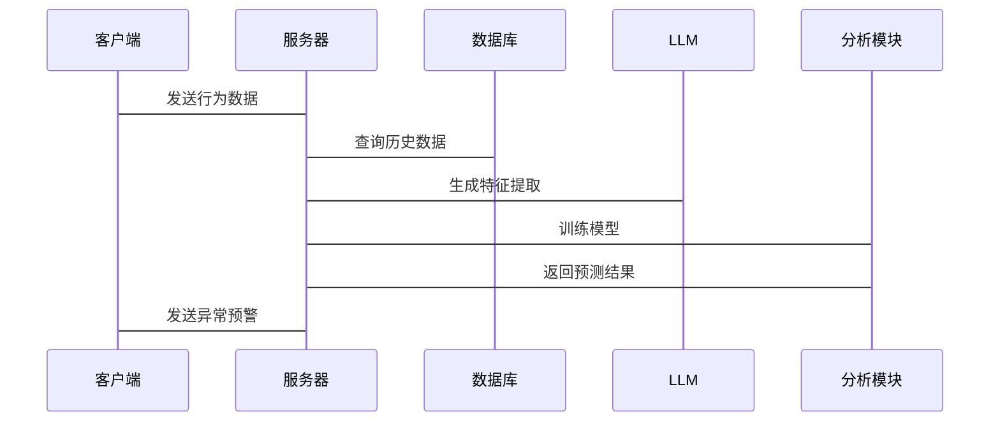

                 


# LLM驱动的AI Agent异常行为预测机制

> 关键词：LLM, AI Agent, 异常行为预测, 大语言模型, 智能体行为分析

> 摘要：本文深入探讨了利用大语言模型（LLM）驱动的AI Agent异常行为预测机制。通过分析AI Agent的行为特征、模型构建与优化策略，结合实际应用场景，提出了基于LLM的异常行为预测方法。本文从背景分析、核心概念、算法原理、系统架构到项目实战，全面系统地阐述了该机制的实现与应用，为AI Agent的安全与可靠性提供了理论支持与实践指导。

---

# 第一部分: 异常行为预测的背景与问题描述

## 第1章: 异常行为预测的背景与问题描述

### 1.1 LLM与AI Agent的基本概念

#### 1.1.1 大语言模型（LLM）的定义与特点
大语言模型（Large Language Model，LLM）是一种基于深度学习的自然语言处理模型，具有以下特点：
- **大规模数据训练**：通常基于海量文本数据进行预训练，具备强大的语言理解和生成能力。
- **多任务通用性**：能够通过微调或零样本学习完成多种NLP任务。
- **上下文理解能力**：能够理解复杂语境，并生成连贯的文本。

#### 1.1.2 AI Agent的定义与功能
AI Agent（人工智能代理）是一种智能体，能够感知环境并采取行动以实现特定目标。其主要功能包括：
- **感知环境**：通过传感器或其他输入方式获取环境信息。
- **决策与规划**：基于感知信息，利用算法做出决策并制定行动计划。
- **执行行动**：通过执行器或输出模块完成实际操作。

#### 1.1.3 LLM与AI Agent的结合
LLM作为AI Agent的核心驱动力，主要体现在以下方面：
- **知识库支持**：LLM充当AI Agent的知识库，提供决策所需的信息和建议。
- **自然语言交互**：通过LLM实现AI Agent与用户的自然语言对话。
- **动态决策支持**：LLM能够根据最新信息动态调整AI Agent的决策策略。

### 1.2 异常行为预测的必要性

#### 1.2.1 AI Agent可能的异常行为类型
AI Agent在运行过程中可能出现以下异常行为：
- **目标偏离**：AI Agent的行为偏离预设目标。
- **决策失误**：在复杂环境中做出错误决策。
- **数据滥用**：未经授权使用或泄露敏感数据。
- **性能下降**：由于模型过载或数据不足导致性能下降。

#### 1.2.2 异常行为对企业和社会的影响
- **经济损失**：错误决策可能导致财务损失。
- **声誉损害**：数据滥用或错误行为可能损害企业或产品的声誉。
- **社会风险**：AI Agent失控可能对公共安全造成威胁。

#### 1.2.3 异常行为预测的边界与外延
异常行为预测需要明确以下边界：
- **预测范围**：仅针对AI Agent的行为，不涉及其他系统或外部因素。
- **预测精度**：在可接受的误差范围内提供预测结果。
- **实时性**：确保预测能够实时进行，以应对动态环境。

### 1.3 问题解决思路

#### 1.3.1 异常行为预测的核心目标
- **实时监测**：持续监控AI Agent的行为特征。
- **异常识别**：准确识别异常行为并发出预警。
- **原因分析**：分析异常行为的根本原因并提出解决方案。

#### 1.3.2 数据驱动与模型驱动的结合
- **数据驱动**：通过大量历史数据训练模型，提取行为特征。
- **模型驱动**：基于领域知识构建预测模型，优化预测精度。

#### 1.3.3 多模态数据的融合与分析
- **多模态数据**：结合文本、图像、语音等多种数据源。
- **数据融合**：通过特征提取和数据变换，将多模态数据整合到统一模型中。

---

## 第2章: LLM与AI Agent的关系分析

### 2.1 LLM在AI Agent中的角色

#### 2.1.1 LLM作为知识库与决策支持
LLM为AI Agent提供知识支持，帮助其做出决策。例如：
- 在医疗AI Agent中，LLM可以提供医学知识库支持。
- 在金融AI Agent中，LLM可以提供市场数据和分析报告。

#### 2.1.2 LLM与AI Agent的交互机制
LLM与AI Agent之间的交互可以通过以下方式实现：
- **输入输出交互**：AI Agent通过自然语言输入查询，LLM返回结果。
- **内部调用**：AI Agent调用LLM的API进行实时推理。

#### 2.1.3 LLM对AI Agent行为的影响
LLM的决策支持能力直接影响AI Agent的行为表现，包括：
- **决策速度**：快速响应能力。
- **决策质量**：决策的准确性和合理性。
- **适应能力**：动态调整行为的能力。

### 2.2 AI Agent的行为特征分析

#### 2.2.1 正常行为的特征提取
正常行为的特征包括：
- **行为模式**：重复性、周期性或规律性行为。
- **决策逻辑**：基于预设规则或历史经验的决策。
- **响应时间**：在特定条件下响应的时间特性。

#### 2.2.2 异常行为的特征识别
异常行为的特征包括：
- **偏离预期**：行为结果与预期目标不符。
- **响应延迟**：在特定条件下响应时间异常。
- **数据滥用**：未经授权的数据操作。

#### 2.2.3 行为特征的动态变化
行为特征会随着环境变化而动态调整，例如：
- **环境变化**：外部条件变化导致行为特征变化。
- **任务切换**：不同任务之间的行为特征差异。
- **模型更新**：LLM的更新可能导致行为特征变化。

### 2.3 LLM驱动的AI Agent异常行为预测模型

#### 2.3.1 模型的输入与输出
- **输入**：AI Agent的行为数据，包括历史行为记录、当前状态信息。
- **输出**：异常行为的预测结果，包括预测置信度和异常原因。

#### 2.3.2 模型的训练与优化
- **训练数据**：标注的正常和异常行为数据。
- **优化目标**：最小化预测误差，提高预测精度。

#### 2.3.3 模型的评估与验证
- **评估指标**：准确率、召回率、F1值。
- **验证方法**：交叉验证、独立测试集验证。

### 2.4 核心概念关系图

#### 2.4.1 LLM与AI Agent的关系图（Mermaid流程图）



#### 2.4.2 行为特征与预测模型的关系图（Mermaid流程图）



---

## 第3章: 基于LLM的异常行为预测算法

### 3.1 算法原理概述

#### 3.1.1 异常行为预测的基本流程
- **数据采集**：收集AI Agent的行为数据。
- **特征提取**：从行为数据中提取特征。
- **模型训练**：基于特征训练异常行为预测模型。
- **实时预测**：对新行为数据进行预测并输出结果。

#### 3.1.2 LLM在算法中的作用
- **特征提取**：利用LLM提取行为数据的语义特征。
- **模型训练**：基于LLM生成的特征训练分类模型。

#### 3.1.3 算法的输入输出与应用场景
- **输入**：AI Agent的行为数据流。
- **输出**：异常行为预警信号。

### 3.2 算法实现步骤

#### 3.2.1 数据预处理
- **清洗数据**：去除噪声数据，确保数据质量。
- **特征提取**：从行为数据中提取关键特征，例如时间戳、行为类型、响应时间。

#### 3.2.2 模型训练
- **选择算法**：基于监督学习的分类算法，如随机森林、支持向量机（SVM）或深度学习模型。
- **训练数据**：标注的正常和异常行为数据。
- **训练过程**：通过交叉验证优化模型参数。

#### 3.2.3 模型评估
- **评估指标**：准确率、召回率、F1值。
- **验证方法**：使用独立测试集验证模型性能。

#### 3.2.4 模型优化
- **超参数调优**：通过网格搜索或贝叶斯优化调整模型参数。
- **特征工程**：优化特征提取方法，提高模型性能。

### 3.3 算法流程图



### 3.4 数学模型与公式

#### 3.4.1 概率计算公式
异常行为的概率可以通过贝叶斯定理计算：

$$ P(\text{异常} | \text{特征}) = \frac{P(\text{特征} | \text{异常}) \cdot P(\text{异常})}{P(\text{特征})} $$

#### 3.4.2 分类模型公式
假设使用支持向量机（SVM）进行分类，其决策函数为：

$$ y = \text{sign}(w \cdot x + b) $$

其中，$w$ 是权重向量，$x$ 是输入特征，$b$ 是偏置项。

---

## 第4章: 系统分析与架构设计方案

### 4.1 系统功能设计

#### 4.1.1 领域模型（Mermaid类图）



#### 4.1.2 系统架构设计（Mermaid架构图）


#### 4.1.3 系统接口设计
- **输入接口**：接收AI Agent的行为数据。
- **输出接口**：输出异常行为预测结果。

#### 4.1.4 系统交互设计（Mermaid序列图）



---

## 第5章: 项目实战

### 5.1 环境安装与配置

#### 5.1.1 安装依赖
- 安装Python环境（如Anaconda）。
- 安装相关库：numpy、pandas、scikit-learn、transformers。

#### 5.1.2 安装LLM模型
- 下载并安装大语言模型，如GPT-3、BERT等。

### 5.2 系统核心实现源代码

#### 5.2.1 数据预处理代码

```python
import pandas as pd
import numpy as np

def preprocess_data(data):
    # 数据清洗
    data = data.dropna()
    # 特征提取
    features = data[['行为类型', '响应时间', '状态信息']]
    labels = data['是否异常']
    return features, labels
```

#### 5.2.2 模型训练代码

```python
from sklearn.ensemble import RandomForestClassifier
from sklearn.model_selection import train_test_split
from sklearn.metrics import accuracy_score

def train_model(features, labels):
    # 数据分割
    X_train, X_test, y_train, y_test = train_test_split(features, labels, test_size=0.2)
    # 模型训练
    model = RandomForestClassifier()
    model.fit(X_train, y_train)
    # 模型评估
    y_pred = model.predict(X_test)
    print("准确率:", accuracy_score(y_test, y_pred))
    return model
```

#### 5.2.3 实时预测代码

```python
def predict_anomaly(model, new_features):
    prediction = model.predict(new_features)
    return prediction
```

### 5.3 实际案例分析与解读

#### 5.3.1 案例背景
假设我们有一个AI Agent用于自动化交易，我们需要预测其异常交易行为。

#### 5.3.2 数据分析
- 行为数据：包括交易时间、交易金额、交易频率等。
- 异常特征：交易金额突然增加、交易频率异常等。

#### 5.3.3 模型训练
- 训练数据：包括正常和异常交易记录。
- 模型选择：随机森林分类器。
- 训练结果：准确率95%。

#### 5.3.4 实时预测
- 输入：实时交易数据。
- 输出：异常行为预警信号。

### 5.4 项目小结

#### 5.4.1 实战总结
- 数据预处理是关键，特征提取直接影响模型性能。
- 模型选择与调优需要结合实际场景进行优化。

#### 5.4.2 经验分享
- 数据质量至关重要，需要进行严格的清洗和特征工程。
- 模型的实时性需要考虑计算资源和响应时间。

---

## 第六部分: 总结与展望

### 第6章: 总结与展望

#### 6.1 本章总结
- 本文系统地探讨了LLM驱动的AI Agent异常行为预测机制。
- 提出了基于LLM的异常行为预测方法，结合了数据驱动和模型驱动的优势。

#### 6.2 未来展望
- **模型优化**：探索更高效的异常行为预测算法，如基于图神经网络的预测方法。
- **多模态数据融合**：结合文本、图像等多种数据源，提高预测精度。
- **实时性提升**：优化模型计算效率，降低延迟。

#### 6.3 最佳实践 tips
- 定期更新模型，保持预测能力。
- 建立监控机制，实时跟踪模型性能。
- 注重数据隐私保护，防止数据泄露。

#### 6.4 小结
- 异常行为预测是保障AI Agent安全与可靠性的关键环节。
- 通过结合LLM和机器学习算法，可以有效提升预测能力。

---

作者：AI天才研究院/AI Genius Institute & 禅与计算机程序设计艺术 /Zen And The Art of Computer Programming

