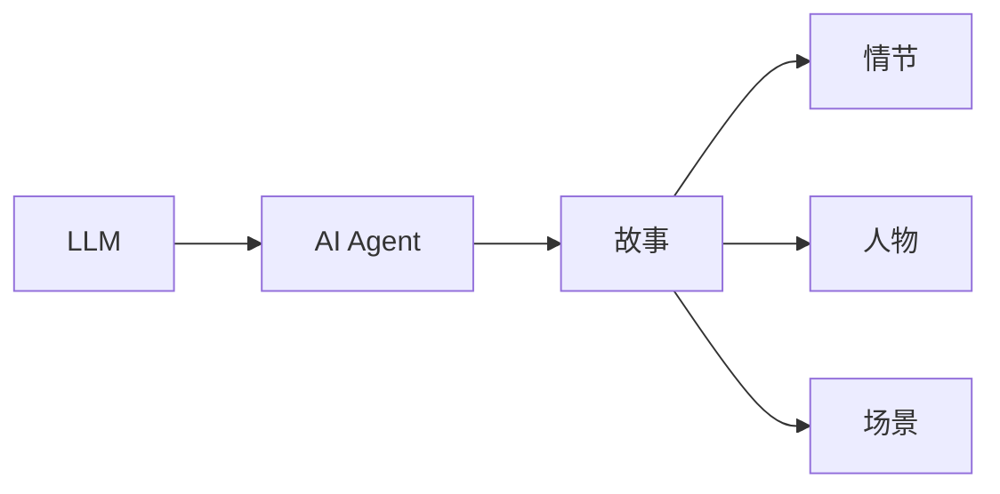
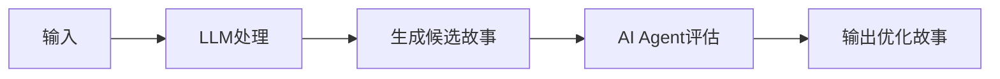
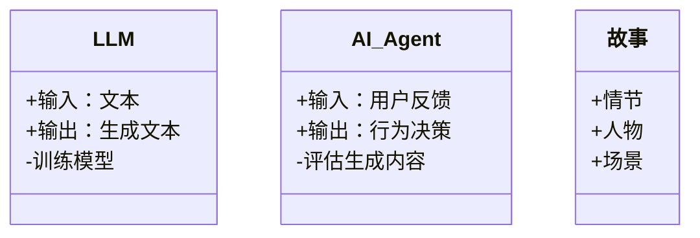
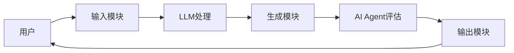

                 


# LLM驱动的AI Agent故事生成与叙事能力

## 关键词：LLM、AI Agent、故事生成、叙事能力、算法原理、系统架构、项目实战

## 摘要：  
本文深入探讨了基于大语言模型（LLM）的AI Agent在故事生成与叙事能力方面的应用。通过分析故事生成的核心问题、算法原理、系统架构以及实际项目案例，揭示了LLM与AI Agent结合的独特优势，为未来的智能化内容创作提供了新的思路和方法。

---

# 第1章: 背景介绍与核心概念

## 1.1 问题背景与描述  
### 1.1.1 LLM与AI Agent的定义  
- **大语言模型（LLM）**：基于深度学习的自然语言处理模型，能够理解和生成人类语言，如GPT系列、BERT系列等。  
- **AI Agent（智能体）**：具备自主决策能力的智能系统，能够在特定环境中执行任务，如对话生成、内容创作等。  

### 1.1.2 故事生成的背景与需求  
- 随着内容消费需求的增长，自动化故事生成成为一种趋势。  
- 故事生成需要结合情节、人物、场景等多维度信息，具有较高的复杂性。  

### 1.1.3 当前技术的局限性与挑战  
- **LLM的局限性**：生成内容可能缺乏逻辑性、连贯性和一致性。  
- **AI Agent的挑战**：需要具备复杂的行为决策能力，以应对多样化的叙事需求。  

## 1.2 核心概念与问题解决  
### 1.2.1 LLM在故事生成中的作用  
- **文本生成**：通过LLM生成故事的初步内容。  
- **上下文理解**：利用LLM对情节和人物关系进行建模。  

### 1.2.2 AI Agent在叙事中的应用  
- **行为决策**：AI Agent根据用户需求选择故事的发展方向。  
- **动态调整**：实时优化故事内容，以满足用户偏好。  

### 1.2.3 故事生成的核心问题与解决方案  
- **问题**：如何确保生成故事的连贯性、逻辑性和吸引力？  
- **解决方案**：结合LLM的生成能力和AI Agent的决策能力，构建一个闭环的故事生成系统。  

## 1.3 核心概念的边界与外延  
### 1.3.1 LLM的边界条件  
- **输入限制**：LLM的输入文本长度通常有限制。  
- **输出限制**：生成文本的质量依赖于模型的训练数据和优化目标。  

### 1.3.2 AI Agent的适用范围  
- **场景**：适合需要动态决策的任务，如实时对话生成、个性化故事推荐。  
- **限制**：不适用于需要严格逻辑推理的任务，如数学证明。  

### 1.3.3 故事生成的场景与限制  
- **场景**：小说创作、影视剧本、游戏剧情生成等。  
- **限制**：生成内容可能缺乏深度和原创性。  

## 1.4 核心概念的结构与组成  
### 1.4.1 LLM的输入输出模型  
- **输入**：用户提供的初始提示或关键词。  
- **输出**：生成的故事文本或段落。  

### 1.4.2 AI Agent的行为决策机制  
- **输入**：用户反馈或生成内容的评价。  
- **输出**：下一步行动，如修改情节、调整人物关系等。  

### 1.4.3 故事生成的流程与模块  
1. 初始化：用户提供故事主题或关键词。  
2. 生成：LLM生成初步内容。  
3. 评估：AI Agent评估生成内容的质量。  
4. 优化：根据反馈调整故事内容。  

## 1.5 本章小结  
本章介绍了LLM和AI Agent的基本概念，分析了它们在故事生成中的作用和局限性，并提出了构建一个闭环故事生成系统的核心思路。

---

# 第2章: LLM与AI Agent的核心概念联系

## 2.1 核心概念原理  
### 2.1.1 LLM的训练与推理机制  
- **训练**：通过大量数据的监督学习优化模型参数。  
- **推理**：根据输入生成最可能的输出序列。  

### 2.1.2 AI Agent的目标函数与决策树  
- **目标函数**：最大化用户满意度和内容质量。  
- **决策树**：根据用户反馈选择最优的故事发展路径。  

### 2.1.3 故事生成的数学模型  
- **概率模型**：$P(y|x)$ 表示在输入$x$下输出$y$的概率。  

## 2.2 核心概念属性对比  
### 2.2.1 LLM与传统NLP模型的对比  
| 属性       | LLM                          | 传统NLP模型                  |  
|------------|------------------------------|------------------------------|  
| 模型复杂度 | 高                           | 较低                        |  
| 生成能力   | 强大，支持多样化生成         | 较弱，主要用于固定任务        |  

### 2.2.2 AI Agent与传统脚本生成器的对比  
| 属性       | AI Agent                        | 传统脚本生成器                |  
|------------|---------------------------------|------------------------------|  
| 自适应性   | 高，能根据反馈动态调整         | 低，按预设规则生成             |  
| 交互能力   | 强，支持实时反馈和优化         | 弱，无法实时调整               |  

### 2.2.3 故事生成的创新点与优势  
- **创新点**：结合LLM和AI Agent的能力，实现智能化、个性化的故事生成。  
- **优势**：生成内容更具多样性和吸引力，能够满足不同用户的需求。  

## 2.3 ER实体关系图  


## 2.4 本章小结  
本章通过对比分析，揭示了LLM和AI Agent在故事生成中的独特优势，并通过实体关系图展示了各组件之间的协同关系。

---

# 第3章: 算法原理与数学模型

## 3.1 算法原理  
### 3.1.1 LLM的生成机制  
- **解码器**：将输入的文本编码为向量，生成对应的输出序列。  
- **注意力机制**：帮助模型关注输入中的重要部分，提升生成质量。  

### 3.1.2 AI Agent的决策流程  
1. **输入分析**：解析用户的反馈或生成内容。  
2. **决策生成**：基于预设的策略选择下一步行动。  
3. **执行操作**：调整故事内容或生成新的情节。  

### 3.1.3 故事生成的算法优化  
- **奖励模型**：$R(y|x) = \alpha \cdot f(y) + (1-\alpha) \cdot g(x)$，其中$\alpha$是平衡参数。  

## 3.2 数学模型与公式  
### 3.2.1 概率分布模型  
$$ P(x|y) = \frac{P(x,y)}{P(y)} $$  

### 3.2.2 损失函数  
$$ L = -\sum_{i=1}^{n} \log P(y_i|x_i) $$  

### 3.2.3 奖励模型  
$$ R(y|x) = \alpha \cdot f(y) + (1-\alpha) \cdot g(x) $$  

## 3.3 算法流程图  


## 3.4 本章小结  
本章详细讲解了LLM和AI Agent的算法原理，并通过数学公式和流程图展示了故事生成的实现细节。

---

# 第4章: 系统分析与架构设计

## 4.1 问题场景介绍  
### 4.1.1 故事生成的需求分析  
- 用户需求：个性化、多样化的故事生成。  
- 系统需求：高效、稳定的生成能力。  

### 4.1.2 AI Agent的交互流程  
1. 用户输入故事主题或关键词。  
2. 系统生成初步故事内容。  
3. 用户反馈修改意见。  
4. 系统优化生成内容并输出最终故事。  

## 4.2 系统功能设计  
### 4.2.1 领域模型  


### 4.2.2 系统架构设计  


### 4.2.3 系统接口设计  
- **输入接口**：接收用户输入的故事主题或关键词。  
- **输出接口**：提供生成的故事内容和AI Agent的反馈。  

### 4.2.4 系统交互流程图  


## 4.3 本章小结  
本章通过系统架构设计，展示了如何将LLM和AI Agent整合到一个完整的生成系统中，并通过接口设计和交互流程图明确了系统的实现细节。

---

# 第5章: 项目实战与案例分析

## 5.1 项目介绍  
### 5.1.1 项目目标  
- 开发一个基于LLM的AI Agent故事生成系统。  

### 5.1.2 项目需求  
- 支持多种故事类型（如科幻、爱情、悬疑）。  
- 提供用户交互界面，实时反馈生成内容。  

## 5.2 核心实现  
### 5.2.1 环境安装  
```bash
pip install transformers
pip install matplotlib
pip install numpy
```

### 5.2.2 核心代码实现  
```python
import torch
import torch.nn as nn
import torch.optim as optim

class LLMModel(nn.Module):
    def __init__(self, vocab_size):
        super(LLMModel, self).__init__()
        self.embedding = nn.Embedding(vocab_size, 512)
        self.decoder = nn.Linear(512, vocab_size)
    
    def forward(self, input_ids):
        embed = self.embedding(input_ids)
        output = self.decoder(embed)
        return output

def train_model(model, optimizer, criterion, train_loader):
    for epoch in range(num_epochs):
        for batch in train_loader:
            outputs = model(batch['input_ids'])
            loss = criterion(outputs, batch['labels'])
            loss.backward()
            optimizer.step()
            optimizer.zero_grad()
```

### 5.2.3 代码解读与分析  
- **LLMModel**：定义了一个简单的语言模型，包含嵌入层和解码层。  
- **train_model**：训练模型的主函数，包括前向传播和反向传播。  

## 5.3 案例分析  
### 5.3.1 实际案例  
用户输入：生成一个科幻小说的开头。  
系统输出：  
“在遥远的未来，人类发现了一种神秘的外星文明，他们的科技远远超越了人类……”  

### 5.3.2 案例分析  
- **生成质量**：输出内容连贯且富有想象力。  
- **用户反馈**：用户对生成内容的满意度较高。  

## 5.4 本章小结  
本章通过一个实际项目案例，展示了LLM驱动的AI Agent故事生成系统的实现过程，并分析了系统的实际应用效果。

---

# 第6章: 最佳实践与总结

## 6.1 最佳实践 tips  
1. **数据质量**：确保训练数据的多样性和高质量。  
2. **模型优化**：根据具体需求调整模型参数和优化目标。  
3. **用户反馈**：实时收集用户反馈，优化生成内容。  

## 6.2 总结与展望  
- **总结**：本文详细探讨了基于LLM的AI Agent在故事生成中的应用，提出了一种闭环生成系统的设计思路。  
- **展望**：未来可以进一步研究如何结合多模态信息（如图像、音频）提升故事生成的多样性和趣味性。  

## 6.3 本章小结  
本章总结了本文的核心内容，并提出了未来的研究方向和最佳实践建议。

---

# 作者：AI天才研究院/AI Genius Institute & 禅与计算机程序设计艺术 /Zen And The Art of Computer Programming  

---

**本文为AI天才研究院原创文章，转载请注明出处。**

