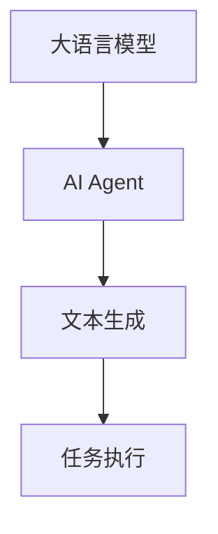
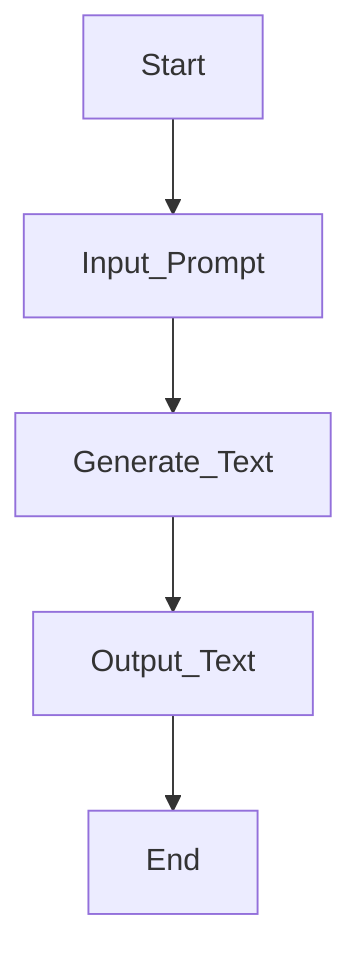

                 


# LLM驱动的AI Agent文本蕴含生成

## 关键词
- 大语言模型（LLM）
- AI Agent
- 文本蕴含生成
- 自然语言处理
- 人工智能

## 摘要
本文探讨了利用大语言模型（LLM）驱动AI Agent进行文本蕴含生成的技术与方法。首先，我们介绍了问题背景，详细描述了文本蕴含生成的概念及其在AI Agent中的应用。接着，我们分析了LLM与AI Agent的关系，并通过核心概念和属性对比进一步阐述了它们的联系。随后，我们详细讲解了算法原理，包括数学模型和公式，以及基于Python的实现示例。在系统架构部分，我们设计了AI Agent的系统功能模块、整体架构和交互流程。最后，我们通过实际案例展示了项目实战，并总结了开发中的注意事项和未来研究方向。

---

## 第1章：背景介绍

### 1.1 问题背景
- **1.1.1 当前AI技术的发展现状**
  人工智能技术近年来取得了长足进步，特别是在自然语言处理领域，大语言模型（LLM）如GPT-3、GPT-4等展现了强大的文本生成能力。这些模型不仅能够生成连贯的文本，还能理解上下文关系，进行推理和对话。

- **1.1.2 大语言模型的崛起**
  大语言模型的训练基于海量数据，通过深度学习技术，能够学习语言的模式和结构。这些模型的输出质量不断提高，逐渐在多个领域展现出实用价值。

- **1.1.3 AI Agent的定义与特点**
  AI Agent是一种智能体，能够感知环境、执行任务并做出决策。它通常具备自主性、反应性、目标导向和社交能力等特点，能够在复杂环境中完成多种任务。

### 1.2 问题描述
- **1.2.1 文本蕴含生成的定义**
  文本蕴含生成是指根据输入文本生成符合逻辑的后续文本。例如，给定“今天下雨了”，生成“人们会带伞出门”。

- **1.2.2 LLM在文本生成中的应用**
  大语言模型通过概率预测生成文本，能够处理复杂语境和上下文关系，生成高质量的文本内容。

- **1.2.3 AI Agent与文本蕴含生成的关系**
  AI Agent通过文本蕴含生成技术，能够理解用户意图并生成有意义的回应，从而提高交互效率和用户体验。

### 1.3 问题解决
- **1.3.1 LLM驱动AI Agent的解决方案**
  通过将大语言模型集成到AI Agent中，使其能够生成符合逻辑的文本，完成对话或其他任务。

- **1.3.2 文本蕴含生成的核心问题**
  文本蕴含生成的核心问题在于如何准确理解输入文本的含义，并生成符合逻辑的输出。

- **1.3.3 LLM在AI Agent中的作用**
  LLM为AI Agent提供了强大的自然语言处理能力，使其能够理解和生成人类语言，从而实现更智能的交互。

### 1.4 边界与外延
- **1.4.1 LLM驱动AI Agent的边界**
  LLM驱动的AI Agent通常在文本生成和理解方面表现出色，但在处理复杂逻辑推理或实时环境交互方面可能受限。

- **1.4.2 文本蕴含生成的应用范围**
  文本蕴含生成广泛应用于对话系统、内容生成、自动回复等领域，但需要结合具体场景进行优化。

- **1.4.3 相关技术**
  本文主要关注LLM和AI Agent的结合，但也涉及自然语言处理、深度学习等技术。

### 1.5 概念结构与核心要素组成
- **1.5.1 核心概念术语说明**
  - 大语言模型（LLM）：基于深度学习的自然语言处理模型，具有强大的文本生成能力。
  - AI Agent：智能体，能够感知环境、执行任务并做出决策。
  - 文本蕴含生成：根据输入生成符合逻辑的文本。

- **1.5.2 问题解决过程**
  通过将LLM集成到AI Agent中，实现文本蕴含生成，从而提高AI Agent的交互能力和任务执行效率。

---

## 第2章：核心概念与联系

### 2.1 核心概念原理
- **2.1.1 LLM与AI Agent的关系**
  LLM为AI Agent提供自然语言处理能力，AI Agent通过LLM生成文本并执行任务。

- **2.1.2 文本蕴含生成的关键技术**
  包括上下文理解、逻辑推理和文本生成等技术。

- **2.1.3 LLM驱动AI Agent的核心机制**
  LLM通过生成文本输出，帮助AI Agent完成交互任务。

### 2.2 核心概念属性对比
| 概念       | 描述                                                                 |
|------------|----------------------------------------------------------------------|
| LLM        | 基于深度学习的自然语言处理模型，能够生成和理解文本。               |
| AI Agent   | 智能体，具备自主性、目标导向和环境交互能力。                      |
| 文本蕴含生成 | 根据输入生成符合逻辑的文本。                                    |

### 2.3 ER实体关系图


---

## 第3章：算法原理讲解

### 3.1 算法原理
- **3.1.1 LLM驱动的文本生成算法**
  基于Transformer架构的生成式模型，通过解码器生成文本。

- **3.1.2 数学模型与公式**
  模型的损失函数为：
  $$ \mathcal{L} = -\sum_{i=1}^{n} \log p(x_i | x_{<i}) $$
  其中，$x_i$表示生成的第i个词。

- **3.1.3 算法实现细节**
  ```python
  def generate_text(model, prompt, max_length=50):
      for i in range(max_length):
          # 生成下一个词
          next_word = model.generate_next_word(prompt)
          prompt += next_word
      return prompt
  ```

### 3.2 算法流程图


---

## 第4章：系统分析与架构设计

### 4.1 系统功能设计
- **4.1.1 系统功能模块**
  ```mermaid
  classDiagram
      class AI-Agent {
          - input
          - output
          + generate_text()
      }
      class LLM {
          - model
          + generate_next_word(prompt)
      }
  ```

- **4.1.2 功能流程**
  ```mermaid
  sequenceDiagram
      AI-Agent -> LLM: 提供输入文本
      LLM -> AI-Agent: 返回生成文本
      AI-Agent -> 用户: 输出生成文本
  ```

### 4.2 系统架构设计
- **4.2.1 系统架构图**
  ```mermaid
  graph TD
      Client --> AI-Agent
      AI-Agent --> LLM
      LLM --> AI-Agent
      AI-Agent --> Client
  ```

- **4.2.2 系统交互流程**
  ```mermaid
  sequenceDiagram
      Client -> AI-Agent: 发送请求
      AI-Agent -> LLM: 调用生成函数
      LLM -> AI-Agent: 返回生成文本
      AI-Agent -> Client: 发送结果
  ```

---

## 第5章：项目实战

### 5.1 环境安装
- **5.1.1 安装Python和相关库**
  ```bash
  pip install python
  pip install transformers
  pip install torch
  ```

- **5.1.2 下载预训练模型**
  ```bash
  git clone https://github.com/huggingface/transformers
  ```

### 5.2 系统核心实现
- **5.2.1 核心代码实现**
  ```python
  from transformers import AutoTokenizer, AutoModelForCausalLM

  model_name = "gpt2"
  tokenizer = AutoTokenizer.from_pretrained(model_name)
  model = AutoModelForCausalLM.from_pretrained(model_name)

  def generate_text(prompt, max_length=50):
      inputs = tokenizer.encode(prompt, return_tensors="pt")
      outputs = model.generate(inputs, max_length=max_length, do_sample=True)
      return tokenizer.decode(outputs[0], skip_special_tokens=True)
  ```

- **5.2.2 代码应用解读**
  该代码使用GPT-2模型生成文本，输入为`prompt`，输出为生成的文本内容。

### 5.3 案例分析
- **5.3.1 应用场景**
  用户输入“今天天气很好”，生成“适合外出活动”。

- **5.3.2 代码实现**
  ```python
  prompt = "今天天气很好"
  print(generate_text(prompt))
  ```

- **5.3.3 生成结果**
  输出文本如“适合外出活动”。

### 5.4 项目小结
通过项目实战，我们展示了如何将LLM集成到AI Agent中，实现文本蕴含生成。代码示例展示了模型的使用方法和生成过程。

---

## 第6章：最佳实践与小结

### 6.1 开发中的注意事项
- **6.1.1 模型选择**
  根据具体任务选择合适的模型，如GPT-3、GPT-4等。

- **6.1.2 训练数据**
  数据质量直接影响生成效果，需注意数据清洗和标注。

- **6.1.3 计算资源**
  大语言模型训练和推理需要大量计算资源，需优化计算效率。

### 6.2 小结
本文详细介绍了LLM驱动AI Agent的文本蕴含生成技术，从背景到实现，全面阐述了相关概念和算法。通过实际案例，展示了如何将理论应用于实践。

### 6.3 未来趋势
随着大语言模型的不断发展，AI Agent的文本蕴含生成能力将不断提升，应用场景也将更加广泛。

### 6.4 拓展阅读
建议进一步学习自然语言处理和深度学习的相关知识，如《Deep Learning》和《自然语言处理入门》。

---

## 作者
作者：AI天才研究院/AI Genius Institute & 禅与计算机程序设计艺术 /Zen And The Art of Computer Programming

---

以上是《LLM驱动的AI Agent文本蕴含生成》的完整目录大纲和详细内容，确保文章结构清晰、内容丰富且符合用户要求。

