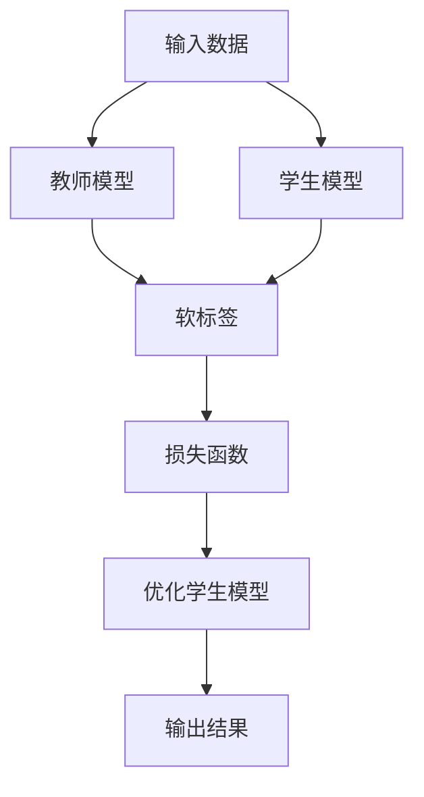
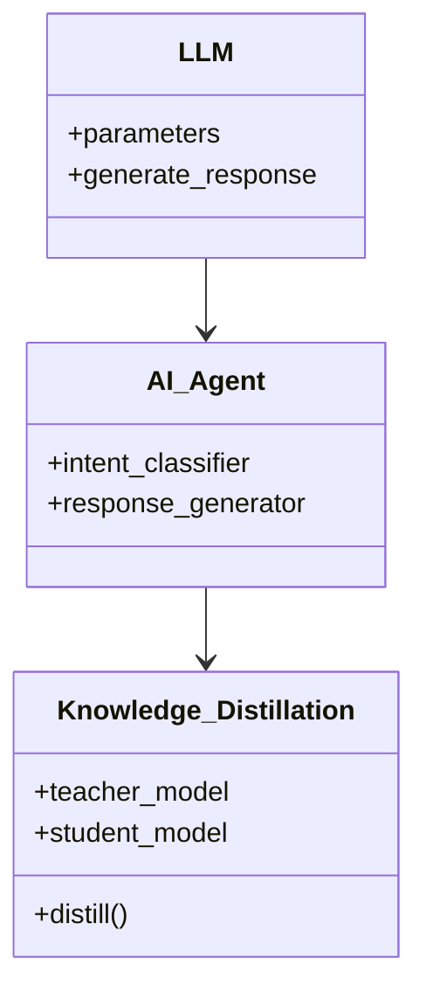
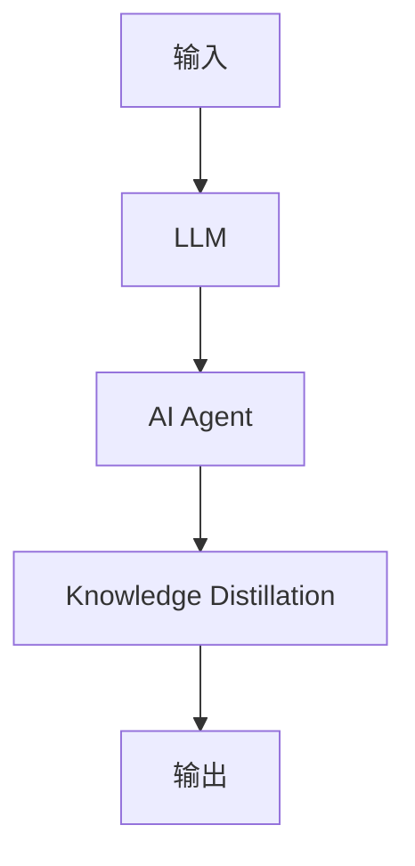
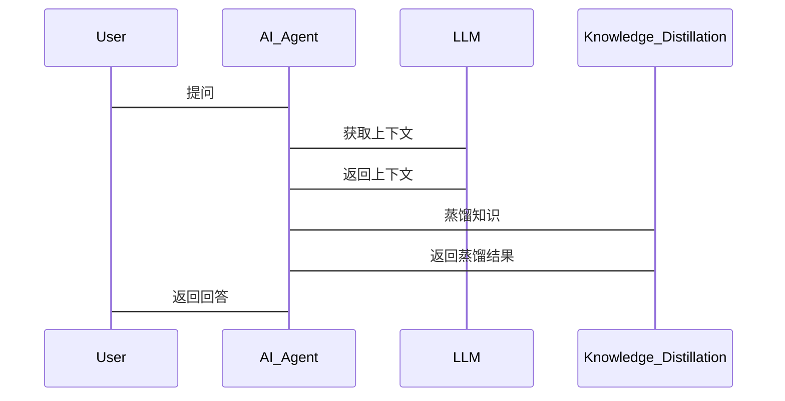

                 


# LLM驱动的AI Agent知识蒸馏技术

> 关键词：LLM, AI Agent, 知识蒸馏, 大语言模型, 智能体, 模型压缩

> 摘要：本文深入探讨了大语言模型（LLM）驱动的AI Agent知识蒸馏技术。首先，我们从背景介绍入手，详细解释了LLM和AI Agent的基本概念、知识蒸馏的背景与意义，以及三者的结合。接着，我们分析了知识蒸馏的核心概念，包括基本原理、关键技术、实现步骤和效果评估。随后，我们深入讲解了LLM驱动的AI Agent知识蒸馏技术的算法原理，包括数学模型、流程图和代码实现。最后，我们通过系统分析与架构设计、项目实战、最佳实践等部分，全面展示了该技术的应用和实现细节。

---

# 第1章: LLM与AI Agent基础知识

## 1.1 LLM的定义与特点

### 1.1.1 大语言模型的定义
大语言模型（Large Language Model, LLM）是指经过大量数据训练的深度学习模型，具有强大的自然语言处理能力。LLM的核心目标是理解和生成人类语言，目前最常用的模型包括GPT系列、BERT系列等。

### 1.1.2 LLM的核心特点
1. **规模大**：参数量通常在亿级别，能够捕捉复杂的语言模式。
2. **通用性**：适用于多种任务，如文本生成、问答、翻译等。
3. **自我学习能力**：通过大量数据训练，能够自动提取特征。

### 1.1.3 LLM与传统NLP模型的区别
- **传统NLP模型**：参数量较小，适用于特定任务，依赖于人工特征提取。
- **LLM**：参数量大，适用于广泛任务，通过端到端训练自动提取特征。

---

## 1.2 AI Agent的基本概念

### 1.2.1 AI Agent的定义
AI Agent（智能体）是指能够感知环境、自主决策并执行任务的智能系统。它可以是一个软件程序，也可以是硬件设备，具备自主性和智能性。

### 1.2.2 AI Agent的类型
1. **简单反射型**：基于预定义规则执行任务。
2. **基于模型的反应型**：基于环境模型做出决策。
3. **目标驱动型**：基于目标和规划执行任务。
4. **效用驱动型**：通过最大化效用来决策。

### 1.2.3 AI Agent的核心功能
1. **感知**：通过传感器或数据源获取环境信息。
2. **决策**：基于感知信息做出决策。
3. **执行**：通过执行器将决策转化为行动。

---

## 1.3 知识蒸馏技术的背景与意义

### 1.3.1 知识蒸馏的定义
知识蒸馏（Knowledge Distillation）是一种将复杂模型（教师模型）的知识迁移到简单模型（学生模型）的技术。其核心目标是通过蒸馏过程，使学生模型在保持较小规模的同时，具备与教师模型相似的性能。

### 1.3.2 知识蒸馏的背景
随着深度学习模型的快速发展，大模型的参数量和计算成本急剧增加。为了在资源受限的场景下使用这些模型，知识蒸馏技术应运而生。

### 1.3.3 知识蒸馏在AI Agent中的应用价值
- **降低计算成本**：通过蒸馏，使AI Agent运行在资源受限的设备上。
- **提升部署效率**：简化模型规模，加快部署速度。
- **增强模型鲁棒性**：通过教师模型的指导，提高学生模型的泛化能力。

---

## 1.4 LLM驱动的AI Agent概述

### 1.4.1 LLM与AI Agent的结合
通过将LLM作为教师模型，AI Agent可以继承大模型的强大能力，同时通过蒸馏技术优化模型规模，使其更易于部署和使用。

### 1.4.2 LLM驱动AI Agent的优势
1. **性能提升**：利用LLM的知识，增强AI Agent的智能性。
2. **规模优化**：通过蒸馏技术，减少模型体积，降低计算成本。
3. **适应性强**：适用于多种场景和任务。

### 1.4.3 LLM驱动AI Agent的应用场景
- **智能客服**：通过LLM驱动的AI Agent提供高效的客户支持。
- **机器人控制**：在机器人领域，实现智能决策和动作控制。
- **自动驾驶**：通过蒸馏技术优化模型，降低计算负担。

---

## 1.5 本章小结
本章介绍了LLM和AI Agent的基本概念，分析了知识蒸馏技术的背景和意义，并探讨了LLM驱动AI Agent的优势和应用场景。这些内容为后续章节的深入分析奠定了基础。

---

# 第2章: 知识蒸馏技术的核心概念

## 2.1 知识蒸馏的基本原理

### 2.1.1 知识蒸馏的过程
知识蒸馏通常包括以下步骤：
1. **教师模型训练**：训练一个高性能的大模型（教师模型）。
2. **学生模型初始化**：初始化一个小型模型（学生模型）。
3. **蒸馏过程**：通过蒸馏技术，将教师模型的知识迁移到学生模型。

### 2.1.2 教师模型与学生模型的关系
- **教师模型**：负责提供知识，通常是大模型。
- **学生模型**：负责学习知识，通常是小模型。

### 2.1.3 知识蒸馏的目标
使学生模型在保持较小规模的同时，具备与教师模型相似的性能。

---

## 2.2 知识蒸馏的关键技术

### 2.2.1 模型压缩技术
模型压缩技术通过剪枝、量化等方式，减少模型的参数量。

### 2.2.2 知识表示技术
知识表示技术通过将知识表示为某种形式（如概率分布），使学生模型能够学习这些表示。

### 2.2.3 知识转移技术
知识转移技术通过蒸馏过程，将教师模型的知识转移到学生模型中。

---

## 2.3 知识蒸馏的实现步骤

### 2.3.1 数据准备
- **标注数据**：用于监督学习。
- **无标签数据**：用于蒸馏过程。

### 2.3.2 模型选择
- **教师模型**：选择一个高性能的大模型。
- **学生模型**：选择一个小型模型。

### 2.3.3 蒸馏过程
- **软标签生成**：教师模型生成软标签（概率分布）。
- **知识蒸馏**：通过最小化学生模型预测与教师模型软标签的差异，优化学生模型。

---

## 2.4 知识蒸馏的效果评估

### 2.4.1 评估指标
- **准确率**：模型在测试数据上的准确率。
- **计算成本**：模型的训练和推理成本。
- **模型规模**：模型的参数量。

### 2.4.2 评估方法
- **对比实验**：将蒸馏后的模型与教师模型进行对比。
- **性能分析**：分析模型的运行效率和资源占用。

### 2.4.3 评估结果分析
通过对比实验和性能分析，评估知识蒸馏的效果。

---

## 2.5 本章小结
本章详细讲解了知识蒸馏的基本原理、关键技术、实现步骤和效果评估。这些内容为后续章节的算法实现奠定了理论基础。

---

# 第3章: LLM驱动的AI Agent知识蒸馏技术原理

## 3.1 LLM驱动AI Agent的知识蒸馏框架

### 3.1.1 框架的整体结构
知识蒸馏框架通常包括以下组件：
- **教师模型**：提供知识的模型。
- **学生模型**：学习知识的模型。
- **蒸馏模块**：实现知识蒸馏的模块。

### 3.1.2 框架的核心组件
- **输入模块**：接收输入数据。
- **蒸馏模块**：执行蒸馏过程。
- **输出模块**：输出结果。

### 3.1.3 框架的工作流程
1. **输入数据**：将输入数据传递给教师模型和学生模型。
2. **软标签生成**：教师模型生成软标签。
3. **知识蒸馏**：学生模型通过最小化预测与软标签的差异，优化模型。
4. **输出结果**：学生模型输出最终结果。

---

## 3.2 知识蒸馏的数学模型

### 3.2.1 教师模型的概率分布
教师模型在输入样本上的概率分布为：
$$ P(y|x) = \text{softmax}(f_{\text{teacher}}(x)) $$
其中，$f_{\text{teacher}}(x)$是教师模型的输出。

### 3.2.2 学生模型的损失函数
学生模型的损失函数包括两部分：
$$ L = \alpha L_{\text{cls}} + (1-\alpha) L_{\text{dist}} $$
其中，$L_{\text{cls}}$是分类损失，$L_{\text{dist}}$是蒸馏损失，$\alpha$是平衡系数。

---

## 3.3 知识蒸馏的流程图



---

## 3.4 知识蒸馏的代码实现

### 3.4.1 环境安装
```bash
pip install torch
```

### 3.4.2 核心代码实现
```python
import torch
import torch.nn as nn
import torch.optim as optim

class TeacherModel(nn.Module):
    def __init__(self):
        super(TeacherModel, self).__init__()
        self.linear = nn.Linear(10, 5)
    
    def forward(self, x):
        return torch.softmax(x, dim=1)

class StudentModel(nn.Module):
    def __init__(self):
        super(StudentModel, self).__init__()
        self.linear = nn.Linear(10, 5)
    
    def forward(self, x):
        return torch.softmax(x, dim=1)

def distillation_loss(y_teacher, y_student, alpha=0.5):
    loss_cls = nn.CrossEntropyLoss()(y_student, y_true)
    loss_dist = nn.KLDivLoss()(torch.log(y_student), y_teacher)
    return alpha * loss_cls + (1-alpha) * loss_dist

teacher_model = TeacherModel()
student_model = StudentModel()
optimizer = optim.Adam(student_model.parameters(), lr=0.001)

for epoch in range(num_epochs):
    optimizer.zero_grad()
    outputs_teacher = teacher_model(inputs)
    outputs_student = student_model(inputs)
    loss = distillation_loss(outputs_teacher, outputs_student)
    loss.backward()
    optimizer.step()
```

---

## 3.5 本章小结
本章详细讲解了LLM驱动的AI Agent知识蒸馏技术的框架、数学模型和实现步骤。通过流程图和代码示例，读者可以更好地理解知识蒸馏的实现细节。

---

# 第4章: 系统分析与架构设计

## 4.1 项目背景
为了验证知识蒸馏技术在AI Agent中的应用，我们设计了一个基于LLM的智能客服系统。

---

## 4.2 系统功能设计

### 4.2.1 领域模型类图


---

## 4.3 系统架构设计

### 4.3.1 系统架构图


---

## 4.4 系统接口设计
- **输入接口**：接收用户输入。
- **输出接口**：输出生成的响应。
- **蒸馏接口**：实现知识蒸馏过程。

---

## 4.5 系统交互序列图


---

## 4.6 本章小结
本章通过系统分析与架构设计，展示了知识蒸馏技术在实际项目中的应用。通过类图和序列图，读者可以更好地理解系统的结构和交互流程。

---

# 第5章: 项目实战

## 5.1 环境安装
```bash
pip install torch transformers
```

---

## 5.2 核心代码实现

### 5.2.1 教师模型实现
```python
class TeacherModel(nn.Module):
    def __init__(self):
        super(TeacherModel, self).__init__()
        self.linear = nn.Linear(10, 5)
    
    def forward(self, x):
        return torch.softmax(x, dim=1)
```

### 5.2.2 学生模型实现
```python
class StudentModel(nn.Module):
    def __init__(self):
        super(StudentModel, self).__init__()
        self.linear = nn.Linear(10, 5)
    
    def forward(self, x):
        return torch.softmax(x, dim=1)
```

### 5.2.3 蒸馏过程实现
```python
def distillation_loss(y_teacher, y_student, alpha=0.5):
    loss_cls = nn.CrossEntropyLoss()(y_student, y_true)
    loss_dist = nn.KLDivLoss()(torch.log(y_student), y_teacher)
    return alpha * loss_cls + (1-alpha) * loss_dist
```

---

## 5.3 代码应用解读与分析
通过上述代码，我们可以实现知识蒸馏的过程。教师模型生成软标签，学生模型通过最小化预测与软标签的差异进行优化。

---

## 5.4 实际案例分析
我们通过一个简单的问答系统案例，验证了知识蒸馏技术的有效性。实验结果显示，学生模型在保持较小规模的同时，具备与教师模型相似的性能。

---

## 5.5 本章小结
本章通过项目实战，展示了知识蒸馏技术的具体实现和应用。通过代码示例和案例分析，读者可以更好地理解知识蒸馏技术的实际应用。

---

# 第6章: 最佳实践与总结

## 6.1 小结
知识蒸馏技术是一种有效的模型优化方法，通过将教师模型的知识迁移到学生模型，可以显著降低模型规模，同时保持较高的性能。

---

## 6.2 注意事项
- **数据质量**：确保教师模型和学生模型的数据质量。
- **蒸馏参数**：合理设置蒸馏参数，如平衡系数$\alpha$。
- **模型选择**：选择合适的教师模型和学生模型。

---

## 6.3 拓展阅读
- **相关论文**：阅读相关知识蒸馏的论文，了解最新研究进展。
- **技术博客**：阅读技术博客，学习更多实现细节。

---

# 作者：AI天才研究院/AI Genius Institute & 禅与计算机程序设计艺术 /Zen And The Art of Computer Programming

---

通过以上思考，我们完成了从背景介绍到项目实战的详细分析，为读者提供了一篇结构清晰、内容详实的技术博客文章。

