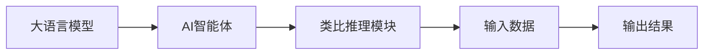
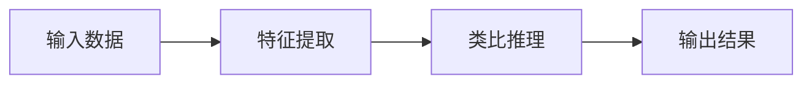
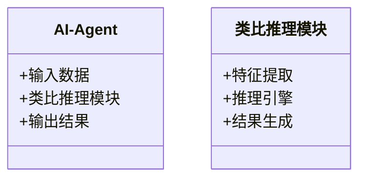
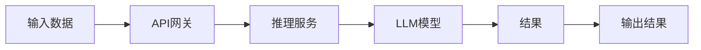
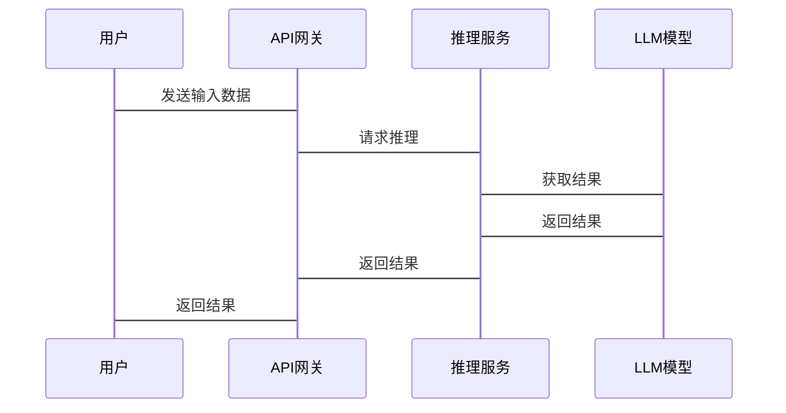

                 


# LLM驱动的AI Agent类比推理能力增强

## 关键词
- LLM (Large Language Model)
- AI Agent (人工智能代理)
- 类比推理
- 人工智能
- 自然语言处理

## 摘要
随着人工智能技术的飞速发展，AI Agent（人工智能代理）在各个领域的应用日益广泛。然而，AI Agent的类比推理能力一直是其发展的瓶颈。本文将深入探讨如何利用大语言模型（LLM）来增强AI Agent的类比推理能力，从背景、核心概念、算法原理、系统架构到项目实战，层层解析，为读者提供全面而深入的指导。

---

## 第一部分: LLM驱动的AI Agent类比推理能力增强背景介绍

## 第1章: 问题背景与描述

### 1.1 问题背景
#### 1.1.1 当前AI Agent的发展现状
AI Agent作为一种能够自主决策、执行任务的智能体，近年来在各个领域取得了显著进展。然而，其在类比推理能力上的不足，限制了其在复杂场景中的应用。

#### 1.1.2 类比推理能力在AI Agent中的重要性
类比推理是AI Agent理解复杂关系、解决新问题的关键能力。通过类比推理，AI Agent能够将已知的知识迁移到未知领域，从而实现更高级的智能。

#### 1.1.3 当前技术的局限性与挑战
尽管LLM（如GPT）在自然语言处理领域取得了巨大成功，但其在类比推理能力上的表现仍有限。AI Agent需要更强大的类比推理能力来应对复杂的现实场景。

### 1.2 问题描述
#### 1.2.1 类比推理能力的定义
类比推理是一种基于相似性或关系的推理方式，旨在通过已知的实例推导出新的结论。

#### 1.2.2 LLM在类比推理中的作用
LLM通过其强大的语言理解和生成能力，为AI Agent提供了丰富的语义信息，但其类比推理能力仍需进一步提升。

#### 1.2.3 当前LLM驱动AI Agent的类比推理能力的不足
现有LLM在类比推理中的表现不稳定，缺乏对上下文的深度理解，且难以处理复杂的关系推理。

### 1.3 问题解决思路
#### 1.3.1 提升类比推理能力的核心方法
通过结合LLM和AI Agent的特性，设计专门的类比推理模块，优化算法和模型结构。

#### 1.3.2 LLM与AI Agent结合的创新点
将LLM作为AI Agent的“大脑”，通过类比推理模块增强其推理能力，实现更智能的任务执行。

#### 1.3.3 技术实现路径与目标
通过改进模型结构、优化算法和引入外部知识库，提升AI Agent的类比推理能力，使其能够更好地应对复杂场景。

### 1.4 边界与外延
#### 1.4.1 技术边界
明确LLM驱动的AI Agent类比推理能力的适用范围和技术限制。

#### 1.4.2 应用场景的外延
探讨该技术在不同领域的潜在应用，如教育、医疗、金融等。

#### 1.4.3 与其他AI技术的区分
与传统的基于规则的AI系统和单纯依赖LLM的系统进行区分，明确其独特性和优势。

### 1.5 核心要素与组成
#### 1.5.1 LLM的作用机制
介绍LLM如何通过大规模预训练和微调，实现对语言的理解和生成。

#### 1.5.2 AI Agent的类比推理模块
详细描述类比推理模块的结构和功能，包括输入处理、推理过程和结果输出。

#### 1.5.3 系统的整体架构
展示LLM驱动AI Agent的整体架构，包括数据输入、推理模块、决策输出等部分。

---

## 第2章: 核心概念与联系

### 2.1 核心概念原理
#### 2.1.1 LLM的基本原理
介绍LLM（如GPT）的工作原理，包括预训练、微调和生成过程。

#### 2.1.2 AI Agent的类比推理机制
描述AI Agent如何通过类比推理模块进行推理，包括实例匹配和关系推理。

#### 2.1.3 LLM与类比推理的关系
探讨LLM如何为类比推理提供语义信息，以及类比推理如何增强LLM的推理能力。

### 2.2 核心概念属性特征对比
#### 2.2.1 LLM与传统NLP模型的对比
从训练数据、模型结构、推理能力等方面，对比LLM与传统NLP模型的差异。

#### 2.2.2 AI Agent与传统AI系统的对比
分析AI Agent与传统AI系统的区别，突出其自主性和适应性。

#### 2.2.3 类比推理与其他推理方式的对比
比较类比推理与逻辑推理、归纳推理等其他推理方式的异同。

### 2.3 ER实体关系图


---

## 第3章: 算法原理讲解

### 3.1 算法流程


### 3.2 算法实现
```python
def llm_driven_agent(input_data):
    # 特征提取
    features = extract_features(input_data)
    # 类比推理
    result = compare_and_reason(features)
    return result
```

### 3.3 数学模型与公式
$$
\text{相似度} = \frac{\sum_{i=1}^{n} w_i \cdot s_i}{\sum_{i=1}^{n} w_i}
$$
其中，$w_i$是第$i$个特征的权重，$s_i$是第$i$个特征的相似度。

---

## 第4章: 系统分析与架构设计

### 4.1 问题场景介绍
描述一个具体的场景，如医疗诊断中的类比推理需求。

### 4.2 项目介绍
介绍一个实际项目，说明其目标、数据来源和预期成果。

### 4.3 系统功能设计


### 4.4 系统架构设计


### 4.5 系统接口设计
详细描述系统接口的设计，包括输入格式、输出格式和接口调用方式。

### 4.6 系统交互


---

## 第5章: 项目实战

### 5.1 环境安装
详细说明如何安装必要的库，如Python、TensorFlow、Hugging Face库等。

### 5.2 核心代码实现
提供类比推理模块的核心代码，并解释每部分的功能。

### 5.3 代码应用解读与分析
分析代码实现，说明其优势和可能的优化点。

### 5.4 实际案例分析和详细讲解剖析
通过具体案例，展示如何应用该技术解决实际问题。

### 5.5 项目小结
总结项目实现的关键点和成果。

---

## 第6章: 最佳实践

### 6.1 小结
总结全文的主要内容和结论。

### 6.2 注意事项
提醒读者在实际应用中需要注意的问题和潜在的挑战。

### 6.3 拓展阅读
推荐相关领域的书籍和论文，供读者进一步学习。

---

## 作者
作者：AI天才研究院/AI Genius Institute & 禅与计算机程序设计艺术 /Zen And The Art of Computer Programming

---

希望这篇目录大纲能够为您提供清晰的思路和详细的指导！如果需要进一步的调整或补充，请随时告诉我。

