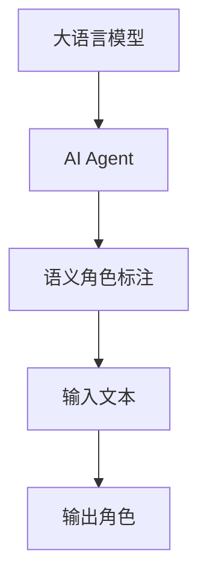
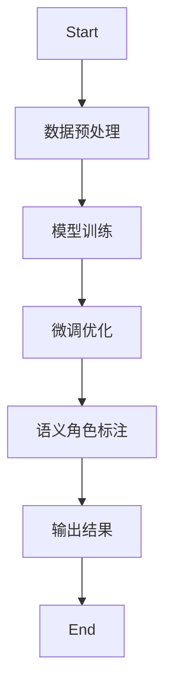
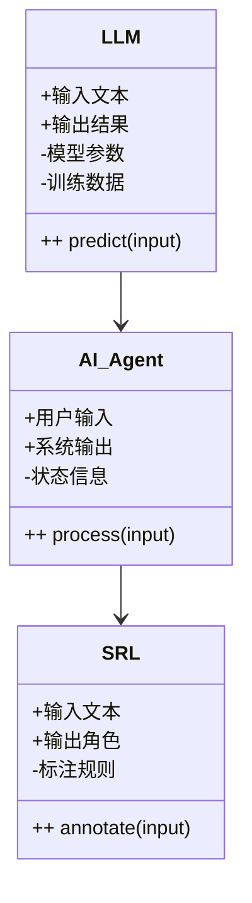
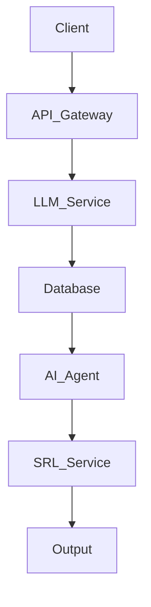

                 


# LLM驱动的AI Agent语义角色标注

> 关键词：LLM，AI Agent，语义角色标注，自然语言处理，深度学习

> 摘要：本文深入探讨了基于大语言模型（LLM）的AI Agent语义角色标注技术。从问题背景到核心概念，从算法原理到系统架构，从项目实战到最佳实践，全面解析LLM驱动的AI Agent语义角色标注的实现方法和应用场景。通过详细的技术分析和实际案例，帮助读者理解并掌握这一前沿技术的核心原理和应用技巧。

---

# 第一部分：背景与概述

## 第1章：问题背景与描述

### 1.1 问题背景

#### 1.1.1 当前AI Agent的发展现状
人工智能代理（AI Agent）是人工智能领域的重要研究方向，其核心目标是通过自动化方式理解和执行人类意图。随着大语言模型（LLM）的崛起，AI Agent的能力得到了质的飞跃，尤其是在自然语言处理（NLP）任务中表现突出。

#### 1.1.2 语义角色标注的必要性
在AI Agent与用户交互的过程中，理解用户意图是核心任务之一。语义角色标注（Semantic Role Labeling，SRL）通过对文本中的语义角色进行标注，帮助AI Agent准确识别动作、实体和关系，从而实现更精准的语义理解。

#### 1.1.3 LLM在AI Agent中的作用
大语言模型（LLM）通过其强大的语言理解和生成能力，为AI Agent提供了强大的语义理解基础。LLM能够通过上下文信息，自动识别文本中的语义角色，从而帮助AI Agent更好地理解用户意图。

### 1.2 问题描述

#### 1.2.1 语义角色标注的核心问题
语义角色标注的核心问题是如何从文本中准确识别出语义角色，例如“谁在做某事”、“做什么”、“在哪里做”等。

#### 1.2.2 LLM驱动的AI Agent面临的挑战
尽管LLM在语义理解方面表现出色，但其在语义角色标注方面仍面临一些挑战，例如如何处理歧义性、如何提高标注精度以及如何实现高效的实时标注。

#### 1.2.3 语义角色标注的边界与外延
语义角色标注的边界在于如何区分语法角色和语义角色，而其外延则包括对多语言、多领域和动态场景的支持。

### 1.3 问题解决与技术优势

#### 1.3.1 LLM驱动的AI Agent如何实现语义角色标注
通过结合LLM的自然语言理解和生成能力，AI Agent能够自动识别文本中的语义角色，并根据这些角色执行相应的任务。

#### 1.3.2 技术优势与创新点
- 利用LLM的强大语义理解能力，实现高效的语义角色标注。
- 通过动态调整标注策略，适应不同的应用场景。
- 结合上下文信息，提高标注的准确性和完整性。

#### 1.3.3 与传统语义标注的区别
传统语义标注主要依赖于预定义的规则和模式，而LLM驱动的语义标注则更加灵活和动态，能够适应复杂的语义场景。

### 1.4 应用领域与研究现状

#### 1.4.1 主要应用领域
- 智能客服：通过语义角色标注，实现精准的用户意图识别。
- 智能助手：帮助用户完成复杂的任务，例如日程管理、信息查询等。
- 自然语言交互：实现更自然和流畅的用户与计算机交互。

#### 1.4.2 当前研究现状
当前研究主要集中在如何提高语义角色标注的准确性和效率，以及如何结合LLM实现更高效的语义理解。

#### 1.4.3 技术发展趋势
未来的研究方向将聚焦于如何实现多模态语义角色标注，以及如何结合边缘计算和实时反馈机制，实现更高效的语义理解。

---

## 第2章：核心概念与联系

### 2.1 核心概念原理

#### 2.1.1 LLM的基本原理
大语言模型（LLM）通过大量的文本数据训练，掌握了语言的语法和语义规则。其核心原理是通过概率模型预测下一个词的概率分布。

#### 2.1.2 AI Agent的定义与功能
AI Agent是一种能够感知环境并采取行动以实现目标的智能体。其核心功能包括感知、决策、执行和反馈。

#### 2.1.3 语义角色标注的实现机制
语义角色标注通过识别文本中的谓词-论元结构，标注出谓词和论元之间的语义关系。

### 2.2 核心概念属性对比

#### 2.2.1 LLM与传统NLP模型的对比
| 特性          | LLM                | 传统NLP模型          |
|---------------|--------------------|----------------------|
| 数据量        | 大规模             | 较小                 |
| 训练方法      | 自监督学习          | 监督学习             |
| 应用场景      | 多样化             | 专用化               |

#### 2.2.2 AI Agent与传统任务执行系统的对比
| 特性          | AI Agent           | 传统任务执行系统     |
|---------------|--------------------|----------------------|
| 智能性        | 高                 | 低                  |
| 适应性        | 强                 | 弱                  |
| 自主性        | 高                 | 低                  |

#### 2.2.3 语义角色标注与其他NLP任务的对比
| 特性          | 语义角色标注       | 命名实体识别（NER）    |
|---------------|--------------------|----------------------|
| 核心目标      | 标注谓词-论元结构  | 标识文本中的实体      |
| 输入形式      | 文本段落           | 文本片段             |
| 输出形式      | 标注后的谓词-论元结构 | 实体标签             |

### 2.3 ER实体关系图



---

## 第3章：算法原理与实现

### 3.1 模型训练流程

#### 3.1.1 数据预处理
数据预处理是模型训练的基础，包括文本清洗、分词、去除停用词等。

#### 3.1.2 模型训练
模型训练是通过优化目标函数，调整模型参数，使模型能够准确预测语义角色。

#### 3.1.3 调参与优化
通过调整超参数和优化策略，进一步提升模型的性能和效率。

### 3.2 语义角色标注方法

#### 3.2.1 基于LLM的标注方法
通过利用LLM的语义理解能力，实现高效的语义角色标注。

#### 3.2.2 基于规则的标注方法
通过预定义的规则和模式，实现语义角色的标注。

#### 3.2.3 基于混合模型的标注方法
结合LLM和规则的双重优势，实现更精准的语义角色标注。

---

### 3.3 算法实现流程



---

## 第4章：数学公式与模型实现

### 4.1 模型数学基础

#### 4.1.1 概率模型
概率模型通过计算每个可能结果的概率，选择概率最大的结果作为最终输出。

$$ P(y|x) = \arg\max_y P(y|x) $$

#### 4.1.2 优化目标
模型优化的目标是最小化损失函数，通常采用交叉熵损失函数。

$$ \mathcal{L} = -\sum_{i=1}^{n} y_i \log p(y_i) $$

---

## 第5章：系统架构与设计

### 5.1 系统功能设计

#### 5.1.1 领域模型设计
通过领域模型设计，明确系统的功能模块和交互流程。



### 5.2 系统架构设计



### 5.3 系统接口设计

#### 5.3.1 API接口
通过API接口实现系统与外部系统的交互，例如：

```python
def process_input(input_text):
    # 调用LLM服务
    response = call_llm(input_text)
    # 调用SRL服务
    roles = annotate_roles(response)
    return roles
```

---

## 第6章：项目实战与案例分析

### 6.1 项目环境安装

#### 6.1.1 安装依赖
安装必要的依赖库，例如：

```bash
pip install transformers
pip install mermaid
pip install matplotlib
```

### 6.2 项目核心实现

#### 6.2.1 LLM集成
将LLM集成到AI Agent中，实现语义角色标注。

```python
from transformers import AutoTokenizer, AutoModelForMaskedLM

tokenizer = AutoTokenizer.from_pretrained("bert-base-uncased")
model = AutoModelForMaskedLM.from_pretrained("bert-base-uncased")
```

#### 6.2.2 语义角色标注
通过模型推理，实现语义角色标注。

```python
def annotate_roles(text):
    inputs = tokenizer.encode_plus(text, return_tensors="pt")
    outputs = model(**inputs)
    # 解析输出结果
    roles = []
    for i in range(len(outputs.logits[0])):
        predicted_index = torch.argmax(outputs.logits[0][i])
        role = tokenizer.decode([predicted_index])
        roles.append(role)
    return roles
```

### 6.3 案例分析与解读

#### 6.3.1 实际案例
分析一个实际案例，例如：

**输入文本：** "Alice sends an email to Bob about the meeting."

**输出角色：** Alice（发送者）、email（内容）、Bob（接收者）、meeting（主题）。

---

## 第7章：最佳实践与小结

### 7.1 最佳实践 tips

- **模型选择：** 根据具体场景选择合适的LLM模型。
- **数据优化：** 通过数据增强和清洗提升模型性能。
- **实时反馈：** 实现实时反馈机制，动态调整标注策略。

### 7.2 小结
通过本文的分析，我们深入探讨了LLM驱动的AI Agent语义角色标注的核心原理和实现方法，结合实际案例，帮助读者理解并掌握这一技术的核心要点。

### 7.3 注意事项
- **数据隐私：** 注意保护用户数据隐私。
- **模型可解释性：** 提高模型的可解释性，便于调试和优化。
- **性能优化：** 通过优化算法和架构，提升系统性能。

### 7.4 拓展阅读
建议读者进一步阅读相关领域的最新论文和技术博客，例如：
- [Transformers: Pre-training of self-supervised language models](https://arxiv.org/abs/1805.09404)
- [BERT: Pre-training of deep bidirectional transformers for language understanding](https://arxiv.org/abs/1810.0469)

---

# 作者：AI天才研究院/AI Genius Institute & 禅与计算机程序设计艺术 /Zen And The Art of Computer Programming

