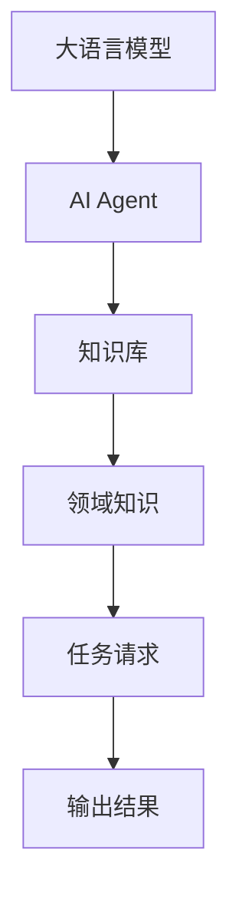
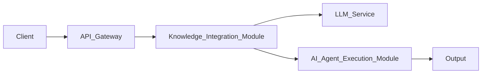

                 


# LLM驱动的AI Agent跨学科知识整合器

> 关键词：LLM, AI Agent, 跨学科知识整合, 大语言模型, 人工智能代理, 知识图谱

> 摘要：随着大语言模型（LLM）技术的快速发展，AI Agent（人工智能代理）逐渐成为跨学科知识整合的核心工具。本文将深入探讨LLM驱动的AI Agent在跨学科知识整合中的应用，分析其核心原理、系统架构设计以及实际应用场景。通过详细的技术分析和案例研究，本文将为读者提供一个全面理解LLM驱动AI Agent跨学科知识整合的框架。

---

## 目录

1. [背景介绍](#背景介绍)
   - 1.1 问题背景
   - 1.2 问题描述
   - 1.3 问题解决
   - 1.4 边界与外延
   - 1.5 概念结构与核心要素

2. [核心概念与联系](#核心概念与联系)
   - 2.1 LLM与AI Agent的核心原理
   - 2.2 概念属性特征对比
   - 2.3 ER实体关系图

3. [算法原理讲解](#算法原理讲解)
   - 3.1 大语言模型的训练过程
   - 3.2 AI Agent的实现算法
   - 3.3 跨学科知识整合的算法实现

4. [系统架构设计](#系统架构设计)
   - 4.1 系统功能设计
   - 4.2 系统架构设计
   - 4.3 接口与交互设计

5. [项目实战](#项目实战)
   - 5.1 环境安装与配置
   - 5.2 系统核心实现
   - 5.3 实际案例分析

6. [总结与扩展](#总结与扩展)
   - 6.1 最佳实践
   - 6.2 项目小结
   - 6.3 未来展望

---

## 背景介绍

### 1.1 问题背景

人工智能（AI）技术的快速发展，尤其是大语言模型（LLM）的崛起，为AI Agent（人工智能代理）提供了强大的技术支持。AI Agent是一种能够自主感知环境、执行任务并做出决策的智能体。随着跨学科知识整合的需求日益增加，如何利用LLM驱动AI Agent实现高效的知识整合成为当前技术研究的热点。

### 1.2 问题描述

当前，AI Agent在实际应用中面临以下主要问题：
- **知识孤岛**：不同领域（如医疗、法律、金融）的知识分散，难以有效整合。
- **信息不一致**：跨学科知识在整合过程中容易出现信息冲突和不一致。
- **决策不确定性**：AI Agent在面对复杂问题时，缺乏足够的知识支持，导致决策不确定性增加。

### 1.3 问题解决

LLM驱动的AI Agent通过以下方式解决上述问题：
- **跨学科知识整合**：利用LLM的强大语言理解和生成能力，整合多个领域的知识。
- **知识图谱构建**：通过构建跨学科的知识图谱，消除知识孤岛。
- **动态决策支持**：基于整合后的知识，提供动态的决策支持。

### 1.4 边界与外延

- **边界**：LLM驱动的AI Agent主要关注跨学科知识的整合与应用，不涉及具体领域的业务逻辑实现。
- **外延**：跨学科知识整合可以应用于医疗、教育、法律等多个领域，具有广泛的应用前景。

### 1.5 概念结构与核心要素

LLM驱动的AI Agent跨学科知识整合的核心要素包括：
1. **LLM**：提供强大的语言理解和生成能力。
2. **知识库**：存储跨学科的知识。
3. **知识整合算法**：实现知识的融合与统一。
4. **AI Agent**：负责任务执行和决策。

---

## 核心概念与联系

### 2.1 LLM与AI Agent的核心原理

- **LLM**：基于Transformer架构的大语言模型，通过自监督学习训练而成，具有强大的语言理解和生成能力。
- **AI Agent**：通过感知环境、理解任务需求，并利用LLM提供的知识支持，执行任务并提供结果。

### 2.2 概念属性特征对比

| 概念 | 特征 |
|------|------|
| LLM | 大规模预训练、多语言支持、上下文理解能力 |
| AI Agent | 自主决策、任务执行、人机交互 |
| 跨学科知识整合 | 跨领域知识融合、动态更新、知识图谱构建 |

### 2.3 ER实体关系图



---

## 算法原理讲解

### 3.1 大语言模型的训练过程

大语言模型的训练过程可以分为以下几个步骤：

1. **数据准备**：收集多领域的文本数据，并进行清洗和预处理。
2. **模型构建**：基于Transformer架构构建模型。
3. **预训练**：使用自监督学习目标（如Masked LM）进行预训练。
4. **微调**：根据具体任务对模型进行微调。

模型训练的数学公式如下：
$$
\text{损失函数} = \text{交叉熵损失}(\text{预测概率分布}, \text{真实标签})
$$
优化器通常采用Adam优化器：
$$
\theta = \theta - \eta \cdot \nabla_{\theta} \text{损失函数}
$$

### 3.2 AI Agent的实现算法

AI Agent的核心算法包括以下步骤：
1. **任务理解**：解析用户的需求。
2. **知识检索**：从知识库中检索相关知识。
3. **决策推理**：基于知识进行推理，生成解决方案。
4. **结果输出**：将结果返回给用户。

---

## 系统架构设计

### 4.1 系统功能设计

系统功能模块如下：
- **知识整合模块**：负责跨学科知识的整合与管理。
- **LLM调用模块**：调用大语言模型提供知识支持。
- **AI Agent执行模块**：负责任务执行和结果输出。

### 4.2 系统架构设计



### 4.3 接口与交互设计

```mermaid
sequenceDiagram
    Client ->+ API_Gateway: 发送任务请求
    API_Gateway -> Knowledge_Integration_Module: 请求知识整合
    Knowledge_Integration_Module -> LLM_Service: 请求知识生成
    LLM_Service --> Knowledge_Integration_Module: 返回生成知识
    Knowledge_Integration_Module -> AI_Agent_Execution_Module: 下达执行任务
    AI_Agent_Execution_Module --> Output: 返回执行结果
    Client <-+ API_Gateway: 收到最终结果
```

---

## 项目实战

### 5.1 环境安装与配置

```bash
pip install transformers
pip install torch
pip install requests
```

### 5.2 系统核心实现

```python
from transformers import AutoTokenizer, AutoModelForCausalLM
import torch

# 初始化模型和tokenizer
tokenizer = AutoTokenizer.from_pretrained("gpt2")
model = AutoModelForCausalLM.from_pretrained("gpt2")

# 定义生成函数
def generate_response(prompt):
    inputs = tokenizer.encode(prompt, return_tensors="pt")
    outputs = model.generate(inputs, max_length=100, do_sample=True)
    response = tokenizer.decode(outputs[0], skip_special_tokens=True)
    return response

# AI Agent核心逻辑
def ai_agent(task_request):
    prompt = f"基于以下知识，解决{task_request}。\n知识：{get_domain_knowledge()}"
    response = generate_response(prompt)
    return response
```

### 5.3 实际案例分析

以医疗领域的跨学科知识整合为例：
- **任务请求**：分析某药物的副作用及可能的替代方案。
- **知识整合**：从医疗知识库中检索相关药物信息，并结合医学文献进行分析。
- **AI Agent执行**：生成详细的分析报告并提供替代方案建议。

---

## 总结与扩展

### 6.1 最佳实践

- **数据质量**：确保知识库的数据质量和多样性。
- **模型调优**：根据具体任务对模型进行微调，提升性能。
- **安全与隐私**：在跨学科知识整合中，需注意数据安全和隐私保护。

### 6.2 项目小结

本文详细探讨了LLM驱动的AI Agent在跨学科知识整合中的应用，从算法原理到系统架构设计，再到项目实战，为读者提供了一个全面的技术框架。

### 6.3 未来展望

随着大语言模型能力的不断增强，LLM驱动的AI Agent将在更多领域实现跨学科知识整合，为人类社会带来更高效的知识管理和应用。

---

## 作者

**作者：AI天才研究院/AI Genius Institute & 禅与计算机程序设计艺术 /Zen And The Art of Computer Programming**

---

感谢您的阅读！如需进一步探讨，请随时与我联系。

