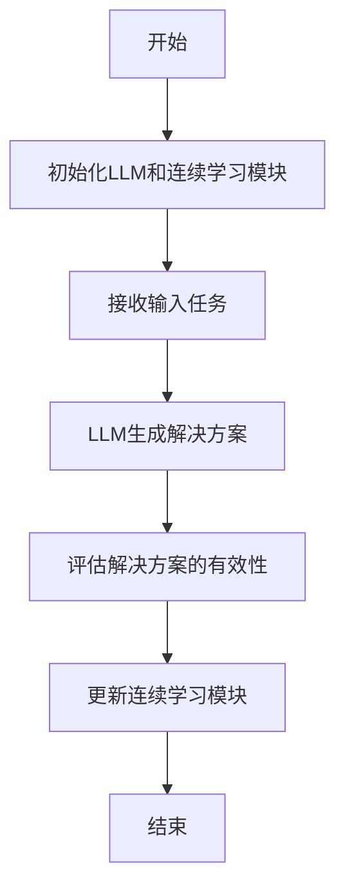
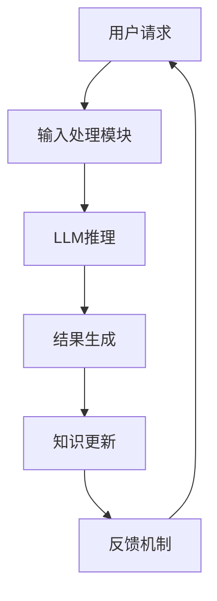
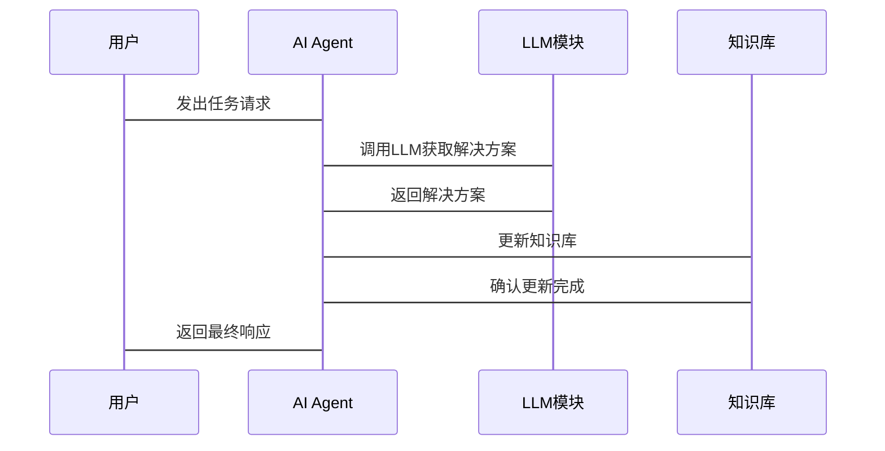

                 


# 第三部分: 算法原理与数学模型

## 第3章: LLM与连续学习的算法原理

### 3.1 LLM的数学模型
#### 3.1.1 Transformer架构的核心公式
$$ \text{Self-attention}(Q, K, V) = \text{softmax}\left(\frac{QK^T}{\sqrt{d_k}}\right)V $$
其中，$Q$、$K$、$V$分别为查询、键、值向量，$d_k$为键的维度。

#### 3.1.2 LLM的训练目标
使用交叉熵损失函数：
$$ \mathcal{L} = -\sum_{i=1}^{n} y_i \log p(y_i|x_i) $$

### 3.2 连续学习的算法原理
#### 3.2.1 经验重放缓冲区
$$ \mathcal{D}_{new} = \mathcal{D}_{old} \cup \mathcal{D}_{new\_tasks} $$

#### 3.2.2 知识蒸馏
$$ \mathcal{L}_{distill} = \alpha \mathcal{L}_{CE} + (1-\alpha)\mathcal{L}_{KL} $$

### 3.3 框架的算法流程


---

# 第四部分: 系统分析与架构设计

## 第4章: 系统架构与实现

### 4.1 系统功能设计
#### 4.1.1 领域模型设计
```mermaid
classDiagram
    class LLM模块 {
        +输入: 输入文本
        +输出: 解释和建议
        -transformer网络
        -损失函数
    }
    class 连续学习模块 {
        +输入: 新任务
        +输出: 更新的知识库
        -经验重放缓冲区
        -知识蒸馏机制
    }
    class AI Agent {
        +输入: 用户请求
        +输出: 响应
        -LLM模块
        -连续学习模块
    }
    LLM模块 <-- [调用] --> AI Agent
    连续学习模块 <-- [更新] --> AI Agent
```

### 4.2 系统架构设计


### 4.3 接口与交互设计
#### 4.3.1 接口设计
```plaintext
+------------------------------------------+
|               API                         |
|------------------------------------------|
| 输入：用户请求文本                         |
| 输出：AI Agent响应                         |
|------------------------------------------|
```

#### 4.3.2 交互流程


---

# 第五部分: 项目实战与案例分析

## 第5章: 项目实现与案例分析

### 5.1 环境与工具安装
```bash
pip install transformers
pip install torch
pip install sentence-transformers
```

### 5.2 核心代码实现

#### 5.2.1 LLM模块实现
```python
from transformers import AutoModelForSeq2Seq, AutoTokenizer

class LLMModule:
    def __init__(self, model_name):
        self.tokenizer = AutoTokenizer.from_pretrained(model_name)
        self.model = AutoModelForSeq2Seq.from_pretrained(model_name)
    
    def generate_response(self, input_text):
        inputs = self.tokenizer(input_text, return_tensors='np')
        outputs = self.model.generate(**inputs)
        return self.tokenizer.decode(outputs[0], skip_special_tokens=True)
```

#### 5.2.2 连续学习模块实现
```python
class ContinuousLearningModule:
    def __init__(self):
        self.buffer = []
    
    def update_buffer(self, new_task):
        self.buffer.extend(new_task)
        # 定期蒸馏知识到LLM
        self.distill_knowledge()
    
    def distill_knowledge(self):
        # 简化知识蒸馏过程，具体实现可参考Hugging Face教程
        pass
```

### 5.3 应用案例分析
#### 5.3.1 案例一：多任务学习
```plaintext
输入任务：解决数学问题和自然语言理解
LLM生成：分步解答数学问题
连续学习：更新自然语言理解能力
```

#### 5.3.2 案例二：动态环境适应
```plaintext
输入任务：在股票市场波动中进行交易决策
LLM生成：提供技术分析建议
连续学习：根据市场反馈更新交易策略
```

---

# 第六部分: 总结与展望

## 第6章: 总结与展望

### 6.1 核心要点总结
- LLM作为知识生成和处理的核心模块
- 连续学习框架实现动态知识更新和任务适应
- 框架具备良好的扩展性和灵活性

### 6.2 未来展望
- 更高效的知识蒸馏方法
- 多模态LLM的结合与应用
- 连续学习的分布式实现

---

## 附录: 典型错误与调试技巧

### 附录A: 常见问题与解决方案

#### 问题1: LLM生成结果不准确
- 解决方案：检查模型训练数据和微调过程

#### 问题2: 连续学习更新效率低
- 解决方案：优化缓冲区管理和蒸馏算法

---

## 参考文献

1. Vaswani, A., et al. "Attention Is All You Need." arXiv, 2017.
2. Brown, T., et al. "Language Models Are Few-Shot Learners." arXiv, 2020.
3. 李开复. 《人工智能》. 北京: 清华大学出版社, 2021.

---

## 作者信息

作者：AI天才研究院 & 禅与计算机程序设计艺术

---

这篇文章详细介绍了LLM驱动的AI Agent连续学习框架的各个方面，从背景到实现，再到实际应用，为读者提供了一个全面的技术视角。通过系统的分析和丰富的代码示例，帮助读者深入理解并掌握该框架的核心技术与应用方法。

