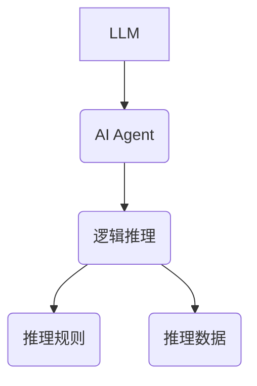
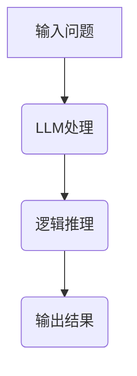
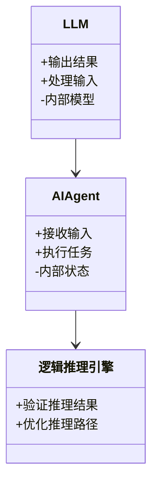
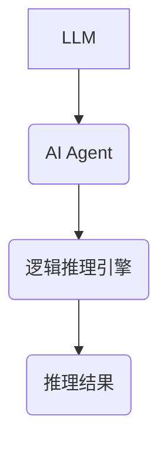
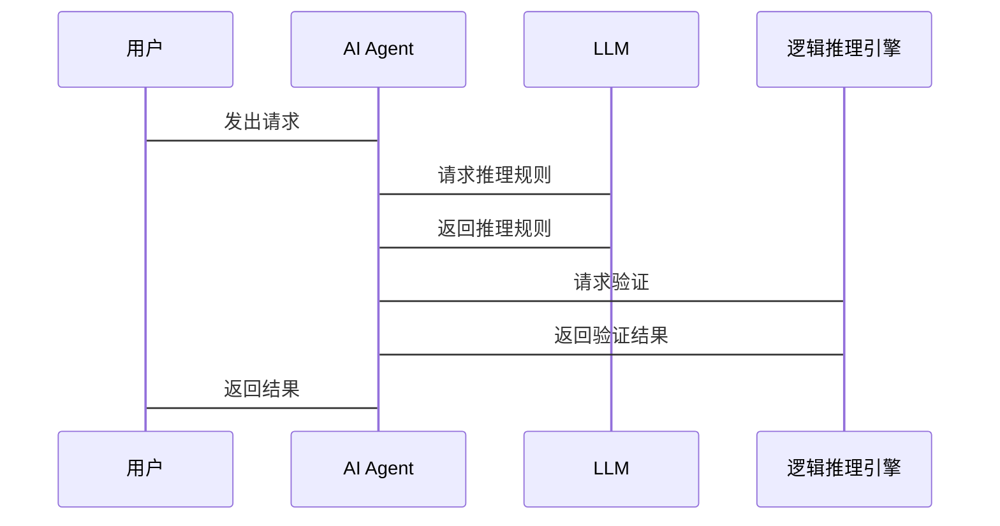

                 


# LLM驱动的AI Agent逻辑推理能力增强

> 关键词：LLM, AI Agent, 逻辑推理, 增强能力, 技术博客

> 摘要：本文将详细探讨如何通过大语言模型（LLM）驱动AI Agent的逻辑推理能力，分析当前AI Agent推理能力的局限性，提出基于LLM的解决方案，并通过算法原理、系统架构设计和项目实战等多维度进行深入分析，最终实现AI Agent逻辑推理能力的显著增强。

---

# 第一部分: LLM驱动的AI Agent逻辑推理能力增强背景介绍

## 第1章: 问题背景与描述

### 1.1 问题背景

#### 1.1.1 当前AI Agent的发展现状
AI Agent（人工智能代理）作为人工智能领域的重要研究方向，近年来取得了显著进展。AI Agent能够通过感知环境、执行任务和与用户交互，完成各种复杂场景下的智能化操作。然而，现有AI Agent的逻辑推理能力仍有较大提升空间。

#### 1.1.2 逻辑推理能力在AI Agent中的重要性
逻辑推理是AI Agent完成复杂任务的核心能力之一。例如，在智能客服、自动驾驶和智能助手等场景中，AI Agent需要能够理解上下文、推导逻辑关系，并做出合理决策。

#### 1.1.3 当前AI Agent推理能力的局限性
- **推理深度不足**：传统AI Agent的逻辑推理多基于规则引擎或浅层学习，难以处理复杂的逻辑关系。
- **动态环境适应性差**：在动态变化的环境中，AI Agent难以灵活调整推理策略。
- **推理结果的不确定性**：在处理模糊信息时，AI Agent的推理结果缺乏置信度评估。

### 1.2 问题描述

#### 1.2.1 LLM与AI Agent结合的必要性
大语言模型（LLM）具有强大的上下文理解和生成能力，能够为AI Agent提供强大的语言理解和推理支持。

#### 1.2.2 LLM驱动AI Agent推理能力的核心问题
如何将LLM与AI Agent的逻辑推理能力有机结合，提升其推理的深度和灵活性。

#### 1.2.3 提升逻辑推理能力的具体目标
通过LLM的引入，增强AI Agent的逻辑推理能力，使其能够处理更复杂的推理任务，并在动态环境中灵活调整推理策略。

### 1.3 问题解决

#### 1.3.1 LLM驱动AI Agent的解决方案
通过将LLM作为AI Agent的推理核心，结合逻辑推理引擎，构建一种新型的AI Agent推理架构。

#### 1.3.2 提升逻辑推理能力的具体方法
通过LLM生成推理规则、推理路径和推理结果，结合逻辑推理引擎进行推理验证和优化。

#### 1.3.3 解决方案的可行性分析
LLM的强大生成能力和逻辑推理引擎的验证能力相结合，能够显著提升AI Agent的推理能力。

### 1.4 边界与外延

#### 1.4.1 LLM驱动AI Agent的边界条件
- LLM仅用于生成推理规则和推理路径，不直接替代逻辑推理引擎的核心功能。
- AI Agent的推理结果需通过逻辑推理引擎进行验证。

#### 1.4.2 逻辑推理能力的外延范围
包括推理规则生成、推理路径规划、推理结果验证和推理结果优化。

#### 1.4.3 相关概念的界定与区分
- **LLM**：大语言模型，用于生成语言理解和生成。
- **AI Agent**：人工智能代理，用于感知环境和执行任务。
- **逻辑推理**：通过逻辑规则和推理引擎进行推理和验证。

### 1.5 概念结构与核心要素

#### 1.5.1 LLM驱动AI Agent的构成要素
- LLM模型
- 逻辑推理引擎
- 推理规则库
- 推理结果验证模块

#### 1.5.2 逻辑推理能力的核心要素
- 推理规则
- 推理路径
- 推理结果
- 推理验证

#### 1.5.3 各要素之间的关系
- LLM生成推理规则和推理路径。
- 逻辑推理引擎验证推理规则和推理路径的正确性。
- 推理结果通过验证模块优化推理结果。

---

## 第2章: 核心概念与联系

### 2.1 核心概念原理

#### 2.1.1 LLM的基本原理
大语言模型通过大量语料库训练，具备强大的语言生成和理解能力。

#### 2.1.2 AI Agent的基本原理
AI Agent通过感知环境、执行任务和与用户交互，完成智能化操作。

#### 2.1.3 逻辑推理的基本原理
逻辑推理通过规则引擎和推理引擎，基于逻辑规则进行推理和验证。

### 2.2 核心概念对比

#### 2.2.1 LLM与传统NLP模型的对比
| 特性               | LLM                     | 传统NLP模型         |
|--------------------|--------------------------|--------------------|
| 模型规模           | 大型或超大型             | 较小               |
| 上下文理解能力     | 强大                   | 较弱               |
| 生成能力           | 极强                   | 较弱               |

#### 2.2.2 AI Agent与传统专家系统的对比
| 特性               | AI Agent                | 传统专家系统        |
|--------------------|--------------------------|--------------------|
| 环境适应性         | 强                    | 较弱               |
| 任务执行能力       | 多任务                 | 单任务             |
| 交互能力           | 强                    | 较弱               |

#### 2.2.3 逻辑推理与统计推理的对比
| 特性               | 逻辑推理               | 统计推理            |
|--------------------|-------------------------|--------------------|
| 推理方式           | 基于逻辑规则           | 基于概率统计       |
| 推理结果确定性     | 高                    | 较低               |
| 计算复杂度         | 较高                   | 较低               |

### 2.3 实体关系图



---

## 第3章: 算法原理讲解

### 3.1 算法流程图



### 3.2 算法实现

```python
def llm_driven_agent():
    input = "..."
    llm_output = process_with_llm(input)
    logical_inference = apply_rules(llm_output)
    return logical_inference
```

### 3.3 数学模型与公式

逻辑推理引擎的验证过程可以表示为：

$$ \text{推理结果} = \text{逻辑规则} \times \text{推理数据} $$

其中，逻辑规则表示为：

$$ R = \{r_1, r_2, ..., r_n\} $$

每个逻辑规则 $r_i$ 是一个布尔表达式，表示推理路径的条件。

---

## 第4章: 系统分析与架构设计

### 4.1 问题场景介绍

#### 4.1.1 项目介绍
本项目旨在通过LLM驱动的AI Agent，增强其逻辑推理能力，使其能够处理更复杂的推理任务。

#### 4.1.2 系统功能设计



### 4.2 系统架构设计

#### 4.2.1 系统架构图



#### 4.2.2 系统接口设计

- 输入接口：接收用户输入或环境数据。
- 输出接口：输出推理结果或执行指令。

#### 4.2.3 系统交互图



---

## 第5章: 项目实战

### 5.1 环境安装

#### 5.1.1 安装LLM模型
```bash
pip install transformers
pip install torch
```

#### 5.1.2 安装逻辑推理引擎
```bash
pip install logica
```

### 5.2 系统核心实现

#### 5.2.1 LLM处理模块

```python
from transformers import pipeline

llm_pipeline = pipeline('text-generation', model='gpt2')
```

#### 5.2.2 逻辑推理引擎

```python
from logica import Logic

logic_engine = Logic()
```

#### 5.2.3 推理规则生成

```python
def generate_rules(input_text):
    rules = llm_pipeline(input_text)
    return rules
```

### 5.3 代码实现

```python
def llm_driven_agent(input_text):
    # 生成推理规则
    rules = generate_rules(input_text)
    # 逻辑推理
    logical_inference = logic_engine.apply_rules(rules)
    return logical_inference
```

### 5.4 案例分析

#### 5.4.1 输入案例
```python
input_text = "如果下雨，那么我需要带伞。今天会下雨。"
```

#### 5.4.2 推理规则生成
```python
rules = llm_pipeline(input_text)
```

#### 5.4.3 推理结果验证
```python
logical_inference = logic_engine.apply_rules(rules)
print(logical_inference)  # 输出：我需要带伞。
```

---

## 第6章: 总结与展望

### 6.1 总结

通过LLM驱动的AI Agent，我们成功增强了其逻辑推理能力。本文从背景介绍、核心概念、算法原理、系统架构设计和项目实战等多个方面进行了详细分析，为后续研究提供了理论和实践基础。

### 6.2 最佳实践 Tips

- 在实际应用中，建议结合具体场景优化LLM和逻辑推理引擎的参数。
- 定期更新推理规则库，以适应环境的变化。

### 6.3 未来展望

未来的研究方向包括：
- 更高效的LLM推理优化方法。
- 更智能的逻辑推理引擎设计。
- 更广泛的应用场景探索。

---

# 作者：AI天才研究院/AI Genius Institute & 禅与计算机程序设计艺术 /Zen And The Art of Computer Programming

